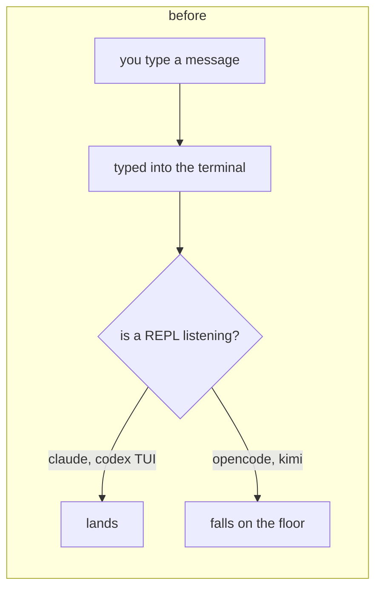
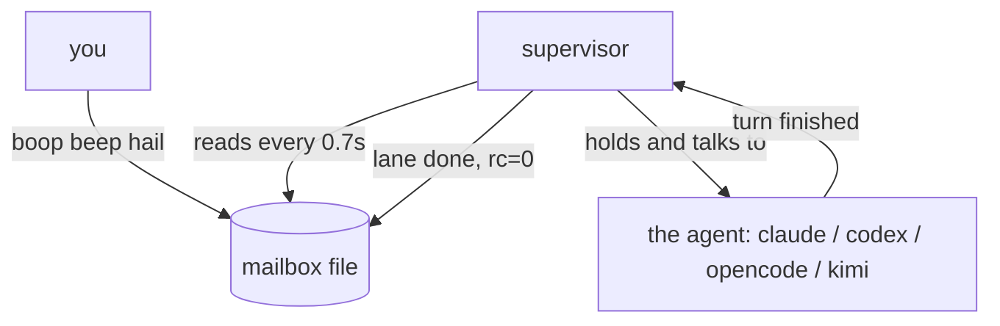
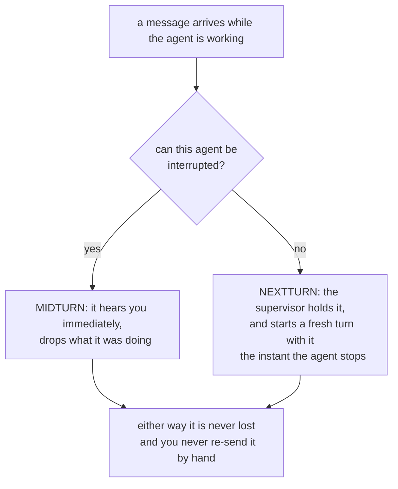
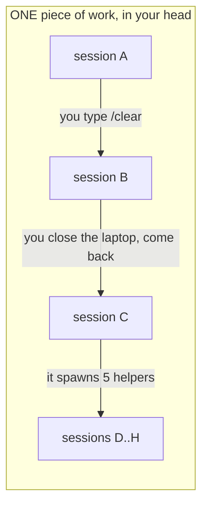
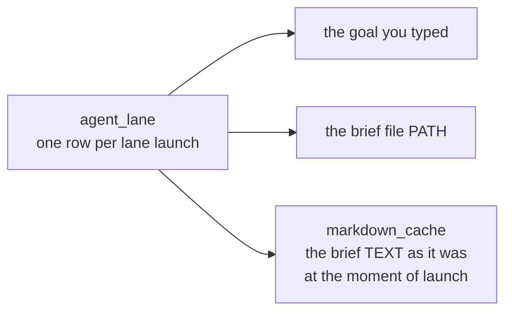

# boop: talk to any agent while it works, and remember why it was working

## Table of contents
1. [What was broken](#what-was-broken)
2. [What runs in a lane now](#what-runs-in-a-lane-now)
3. [The two ways a message lands](#the-two-ways-a-message-lands)
4. [Which agent takes which](#which-agent-takes-which)
5. [Did it work](#did-it-work)
6. [Traces: the name that does not move](#traces-the-name-that-does-not-move)
7. [Goals and briefs are saved now](#goals-and-briefs-are-saved-now)
8. [What we did not build](#what-we-did-not-build)

---

## What was broken

Two things.

**One.** Four different AI agents (claude, codex, opencode, kimi) were each
started in their own way, and two of them could not be spoken to once they were
running. The help text said so out loud: wait for it to finish, or kill it.

**Two.** The database knew how much work an agent did and not what it was told
to do. A lane could be given a goal and a brief file; neither was saved.

---

## What runs in a lane now

Every lane runs the same one program. Not the agent directly: a small boop
program that holds the agent, called the supervisor.

The supervisor does three jobs:

| job | meaning |
|---|---|
| open | hand the brief to the agent as its first message |
| deliver | every 0.7 seconds, check the mailbox and pass anything new to the agent |
| finish | when the agent stops and the mailbox is empty, exit with a real pass or fail |

Same command, same mailbox, same finish, for all four. Nothing about the agent
leaks upward.

---

## The two ways a message lands

The old behavior was: you wait, then you manually start the agent again with the
message. The supervisor now does exactly that, by itself, in under a second.

---

## Which agent takes which

| agent | interrupt mid-work? | why |
|---|---|---|
| claude | yes | it has a real input pipe that stays open while it works |
| codex | yes | it has a background service mode with a "steer the current turn" command |
| opencode | no | its runner does all the thinking inside one throwaway command with no way in |
| kimi | no | same shape: the question is a command-line argument, and then the door shuts |

For the two that say no: we tried four different ways into opencode and all four
were measured and failed. That is written down with the exact error messages, so
nobody has to re-discover it. If opencode fixes its side, our side is about
thirty lines.

---

## Did it work

Yes, on all four, through the real path: a fresh git worktree, a real terminal
session, a real agent, a real message sent while it was busy.

The test each time: tell the agent to sleep in a loop for a long time, then
mid-way tell it to stop and write a specific word into a specific file. If the
word is in the file, it heard us and obeyed.

| agent | heard it | did the new thing | how it landed | finished clean |
|---|---|---|---|---|
| claude | yes | yes | mid-work | yes |
| codex | yes | yes | mid-work | yes |
| opencode | yes | yes | next turn | yes |
| kimi | yes | yes | next turn | yes |

And the proof is not a screenshot. The database records, for each message, that
it was delivered and whether it landed mid-work or on the next turn.

---

## Traces: the name that does not move

Here is the problem in one picture. An agent's "session id" is really a
process-run id. It changes constantly.

Yesterday the database saw eight unrelated things. Now there is a **trace**: one
durable name that all eight hang under. The session ids still move; the trace
does not.

The careful part is deciding when a NEW session belongs to an OLD trace. We only
say yes when we actually know:

| we attach when | because |
|---|---|
| you named the trace on the command line | you said so |
| boop is the program holding the agent, and the agent changed its own id | boop watched it happen |
| the agent itself recorded "I spawned this helper" | the agent said so |

We refuse to guess from "these two things happened in the same folder around the
same time". Two unrelated pieces of work look identical under that rule, and
merging two unrelated stories is worse than leaving one story short. So some
sessions have no trace, and that is the deliberate choice.

Backfilling the existing history: **1556 of 2767 old sessions** got a trace from
helper-spawn records, forming 162 traces. The biggest one is 95 sessions: one
parent and 94 helpers, now one story. The other 1211 were left alone. Nothing
was deleted.

---

## Goals and briefs are saved now

Three new places in the database:

The last one matters more than it sounds. Brief files get edited after the lane
that read them has already run. Two lanes were launched from the same file path
on the same day with different contents, and the database can now show you both.
The file on disk only has the newer one.

`markdown_cache` is its own table so that one brief read by twenty lanes is
stored once, not twenty times. Proven: the same brief launched twice, two lane
rows, one stored copy.

---

## What we did not build

| thing | why not |
|---|---|
| interrupting opencode mid-work | its own runner has no door; four routes tried and measured |
| interrupting kimi mid-work | same; there is a protocol mode that might work, unexplored |
| any new third-party library | checked twenty-odd candidates for process control, message queues, JSON-RPC clients, HTTP clients and hashing, and every one either did not fit the shape or cost more than it saved. Nothing new was added. |
| watching the mailbox file instead of checking it 1.4 times a second | checking is currently too fast to measure; the swap is one function when it stops being |
| catching up 1211 old sessions into traces | on purpose, see above |

One loose thread worth naming: launching two lanes in the exact same instant
once lost one of their entries in the routing file. Launching them one after
another was clean every time. Not caused by this work, not fixed by it,
written down.
