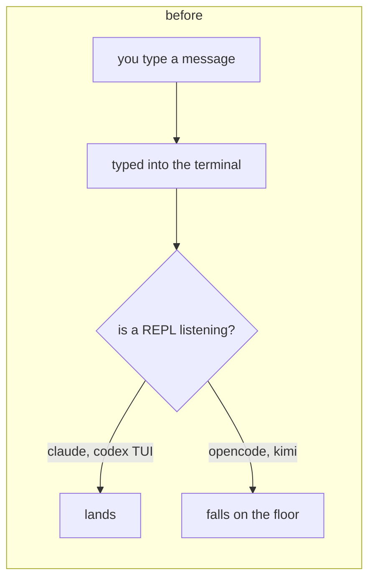
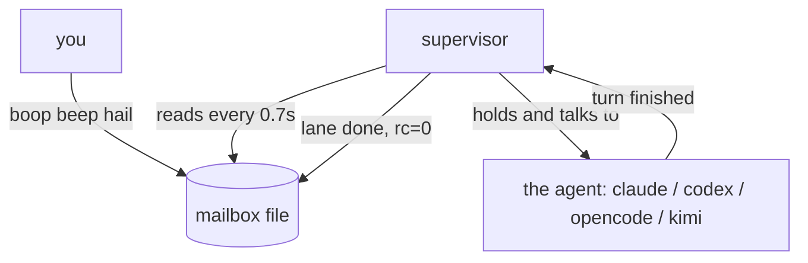
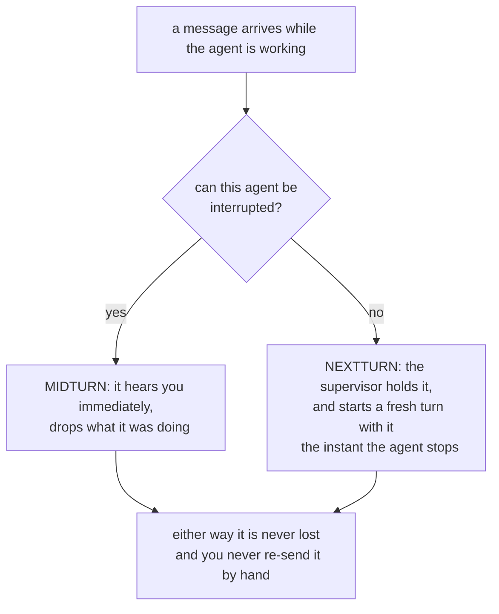
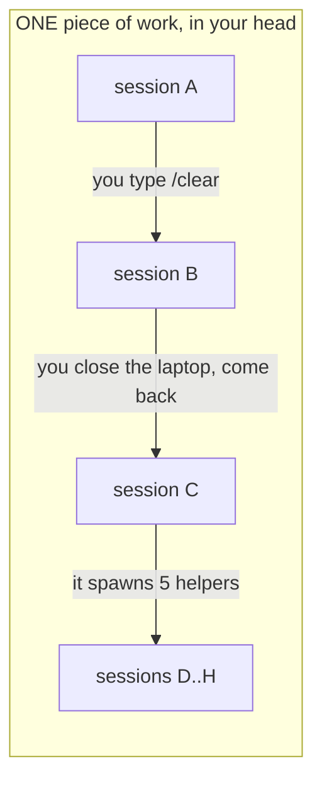
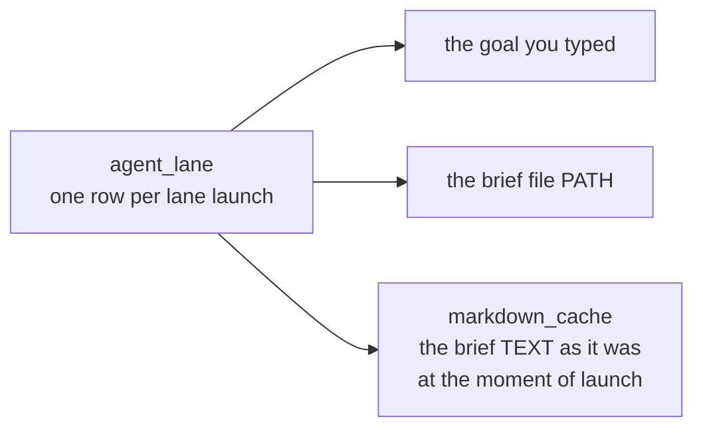
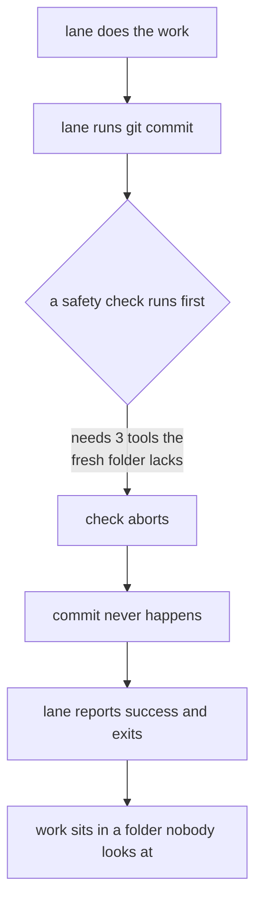

# boop: talk to any agent while it works, and remember why it was working

## Table of contents
1. [What was broken](#what-was-broken)
2. [What runs in a lane now](#what-runs-in-a-lane-now)
3. [The two ways a message lands](#the-two-ways-a-message-lands)
4. [Which agent takes which](#which-agent-takes-which)
5. [Did it work](#did-it-work)
6. [Traces: the name that does not move](#traces-the-name-that-does-not-move)
7. [Goals and briefs are saved now](#goals-and-briefs-are-saved-now)
8. [What we did not build](#what-we-did-not-build)

---

## What was broken

Two things.

**One.** Four different AI agents (claude, codex, opencode, kimi) were each
started in their own way, and two of them could not be spoken to once they were
running. The help text said so out loud: wait for it to finish, or kill it.

**Two.** The database knew how much work an agent did and not what it was told
to do. A lane could be given a goal and a brief file; neither was saved.



---

## What runs in a lane now

Every lane runs the same one program. Not the agent directly: a small boop
program that holds the agent, called the supervisor.



The supervisor does three jobs:

| job | meaning |
|---|---|
| open | hand the brief to the agent as its first message |
| deliver | every 0.7 seconds, check the mailbox and pass anything new to the agent |
| finish | when the agent stops and the mailbox is empty, exit with a real pass or fail |

Same command, same mailbox, same finish, for all four. Nothing about the agent
leaks upward.

---

## The two ways a message lands



The old behavior was: you wait, then you manually start the agent again with the
message. The supervisor now does exactly that, by itself, in under a second.

---

## Which agent takes which

All four take a message mid-work. It took two attempts to get there, and the
first attempt was wrong in an instructive way.

| agent | how the message gets in |
|---|---|
| claude | a real input pipe that stays open while it works |
| codex | a background service mode with a "steer the current turn" command |
| opencode | typed into its terminal window; plain Enter interrupts |
| kimi | typed into its terminal window; Enter alone only queues, ctrl-s interrupts |

### The wrong turn, and what fixed it

Each of these tools has two personalities: a one-shot command that takes your
question as a command-line argument and exits, and an interactive terminal app
you sit in front of. The first attempt tried to find a back door into the
one-shot version of opencode and kimi. There isn't one, and there was never
going to be one: the question is an argument, the program answers it, the
program exits.

The interactive version is the one you can talk to, because talking to it is
what it is for. Our lanes already run inside terminal windows, so "type into the
window" was available the whole time.

kimi even tells you the key. Type a message while it is working and it prints:

```
❯ STOP sleeping. Immediately run: echo ...
  ↑ to edit · ctrl-s to steer immediately
```

So we send ctrl-s. Its own thinking then reads: "The user has interrupted with a
new instruction."

### Two things the terminal route forced us to solve

| question | answer |
|---|---|
| a terminal app never exits, so how do we know a lane is done? | watch the window. Both apps animate a spinner while working and go still when they stop. We hash the window, ignore the bottom three lines of decoration, and call it done when the picture holds still for 20 seconds. |
| some briefs are 8 KB. Can you type that into a text box? | yes. Measured: 7,599 characters landed in one hundredth of a second, all of it, and it did not submit early. Typing a newline and pressing Enter turn out to be different keys, which is exactly the behavior we needed. |

The honest cost: for the two terminal-driven agents, "finished" means "stopped
moving", not "succeeded". claude and codex still report a true pass or fail.

---

## Did it work

Yes, on all four, through the real path: a fresh git worktree, a real terminal
session, a real agent, a real message sent while it was busy.

The test each time: tell the agent to sleep in a loop for a long time, then
mid-way tell it to stop and write a specific word into a specific file. If the
word is in the file, it heard us and obeyed.

| agent | heard it | did the new thing | how it landed | finished clean |
|---|---|---|---|---|
| claude | yes | yes | mid-work | yes |
| codex | yes | yes | mid-work | yes |
| opencode | yes | yes | mid-work | yes |
| kimi | yes | yes | mid-work | yes |

And the proof is not a screenshot. The database records, for each message, that
it was delivered and whether it landed mid-work or on the next turn.

---

## Traces: the name that does not move

Here is the problem in one picture. An agent's "session id" is really a
process-run id. It changes constantly.



Yesterday the database saw eight unrelated things. Now there is a **trace**: one
durable name that all eight hang under. The session ids still move; the trace
does not.

The careful part is deciding when a NEW session belongs to an OLD trace. We only
say yes when we actually know:

| we attach when | because |
|---|---|
| you named the trace on the command line | you said so |
| boop is the program holding the agent, and the agent changed its own id | boop watched it happen |
| the agent itself recorded "I spawned this helper" | the agent said so |

We refuse to guess from "these two things happened in the same folder around the
same time". Two unrelated pieces of work look identical under that rule, and
merging two unrelated stories is worse than leaving one story short. So some
sessions have no trace, and that is the deliberate choice.

Backfilling the existing history: **1556 of 2767 old sessions** got a trace from
helper-spawn records, forming 162 traces. The biggest one is 95 sessions: one
parent and 94 helpers, now one story. The other 1211 were left alone. Nothing
was deleted.

---

## Goals and briefs are saved now

Three new places in the database:



The last one matters more than it sounds. Brief files get edited after the lane
that read them has already run. Two lanes were launched from the same file path
on the same day with different contents, and the database can now show you both.
The file on disk only has the newer one.

`markdown_cache` is its own table so that one brief read by twenty lanes is
stored once, not twenty times. Proven: the same brief launched twice, two lane
rows, one stored copy.

---

## What we did not build

| thing | why not |
|---|---|
| a true pass/fail for the two terminal-driven agents | a terminal app never exits, so there is no exit code to read |
| any new third-party library | checked twenty-odd candidates for process control, message queues, JSON-RPC clients, HTTP clients and hashing, and every one either did not fit the shape or cost more than it saved. Nothing new was added. |
| watching the mailbox file instead of checking it 1.4 times a second | checking is currently too fast to measure; the swap is one function when it stops being |
| catching up 1211 old sessions into traces | on purpose, see above |

---

## The other bug: lanes that worked and then lost the work

Four lanes in one day wrote their entire deliverable and then failed to save it.



Every lane gets a brand new folder. The safety check that runs before each save
needs a compiled program and two installed dependency trees, and a brand new
folder has none of them. So the save fails, and nothing above it noticed.

The fix is a warmup step that runs after the folder is made and before the agent
starts. It does three things and it is fast the second time:

| step | first ever run | every run after |
|---|---|---|
| build the compiled tool | 24 seconds | copied in 0.01 seconds |
| install dependencies (twice) | under a second each | under a second each |
| **whole warmup** | **27.6 seconds** | **1.5 seconds** |

The trick for the 0.01 seconds: fingerprint the tool's source code, and if a
copy built from that exact fingerprint is already sitting in a cache, copy it
instead of rebuilding. The usual answer here would be a compiler cache, and one
exists, but it would only get us from 24 seconds to maybe 8. Copying a finished
program beats rebuilding it every time.

Two decisions worth stating:

- **If the warmup fails, the lane does not start.** Letting it start anyway
  would recreate the exact bug: an agent that works hard and cannot save. One
  clear error now beats four lost deliverables later. There is an escape switch
  for the case where the failure is a network blip.
- **A project without a warmup step is left alone.** No error, no warning. Not
  every project needs one.

Proven end to end: a lane in a brand new folder ran the warmup, did its work,
and its commit is sitting at the top of the branch. A second brand new folder
warmed up 18 times faster.

---

## Loose thread

Launching two lanes in the exact same instant once lost one of their entries in
the routing file. Launching them one after another was clean every time. Not
caused by this work, not fixed by it, written down.
