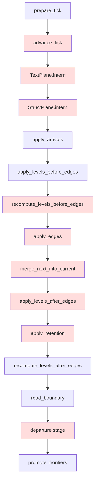

# emit_rust pass 3: every diff was a missing tick phase

## Contents
1. [Headline](#headline)
2. [The inherited classification was wrong](#the-inherited-classification-was-wrong)
3. [The one cause, and how it split into five](#the-one-cause-and-how-it-split-into-five)
4. [What landed](#what-landed)
5. [The cause column that groups](#the-cause-column-that-groups)
6. [What is left](#what-is-left)
7. [Gate outputs](#gate-outputs)

## Headline

```
RUST-GRADE graded=392 byte-clean=109   (inherited)
RUST-GRADE graded=392 byte-clean=230   (this branch)
```

| verdict | before | after |
|---|---:|---:|
| clean | 109 | **230** |
| diff | 171 | **50** |
| unsupported | 106 | 106 |
| error / compiled-only | 6 | 6 |

Zero fixtures lost at any step; every `grade.sh` run reported RATCHET, never
REGRESSION.

## The inherited classification was wrong

The brief said all 171 diffs were the oracle's line MISSING, zero wrong lines,
zero extra lines. That reading came from `diff -u | awk '/^[+-]/ {print; exit}'`,
which stops at the first `-` line and never sees the `+` that follows it. A tick
line is ONE JSON object holding every rel's delta, so a single wrong rel makes
the whole line differ and the first `[+-]` hit is always a `-`.

Compared per tick, per rel, the real shape of the inherited 171:

| shape | count |
|---|---:|
| mixed (missing rel AND wrong row / short log) | 108 |
| wrong-only (rel present, rows wrong) | 49 |
| missing-only | 14 |

`wrong-only` was 49 rows, not 0. The engine did produce wrong answers.

## The one cause, and how it split into five

There is one cause at the right altitude: **`run_tick` ran 6 of the 15 phases
`emit_ts.pl` puts in `run_incremental_tick`.** Traced by reading
`v6/prolog/emit_ts.pl:2518-2571` (the phase list the TS door emits) against
`v6/sprefa-engine-rs/src/program.rs:run_tick`, then confirmed fixture by fixture.



Red = absent from the Rust tick when this lane started.

Falsified along the way:

| hypothesis | verdict |
|---|---|
| arrivals never reach the engine | false: 109 fixtures were already byte-clean on the arrival path alone |
| the tick-log writer emits nothing | false: `float_shortest_round_trip_wire` proved the writer runs and renders |
| boot statements never execute | false: boot is where the 32 aggregate fixtures got their only correct answer |
| a whole phase is missing | **survived**, five times over |
| the schedule is parsed but not applied | half true: the schedule was applied, the FOLD was wrong (see cause B below) |

Grouped by the phase each diff needed, measured across the 171:

| unbuilt phase | diffs needing it | diffs needing ONLY it |
|---|---:|---:|
| TextPlane.intern | 147 | 45 |
| edge phases (3) | 80 | 10 |
| StructPlane.intern | 31 | 9 |
| aggregate level plan | 10 | 0 |
| retention | 4 | 0 |
| dred / expand | 2 | 0 |

`text-intern` was a perfect predictor at the start: 147 of 147 fixtures that
needed it were diffs, 0 were clean.

## What landed

One commit per cause.

| commit | cause | byte-clean |
|---|---|---:|
| `60eb43cc` | no text plane: an arriving string reached the arrival INSERT raw, so a `__str` dictionary-id column took the content and the boundary read back nothing | 109 -> 169 |
| `7225a6e5` | edge phases absent, and `run_schedule` drained carry after EVERY tick instead of after the schedule | 169 -> 213 |
| `05cabba6` | grouping cause column, plus `js_float_text` formatting through `Display`, which never reaches exponent form | 213 -> 214 |
| `b4d57723` | aggregate level plan and retention never ran | 214 -> 225 |
| `a4b05fbb` | `__tick` never incremented | 225 -> 230 |

Two details worth carrying forward:

- **The fold, not just the phase.** `TickFold` (`v6/tsv2/runtime/tickLoop.ts:30-32`)
  drains carry only once `tick_number >= schedule.length`, and never resets the
  tick counter. The Rust driver drained after every tick and restarted numbering,
  which nothing had exposed because carry was always false before edges ran. 23
  fixtures that the edge port unblocked still failed on this alone.
- **Interns were being dropped by the emitter, not the engine.** `edgeinterns/2`
  and the level `DeltaInternSqls` were destructured as `_` in `emit_rust.pl`, so
  the Rust arm never saw them. `intern_then_execute` now runs them in the same
  ordered batch as the statement that reads their ids.

## The cause column that groups

`grade.sh` recorded the raw first-differing LINE, so 171 rows were 171 unique
strings. `v6/sprefa-engine-rs/diff_cause.py` now writes
`<category> first-tick=<n>` over `missing-rel`, `extra-rel`, `wrong-row`,
`missing-tick`, `extra-tick`, `number-text`, and grade.sh's existing per-verdict
`uniq -c` prints the histogram for free. 50 diffs read as 9 buckets:

```
  diff 50
    19  mixed(missing-rel+missing-tick) first-tick=1
    18  mixed(missing-rel+wrong-row) first-tick=1
    4  wrong-row first-tick=1
    3  mixed(missing-rel+missing-tick) first-tick=3
    2  mixed(missing-rel+missing-tick) first-tick=2
    1  mixed(missing-rel+wrong-row) first-tick=2
    1  mixed(missing-rel+missing-tick+wrong-row) first-tick=2
    1  mixed(missing-rel+missing-tick) first-tick=4
    1  missing-tick first-tick=3
```

`number-text` earned its slot on the first run: it caught
`float_shortest_round_trip_wire`, where the two lines were equal as JSON and
different as bytes.

## What is left

The 50 remaining diffs are three phases, none of them started.

| bucket | count | what it needs |
|---|---:|---|
| ordered programs | 26 | `run_ordered_tick`: per-occurrence edge arms in arrival order. `emit_rust.pl` does not emit the ordered arms at all (`emit_ts.pl:1762-1836` is the shape). Covers the whole `json_patch_*` family, `lww_fold_*`, `concat_fold_*`, `seq_wire_*`, `seeded_pre_*`. |
| struct plane | 18 | `StructPlane.intern` (`v6/tsv2/runtime/structPlane.ts`): a post-order walk over declared types, interning each child before its parent. Every `struct_*`, `option_*_of_rel`, `rel_element_list_*` fixture. |
| departure frontier | 6 | the departure stage phase plus `departure_read_sql/3`; `departure_frontier_table_name` already rides in the program JSON and nothing reads it. |

Ordered programs is the biggest and also the only one needing new emitter
output rather than a runtime port.

## Gate outputs

Measured on `a4b05fbb`.

```
RUST-GRADE graded=392 byte-clean=230
conformance   392 PASS / 0 FAIL   (3 runs, identical)
ARCH.pl       0 FAIL
sweep         RUN total=286 identical=283 wrong=0 emitted_crash=0 rejection=3
              MANIFEST_REASON_DIFF restated=0 args=0 bucket_moved=0 added=0 removed=0
cargo test    1 passed, 0 failed
```

`grade.sh` end to end is 14s cold, ~9s warm. It builds one crate for the
text-door compile check and reuses it; it does NOT compile a crate per fixture,
so the 10-second law is not in play beyond the one cargo build.

`just green-all` is red by design; `.github/CI-KNOWN-RED.md` is the gate. No leg
outside that allowlist failed on this branch. No `just` leg runs `grade.sh` yet,
so the RUST-GRADE ratchet is not wired into CI; wiring it means touching
`v6/justfile`, which this lane did not own.
