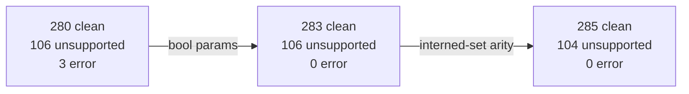

# emit_rust IR coverage: the 106 triage

## Contents
1. [What moved](#what-moved)
2. [The A/B split](#the-ab-split)
3. [Pile A, closed](#pile-a-closed)
4. [Pile B, the 75 asserted stops](#pile-b-the-75-asserted-stops)
5. [Pile B, the 29 real gaps](#pile-b-the-29-real-gaps)
6. [Gates](#gates)

## What moved



| verdict | before | after |
|---|---:|---:|
| clean | 280 | 285 |
| unsupported | 106 | 104 |
| error | 3 | 0 |
| compiled, no oracle | 3 | 3 |
| diff | 0 | 0 |

The 3 `compiled` rows are the corpus's three rejection fixtures
(`json_object_dup_key_rejected`, `json_object_throws_on_duplicate_keys`,
`log_retraction_rejected`). The oracle throws on the same schedules, so there is
no tick log to diff. The tsv2 sweep buckets the same three as `REJECTION`.

## The A/B split

Pile A test: does the fixture reach `compiled` in
`v6/prolog/compile/out/manifest.json`, i.e. does `emit_ts` handle what
`emit_rust` will not.

| pile | count | reading |
|---|---:|---|
| A: emit_ts compiled, emit_rust did not | 5 | all closed, below |
| B: both doors stop | 104 | language work, user's call |

Measured against the manifest at `dcc9bb1b`: for all 104 pile-B fixtures the
manifest `reason` and the `graded.tsv` reason agree stem for stem, **0
mismatches**. The two backends stop in exactly the same place for exactly the
same reason. Nothing in pile B is an emit_rust gap.

Pile B splits three ways by what the fixture's own expectations assert:

| shape | count | reading |
|---|---:|---|
| `throws(W)` in the expectations | 75 | the stop IS the test; not a gap |
| expectations empty | 2 | stop witness with no observable behavior |
| `final(...)` / `deltas(...)` asserted | 27 | the oracle runs it and the compiler stops: a real gap |

## Pile A, closed

### 1. bool literal boot params, 280 -> 283, commit `7a98a339`

The 3 `error` fixtures threw `type_error(json_term, bool_lit(true))` out of
`json_write_dict`. `boot_dict/2` put `bootstmt/3` params into the document raw
and `bool_lit(true)` is not a JSON term. `emit_rust.pl:81` now maps params
through `boot_param/2`, the JSON twin of `emit_ts.pl:119 param_text/2`:
`bool_lit(B)` becomes the JSON literal, numbers stay numbers, everything else
becomes a string so a text param spelling `"true"` is not silently promoted to a
boolean by `json_write_dict`.

The Rust side needed nothing: `types.rs:37 enum Value` already carries
`Bool(bool)` under `#[serde(untagged)]` and `sql.rs:77` binds it as
`Integer(0|1)`.

Fixtures: `bool_identity_comparison_filters`, `bool_literals_round_trip`,
`bool_relation_negation_is_two_valued`.

### 2. interned-set member arity, 283 -> 285, commit `05f55b70`

`list_interned_set_dictionary_content_deduplicates` and
`list_interned_set_end_to_end` graded `emitter returned false`, and they were
the only two fixtures MISSING from the 390-row manifest. Neither fact was about
emit_rust.

`0_generic_expand.pl` keyed the minted companion arity on the SUFFIX alone:

```prolog
flavor_ref_arity(member, 3).
```

`list_flavor_artifacts(list_interned_set(E), _)` declares exactly two columns
for its member companion, `content_id` and `value_id`
(`0_generic_expand.pl:160-161`), so the rel was minted at `/3`, the two
`col_type` rows never bound, and the rel record fell back to three inferred TEXT
columns:

```
'__gen__..._interned_set_text_...__member'/3, set,
  [col(col1,inferred,text), col(col2,inferred,text), col(col3,inferred,text)]
```

Two consequences, both in the emitted DDL before the fix:

- `CREATE TABLE ...__member ("col1" INTEGER, "col2" INTEGER, "col3" INTEGER, UNIQUE ("col1","col2"))`
  plus a `__txt_` render view, i.e. both integer foreign keys were routed
  through the `__str` text dictionary. That is the surrogate-keys law inverted:
  the ids that already ARE surrogate keys got interned as text.
- `schedule_json/4` (`sweep.pl:174`) then failed, because the fixture posts
  `__member(200, 10)` at arity 2 and `maplist/4` over a 3-long column-type list
  and a 2-long argument list cannot unify. `sweep_one/6` runs inside a
  `findall/3`, so a FAILURE (as opposed to a throw) drops the row silently, and
  the fixture vanished from the manifest instead of appearing as a bucket.

`flavor_ref_arity/3` now takes the flavor. `flavor_ref/3` has no caller outside
`0_generic_expand.pl`, so the blast radius is the four list flavors.

Both doors go byte-clean on the same two fixtures at once, which is the receipt
that the arity was simply wrong rather than a shape choice:

| gate | before | after |
|---|---|---|
| RUST-GRADE | `graded=392 byte-clean=283` | `graded=392 byte-clean=285` |
| tsv2 sweep RUN | `total=286 identical=283 wrong=0` | `total=288 identical=285 wrong=0` |
| manifest | 390 rows | 392 rows, `added=2 removed=0` |
| conformance | 392 PASS / 0 FAIL | 392 PASS / 0 FAIL |

## Pile B, the 75 asserted stops

75 of the 104 carry `throws(W)` in their own expectations. The fixture exists to
pin the stop, conformance is green on all of them, and `emit_rust` reproduces
the stop with the witness the fixture names. No work here.

51 of the 75 name the exact witness; the other 24 write the generic
`throws(unsupported_construct)` or an older witness spelling
(`arithmetic_rejects_non_int_operand_at_runtime` says `arith_on_non_int`, the
compiler says `arith_operand_not_number`; the five `*_is_a_named_unsupported`
rows say `reserved_body_word`, the compiler says `lifecycle_arm` / `removed_word`
/ `zip`). That witness drift is a fixture-text question, not a coverage one.

## Pile B, the 29 real gaps

The oracle runs these and produces the rows the fixture asserts; both compiled
doors stop. Grouped by construct, throw site cited. **None of these is decided
here.** They are forks for the user.

| n | construct | throw site | fixtures |
|---:|---|---|---|
| 9 | `edge_body_needs_json_destructure` | `analyze.pl:1065` (`edge_goal_unsupported/4`, priority 8) | the whole demand/decode pipe-stage family: `chain_into_keyed_head_replaces`, `desugared_trace_equals_hand_written`, `guard_stage_fires_on_negation_and_comparison`, `guard_stage_silent_below_threshold`, `guard_stage_silent_when_muted`, `pipe_stage_costs_one_tick`, `trigger_marker_is_what_stops_backlog_replay`, `unmarked_chain_replays_to_late_subscriber`, `unmarked_first_stage_refires_on_late_watch` |
| 4 | `trigger_arg_not_var` | `lower.pl:3182` | `async_state_machine_with_pattern_scan`, `edge_trigger_literal_filters_on_the_oracle_door`, `same_tick_error_then_fresh_chains_arms`, `scope_done_three_spellings` |
| 4 | `level_body_goal(_, json_each(_,_))` | `analyze.pl:1650` | `ghcacher_host_program_term`, `ghcacher_json_normalization`, `json_each_fans_out`, `json_round_trip_decode_to_document` |
| 2 | `decode_source_not_struct` | `lower.pl:2731`, `lower.pl:4792` | `decode_missing_key_fails_quietly`, `decode_open_pattern_binds_nested` |
| 2 | `aggregate_head(json_array(_))` | `analyze.pl:1647` | `json_array_groups_and_nests`, `json_array_keeps_bag_duplicates` |
| 2 | `reserved_rel_namespace` | `compile.pl:272` | `reserved_namespace_declared_rel`, `reserved_namespace_derived_head` (expectations empty) |
| 1 | `compound_pattern_on_arrival_rel` | `analyze.pl:1616-1628` | `fork_join_error_arm_is_a_value` |
| 1 | `list_of_relation_refs` | `0_type_plane.pl:123` | `list_of_relation_refs_still_refused` |
| 1 | `edge_body_with_negation` | `analyze.pl:1061` (priority 5) | `seed_and_transition_are_disjoint` |
| 1 | `decode_field_unknown` | `lower.pl:2762` | `struct_decode_field_unknown_rejected` |
| 1 | `comparison_type_mismatch` | `lower.pl:1826` | `text_one_and_numeric_one_are_not_equal` |
| 1 | `join_column_type_mismatch` | `lower.pl:335` | `text_one_and_numeric_one_never_join` |

Two of these already carry a written cause in `ARCH.pl` and neither is a
language impossibility:

- `edge_body_needs_json_destructure`, 9 fixtures, the single biggest block.
  `ARCH.pl:828 task(json_edge_body_unblock, unbuilt, [])` records the stated
  reason as STALE and unowned: the encoding question it deferred to was ruled
  `compound_storage = struct_as_rows` on 2026-07-29, and the edge-body guard
  seam already landed for negation, comparisons and binds
  (`edge_body_constructs`). `lower.pl:2363` still holds the stop. Unbuilt work,
  not a limit.
- `compound_pattern_on_arrival_rel`, 1 fixture. `ARCH.pl:778` prices a real fix,
  rejects it on the brief's own condition, and says the class is deleted by
  `struct_as_rows`.

`comparison_type_mismatch` and `join_column_type_mismatch` are the "no coercions"
decision already on `CLAUDE.md` in code form, pinned by
`compile/test/plunit_tests.pl:2284` and `:2295`. Those two are working as ruled.

## Gates

Each measured on this tree, from the leg, never from the whole gate.

| gate | runs | result |
|---|---:|---|
| `bash v6/sprefa-engine-rs/grade.sh` | 3 | `RUST-GRADE graded=392 byte-clean=285` all three |
| `swipl -g go -t halt go.pl` (conformance) | 3 | 392 PASS / 0 FAIL |
| `swipl -g go -t halt v6/prolog/ARCH.pl` | 1 | green |
| `cd v6/tsv2 && bash scripts/sweep.sh` | 1 | `RUN total=288 identical=285 wrong=0 emitted_crash=0 rejection=3`, `FINAL final_identical=285 final_wrong=0` |
| `cargo test --no-fail-fast` (sprefa-engine-rs) | 1 | 1 passed, 0 failed |

`grade.sh` cold is 20.6s and warm 9s, over the 10-second law on a cold cargo
build. The prolog half of it is `COMPILE-TRACE ... total=10/86952` for the
text-door check program.
