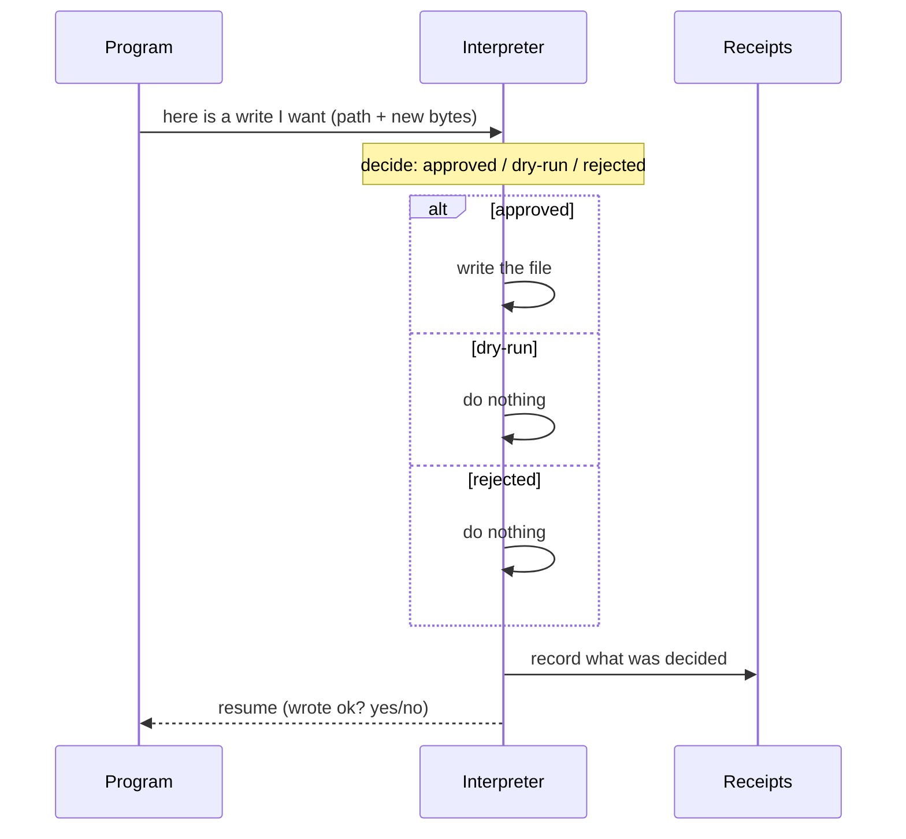

# fs-effects-recon, in plain words

What the old versions built, and whether to rebuild it as a tiny Rust library we own.

## TOC

- The one-sentence story
- The idea: a file write is a "yield", not a command
- What each version built (one page each)
- The side-by-side table
- What v6 has today
- Buy or build? (the library list)
- The shape: three ways to package it
- The three forks you get to pick

## The one-sentence story

The old engines had a clean idea: a program does not say "write this file"; it says "here is a write I want", and a SEPARATE interpreter decides yes/no/dry-run, does the write, and records what it decided. That idea kept getting rebuilt each version and thrown away. A small Rust library would stop the repeat.

## The idea: a file write is a "yield", not a command

Think of the program as a recipe that, at the write step, does a hand-off. It does not do the write itself. It hands a note to an interpreter and waits. The interpreter may:

- do it (approved)
- not touch the file but say "would have written" (dry-run)
- refuse (rejected)

In all three cases it writes a receipt row: what the write was, what was decided, whether it worked. The receipt is data you can read back. Nothing skips a code path; the decision IS the record.

The dry-run is not a switch that skips the write. It is a decision recorded next to the real writes, so a user sees the full list and can approve some.

## What each version built

### v3 (the richest)
Everything above, built as typed "effects":
- reads and writes and shell and print were all the same shape (a request + a typed reply)
- file writes got a `policy`: approve all, dry-run, or approve only some by id
- dry-run recorded a row (`dry-run`, never touched disk)
- reads were batched (many files read in one parallel pass)
- a real "yield / resume" primitive existed (suspend an op, wake it later)
- file watching: watch a folder, ignore junk, emit a batch of changed files

### v4 (one big crate, writes became direct)
The write policy and the yield primitive were gone. File writes now just did the IO directly inside the op. Two new safety bits replaced the policy:
- drift check (if the file changed since we read it, skip, don't clobber)
- dirty notify (after a write, tell the engine to redo anything downstream)
Writes were batched per file. Watching was not a file watcher anymore; it was a git-event poller feeding an incremental re-derive.

### v5 (the @async effect)
Only one effect kind survived: shell commands from rule bodies. Batching came back as `collect`: gather a value across all matches and fire one command with the whole set. No file-write effect at all. Two unrelated dry-runs existed (a move-refactor preview, and a git-checkout preview).

### v5cozokuzu
A throwaway database experiment (Cozo vs Kuzu). Not an effect system. Skip it.

### Why each died
- v3 to v4: v4 rebuilt on a different runtime (a component queue + SQLite fact store); the write policy and staging did not move over.
- v4 to v5: v5 went to shell-only effects; the per-file batch writer was dropped.
- v5 to v6: v6 is a new TypeScript runtime; the `collect` batching and the whole write side did not land.

## The side-by-side table

| question | v3 | v4 | v5 | v6 (now) |
|---|---|---|---|---|
| write expressed as | a typed "effect" handed to an interpreter | direct file IO in the op | none | none (shell out) |
| who decides | the sink, reads a policy, records a row | drift check + dirty notify | the effect queue states | witness cache |
| dry-run | a recorded decision, file untouched | gone | only for move-refactor / checkout | no keyword; a diff-as-data lab |
| batching | reads batched in parallel | writes batched per file | `collect` gathers all matches into one shell call | extract host folded; writes not batched |
| watch | notify watcher, folder, gitignore-filtered, emits changed-file batch | git-event poller + re-derive | stream subscriptions | glob `watch` bind, coalesced |
| codemod/refactor | write ops + effect-cache approval | write ops + next/next? | --move use-path rewriter | staged-diff lab |

## What v6 has today (checked, not guessed)

| thing | present? | where the truth is |
|---|---|---|
| `watch` bind (glob matches files, emits row per change) | yes | registry.pl:295, types.ts:817 |
| host effects with a witness cache (dedupe / in-flight lock) | yes | types.ts:747-775 |
| `sh` shell host decl | yes | dl.langium:54, example file:1 |
| file read as a builtin | no (only subprocess reads; runtime reads digests for watch) | 2_binds.ts:232 |
| file write as a builtin | no (shell out, one fork per call) | staged-writes/2-apply.dl6 |
| dry-run | no keyword; a staged-diff lab already does it as data | staged-writes/1-stage.dl6 |
| `collect` batching | no (v5-only) | labs reference v5 |

Two things the checks corrected about the original list:
- dry-run is absent as a mode, but a small lab already expresses it as data (computed diffs the user inspects before a separate "armed" demand applies). That is the v3 mindset returning.
- file reads exist only as subprocess calls, not as a first-class read.

## Buy or build? (the library list)

The rule: never build common-shaped things without checking the shelf first. Research agent checked versions and maintenance for 2026. Summary:

| job | best buy | still needs you |
|---|---|---|
| diff two texts | `similar` | applying them |
| buffer text (fast edits) | `ropey` | the edit model |
| apply a unified patch | `diffy` | transaction + rollback |
| match-and-rewrite tree patterns | `ast-grep-core` (already used here) | the driver loop |
| walk files, respect .gitignore | `ignore` (already used) | the reads + batching |
| match paths | `globset` | walking |
| watch files/folders, debounced | `notify-debouncer-full`; or `watchexec` if you also want run+signals | the collapse to rows |
| atomic single-file save | `tempfile::persist` | multi-file transaction |
| coroutine shapes | an enum + match interpreter (Rust generators are still nightly in 2026) | semantics |

Nothing on the shelf applies a set of file edits atomically with a dry-run and a report. Every crate stops one step short. So the part we own is small and specific: dry-run decision + one transaction over many files + a receipt row. That is the v3 `StagedWriteRow` idea.

On `watchexec`: it is a maintained library plus CLI that does watch + debounce + run, so it covers most of the watching ask. But v6 deliberately keeps its watcher behind a seam (swap one adapter, done) and the current impl is the OS's built-in watcher. Adopting `watchexec` only makes sense if you also want the run-a-command-on-change and signal handling inside the process. For the file side, `notify-debouncer-full` is enough; for the TS runtime, keep the built-in watcher.

## The shape: three ways to package it

`sprefa-extract` is the model: a standalone Rust crate that is both a library and a CLI. It reads a file, prints flat JSON rows to stdout, and the runtime runs it as a subprocess. Copy that.

- CLI owns no logic (parse args, call the library, print)
- wire = JSON lines to stdout, `--schema` prints the contract
- runtime runs it via a host executor, decodes stdout, lands rows on a relation

Three ways to package the write engine:

1. **sibling crate `sprefa-write`** (copy the extract pattern). A `--plan` (dry-run) vs `--apply` (write) flag; prints a receipt row per edit. Best match to "make it a library".
2. **inside the existing host runner** (no new crate). Lowest ceremony, but rewrites the logic into the TS runtime each time, which is exactly the recurring welding the user wants to stop.
3. **a shared core lib + thin CLI + thin runtime adapter** (most reuse, most ceremony).

| option | reuse later | effort | breaks free of the runtime? |
|---|---|---|---|
| sibling crate | good | medium | yes |
| inside runner | low | low | no |
| core lib + CLI + adapter | best | high | yes |

## The three forks you get to pick

**1. Which package shape.** Fork 1, 2, or 3 above. The sibling crate is the direct answer to the user's ask.

**2. How batching arrives.**
- port v5's `collect` (a language feature, gathers all matches into one call), or
- a batch-shaped host decl (the write decl takes a path plus a list of edits, one invocation per file), or
- the library batches internally (buffers edits, one transaction per file).
Price: use internally for atomicity, plus the batch decl for transport; add `collect` only if you want the dl-level syntax.

**3. How watch-file and watch-folder differ.**
- one `watch` bind, the glob decides (a file glob vs a folder glob), or
- two binds `watch_file` / `watch_dir`, differing only in what they emit, or
- one bind with a kind column.
Price: option 1 is already the behavior; option 2 is the accurate surface if you want per-file digests distinct from watching many files.

You rule on these. The measurements above are what make the choice cheap.

<!-- todo(decision): pick package shape 1/2/3. -->
<!-- todo(decision): pick batching path. -->
<!-- todo(decision): pick watch surface. -->
