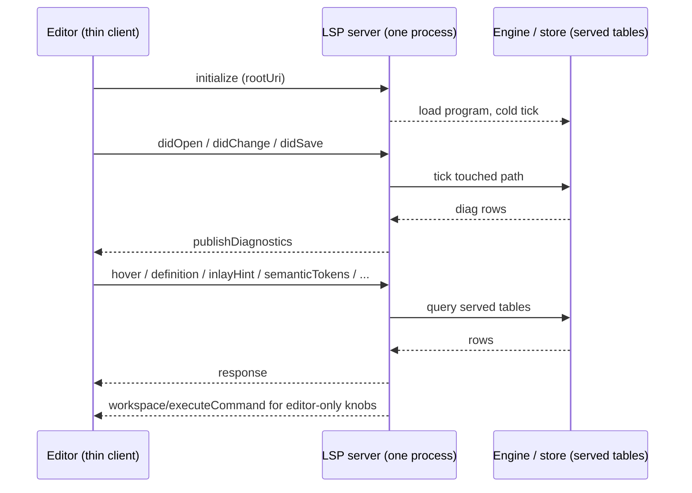
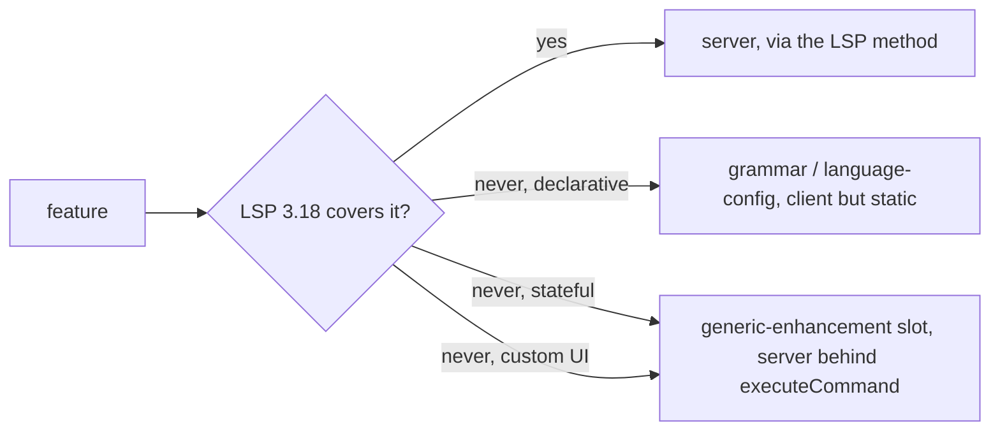

# lsp-archaeology, plain words

No citations here. The numbers and headings come out of the research doc next
to this one. Read this first, read that one for the receipts.

## TOC

1. What we dug out
2. The same question, four versions
3. The thin-client line
4. The buy list
5. The shape, as choices

---

## 1. What we dug out

Everything the editor shows is a request or a push through the server. The
client does not compute diagnostics, symbols, or hints; it spawns the server and
renders what comes back.

---

## 2. The same question, four versions

| | v3 | v4 | v5 | v6 |
|---|---|---|---|---|
| server language | Rust | Rust | Rust | not built yet, TS or Rust is the choice |
| wire | stdio + websocket | stdio | stdio | stdio (planned) |
| hover | yes | yes | yes | |
| completion | yes | yes | no | |
| definition | no | yes | yes | |
| inlay hint | no | tried, died | no | |
| semantic tokens | no | yes | no | |
| formatting | no | no | no | |
| editor client | none (generic client) | 48 lines TS | 56 lines TS | to decide |
| did it test the wire? | yes | no | yes | reuse the driver |
| graph viewer | none | none | out of scope | out of scope |

Three Rust servers, all rebuilt each version. v4 tried inlay hints and the
feature died when the pipeline shape changed. v5 dropped completion and
formatting, added hierarchy navigation and editor commands. v6 has nothing yet.

The one feature v5 delivers that v6 needs is diagnostics, and the data for it
already falls out of the engine. Dropping v5 costs one feature, not a suite.

---

## 3. The thin-client line

Map every feature onto an LSP method. Anything that has one is server work.

The slot's three rules:

1. client code exists only where LSP 3.18 has no method and the file is not
   grammar/config.
2. any stateful client feature becomes a server command behind
   `workspace/executeCommand`; the client holds no feature state.
3. a client feature names the LSP method it checked, or it does not ship.

The graph viewer is outside this table entirely, a separate ambition for later.

---

## 4. The buy list

Nothing here is worth building. Buy the wire and the types.

| job | buy | alternative that loses |
|---|---|---|
| LSP from TS | `vscode-jsonrpc` + `vscode-languageserver-types` (or the protocol bundle) | `vscode-languageserver` (owns the connection), or hand-rolled framing (re-implements the types for free) |
| LSP from Rust | `lsp-server` (v5 already runs it) or `async-lsp` for middleware | `tower-lsp` (dormant 3 years) |
| client | `vscode-languageclient` | a generated extension (bigger than the ~50 lines the job needs) |
| position math | `line-index` | hand-rolled UTF-16 math (the emoji trap) |
| wire tests | plain stdio `Content-Length` golden tests | booting real VS Code |

Skill notes for the Rust side say the same: pick `lsp-server` for the
no-framework loop, `async-lsp` when you want middleware, never hand-roll
position math.

The language fork: put the server inside v6's TypeScript `serve_tsv2` (one
process, one merge point) or on the Rust engine being built (the language v4 and
v5 both shipped). Both drop the v5 binary, so both pass. Price both, pick later.

---

## 5. The shape, as choices

- where it lives: a sibling under `v6/` (cheapest, reuses the build harness) or a
  separate repo (cleanest boundary, more plumbing). Not welded into the compiler.
- dependency direction: the editor area reads compiler output (tables, the
  served wire). The compiler never imports the editor area.
- wire: stdio JSON-RPC. SSE looks natural here but no stock editor speaks it, so
  it would force a custom client. Skip it.
- thinness: the extension stays around 100 lines or under. v4 did it in 48, v5
  in 56. Grammar and config are declarative; everything else is server-side.
- the two old trees: `editors/vscode` gets replaced by the standalone area (its
  README is already stale). `editors/vscode-dl` is parked untouched, out of scope.

Deadlines, no reading order: the archaeology is done, the buy list is priced,
the forks are laid out. The choice of where the area lives and which language
the server speaks is the user's.
