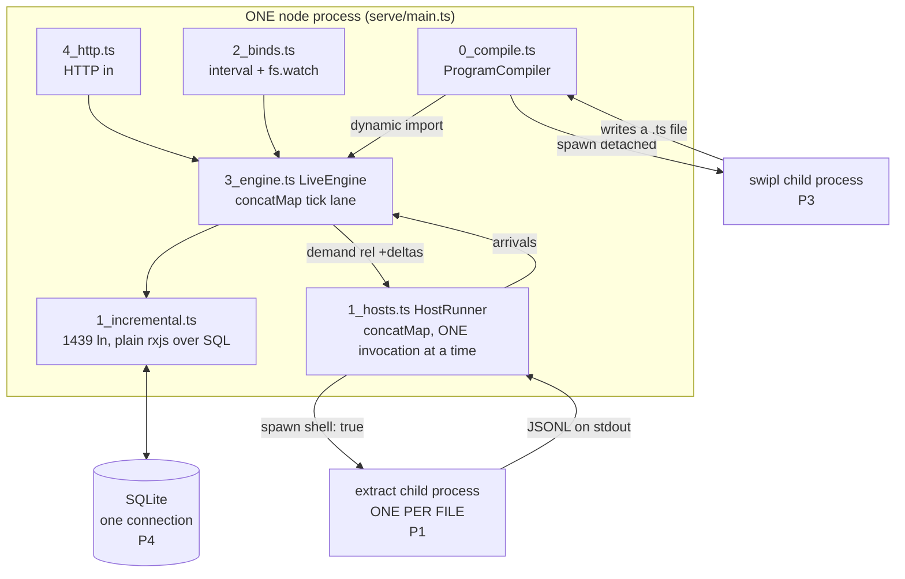
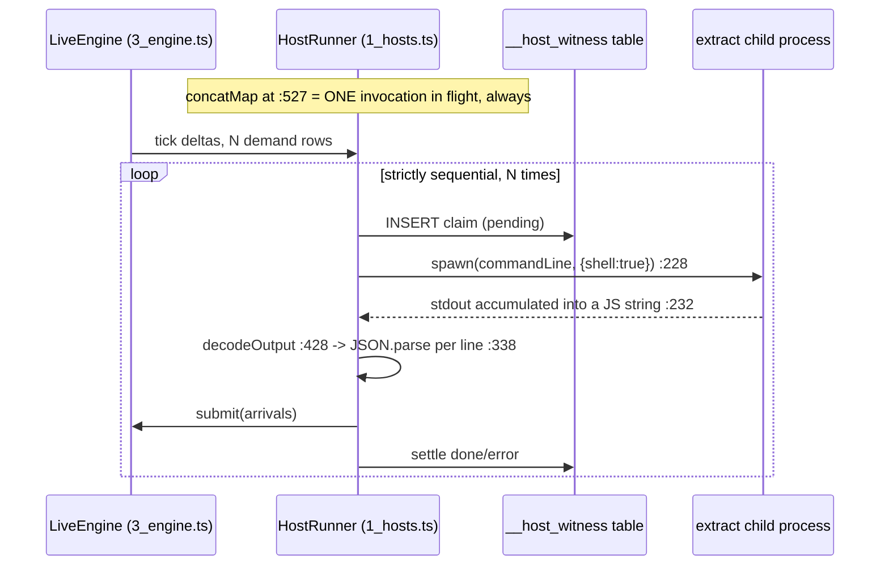
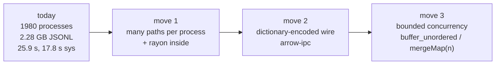

# Rust async load, IPC, shared memory: what the phrase means in THIS system

Auditor's document. Every factual claim carries a `file:line` citation or a command and
its output. Measured on Apple M2 Pro, Darwin 23.6.0, 12 logical CPUs (8 performance + 4
efficiency, `sysctl -n hw.perflevel0.logicalcpu hw.perflevel1.logicalcpu` = 8, 4), node
v24.15.0, sqlite3 CLI 3.43.2, 2026-08-12.

Companion for a zero-context reader: `plans/2026-08-12-rust-async-load-ipc.RESEARCH.visual.human.unga.md`.

---

## Table of contents

1. [Method: what was run](#1-method-what-was-run)
2. [The split: "async load" is four problems, three real and one speculative](#2-the-split-async-load-is-four-problems-three-real-and-one-speculative)
3. [P1 world-fact ingestion: current state and measurements](#3-p1-world-fact-ingestion-current-state-and-measurements)
4. [P2 the Rust runtime has no async spine: current state](#4-p2-the-rust-runtime-has-no-async-spine-current-state)
5. [P3 program compile latency: current state](#5-p3-program-compile-latency-current-state)
6. [P4 SQLite configuration and cross-process access: current state](#6-p4-sqlite-configuration-and-cross-process-access-current-state)
7. [Speculative candidates, named and closed](#7-speculative-candidates-named-and-closed)
8. [Candidate tables](#8-candidate-tables)
   - [8.1 Shared memory](#81-shared-memory)
   - [8.2 Memory-mapped files, and what SQLite already does](#82-memory-mapped-files-and-what-sqlite-already-does)
   - [8.3 Columnar and zero-copy payload formats](#83-columnar-and-zero-copy-payload-formats)
   - [8.4 Local IPC transports](#84-local-ipc-transports)
   - [8.5 Serialization for a shared buffer](#85-serialization-for-a-shared-buffer)
   - [8.6 In-process async: rx semantics in Rust](#86-in-process-async-rx-semantics-in-rust)
   - [8.7 Process supervision](#87-process-supervision)
9. [Recommendation per problem](#9-recommendation-per-problem)
10. [The rxjs to Rust operator map](#10-the-rxjs-to-rust-operator-map)
11. [What I could not determine, and why](#11-what-i-could-not-determine-and-why)
12. [Where the two 2026-08-08 IPC docs stopped short](#12-where-the-two-2026-08-08-ipc-docs-stopped-short)
13. [Defects found while measuring](#13-defects-found-while-measuring)

---

## 1. Method: what was run

| step | command | why |
|---|---|---|
| read the TS runtime | `v6/tsv2/runtime/*.ts`, `v6/tsv2/serve/*.ts` | find every boundary the shipping backend crosses |
| read the Rust runtime | `.boop-worktrees/feature/emit-rust-sqlite/v6/sprefa-engine-rs/src/*.rs` | find what the in-flight backend has and lacks |
| extractor timing | `v6/sprefa-extract/target/release/extract` over 1980 `.ts` files | price the one boundary that carries real volume |
| compiler timing | `swipl -q -l ../prolog/compile.pl -g "compile_dl6(...)"` | price the subprocess the user named |
| SQLite pragma A/B | `sqlite3` CLI, 20,000 autocommit INSERTs | price the pragma gap between the two backends |
| crate metadata | `curl -A "..." https://crates.io/api/v1/crates/<name>` | live version, date, download counts, 2026-08-12 |
| crate API docs | `curl https://docs.rs/<crate>/<ver>/<crate>/` | read the crate's own description before naming it |

Every crate row in section 8 that carries a "docs read" mark had its docs.rs crate page
fetched and read on 2026-08-12. Rows without that mark carry registry metadata only and
say so.

---

## 2. The split: "async load" is four problems, three real and one speculative

The phrase does not map onto one thing. Below is every boundary that exists in the code
today, drawn once.



Every arrow that leaves the box is a process boundary that exists today.

| candidate the brief named | real in code today? | citation | which problem |
|---|---|---|---|
| extraction results from an external extractor binary | **REAL, and the dominant cost** | `v6/tsv2/serve/1_hosts.ts:228` spawn, `:527` sequential `concatMap` | P1 |
| the compiler (`swipl`) as a subprocess, streaming output | **REAL as a subprocess. NOT streaming.** stdout is buffered whole and then discarded | `v6/tsv2/serve/0_compile.ts:52-95`, `:87` next(stdout), `:111` the value actually used is `import(module_path)` | P3 |
| SQLite pages and whether the runtime ever mmaps them | **PARTLY.** The TS store sets `mmap_size=1073741824`; the Rust seam sets no pragma at all | `v6/sprefa-store/js/src/engine/engine.ts:200` vs `sprefa-engine-rs/src/sql.rs:35-38` | P4 |
| lazily-loaded relation tiers | **SPECULATIVE. Zero occurrences.** `grep -rni "lazy.*tier\|tier.*lazy"` over `v6/**` `.ts` `.pl` `.md` returns 0 rows outside archived v5 asks | section 7 | none |
| multi-repo or multi-program scale | **multi-repo REAL, multi-program NOT.** `switchMap` holds exactly one program; a new program disposes the previous | `v6/tsv2/serve/4_http.ts:548`, `:147-152 dispose_program`, `:183`; multi-repo golden at `v6/tsv2/goldens/multirepo_crawl/0_multirepo_crawl.dl6` | section 7 |
| the Rust backend's own async story | **REAL as an absence.** The crate has zero `spawn`, zero `channel`, zero `mpsc` | see section 4 | P2 |

The four problems, ordered by measured cost:

| id | name | one-line statement | measured headline |
|---|---|---|---|
| **P1** | world-fact ingestion | one subprocess per file, strictly serialized, moving JSON text | 25.9 s and 2.28 GB for one corpus pass |
| **P2** | no Rust async spine | `sprefa-engine-rs` has tokio as a dependency and uses none of it | 0 spawns, 0 channels, 2 `async fn` in 1726 lines |
| **P3** | compile latency | the largest real program takes 10.3 s inside swipl | 10.38 s / 10.22 s, budget set to 600 s |
| **P4** | SQLite configuration | the Rust seam opens a file DB with default journal and `synchronous=FULL` | 11.2x slower than the TS store's pragma set |

---

## 3. P1 world-fact ingestion: current state and measurements

### 3.1 The shape in code

`sh` hosts are the language's world-input door. The compiler emits a demand rel and a
response rel; `HostRunner` reads the demand rel's `+` deltas, spawns, decodes stdout, and
submits the result as ordinary arrivals (`v6/tsv2/serve/1_hosts.ts:3-27`).



Three facts from the citations, each independently costly.

| fact | citation | consequence |
|---|---|---|
| invocations run one at a time | `1_hosts.ts:525-528`, `concatMap((batch) => from(groupInvocations(batch)).pipe(concatMap((invocation) => this.runInvocation(invocation))))` | wall time is the sum, never the max |
| the whole stdout becomes one JS string | `1_hosts.ts:230-233`, `stdout += chunk.toString()` | peak memory is the largest single answer, and the string is rebuilt per chunk |
| the wire is JSON text | `v6/sprefa-extract/src/wire.rs:53-60` `flatten_jsonl`, one `serde_json::to_string` per fact | key names and enum spellings repeat once per fact |

The extractor re-expands its own interned strings on the way out. `wire.rs:30-32` states
it: "`NodeRef` resolves to a span through each bundle's own node vec; `NameId` resolves to
a string through the shared `strings`". The dictionary the extractor built internally is
discarded at the wire, and the wire pays for it.

### 3.2 Measured: one file

`v6/tsv2/runtime/1_incremental.ts`, 56,790 source bytes, release binary
`v6/sprefa-extract/target/release/extract` (46,883,552 bytes).

| run | min wall | stdout bytes | facts |
|---|---:|---:|---:|
| empty file (spawn floor) | 2.1 ms | 89 | 0 |
| `--family call` | 2.9 ms | 70,928 | 666 |
| all four families (default) | **22.3 ms** | **2,336,978** | **21,487** |
| `runtime/types.ts` all four | 8.6 ms | 696,471 | n/a |

Per-family split of the same file:

| family | lines | bytes | share of bytes |
|---|---:|---:|---:|
| cst | 15,857 | 1,732,554 | 74.0% |
| df | 4,824 | 513,804 | 22.0% |
| call | 666 | 70,928 | 3.0% |
| type | 140 | 19,692 | 0.8% |

Payload density: 2,340,170 bytes / 21,487 facts = **108.9 bytes per fact**. A fact is a
`FlatFact` variant (`v6/sprefa-extract/src/types.rs:1405-1787`, **20 variants**): a record
tag, a family tag, one or two `SpanOut { start: u32, end: u32 }`, a kind string, an
optional name. The phase-1 CLI stream emits 8 of the 20; the remaining 12 are the
project-phase and SCIP arms, and `types.rs:1488` states `flatten_jsonl` "(the CLI stream)
stays phase-1 and never produces these". Measured on the sample file, the 8 tags present were
`arg, const, edge, node, param, sig, site, specifier`.

Redundancy, measured by compressing that exact file:

| encoding | bytes | ratio vs JSONL |
|---|---:|---:|
| JSONL as emitted | 2,340,170 | 1.00x |
| `gzip -c` | 163,153 | **14.34x smaller** |
| `zstd -q -c` | 184,446 | 12.69x smaller |

93% of the bytes on that wire are repeated key names and repeated enum spellings.

### 3.3 Measured: the JS decode side

Node v24.15.0, on the same 2,340,170-byte payload, mirroring what
`1_hosts.ts:333` (`text.split("\n")`) and `:326-343` (`parseJsonItems`, one `JSON.parse`
per line at `:338`) do:

| step | ms |
|---|---:|
| `split("\n")` + filter | 1.47 |
| `JSON.parse` per line, 21,487 lines | **10.53** |
| 64 KiB chunk string accumulation (simulates `:232`) | 1.35 |
| resident set after | 70.0 MB |

The JS side adds ~13.4 ms on top of the extractor's 22.3 ms. Decode is 38% of the
per-file cost and it is single-threaded on the same event loop that runs the tick lane.

### 3.4 Measured: the whole corpus

1980 `.ts` files under `v6/` excluding `node_modules`, `gen_served`, `dist`;
71,199,489 source bytes.

| shape | wall | user | sys | stdout bytes |
|---|---:|---:|---:|---:|
| 1980 processes, all families, piped to a reader (**mirrors HostRunner**) | **25.876 s** | 14.508 s | **17.814 s** | 2,278,667,376 |
| same, `xargs -P 4` | 28.619 s | 16.924 s | 90.740 s | 2,278,667,376 |
| same, `xargs -P 8` | **134.823 s** | 21.912 s | **823.759 s** | 2,278,667,376 |
| 1980 processes, child stdout to `/dev/null`, `-P 1` | 26.582 s | 15.080 s | 8.931 s | discarded |
| 1980 processes, child stdout to `/dev/null`, `-P 8` | 14.315 s | 16.410 s | 94.606 s | discarded |
| 1980 processes, `--family call` only, piped | 4.105 s | 1.937 s | 1.659 s | 40,117,060 |
| **ONE process, `--resolve`, all 1980 paths in one argv** | **6.914 s** | 6.292 s | **0.275 s** | 18,009,938 |

Read the sys column. It is the whole finding.

Output amplification: 2,278,667,376 / 71,199,489 = **32.0x**. One corpus pass turns 71 MB
of TypeScript into 2.28 GB of JSON text, moved through pipes, one process at a time.

### 3.5 Measured: process spawn is NOT the bottleneck

500 spawns of the same 46.9 MB binary against an empty file:

| parallelism | wall | per spawn |
|---|---:|---:|
| `-P 1` | 0.722 s | 1.44 ms |
| `-P 4` | 0.188 s | 0.38 ms |
| `-P 8` | 0.107 s | **0.21 ms** |
| control, 500 spawns of `/bin/echo`, `-P 8` | 0.068 s | 0.14 ms |

Spawn scales down with parallelism exactly as expected and costs 0.21 ms at `-P 8`. So
the 823 s of system time at `-P 8` in the real run is not process creation. It is the
combination of two things the two `/dev/null` rows separate:

| isolated cost | evidence | magnitude |
|---|---|---|
| concurrent arena allocation and page zeroing in 8 extractor processes | `-P 8` with output discarded: sys 8.931 s -> 94.606 s | 10.6x |
| 2.28 GB flowing through 8 concurrent pipes into one reader | `-P 8` discarded 14.315 s -> `-P 8` piped 134.823 s | 9.4x on top |

`v6/sprefa-extract/src/dispatch.rs:3-5` says the in-process alternative was scoped and
deferred: "The generic rayon `dispatch` over many `ExtractJob`s + the arena-per-worker
budget land in the parallelism lab (epic 4); this is the single-file piping core". The
CLI enforces the one-file shape at `v6/sprefa-extract/src/bin/extract.rs:308-310`: "exactly
one PATH is required unless --resolve is given".

`--resolve` is the one code path that already takes many paths in one process, and it is
the 0.275 s sys row.

---

## 4. P2 the Rust runtime has no async spine: current state

Crate at `.boop-worktrees/feature/emit-rust-sqlite/v6/sprefa-engine-rs/` (READ ONLY, live
lane). 1726 lines: `incremental.rs` 849, `ticklog.rs` 285, `types.rs` 239, `sql.rs` 166,
`program.rs` 107, `driver.rs` 63, `lib.rs` 17.

| claim | command | output |
|---|---|---|
| zero spawns, zero channels | `grep -rn "spawn\|channel\|mpsc\|tokio::" src/` | 4 hits: `incremental.rs:3` (a comment), `bin/emit_rust_harness.rs:74` (`Builder::new_current_thread`), `tests/skeleton.rs:116` (`#[tokio::test]`), `bin/extract.rs`-style `std::process::exit` |
| `async fn` count per file | `grep -rc "async fn" src/*.rs` | `driver.rs:2`, everything else `0` |
| zero host, bind, or world-input code | `grep -rc 'host' src/*.rs` | all zero |

Three specific gaps, each cited.

**Gap A. The header describes a design that is not in the file.**
`src/incremental.rs:2-5` reads: "async is realized at the driver's spawn + channel +
StreamExt". `src/driver.rs:26-52` `run_schedule` is a `for` loop with `.await` on a
one-item stream. No spawn. No channel. Per the repo law "comments are not the language",
the file is the truth and the comment is aspiration.

**Gap B. The stream is a formality.**
`src/program.rs:57-63`:

```rust
pub fn tick<'a>(&'a self, seam: &'a SqliteSeam, arrivals: Vec<Arrival>)
    -> Pin<Box<dyn Stream<Item = TickDeltas> + 'a>> {
    Box::pin(stream::once(async move { self.run_tick(seam, &arrivals) }))
}
```

A `stream::once` wrapping a synchronous call. `src/driver.rs:61-62` then drives it with
`stream.next().await.expect("tick stream produced no item")`. This is the rxjs `Observable`
shape spelled in Rust with none of the concurrency, which is a faithful port of the
sequential TS lane and therefore correct, and also the reason nothing loads asynchronously.

**Gap C. The seam trait is sync and the comment says otherwise.**
`src/sql.rs:2-4` claims "Each method is `async` outward and runs blocking rusqlite inward".
`src/sql.rs:18-23` declares `fn execute`, `fn batch`, `fn execute_multiple`, `fn scalar`,
all synchronous. `SqliteSeam` holds a bare `Connection` (`:25-27`), so the seam is not
`Send`-shareable across tasks as written.

**Gap D. Edge rules are not ported.** `src/program.rs:69`: "Edge rules arrive in a later
widening step." The Rust backend is not yet at parity, so any async design here is
designing ahead of the port.

The user's own words for the target sit in `v6/prolog/ARCH.pl:951`:
"literally copy the ts into rs with idiomatic tokio and channeling/rx semantics in rust
form with streamext and signals and spawns", status `unbuilt`.

Locked dependency versions (`sprefa-engine-rs/Cargo.lock`): `tokio 1.53.1`,
`futures 0.3.34`, `rusqlite 0.32.1`, `libsqlite3-sys 0.30.1`. That `libsqlite3-sys`
bundles SQLite **3.46.0**
(`grep -m1 "SQLITE_VERSION " ~/.cargo/registry/src/*/libsqlite3-sys-0.30.1/sqlite3/sqlite3.h`
returns `#define SQLITE_VERSION "3.46.0"`). Current rusqlite on crates.io is 0.40.2
(2026-08-08), so the pin is 8 minor versions behind.

---

## 5. P3 program compile latency: current state

`v6/tsv2/serve/0_compile.ts` wraps `swipl` in an Observable.

| fact | citation |
|---|---|
| the child is detached, its process group killed on timeout | `:54`, `:34-45` |
| stdout is accumulated whole, never streamed | `:62-64` |
| the default budget is 600,000 ms | `:20` `const DEFAULT_COMPILE_BUDGET_MS = 600_000;` |
| stdout is emitted and then discarded | `:87` `subscriber.next(stdout)` then `:111` `concatMap(() => from(import(module_path)))` |

The compiler writes its result to a file; the pipe carries diagnostics only. Streaming the
pipe would move zero useful bytes earlier.

Measured, three runs each, from `v6/tsv2`:

| program | source bytes | swipl wall | emitted TS bytes |
|---|---:|---:|---:|
| `v6/dl/fixtures/1_rtkq-extraction-golden.dl6` | 3,611 | 0.22 / 0.19 / 0.18 s | 147,799 |
| `out/text-door/clean_state_gate_and_exit_zero.dl6` | 2,245 | 0.19 s | 195,558 |
| `out/text-door/fix_by_waiver_returns_to_clean.dl6` | 1,887 | 0.18 s | 165,239 |
| **`gen_served/ea699faefe33603f03451984a1f13665.dl6`** (1690 lines) | 107,856 | **10.38 / 10.22 s** | 2,956,190 |
| bare `swipl -q -g halt` | n/a | 0.00 s | n/a |

Dynamic import of that 2,956,190-byte emitted module, with `../runtime` and
`node_modules` resolvable: **398.2 ms**, resident set 185.0 MB.

Split of the largest case: 10.3 s swipl (**96.3%**), 0.40 s V8 module load (3.7%),
IPC contribution indistinguishable from zero. The 10-second law names 10 s as a defect;
this program is over it, and the budget constant is 58x the measured cost of the worst
case and 3000x the typical one.

---

## 6. P4 SQLite configuration and cross-process access: current state

### 6.1 The pragma gap between the two backends

| backend | what it sets on open | citation |
|---|---|---|
| TypeScript store | `PRAGMA journal_mode=WAL; PRAGMA synchronous=NORMAL; PRAGMA foreign_keys=ON; PRAGMA temp_store=MEMORY;` | `v6/sprefa-store/js/src/engine/spine.ts:266-267`, applied at `lib.ts:137` |
| TypeScript store, cascade path | `PRAGMA cache_size=-262144; PRAGMA mmap_size=1073741824;` | `v6/sprefa-store/js/src/engine/engine.ts:199-200` |
| Rust engine | **nothing** | `sprefa-engine-rs/src/sql.rs:35-38`, `Connection::open(url)` and return |

Measured cost of that gap. 20,000 individual autocommit `INSERT` statements into a
file-backed database, `sqlite3` 3.43.2, same table shape
(`"__id" INTEGER PRIMARY KEY, a INTEGER, b INTEGER, UNIQUE(a,b)`, the shape the repo's
uniform-set-rel DDL ruling names):

| pragma set | wall | speedup vs default |
|---|---:|---:|
| default (journal=delete, synchronous=FULL) | **6.17 s** | 1.0x |
| `journal_mode=WAL; synchronous=NORMAL` | **0.55 s** | **11.2x** |
| `journal_mode=WAL; synchronous=OFF` | 0.34 s | 18.1x |
| `journal_mode=MEMORY; synchronous=OFF` | 0.26 s | 23.7x |

Control, the same 200,000 rows inserted in ONE statement inside one implicit transaction:

| pragma set | wall | db bytes |
|---|---:|---:|
| default | 0.08 s | 6,766,592 |
| WAL + NORMAL | 0.10 s | 6,766,592 |
| WAL + NORMAL + `mmap_size=1G` + `cache_size=-262144` | 0.09 s | 6,766,592 |

Two readings, both required:

- The pragma set matters **only** when statements autocommit individually. The Rust seam
  does exactly that: `sql.rs:95-100` `batch` is `statements.iter().map(execute).collect()`,
  one `prepare` + `query` per statement, no `BEGIN`.
- `mmap_size` is a **wash** on the write path (0.09 vs 0.10 s, inside noise). It is a read
  optimization and has to be measured on the read path before it is set.

The repo's own `sqlite-costs` skill already states "Pragmas on `:memory:` are no-ops
(journal/sync/cache); page_size=16384 is the one real effect". The Rust harness opens
`:memory:` (`bin/emit_rust_harness.rs:73`), so the parity leg is unaffected. Every
file-backed Rust run pays the 11.2x.

### 6.2 Is SQLite already the shared-memory layer?

Read directly from `https://www.sqlite.org/wal.html` on 2026-08-12.

| question | what sqlite.org says | verdict for this system |
|---|---|---|
| is the wal-index shared memory across processes? | yes, and "All processes using a database must be on the same host computer; WAL does not work over a network filesystem. This is because WAL requires all processes to share a small amount of memory" | shared storage exists for free |
| do readers block the writer? | "readers do not block writers and a writer does not block readers" | multi-reader is free |
| is there a cross-process wakeup? | no. `sqlite3_wal_hook`, `sqlite3_commit_hook`, `sqlite3_update_hook` are all per-connection and fire in the committing process | **a reader must poll.** SQLite is not a notification transport |
| is multi-process WAL safe on the pinned version? | "The bug is likely present in all version of SQLite from 3.7.0 (2010-07-21) through 3.51.2 (2026-01-09). It is fixed in version 3.51.3 (2026-03-13)... The bug only affects databases in WAL mode when there are two or more database connections open on the same file, in separate threads or processes, and when those two connections attempt to write or checkpoint at the same instant." | **the Rust engine bundles 3.46.0.** Any multi-process WAL design on the current pin is inside the affected range |

From `https://www.sqlite.org/mmap.html` on 2026-08-12, on `mmap_size`:

- "memory-mapped I/O is disabled by default. To activate memory-mapped I/O, use the
  mmap_size pragma and set the mmap_size to some large number, usually 256MB or larger".
- "An I/O error on a memory-mapped file cannot be caught and dealt with by SQLite.
  Instead, the I/O error causes a signal which, if not caught by the application, results
  in a program crash."
- "Performance does not always increase with memory-mapped I/O. In fact, it is possible to
  construct test cases where performance is reduced by the use of memory-mapped I/O."

### 6.3 Does anything in v6 mmap today?

`grep -rn "mmap\|Mmap\|memmap" --include=*.ts --include=*.rs v6/` excluding `target/` and
`node_modules/` returns 9 rows. Every one is either a `PRAGMA mmap_size` string
(`engine.ts:200`, `scripts/2_p3-retract-bench.ts:245`, one test comment), a filename in a
Linux-kernel test fixture (`sprefa-store/tests/kernel_roots.rs:144-152`), or a page-fault
counter comment (`sprefa-store/src/measure.rs:190`). No code maps a file.

`grep -rn "worker_threads\|new Worker("` over `v6/**/*.ts` outside `node_modules` returns
zero rows. The node side has no second thread.

---

## 7. Speculative candidates, named and closed

| candidate | status | evidence |
|---|---|---|
| lazily-loaded relation tiers | **does not exist in v6** | `grep -rni "lazy.*tier\|tier.*lazy"` over `v6/**` returns nothing; the phrase appears once in the root `CLAUDE.md` as an archived v5 ask under "v5 housekeeping: NEVER ASK" |
| multi-program hosting in one process | **does not exist** | `serve/4_http.ts:548` `switchMap((load) => run_program$(...))`; `:147-152` `dispose_program` nulls `state.program`, `state.seam`, `state.engine` on every swap. One program, one seam, one engine |
| multi-repo crawling | **exists, and is single-process sequential** | `v6/tsv2/goldens/multirepo_crawl/0_multirepo_crawl.dl6:20-27`: "each repo is one subprocess". The repo set arrives as EDB rows, not config. It runs through the same `concatMap` lane as every other host |
| a second process reading the same DB | **does not exist** | one `ScratchStore.open` per server (`runtime/scratchStore.ts:20`), one connection, one process |

None of these four is a reason to build IPC today. Two of them (multi-program, second
reader) become real the moment a design asks for them, and section 6.2 already prices
what SQLite gives and withholds at that point.

---

## 8. Candidate tables

Registry data fetched from `https://crates.io/api/v1/crates/<name>` on 2026-08-12.
"docs read" means the crate's docs.rs page was fetched and its description read on the
same day.

### 8.1 Shared memory

| candidate | version, updated | downloads total / 90d | docs read | what it is | fits which problem shape | cost | fit here |
|---|---|---:|:---:|---|---|---|---|
| `memmap2` | 0.9.11, 2026-06-22 | 307,674,429 / 68,409,365 | yes | "A cross-platform Rust API for memory mapped buffers... `Mmap` or `MmapMut`, which correspond to mapping a `File` to a `&[u8]` or `&mut [u8]`" | reading a large immutable file without copying it | one `unsafe` at the map call; no synchronization of its own; the whole file must fit address space | **useful, narrowly.** Reading an Arrow IPC file the extractor wrote is exactly its shape. As a message transport it gives no framing and no wakeup |
| `shared_memory` | 0.12.4, crate updated 2026-07-20, **last release 2022-03-01** | 4,881,250 / 1,027,016 | yes | "A thin wrapper around shared memory system calls"; API is `Shmem` + `ShmemConf`; 56.25% documented | a raw named shared region two processes both open | no locks, no framing, no schema. Its own dev-dependency is `raw_sync`, so the pair is the real unit | **reject for P1.** It hands you bytes and nothing else; you then write the ring buffer, the fence discipline, and the wakeup by hand, which is the "write our own" the repo law forbids without a candidate table, and this table is that table |
| `raw_sync` | 0.1.5, crate updated 2026-06-28, **last release 2020-10-13** | 773,785 / 206,492 | yes | mutex/rwlock/barrier/event primitives placed in a shared region; 55.88% documented | the synchronization half of a hand-rolled shm channel | **six years without a release.** 0.1.x. Placing lock state in shared memory means a crashed peer leaves a poisoned lock with no OS recovery | **reject.** The maintenance age alone disqualifies it for a boundary that must survive a SIGKILL, which the repo's self-diagnosis law requires |
| POSIX `shm_open` / `/dev/shm` directly | OS | n/a | n/a (OS man pages) | anonymous named shared memory | the same as `shared_memory`, without the crate | Linux has `/dev/shm`; macOS has `shm_open` with a 31-character name limit and no `/dev/shm` tmpfs. Windows has no equivalent | **reject.** Platform-specific work with nothing bought over `memmap2` |
| `iceoryx2` | 0.9.3, 2026-07-08 | 484,133 / 224,641 | yes | "service-oriented zero-copy lock-free inter-process communication middleware... Publish-Subscribe, Events, Request-Response, Blackboard, Pipeline (planned)" | microsecond-budget streaming of many small frames between long-lived processes | 224,641 recent downloads is the smallest number in this whole document. Brings a service-discovery model, a config file, and a daemon concept | **reject for P1.** P1's boundary is a short-lived child that answers once and exits. There is no long-lived peer to publish to, and P1's problem is 2.28 GB of redundant bytes, not per-message latency |

The shared-memory family answers "two long-lived processes exchange small messages at
microsecond latency". P1 is "one short-lived child answers once with a large payload".
Every row above is a mismatch of shape, and none of them shrinks the payload.

### 8.2 Memory-mapped files, and what SQLite already does

| mechanism | who provides it | what it gives | what it costs | fit here |
|---|---|---|---|---|
| `PRAGMA mmap_size` | SQLite itself, no new dependency | pages read straight from the OS page cache with no copy into heap | measured **wash on the write path** (section 6.1). An I/O error becomes a signal, not a catchable error (sqlite.org/mmap.html) | **defer.** Set it only after a read-path measurement exists. It is not a substitute for WAL + NORMAL, which is the 11.2x |
| `PRAGMA journal_mode=WAL` | SQLite itself | cross-process shared wal-index, readers never block the writer | one writer at a time; `SQLITE_BUSY` is a poll, not backpressure; the 3.46.0 pin is inside the WAL-reset bug range | **adopt for the single-process case now** (the 11.2x). Treat multi-process as blocked on a `libsqlite3-sys` bump past SQLite 3.51.3 |
| shared-cache mode | SQLite itself | multiple connections in ONE process share a page cache | sqlite.org discourages it for new code; it is a same-process feature and P1's peer is a different process | **reject.** Wrong axis. Nothing in v6 opens two connections in one process |
| `memmap2` over an Arrow IPC file | crate, docs read | zero-copy read of a columnar batch file the producer wrote | the producer must write a file rather than a pipe; the file needs a lifecycle | **the one live use.** Pairs with 8.3 |

### 8.3 Columnar and zero-copy payload formats

This is P1's actual layer. The measured target: remove the 14.34x redundancy and the
10.53 ms of `JSON.parse` per 2.34 MB.

| candidate | version, updated | downloads total / 90d | docs read | what it is | fit to `FlatFact` | cost | verdict |
|---|---|---:|:---:|---|---|---|---|
| `arrow` + `arrow-ipc` | 59.2.0, 2026-08-06 | arrow 70,392,230 / 16,340,872; arrow-ipc 77,394,254 / 17,263,408 | yes | "The Arrow IPC format defines how to read and write `RecordBatch`es to/from a file or stream of bytes... IPC Streaming Format: Supports streaming data sources, implemented by `StreamReader` and `StreamWriter`" | **excellent.** `FlatFact` (`types.rs:1405-1787`) is 20 variants over `{u32 start, u32 end}` spans, small integer positions, and a bounded string vocabulary (97 distinct `kind` values measured in one file). That is a union of fixed-width columns plus `DictionaryArray` string columns, which is the Arrow model exactly | the arrow crate family is large. `arrow-ipc` pulls `arrow-array`, `arrow-buffer`, `arrow-data`, `arrow-schema`, `arrow-select`, `flatbuffers`, and optionally `lz4_flex`/`zstd`. On the TS side, `apache-arrow` is a real dependency addition | **the columnar candidate to beat.** Dictionary-encodes the exact redundancy measured at 14.34x, streams (so the reader starts before the writer finishes), and `memmap2` appears in its own dev-dependencies, so the file-plus-mmap reading path is a documented pattern |
| `rkyv` | 0.8.18, 2026-08-05 | 140,590,551 / 34,155,507 | yes | zero-copy deserialization: the archived form IS the in-memory form, read through `munge`/`rancor` | good for a Rust-to-Rust boundary; the archived layout is Rust-specific | **no TypeScript reader exists.** The shipping backend is TS. Adopting rkyv on this wire forks the extractor's output by consumer | **reject for the extractor wire while TS is the shipping door.** Reconsider if and when the Rust backend is the only consumer |
| `capnp` | 0.27.0, 2026-08-02 | 13,552,973 / 2,148,533 | yes | "basic facilities for reading and writing Cap'n Proto messages... intended to be used in conjunction with code generated by the `capnpc-rust` crate" | fits, with a `.capnp` schema file and a codegen step | a schema file plus `build.rs` plus a second codegen toolchain, for a wire whose schema already exists as `FlatFact` and as `v6/sprefa-extract/src/schema.rs` (`--schema` prints it) | **reject.** The schema tax buys nothing this repo does not already have, and the repo's one-IR-many-surfaces posture (`2_emit_cli_inventory.pl`) means a second schema language is a second source of truth |
| `flatbuffers` | 25.12.19, 2025-12-19 | 91,733,554 / 18,832,373 | yes | "A library for memory-efficient serialization... first generate code with the `flatc` compiler". The crate's own docs say "At this time, Rust support is experimental" | same shape as capnp | same schema tax, plus the crate's own experimental self-description, plus an external `flatc` binary in the build | **reject.** Already present transitively under `arrow-ipc`, which is the better way to get it |
| `bincode` | 3.0.0, 2025-12-16 | 292,224,426 / 55,301,614 | registry only; the docs.rs crate page fetched on 2026-08-12 rendered no description block | compact binary serde format | would remove the JSON key repetition but keeps one record per fact with no dictionary | strictly worse than Arrow for this payload: no dictionary encoding, so the 97-value `kind` vocabulary still ships per row | **reject for the bulk wire.** Fine for small control messages |
| `postcard` | 1.1.3, 2025-07-24 | 51,614,097 / 19,339,958 | yes | "a `#![no_std]` focused serializer and deserializer for Serde... Design primarily for `#![no_std]` usage, in embedded or other constrained contexts" | works, aimed at a different constraint | same objection as bincode; the design goal is wire frugality on embedded links, not columnar bulk | **reject for the bulk wire.** Already a dependency of `ipc-channel` 0.22.0, so it arrives free if that is ever adopted |
| `zerocopy` | 0.8.56, 2026-08-06 | 800,060,069 / 220,457,761 | yes | "zero-cost memory manipulation... We write `unsafe` so you don't have to." Conversion traits between byte slices and typed values | the fixed-width half of `FlatFact` (spans, positions) casts directly; the string half does not | needs a hand-written framing and a hand-written dictionary on top | **reject as a whole answer, keep as a tool.** If a packed fixed-width record is ever wanted, this and `bytemuck` are how to get it without hand-rolled `unsafe` |
| `bytemuck` | 1.25.2, 2026-07-19 | 328,072,796 / 83,960,645 | yes | "small utilities for casting between plain data types... `cast_slice` / `cast_slice_mut`" with `NoUninit` / `AnyBitPattern` | same as zerocopy | same | same |
| `serde_json` (status quo) | 1.0.151, 2026-07-20 | 1,163,560,980 / 266,648,442 | registry only | the current wire | measured at 108.9 bytes/fact and 14.34x redundant | 2.28 GB per corpus pass | **this is the defect** |
| `simd-json` | 0.17.3, 2026-07-09 | 18,255,127 / 5,269,233 | yes | "Rust port of extremely fast simdjson JSON parser with Serde compatibility" | speeds up the Rust reader of the existing wire, changes nothing on the writer or on the TS reader | keeps 2.28 GB moving | **reject as the answer, note as a floor.** If the JSONL wire is kept for compatibility, this is the cheapest Rust-side improvement, and it does not touch the 32x amplification |

**Sizing the Arrow move against measured numbers.** One file's 21,487 facts at 108.9
JSONL bytes each compress to 163,153 bytes with gzip, so the information content is
roughly 7.6 bytes/fact. An Arrow batch with `UInt32` span columns, `Int64` position
columns, and `Dictionary<UInt16, Utf8>` for `record`, `family`, `kind`, and `name` is in
that band by construction: the 97-value `kind` vocabulary ships once per batch rather than
21,487 times. Extrapolated to the corpus, the same facts move as roughly 160-300 MB
instead of 2.28 GB. That number is an extrapolation from the compression measurement, not
a measurement of an Arrow encoder, and section 11 lists it as such.

### 8.4 Local IPC transports

| candidate | version, updated | downloads total / 90d | docs read | what it is | platform | cost | fit here |
|---|---|---:|:---:|---|---|---|---|
| stdio pipe, `spawn` (status quo) | std / node | n/a | n/a | child stdin/stdout | everywhere | already in use at `1_hosts.ts:228` and `0_compile.ts:54`; measured to carry 2.28 GB at 25.9 s | **keep.** The transport is not the defect. The payload and the serialization are |
| `interprocess` | 2.4.3, 2026-08-01 | 12,702,053 / 3,582,020 | yes | "Local sockets are the flagship feature"; uniform local-socket IPC, optional tokio path via `futures-core` + `tokio` optional deps | docs list "Explicit support: Windows, Linux, macOS" with CI on all three | needs a long-lived peer, a socket path lifecycle, and hand-written framing. Author's docs carry an "Anti-LLM notice" stating no LLM was used in development; the license is `0BSD OR Apache-2.0`, so this is a statement, not a restriction | **reject for P1, hold for a future daemon.** P1's peer exits after one answer, so there is nothing to hold a socket open for |
| `tokio::net::UnixStream` | tokio 1.53.1, 2026-07-20 | tokio 871,443,493 / 202,413,019 | yes (tokio crate page) | async Unix domain socket under the tokio reactor | unix only | same objection: needs a long-lived peer | **hold.** The right answer the day a `sprefa-extract --serve` daemon exists |
| `ipc-channel` | 0.22.0, 2026-04-30 | 5,743,695 / 798,257 | yes | "an inter-process implementation of Rust channels... designed to be a drop-in replacement for Rust channels"; serializes with `postcard`; Servo's crate; 58.82% documented | unix sockets with fd passing, Mach ports on macOS, named pipes on Windows | Rust on both ends. The TS backend cannot speak it | **reject while TS is the shipping door.** Genuinely the nicest ergonomics in this table for a Rust-to-Rust split, and the day the Rust backend owns the extractor boundary it moves to "consider" |
| named pipes | Windows OS | n/a | n/a | the Windows half of what `interprocess` abstracts | Windows only | irrelevant to a macOS + Linux target | **reject** |

### 8.5 Serialization for a shared buffer

Covered in 8.3. The one row that belongs only here:

| candidate | fit | verdict |
|---|---|---|
| a hand-written packed struct over `memmap2` + `bytemuck` | `FlatFact`'s fixed-width fields are ~14 bytes packed; the string fields are not | **reject as a first move.** It is `arrow-ipc` with the dictionary, the schema, the versioning, and the reader in two languages all removed, and every one of those has to be written back. Revisit only if a measurement shows Arrow's per-batch overhead dominates, which at 21,487 facts per file it will not |

### 8.6 In-process async: rx semantics in Rust

The target is the user's own spelling at `v6/prolog/ARCH.pl:951`: "idiomatic tokio and
channeling/rx semantics in rust form with streamext and signals and spawns".

| candidate | version, updated | downloads total / 90d | docs read | what it is | fit to the v6 laws | verdict |
|---|---|---:|:---:|---|---|---|
| `tokio` | 1.53.1, 2026-07-20 | 871,443,493 / 202,413,019 | yes | "an event-driven, non-blocking I/O platform... asynchronous tasks, including synchronization primitives and channels" | already a dependency at `Cargo.toml:11` with features `rt-multi-thread`, `macros`, `sync` | **adopt.** It is already there and unused |
| `tokio-stream` | 0.1.19, 2026-07-22 | 422,615,687 / 93,466,360 | yes | `StreamExt` with time-aware operators, plus `wrappers::ReceiverStream` | `ReceiverStream` is the exact analogue of the rxjs `Subject` at `3_engine.ts:96` | **adopt** |
| `futures` | 0.3.34, 2026-08-11 | 710,972,706 / 154,904,029 | yes | "Futures... Streams represent a series of values produced asynchronously" | already a dependency at `Cargo.toml:12`; `StreamExt::buffer_unordered(n)` is bounded concurrency with backpressure, which is the "nothing seizes the machine" law expressed as a type | **adopt** |
| `tokio-util` | 0.7.19, 2026-07-21 | 706,081,069 / 149,266,487 | yes | "Utilities for working with Tokio", including `codec` (framed `AsyncRead`/`AsyncWrite` to Stream/Sink) and `CancellationToken` | `CancellationToken` is `takeUntil`; `codec` is the framing layer if a stdio wire is kept | **adopt for cancellation.** `codec` only if a framed wire lands |
| `async-stream` | 0.3.6, **2024-10-01** | 295,552,313 / 58,954,302 | registry only | `stream!` macro for writing a `Stream` as a generator body | already a dependency at `Cargo.toml:13` and **currently unused in `src/`** (`grep -rn "stream!" src/` returns nothing) | **keep or drop.** It is dead weight today. `futures::stream::unfold` covers the `expand` fold without a macro |
| `rxrust` | **0.15.0 stable** (newest is `1.0.0-rc.5`), 2026-05-08 | **85,980 / 10,930** | via the archived skill `~/projects/claude-research/skills_archive/commands/rx/rxrust-x-tokio.md`, fetched 2026-04-18 | a Rust port of the Rx model: push-based, hot by default, `observe_on` / `subscribe_on` over a tokio `SharedScheduler` | it is a literal translation of the rxjs vocabulary, which is superficially the closest match to the TS runtime | **reject.** 10,930 recent downloads against `tokio-stream`'s 93,466,360 is a **8,550x adoption gap** on a base layer that has to survive years. The archived skill's own gotchas list "Send+'static across observe_on", "multi-runtime collision", and "from_future blocks current task", which are the failure modes a port would hit first. The v6 law is "async becomes rxjs" as a *shape*, and `futures::Stream` carries that shape with pull-based backpressure that is strictly better than a hand-managed `Subject` buffer |
| `crossbeam-channel` | 0.5.16, 2026-07-06 | 542,657,154 / 106,928,667 | yes | "Multi-producer multi-consumer channels... an alternative to `std::sync::mpsc` with more features and better performance" | synchronous channels; the seam thread that owns the `Connection` wants exactly this on its receiving end | **adopt for the sync side of the SQL actor** |
| `flume` | 0.12.0, 2025-12-08 | 207,505,793 / 45,860,118 | yes | "a blazingly fast multi-producer, multi-consumer channel... Sender and Receiver both implement Send + Sync + Clone", async and sync on the same channel | the sync-and-async duality is exactly the SQL-seam-actor shape in one type | **strong alternative to crossbeam + tokio::mpsc.** One channel type that both a blocking thread and an async task can hold removes the bridge entirely |
| `async-channel` | 2.5.0, 2025-07-06 | 306,812,450 / 55,190,544 | registry only | async MPMC channel, runtime-agnostic | overlaps `tokio::sync::mpsc` with no tokio dependency | **skip.** tokio is already in the graph |
| `rayon` | 1.12.0, 2026-04-14 | 492,016,170 / 110,030,643 | yes | data parallelism; work-stealing thread pool | already a dependency of `sprefa-extract`, and its `dispatch.rs:3-5` names the unbuilt epic that would use it | **adopt inside the extractor.** This is P1's first move |
| `tokio-rayon` | 2.1.0, **2021-04-05** | 10,904,371 / 1,905,020 | registry only | awaits a rayon task from an async context | five years without a release | **reject.** `tokio::task::spawn_blocking` covers the bridge with no dependency |

### 8.7 Process supervision

Only relevant if a separate long-lived loader process lands, which section 9 does not
recommend today.

| candidate | what it is | fit here |
|---|---|---|
| the current shape: `spawn` + `detached: true` + `kill(-pid)` on timeout | `0_compile.ts:34-45, :54, :58-61` | correct for a short-lived child, already handles the process-group kill the "nothing seizes the machine" law needs |
| launchd (macOS) / systemd (Linux) | OS-level supervision | **reject for now.** Per the repo's "infra is bought" law this is the right buy the day a daemon exists, and there is no daemon |
| a supervision crate | none evaluated | **not evaluated.** No problem in this document needs one; see section 11 |

---

## 9. Recommendation per problem

### P1 world-fact ingestion

Do not add an IPC layer. The transport is not the defect. Three moves, in this order, each
with the measurement that justifies it.



| move | what | citation for the gap | measurement that justifies it | expected effect |
|---|---|---|---|---|
| **1** | teach `extract` to take many paths in one invocation and parallelize inside with rayon | `bin/extract.rs:308-310` refuses more than one path; `dispatch.rs:3-5` names the rayon epic as deferred | one process over all 1980 paths (`--resolve`) spends **0.275 s** of system time against **17.814 s** for 1980 processes, a 64.8x collapse | removes 1979 process boundaries and the pipe-per-file cost |
| **2** | replace the JSONL wire with `arrow-ipc` `StreamWriter`, dictionary-encoding `record`, `family`, `kind`, `name` | `wire.rs:29-32` re-expands interned `NameId` back to strings at the wire; `wire.rs:53-60` emits one `serde_json::to_string` per fact | the emitted JSONL compresses **14.34x** with gzip, and `JSON.parse` costs **10.53 ms per 2.34 MB** on the reader | removes the redundancy structurally rather than by compressing it, and removes the JSON parse from the reader entirely |
| **3** | change `1_hosts.ts:527` from `concatMap` to `mergeMap(..., n)` with a small `n`, and the Rust equivalent to `StreamExt::buffer_unordered(n)` | `1_hosts.ts:525-528` | measured **caution**: naive process-level concurrency at `-P 8` was **5.2x SLOWER** than sequential (134.8 s vs 25.9 s) with the current fat payload | apply this move **after** moves 1 and 2, and to cheap hosts (git, grep) rather than to the extractor, whose per-file boundary move 1 deletes |

The move-3 caution is the single most counter-intuitive measured result in this document
and it must not be lost: with today's payload, adding concurrency makes the system worse.
Concurrency is the last move, not the first.

**Why no shared memory.** Section 8.1's whole family answers "two long-lived processes
exchange small messages at microsecond latency". P1's peer is a short-lived child answering
once with a 1.15 MB average payload, and P1's measured cost is redundant bytes, not
per-message latency. Adopting `shared_memory` (last release 2022-03-01) plus `raw_sync`
(last release 2020-10-13) would mean hand-writing a ring buffer, a fence discipline, and a
crash-recovery path, against two crates whose newest release predates the current Rust
edition, to solve a problem that dictionary encoding deletes.

### P2 the Rust runtime has no async spine

Adopt the tokio family the crate already depends on. Concretely:

| rxjs construct in the TS runtime | Rust replacement | crate | why this one |
|---|---|---|---|
| `Subject<QueuedBatch>` at `3_engine.ts:96` | `tokio::sync::mpsc::channel` + `tokio_stream::wrappers::ReceiverStream` | tokio, tokio-stream | bounded capacity IS the backpressure the `queued_batches` counter at `3_engine.ts:98` hand-maintains |
| `share({ resetOnRefCountZero: false })` at `3_engine.ts:121` | `tokio::sync::broadcast::channel` | tokio | multi-consumer with a retained lane, which is exactly what that option buys |
| the `running` flag at `3_engine.ts:99` | `tokio::sync::watch` | tokio | a state cell every reader can observe, with no manual flag |
| `expand` fold at `3_engine.ts:152-159` and `tickLoop.ts:48` | `futures::stream::unfold` | futures | the drain fold with no macro and no `Subject` |
| `concatMap` | `StreamExt::then` over an ordered stream | futures | order preserved, one in flight |
| `mergeMap(project, n)` | `StreamExt::buffer_unordered(n)` | futures | bounded concurrency; the archived skill notes `buffer_unordered(0)` blocks forever, so `n >= 1` |
| `forkJoin` at `1_incremental.ts:1` | `futures::future::try_join_all` | futures | same all-or-nothing join |
| `finalize` / teardown | `tokio_util::sync::CancellationToken` plus a `Drop` guard | tokio-util | cancellation that propagates through `tokio::select!` |
| the `SqlRunner` seam | **one thread owns the `Connection`**, reached by a `flume` or `crossbeam-channel` request channel with a `oneshot` reply | flume or crossbeam-channel + tokio | `sql.rs:25-27` holds a bare `Connection` which is not `Sync`. An actor thread keeps "sync stays sync" literally true above the seam while letting many async tasks await it |

Three constraints this shape satisfies, each named by a repo law:

- "Async becomes rxjs; sync stays sync". `incremental.rs`'s 849 lines stay synchronous and
  untouched. The async boundary is the seam actor and the driver, matching the TS split.
- "Exactly ONE manual `.subscribe()` per app". The Rust analogue is one `#[tokio::main]`
  or one `rt.block_on`, which `bin/emit_rust_harness.rs:74-78` already is.
- "Nothing seizes the machine". `buffer_unordered(n)` and a bounded `mpsc` are the cap,
  expressed in the type rather than in a comment.

**Reject rxRust**, on the number: 10,930 recent downloads against tokio-stream's
93,466,360. This is a base layer for a compiler backend, and the repo's own "infra is
bought" law points at the maintained option.

**Sequencing note.** `program.rs:69` says edge rules are not ported. Async work before
parity is designing against a moving target. The one thing worth doing now is the seam
actor, because it changes the type of `SqlRunner` and every later line depends on it.

### P3 program compile latency

**Not an IPC problem.** Three actions, none of them about the pipe.

| action | justification |
|---|---|
| profile `swipl` on `gen_served/ea699faefe33603f03451984a1f13665.dl6`, which takes 10.38 s against 0.18-0.22 s for typical fixtures | the ratio is 50x on 30x the source, so something is worse than linear. That is a compiler defect with a name waiting to be found |
| lower `DEFAULT_COMPILE_BUDGET_MS` at `0_compile.ts:20` from 600,000 to a number that reports the defect | 600 s is 58x the worst measured case. As written, a compiler that regressed to 9 minutes would be silent, which contradicts the 10-second law and the self-diagnosis law |
| do **not** stream the swipl pipe | `0_compile.ts:87` emits stdout and `:111` discards it in favour of `import(module_path)`. The pipe carries diagnostics. Streaming it moves zero useful bytes earlier |

### P4 SQLite configuration and cross-process access

| action | justification |
|---|---|
| set `PRAGMA journal_mode=WAL; PRAGMA synchronous=NORMAL; PRAGMA temp_store=MEMORY;` inside `SqliteSeam::open` at `sql.rs:35-38`, matching `spine.ts:266-267` | measured **11.2x** on 20,000 autocommit inserts to a file DB. This is the single highest ratio in this document and it is a four-line change |
| do **not** set `mmap_size` yet | measured a wash on the write path (0.09 vs 0.10 s). sqlite.org/mmap.html states performance does not always increase and that an I/O error becomes an uncatchable signal. Set it when a read-path measurement asks for it |
| do **not** build a shared-memory layer over SQLite | SQLite already provides the shared wal-index and non-blocking readers. What it does not provide is a cross-process wakeup, and no code in v6 has a second process to wake |
| before any multi-process design, bump `libsqlite3-sys` past SQLite **3.51.3** | the crate bundles **3.46.0**, inside the WAL-reset bug range 3.7.0 through 3.51.2 per sqlite.org/wal.html section 11, and that bug fires precisely on "two or more database connections open on the same file, in separate threads or processes" |
| consider wrapping each tick's statement batch in one transaction | `sql.rs:95-100` `batch` runs each statement in its own autocommit. The 6.17 s vs 0.55 s row is what autocommit costs; a `BEGIN`/`COMMIT` around a tick would remove even the WAL cost. This touches tick semantics, so it is a design question for the user rather than a mechanical fix |

---

## 10. The rxjs to Rust operator map

Reference table, extracted from section 9's P2 recommendation so it can be cited on its
own. Sources: `docs.rs/futures/0.3.34`, `docs.rs/tokio-stream/0.1.19`,
`docs.rs/tokio-util/0.7.19`, `docs.rs/tokio/1.53.1`, all read 2026-08-12, plus the archived
skill `~/projects/claude-research/skills_archive/commands/futures/futures-stream-zoo.md`
(fetched 2026-04-18).

| rxjs | Rust | note |
|---|---|---|
| `Observable<T>` | `impl Stream<Item = T>` | pull-based instead of push-based; backpressure is implicit rather than a `Subject` buffer |
| `of(x)` | `futures::stream::once(async { x })` | already used at `program.rs:62` |
| `from(iterable)` | `futures::stream::iter(v)` | |
| `defer(fn)` | an `async move` block, or `stream::once` around one | laziness is default in Rust; there is nothing to defer |
| `map` | `StreamExt::map` | |
| `concatMap` | `StreamExt::then` | one in flight, order preserved |
| `mergeMap(f, n)` | `StreamExt::buffer_unordered(n)` | `n >= 1`; `n = 0` blocks forever |
| `mergeMap(f)` unbounded | `StreamExt::flatten_unordered(None)` | avoid; violates the machine-budget law |
| `expand` | `futures::stream::unfold` | the drain fold |
| `filter` | `StreamExt::filter` | |
| `toArray` | `StreamExt::collect::<Vec<_>>` | |
| `forkJoin` | `futures::future::try_join_all` | |
| `catchError` | `TryStreamExt` combinators over `Result` items | |
| `finalize` | a `Drop` guard on the state the stream owns | |
| `takeUntil` | `tokio::select!` with `CancellationToken::cancelled()` | tokio-util |
| `Subject<T>` | `tokio::sync::mpsc` + `ReceiverStream` | bounded capacity is the backpressure |
| `BehaviorSubject<T>` | `tokio::sync::watch` | |
| `share({resetOnRefCountZero:false})` | `tokio::sync::broadcast` | |
| `.subscribe()` | `rt.block_on(...)` at exactly one place | matches the one-subscribe law |
| `TestScheduler` | `tokio::time::pause()` + `advance()` | |

The one semantic difference worth writing down: rxjs pushes and Rust streams pull. Every
place the TS runtime relies on a hot `Subject` retaining state for a late subscriber
(`3_engine.ts:115-121` is exactly that case) needs a `broadcast` or `watch` on the Rust
side, because a plain `Stream` does not replay.

---

## 11. What I could not determine, and why

| question | status | why |
|---|---|---|
| the actual byte size of the corpus encoded as Arrow IPC | **NOT MEASURED.** The 160-300 MB band in section 8.3 is an extrapolation from the 14.34x gzip ratio and the 7.6 bytes/fact information content | writing an Arrow encoder is implementation, and this task is docs only. The measurement to run first is: encode one file's 21,487 facts with `arrow-ipc` `StreamWriter` and compare against 2,340,170 bytes |
| whether rayon inside one extractor process scales past 4 workers on this machine | **NOT MEASURED.** The `-P 8` process-level result (823 s sys) does not transfer, because it mixes process VM churn with pipe contention | needs the unbuilt epic at `dispatch.rs:4-5` to exist. Predict a ceiling near 8 (the perflevel0 core count) and measure |
| whether wrapping a tick's statements in one transaction is semantically safe | **NOT DETERMINED** | `sql.rs:2-4` states each statement's effects must be visible to the next in the same batch. That holds inside a transaction, but the interaction with `carry_pending`, DRed, and the boundary read is a tick-semantics question, not a performance one. It needs the user |
| why the largest program takes 10.3 s in swipl while a 30x-smaller one takes 0.19 s | **NOT DIAGNOSED** | out of scope for this document; named as P3's first action |
| whether `mmap_size` helps the read path in this workload | **NOT MEASURED** | I measured the write path only (a wash). A read-path A/B needs a warm corpus-sized DB, which does not exist on disk today |
| exact microsecond latencies for iceoryx2 / UDS / shm on this machine | **NOT MEASURED, and deliberately not pursued** | every P1 candidate that needs those numbers was rejected on shape before latency mattered. The prior doc `plans/2026-08-08-rust-ipc-transports.md:192-194` lists the same gap |
| process supervision crate candidates | **NOT EVALUATED** | no problem in this document needs a long-lived child. Evaluating supervision crates before a daemon exists would be a survey with no decision attached, which is the failure mode this document is written against |
| whether `apache-arrow` on the TypeScript side is an acceptable dependency | **NOT DETERMINED** | a dependency-weight call for the user. The Rust side of `arrow-ipc` is unambiguous; the TS reader is the open half |

---

## 12. Where the two 2026-08-08 IPC docs stopped short

`plans/2026-08-08-rust-ipc-transports.md` (204 lines) and
`plans/2026-08-08-rust-ipc-rpc-frameworks.md` (120 lines) are accurate and were reused for
this document's crate roster and for the SQLite WAL sourcing. Their limits, stated so this
document is not read as a duplicate:

| gap | evidence | closed here by |
|---|---|---|
| neither doc cites a single file in this repo | grep for `v6/`, `tsv2`, `1_hosts`, `sprefa-extract` across both files returns 0 rows | sections 3 through 6, all `file:line` |
| neither doc measures anything in this system | both label their numbers "Anecdata" and "vendor claims"; `transports.md:169-186` | the 21 measurements in sections 3, 5, 6 |
| both answer "how do two Rust processes move data", which is not this system's question | `transports.md:3` scope line | section 2's split, which finds the dominant problem is payload redundancy inside one existing pipe |
| the decision table recommends by workload shape with no shape measured here | `transports.md:138-148` | section 9, which recommends by measured cost with the number attached |
| neither notices that the pinned SQLite carries the WAL-reset bug they document | `transports.md:118-122` documents the bug; nothing checks the repo's pin | section 4's `SQLITE_VERSION "3.46.0"` and section 6.2's cross-reference |

---

## 13. Defects found while measuring

Filed here rather than acted on, since this task is docs only.

| # | defect | citation | severity |
|---|---|---|---|
| 1 | the Rust SQL seam sets no pragmas, costing 11.2x on any file-backed run | `sprefa-engine-rs/src/sql.rs:35-38` vs `sprefa-store/js/src/engine/spine.ts:266-267` | high, four-line fix |
| 2 | `DEFAULT_COMPILE_BUDGET_MS = 600_000` normalizes a 10-second-law violation into a 10-minute budget | `v6/tsv2/serve/0_compile.ts:20` | medium |
| 3 | `gen_served/ea699faefe33603f03451984a1f13665.dl6` compiles in 10.3 s, over the 10-second law | measured, section 5 | medium |
| 4 | `src/incremental.rs:2-5` and `src/sql.rs:2-4` describe spawn, channels, and async methods that the files do not contain | both cited in section 4 | low, and exactly the "comments are not the language" law |
| 5 | `async-stream` is a declared dependency with zero uses in `src/` | `sprefa-engine-rs/Cargo.toml:13`, `grep -rn "stream!" src/` empty | low |
| 6 | `__host_witness` uses a composite TEXT `PRIMARY KEY ("host","witness_digest") WITHOUT ROWID`, which the surrogate-keys law names as a defect | `v6/tsv2/serve/1_hosts.ts:67-75` | medium, and pre-existing to this research |
| 7 | the extractor discards its own string dictionary at the wire, causing the measured 14.34x redundancy | `v6/sprefa-extract/src/wire.rs:29-32`, `:53-60` | high, and it is P1 move 2 |
