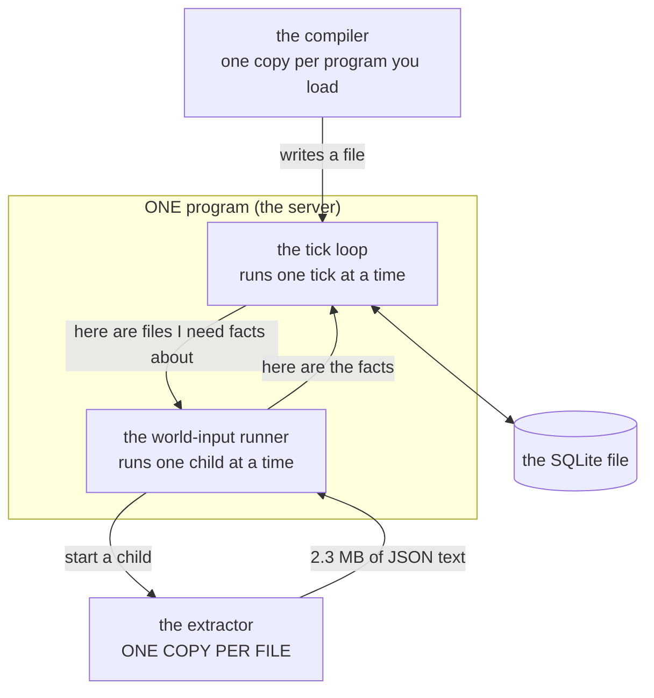
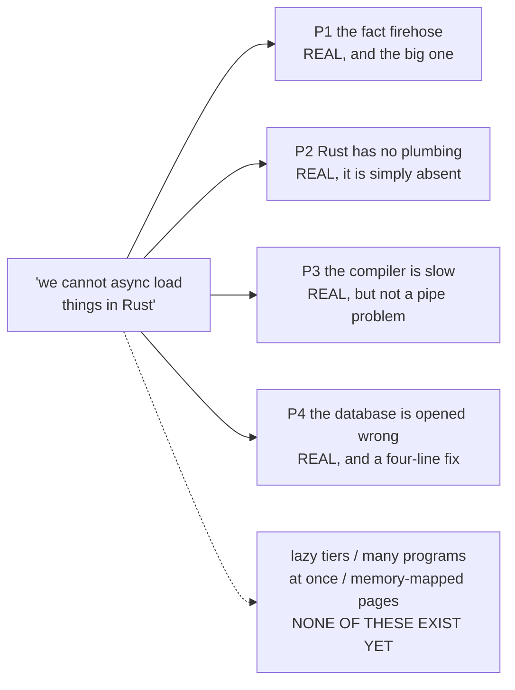
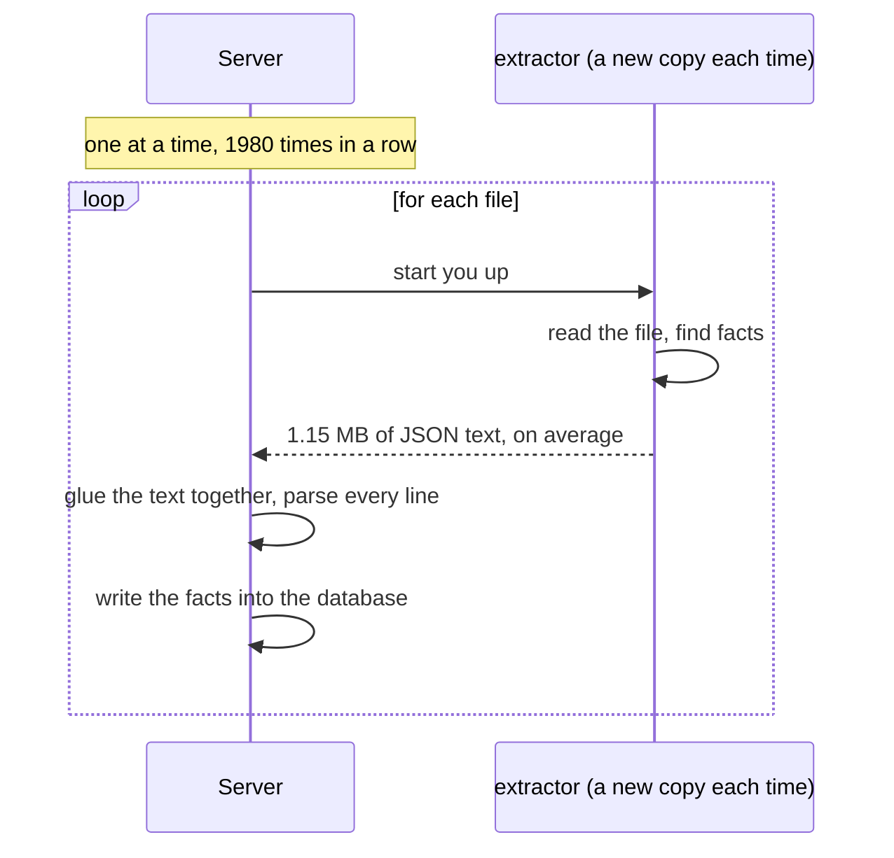
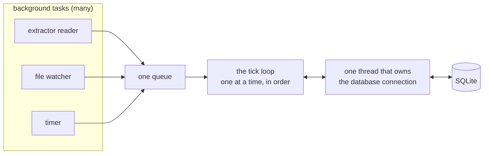
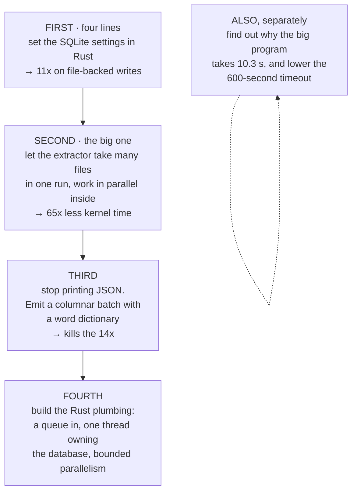

# "We cannot async load things in Rust": what that actually turned out to be

Plain-words version. No file references, no crate jargon left undefined. Read this one first.

---

## Table of contents

1. [The one-paragraph answer](#1-the-one-paragraph-answer)
2. [Words you need](#2-words-you-need)
3. [What the machine does today](#3-what-the-machine-does-today)
4. [The question was really four questions](#4-the-question-was-really-four-questions)
5. [Problem 1: the fact firehose](#5-problem-1-the-fact-firehose)
6. [The surprise: going parallel made it five times worse](#6-the-surprise-going-parallel-made-it-five-times-worse)
7. [Problem 2: the Rust side has no plumbing yet](#7-problem-2-the-rust-side-has-no-plumbing-yet)
8. [Problem 3: the compiler is slow, and it is not a pipe problem](#8-problem-3-the-compiler-is-slow-and-it-is-not-a-pipe-problem)
9. [Problem 4: the database is opened wrong](#9-problem-4-the-database-is-opened-wrong)
10. [Things I checked that turned out not to exist](#10-things-i-checked-that-turned-out-not-to-exist)
11. [Shared memory: why the answer is no](#11-shared-memory-why-the-answer-is-no)
12. [What to do, in order](#12-what-to-do-in-order)
13. [What I did not find out](#13-what-i-did-not-find-out)

---

## 1. The one-paragraph answer

You do not have an IPC problem. You have a **payload problem** and a **process-count
problem**, wearing an IPC costume. One pass over your own TypeScript turns 71 megabytes of
source into **2.28 gigabytes of JSON text**, moved through **1980 separate short-lived
programs**, one at a time, taking **26 seconds**. Ninety-three percent of those bytes are
the same words repeated. Nothing about shared memory, memory-mapped files, or a socket
library fixes any of that. Shrinking the payload and running one program instead of 1980
fixes all of it.

---

## 2. Words you need

| word | what it means here |
|---|---|
| **fact** | one small piece of information the code reader found, like "there is a function call at byte 4200 to a thing named `foo`" |
| **the extractor** | a separate program you already own that reads a source file and prints facts |
| **JSONL** | one JSON object per line of text. Human-readable, and very fat |
| **pipe** | the plumbing that carries text out of a child program into its parent |
| **spawn** | starting a child program |
| **pragma** | a setting you give SQLite when you open a database file |
| **WAL** | a SQLite mode that makes writes much faster and lets many readers work at once |
| **columnar** | storing a table column-by-column instead of row-by-row. Lets you write a repeated word once instead of once per row |
| **dictionary** | a list of the distinct words, plus a number per row pointing into that list. The same trick your own database rules already require |
| **shared memory** | two programs looking at the same block of RAM at the same time |
| **tokio** | the standard Rust library for doing several things at once |
| **stream** | a sequence of values that arrive over time. The Rust equivalent of what rxjs calls an Observable |

---

## 3. What the machine does today



Every arrow leaving the box is a real boundary between two running programs.

---

## 4. The question was really four questions



One answer to four questions is why the last attempt failed. Here they are separately.

| | problem | the number |
|---|---|---|
| **P1** | one child program per file, one at a time, moving fat text | 26 seconds and 2.28 gigabytes for one pass |
| **P2** | the Rust engine has the concurrency library installed and uses none of it | zero background tasks, zero channels in 1726 lines |
| **P3** | your biggest program takes 10.3 seconds to compile | the timeout is set to 600 seconds, so nobody notices |
| **P4** | the Rust database seam opens the file with the slow default settings | 11.2 times slower than the TypeScript side |

---

## 5. Problem 1: the fact firehose

### What happens now



### The measurements

One medium TypeScript file, 57 kilobytes of source:

| what | number |
|---|---|
| time to start an extractor at all | 2 milliseconds |
| time to read the file and find every fact | 22 milliseconds |
| facts found | 21,487 |
| JSON text produced | **2.3 megabytes** |
| time for the server to parse that text | 12 milliseconds |

So one 57 KB source file becomes 2.3 MB of text. Forty times bigger.

The whole codebase, 1980 files, 71 megabytes of source:

| what | number |
|---|---|
| wall clock | **26 seconds** |
| JSON text produced | **2.28 gigabytes** |
| how much bigger the output is than the input | 32 times |

### Where the fat is

Take that 2.3 megabyte file and compress it:

```
2,300,000 bytes  ████████████████████████████████████████  as written
  163,000 bytes  ███                                       after gzip
```

It shrinks **14 times**. That means fourteen fifteenths of what you are moving is the same
handful of words, typed over and over. Every line says `"record"` and `"family"` and
`"span"` and `"start"` and `"end"` again. There are only 97 different values in the whole
`kind` field, and each one gets spelled out in full, 21,487 times.

The extractor already keeps an internal list of distinct words and refers to them by
number. It **throws that list away** on the way out and spells everything back out in
full. That single decision is the 14x.

This is the same rule you already wrote down for your own database tables: keep the words
in one list, put numbers everywhere else. The wire between the extractor and the server
never got the rule.

---

## 6. The surprise: going parallel made it five times worse

The obvious fix is "run eight extractors at once". I measured it. Do not do it.

| how many at once | wall clock | time spent inside the operating system |
|---|---|---|
| 1 at a time | **26 seconds** | 18 seconds |
| 4 at a time | 29 seconds | 91 seconds |
| 8 at a time | **135 seconds** | **824 seconds** |

Eight at a time is **five times slower** than one at a time.

I checked whether starting programs was the cause. It is not: starting 500 copies of the
extractor at 8-at-a-time takes 0.1 seconds total.

The cause is the payload and the memory. Each extractor grabs a large scratch buffer, and
eight of them fighting the operating system for memory, while all eight shove text down
pipes into one reader, is what burns 824 seconds of kernel time.

### The other direction works

There is one code path in the extractor that already accepts many files in one go. Running
it over all 1980 files, in **one single program**:

| approach | wall clock | operating-system time |
|---|---|---|
| 1980 separate programs | 26 s | **17.8 s** |
| **one program, all 1980 files** | 7 s | **0.3 s** |

Sixty-five times less kernel time. That is the shape of the fix.

---

## 7. Problem 2: the Rust side has no plumbing yet

The Rust engine lists the standard Rust concurrency library as a dependency. It then uses
none of it.

| what I looked for | how many I found |
|---|---|
| background tasks started | 0 |
| channels between parts | 0 |
| functions that can wait | 2, both in the top-level driver |
| any code that talks to the outside world (files, git, the extractor) | 0 |

The comments at the top of two files describe background tasks and channels that are not
in the files. The loop that runs ticks is a plain `for` loop.

So the honest statement is not "Rust cannot async load". It is **"the Rust engine has not
been given a world-input path at all yet"**. All of the world-input machinery lives on the
TypeScript side and has not been ported.

There is also a note in the Rust code saying one whole category of rule ("edge rules") is
not ported yet. So the Rust engine is not finished doing the simple thing, which is worth
knowing before designing the concurrent thing.

### What the plumbing should be



Everything above the database stays plain, boring, one-thing-at-a-time code. The only
places that wait are the queue and the database thread. That is exactly the split the
TypeScript side already has, and it is the split your own written rule asks for.

**One library choice worth calling out.** There is a Rust library that copies the rxjs
vocabulary literally. It has about eleven thousand downloads in the last three months. The
standard Rust stream library has ninety-three million. That is an eight-thousand-fold gap
on a foundation you would live with for years. Use the standard one and translate the
vocabulary; the translation table is in the detailed document.

---

## 8. Problem 3: the compiler is slow, and it is not a pipe problem

| program | source size | time to compile |
|---|---|---|
| a normal fixture | 3.6 KB | 0.2 seconds |
| another normal fixture | 2.2 KB | 0.2 seconds |
| **your biggest real program** | 108 KB | **10.3 seconds** |

Thirty times the source, fifty times the time. Something in there is worse than
proportional, and that is a compiler bug waiting to be found.

Two things this is **not**:

- It is not a pipe problem. The compiler writes its answer to a file. The pipe only carries
  error messages. Making the pipe faster moves nothing.
- It is not a loading problem. Loading the 3 MB result the compiler produced takes 0.4
  seconds, four percent of the total.

One thing to fix immediately: the timeout on the compiler is set to **600 seconds**. Your
own rule says anything over 10 seconds is a bug to investigate. As set, the compiler could
degrade to nine minutes and nothing would say a word.

---

## 9. Problem 4: the database is opened wrong

The TypeScript side opens SQLite with a set of settings. The Rust side opens it with none.

Twenty thousand individual writes into a database file:

| settings | time |
|---|---|
| **what the Rust side does today (nothing)** | **6.17 seconds** |
| what the TypeScript side does | **0.55 seconds** |
| even more aggressive | 0.34 seconds |

**Eleven times faster, for four lines of code.** This is the best ratio in the whole
investigation and the cheapest thing on the list.

Note that this only bites when the database is a real file. The current Rust test harness
uses an in-memory database, where these settings do nothing, which is why nobody has
noticed.

### Is SQLite already the shared memory you were reaching for?

Partly, and it is worth knowing exactly where it stops.

| what you might want | does SQLite give it? |
|---|---|
| two programs reading the same data | **yes**, for free, in WAL mode |
| readers not blocking the writer | **yes** |
| two programs writing at once | **no.** One writer at a time |
| a program getting told "new data arrived" | **no.** It has to keep asking |

So SQLite is a good shared filing cabinet and a bad doorbell.

One warning: there is a known SQLite corruption bug that fires only when two programs
write to the same file at the same instant. It was fixed in SQLite 3.51.3. **The Rust
engine currently bundles SQLite 3.46.0**, which is inside the affected range. If you ever
do point two programs at one database file, bump that first.

---

## 10. Things I checked that turned out not to exist

You asked me to check some candidates. Four of them are not in the code at all. Saying so
is part of the answer.

| candidate | reality |
|---|---|
| relations loaded lazily in tiers | does not exist anywhere in v6. The phrase appears once, in a list of old v5 ideas you told everyone to stop asking about |
| many programs held in one server at once | does not exist. Loading a new program throws away the old one, its database, and its engine |
| the runtime memory-mapping database pages | does not exist. The only mention of memory mapping anywhere is a SQLite setting string |
| a second thread on the JavaScript side | does not exist. No worker threads anywhere |

One candidate **is** real: crawling several repositories. It works today, and it runs
through the same one-at-a-time path as everything else, so it has problem 1 and nothing
new.

---

## 11. Shared memory: why the answer is no

You named a family of tools. Here is why each one does not fit, in one line.

| tool | what it is for | why not here |
|---|---|---|
| a shared block of RAM two programs both open | two long-lived programs swapping small messages very fast | your extractor lives for 22 milliseconds and answers once. There is no long-lived partner to share with |
| the two Rust crates that do that | same | one has not had a release since 2022, the other since 2020. Both hand you raw bytes and nothing else, so you would write the queue, the locking, and the crash recovery yourself |
| a fancy zero-copy messaging middleware | robots and cars, microsecond deadlines | smallest download count of anything in this study, and it solves latency. Your problem is volume |
| memory-mapped files | reading a big file without copying it | **genuinely useful**, but only once the extractor writes a compact file instead of shouting text down a pipe |
| a socket library instead of a pipe | two long-lived programs having a conversation | your child exits after one answer. There is no conversation |
| a Rust-only channel that crosses processes | lovely, if both ends are Rust | the shipping engine is TypeScript. Revisit when Rust owns this boundary |
| a columnar format with a built-in dictionary | exactly the shape of your facts, and it kills repeated words by design | **this is the one.** It is the only candidate that attacks the 14x |

The pattern: every shared-memory tool answers "make each message arrive faster". Your
messages are not slow. They are enormous and redundant.

---

## 12. What to do, in order



| order | move | why now | expected |
|---|---|---|---|
| 1 | set the SQLite settings when the Rust engine opens a file | four lines, already proven on the TypeScript side | 11x on writes |
| 2 | one extractor run for many files, parallel inside that one program | measured: kernel time drops from 17.8 s to 0.3 s | deletes 1979 process boundaries |
| 3 | replace the JSON text wire with a columnar batch that spells each word once | measured: the text is 14x redundant, and parsing it costs the server 12 ms per file | roughly 2.28 GB becomes a few hundred megabytes |
| 4 | build the Rust concurrency plumbing on the standard libraries | it is entirely absent today | catches the Rust side up to the TypeScript side |
| any time | investigate the 10.3-second compile, and lower the 600-second timeout | your own rule says 10 seconds is a bug | a named defect instead of a silent one |

**The thing not to do first.** Do not add parallelism to the current setup. Measured: eight
at a time is five times slower than one at a time. Parallelism is move four, after the
payload shrinks and the process count collapses. Doing it first makes everything worse and
would look like proof that the whole idea was wrong.

---

## 13. What I did not find out

| question | why not |
|---|---|
| exactly how many megabytes the columnar version would be | that needs writing the encoder, which is implementation. The few-hundred-megabyte estimate comes from the compression measurement, not from an encoder |
| how well parallelism inside one extractor scales | the code path does not exist yet. The eight-at-a-time disaster does not predict it, because that was eight separate programs fighting over memory |
| whether wrapping each tick's writes in one transaction is safe | that would be even faster than the settings change, but it changes when writes become visible to the next step. That is a semantics question, and it is yours to decide |
| why the big program takes 10.3 seconds | out of scope here; it is named as the first thing to profile |
| whether the memory-mapping setting helps reading | I measured writing only, where it made no difference. Reading needs a warm big database, which does not exist on disk today |
| whether adding the columnar library to the TypeScript side is acceptable weight | the Rust half is clearly fine. The TypeScript half is a dependency-size call for you |
