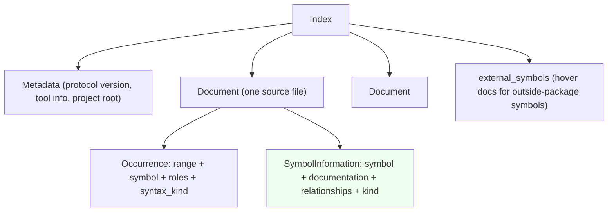

# SCIP as a data model, not as storage: which modelling ideas this system should adopt

Base commit checked with `git log --oneline -1`: `0447d771` (Merge pull request #215).
Docs only. Zero implementation code.

> Framing, restated from the brief: SCIP is a data model for describing code
> symbols across languages. This repo is not going to store SCIP indexes
> (explicitly rejected) and is not re-running the v5 ingestion work (done and
> priced). The question is which of SCIP's modelling ideas this system adopts.
> The user's "we would dense id the world but idea is same" is the thesis: the
> IDEA transfers, the encoding does not.

## Table of contents

- [What this repo already measured, and where the numbers live](#what-this-repo-already-measured)
- [Deliverable 1: the model, taught](#deliverable-1-the-model-taught)
  - [Version and sources](#version-and-sources)
  - [The three-level shape](#the-three-level-shape)
  - [The symbol string](#the-symbol-string)
  - [Descriptors](#descriptors)
  - [Local symbols](#local-symbols)
  - [Occurrence roles](#occurrence-roles)
  - [Relationships](#relationships)
  - [Syntax kinds](#syntax-kinds)
  - [The package / moniker layer](#the-package--moniker-layer)
  - [What SCIP deliberately omits](#what-scip-deliberately-omits)
  - [Worked example: one real symbol string decomposed](#worked-example-one-real-symbol-string-decomposed)
- [Deliverable 2: the feature matrix](#deliverable-2-the-feature-matrix)
  - [The matrix](#the-matrix)
  - [The five explicit questions](#the-five-explicit-questions)
  - [Expanded candidates](#expanded-candidates)
- [Deliverable 3: the narrow adoption fork](#deliverable-3-the-narrow-adoption-fork)
  - [The four priced forks](#the-four-priced-forks)
  - [Build vs buy, per candidate](#build-vs-buy-per-candidate)
- [Anti-cheat compliance](#anti-cheat-compliance)

## What this repo already measured

Every row from the brief re-verified against the tree at base `0447d771`.

| fact | evidence in tree |
|---|---|
| SCIP is a dl rel family in v5: `scip_def`, `scip_ref`, `scip_edge` | `.dl/gen-skill-ref.dl:39-41` claims the three rels; declared in `src/rels/scip.rs:61-67` |
| four v5 modules implement ingestion | `src/scip_setup.rs` (738 lines), `src/scip_import.rs` (979), `src/rels/scip.rs` (362), `src/engine/extract/scip_narrow.rs` (162) |
| field coverage 17/43 to 43/43 | `v6/prolog/ARCH.pl:832` (task `scip_passthrough`) |
| cost that stopped a standing feed | `v6/prolog/ARCH.pl:832`: 204 docs, 150,640 rows / 32.1 MB to 177,967 / 59.4 MB; ~17 MB of the 21.5 MB growth is constant columns; `syntax_kind` is 0 in 123,655 of 123,655; verdict is the engine cannot hold 100% at 291k rows per 1,000 files against 74.2 files/s |
| narrowing exists as a mechanism | `v6/prolog/ARCH.pl:832`: `--scip-record KINDS` filters at production; `src/scip_setup.rs` / `src/engine/extract/scip_narrow.rs` implement the seam |
| SCIP vs cheap syntactic resolver, measured | `v6/prolog/ARCH.pl:832`: scip 764 edges / 755 agree / recall .992 / precision .988; diet 761 / 761 / 1.000 / 1.000 |
| the 9-edge crux | `v6/prolog/ARCH.pl:832`: the 9 scip-only edges reach a declaration through an inferred type with no import statement, which no syntactic resolver closes |
| a pinned SCIP index named as the fix for a real blocker | `v6/prolog/ARCH.pl:777` (task `flow_parity_residue`): Rust call targets V5 200 / V6 168, matched 113; "close with improved typed Rust resolution facts or a pinned SCIP index" |
| SCIP indexers already invoked as ratchets | `v6/prolog/ARCH.pl:846` (task `external_oracle_scout`): `golden_parity.rs` runs scip-typescript, scip-go, rust-analyzer as non-ignored ratchets; binaries declared in `v6/sprefa-extract/src/scip_ensure.rs:69-84` |

Direct observation this lane adds:

- `scip` crate `0.7.1` is the Rust binding this repo consumes (`Cargo.toml:128`).
- The wire schema is vendored at `v6/sprefa-extract/proto/scip.proto` and is the
  codegen input (`ProtoSeam`/`ScipSource` seam).
- `v5` already carries several SCIP-derivable rels that pre-answer pieces of the
  matrix: `scip_impl` ("interface/supertype dispatch edge from SCIP
  is_implementation", `src/rels/scip.rs:73`), `scip_callee_type`
  (`src/rels/scip.rs:71`), `scip_local` (`src/rels/scip.rs:73`), `scip_occurrence`
  (`src/rels/scip.rs:77`).

## Deliverable 1: the model, taught

The audience is someone who has never opened the SCIP spec. Each concept gets
one line on what it MODELS and one on what it CANNOT say.

### Version and sources

- Wire schema: `v6/sprefa-extract/proto/scip.proto`, header
  "VENDORED from https://github.com/sourcegraph/scip @ 44d39fcfc954 (2026-07-21)".
  This is the contract this repo actually uses, so it is the authority here.
- Rust binding: `scip` `0.7.1` (`Cargo.toml:128`); the symbol formatter table
  below is quoted from `src/symbol.rs` of that crate.
- Design rationale: the SCIP project's `docs/DESIGN.md`,
  https://github.com/scip-code/scip/blob/main/docs/DESIGN.md, read by this lane.
  It states the three design decisions that matter for the fork analysis.

### The three-level shape

SCIP is an `Index` made of `Document`s. Each `Document` is one source file. Each
`Document` carries `Occurrence`s (positions in that file that mention a symbol)
and `SymbolInformation` (rich metadata for symbols defined in that file).
Symbols referenced from other packages can live in `Index.external_symbols`.
`Metadata` heads the index with tool info and the project root.

MODELS: the read unit is the file; the mention unit is the occurrence; the
semantic unit is the symbol information. You can stream an index file by file
without holding the whole graph in memory (`scip.proto` `Index` doc comment).

CANNOT say: which documents are mutually reachable. The graph is never encoded
directly; SCIP deliberately abandons an adjacency-list graph in favor of
documents and arrays so indexers stream and stay parallel (`DESIGN.md`, "Avoid
direct encoding of graphs"). Your system already builds the reachable graph
yourself (call graph, import graph), which SCIP never gives you flat.

### The symbol string

A symbol is a `scheme`, an optional `package`, and an ordered list of
`descriptors` (`scip.proto` `Symbol`, `v6/sprefa-extract/proto/scip.proto:193-206`).
Its canonical text form is `scheme manager name version`, then each descriptor
appended with its suffix. Example from this repo's own fixture:
`scip-typescript npm . . \`animal.ts\`/Dog#`
(`tests/5_scip_facts_cli.rs:72`). The string is globally unique across every
index and every repo because the scheme names the indexer and the package names
the distribution unit; two indexers cannot collide, and two packages of the
same name under different managers or versions cannot either.

MODELS: a single canonical address that identifies exactly one symbol anywhere
in the world, used as the join key between defs and refs and between repos.

CANNOT say: any human-readable meaning by itself. It is a structured name you
must parse to learn "this is package `npm`'s type `Dog` in file `animal.ts`".

Why it is a STRING and what that costs: `DESIGN.md` is explicit. Strings support
hashing and equality natively in every language, so indexers do not need a
symbol table; and the string is self-describing and readable, so an indexer
bug corrupts only the rows that mention one bad string instead of a whole
numbered table. The cost is exactly the redundancy this repo measured: the
symbol text is repeated on every occurrence row. That is the 59.4 MB growth in
`ARCH.pl:832` restated at the schema level.

### Descriptors

A descriptor names one step down a nesting. The `suffix` tells you what kind of
step it is (`scip.proto` `Descriptor.Suffix`, `v6/sprefa-extract/proto/scip.proto:208-230`):
Namespace, Type, Term, Method, TypeParameter, Parameter, Meta, Local, Macro.
The formatter (`scip` crate `src/symbol.rs:123-135`, v0.7.1) renders each:

| suffix | rendered as | example fragment |
|---|---|---|
| Namespace / Package | `{name}/` | `\`animal.ts\`/` |
| Type | `{name}#` | `Dog#` |
| Term | `{name}.` | `topLevel.` |
| Method | `{name}({disamb}).` | `sound().` |
| TypeParameter | `[{name}]` | `[T]` |
| Parameter | `({name})` | `(id)` |
| Meta | `{name}:` | `impl` |
| Macro | `{name}!` | `m!` |
| Local | `{name}` | `local 7` |

MODELS: the full containment of a symbol: package holds types, types hold terms,
types hold methods, methods hold parameters and type parameters, plus a catch-all
Meta. This is how the model expresses "this method belongs to this type, which
belongs to this package" without a separate table.

CANNOT say: overload identity beyond what the disambiguator gives, and nothing
about the type a method is on except by convention (`scip_callee_type` in this
repo, `src/rels/scip.rs:71`, reads it out of rust-analyzer's `impl`/`for`
segment, which is indexer-specific, not schema-guaranteed).

### Local symbols

A `Local` descriptor renders as `local <id>` where id is appearance-scoped, not
global (`scip` crate `src/symbol.rs:583`, `assert_eq!("local 7", ...)`). Locals
are never the target of a global reference; two different `local 3` in two
different functions name unrelated things. This repo's `scip_local` already
attaches locals to their enclosing fn (`src/rels/scip.rs:73`), stripping the
`foo#1` shadow disambiguators (`src/scip_import.rs:641-646`).

MODELS: cheap, local, non-colliding identity for variables and parameters with
zero cross-file coordination.

CANNOT say: anything across a scope boundary. A local's meaning is only
recoverable through its enclosing function, which the schema does not encode
directly; you have to derive it from enclosing ranges.

### Occurrence roles

An occurrence is a source range plus a symbol plus a `SymbolRole` bitset
(`scip.proto` `Occurrence`, `v6/sprefa-extract/proto/scip.proto:695-744`;
`SymbolRole`, :527-549): Definition `0x1`, Import `0x2`, WriteAccess `0x4`,
ReadAccess `0x8`, Generated `0x10`, Test `0x20`, ForwardDefinition `0x40`.
This repo already maps the common ones into `scip_occurrence.role` as
`definition/import/write/read/reference` (`src/rels/scip.rs:77`).

MODELS: the position-level semantics of a mention: is this the defining write,
a read, a write, an import, generated, in tests, or a forward declaration.

CANNOT say: the enclosing statement or expression, or the call arguments, or
control flow. A role says a read happened here, not what was done with it.

### Relationships

`SymbolInformation.relationships` attach cross-symbol edges (`scip.proto`
`Relationship`, `v6/sprefa-extract/proto/scip.proto:468-490`): `is_reference`,
`is_implementation`, `is_type_definition`, `is_definition`. The schema's own
worked example is the Animal/Dog pair: `Dog#` has an `is_implementation`
relationship on `Animal#`, and `Dog#sound()` carries both `is_implementation`
and `is_reference` on `Animal#sound()`. This repo decodes exactly that pair and
asserts it survives into `scip_impl` (`tests/5_scip_facts_cli.rs:40-56`,
`src/rels/scip.rs:73`).

MODELS: the semantic relations "this symbol implements / references / is a type
definition of / is a definition of that symbol", which is the basis of
Find-implementations and Go-to-type-definition.

CANNOT say: the direction of inheritance versus interface satisfaction, generic
instantiation, or anything about callers. It is a small closed vocabulary of
four link kinds.

### Syntax kinds

`syntax_kind` is a per-occurrence syntax-highlighting class (`scip.proto`
`SyntaxKind`, `v6/sprefa-extract/proto/scip.proto:551+`; `Occurrence.syntax_kind`,
:742). This repo measured it is constant 0 in 123,655 of 123,655 rows
(`ARCH.pl:832`), because the indexers in use never populate it.

MODELS: how to color an occurrence.

CANNOT say: `syntax_kind` is structural; it is the single counted case where
SCIP's fine-grained per-occurrence data has no signal at all in our toolchain,
and the measured reason a narrowed feed drops it (`ARCH.pl:832`).

### The package / moniker layer

The `package` (manager, name, version) on a symbol is how a symbol crosses a
package boundary (`scip.proto` `Package`, `v6/sprefa-extract/proto/scip.proto:199-206`).
The same type reached from another package carries the same global symbol, so a
consumer can resolve a symbol defined in a dependency without that dependency's
index. This is the whole cross-repo story: two indexes agree on symbols without
linking their documents.

MODELS: distribution-unit identity and cross-index symbol agreement.

CANNOT say: the resolved file content of that external package. External symbols
carry at most hover documentation (`Index.external_symbols`), never defs or refs.

Note the deliberate limit in this repo: `src/rels/scip.rs` "cross-repo SCIP
resolution is intentionally NOT reconstructed: a ref resolves only within its own
index's document set". The model has the vocabulary to cross a pocket boundary;
this system has chosen not to use it yet.

### What SCIP deliberately omits

The schema has no full type-expression tree, no function bodies, and no call
arguments. A method symbol names a method; it does not tell you its parameter
types as a tree, its body, or which callers pass what. Signatures exist only as
display text (`Signature`, `scip.proto:312+`), and `Occurrence` records mentions,
leaving the surrounding AST out.

MODELS: this-boundary is exactly what a code navigation LSP layer needs, no more.

CANNOT say: type shapes (that is the type IR's job), dataflow, or call-site
arguments (that is the flow/call IR's job).

### Worked example: one real symbol string decomposed

String: `` scip-typescript npm . . `animal.ts`/Dog# `` (this repo's fixture,
`tests/5_scip_facts_cli.rs:72`).

| segment | value | meaning (per the grammar above) |
|---|---|---|
| scheme | `scip-typescript` | the indexer that produced it |
| manager | `npm` | the distribution manager |
| package name | `.` | placeholder for a root package |
| package version | `.` | placeholder for no version |
| descriptor 1 | `` `animal.ts` `` with suffix `/` | Meta: the file, backtick-quoted because it holds reserved chars |
| descriptor 2 | `Dog` with suffix `#` | Type `Dog` in that file |

The full global symbol is the concatenation, globally unique because the scheme
names the indexer and the file-named Meta scopes the type.

A method would stack one more descriptor: `Dog#sound()` is the `Dog` Type
descriptor, then a Method descriptor `sound` (rendered `sound().` per the crate
table; the spec's prose writes it `sound()`).

## Deliverable 2: the feature matrix

Columns are places in THIS system a SCIP modelling idea could serve: the type IR,
the module/visibility IR, extraction (`sprefa-extract`), LSP features, codemod /
write planning, and cross-repo. Reference points for the columns: type IR rels in
`src/engine/decls.rs:522-553` (`type_entity`, `type_edge`, `type_sig`,
`type_link`); the type IR polyglot plan `plans/2026-08-12-type-ir-polyglot.PLAN.md`;
module/visibility in `plans/2026-08-03-modscope-plan.md`; LSP in
`plans/2026-08-12-v6-native-lsp.PLAN.md`.

### The matrix

Verbs: yes / no / partial, plus a clause.

| SCIP idea | type IR | module/visibility IR | extraction (`sprefa-extract`) | LSP features | codemod / write planning | cross-repo |
|---|---|---|---|---|---|---|
| symbol string as an interned symbol id | **partial**: `type_entity.sym` is already the cross-graph key (`decls.rs:522`), just TEXT now; interning it is the A-fork change, not a new idea | **yes**: a symbol id is the natural module name once it spans packages | **yes**: already the emit unit of `--scip-facts` (`projects/fixtures`, `5_scip_facts_cli.rs`) | **yes**: the id is the goto-definition / find-refs join key | **partial**: refs by id survive a rename only if the plan re-links ids | **yes**: this is the only model layer with cross-index agreement |
| descriptors as nested naming | **yes**: `sym` as `repo::file::kind::name` is already a descriptor chain flattened (`decls.rs:522`); the descriptor tree is the principled version of that flat string | **yes**: package/type/method nesting mirrors module nesting, useful when `use` alias sugar lands (`modscope-plan.md:169` keeps `use` out of v1) | **partial**: decode emits descriptor-adjacent rows (`scip_name`, `src/rels/scip.rs:63`) but not the full tree | **partial**: nesting drives symbol outline / breadcrumbs | **no**: descriptor nesting does not change a write target's location | **yes**: the suffix is what disambiguates same-named types across packages |
| local symbols | **no**: types are global; locals are not types | **partial**: locals attach to a scope, the same shape as `scip_local` (`src/rels/scip.rs:73`) | **yes**: already extracted to `scip_local` | **partial**: local-scope find-refs, but LSP computes this itself | **no** | **no**: by definition not cross-repo |
| Document / Occurrence / SymbolInformation three-level | **no**: the type IR is a flat rel set, not per-file grouped | **yes**: a module IS a Document; the file grouping is the module boundary | **yes**: the extractor already walks per-document occurrences | **yes**: the three-level shape maps to the three LSP answer shapes (file, position, symbol info) | **partial**: file-level grouping lets a write plan bundle same-file rewrites | **no**: per-file grouping does not cross a repo |
| occurrence roles (def/ref/write/read/import/gen/test/forward) | **no**: the type IR cares about declared entities, not mention roles | **partial**: import role is the import graph; write/read matter to visibility | **yes**: `scip_occurrence.role` already encodes them (`src/rels/scip.rs:77`) | **yes**: roles are most of what LSP needs per position | **partial**: write vs read distinguishes a rewriter's targets from its readers | **no** |
| relationships (is_implementation / is_reference / is_type_definition / is_definition) | **partial**: `scip_impl` already carries impl edges (`src/rels/scip.rs:73`); the type IR itself has no notion of one type implementing another (gap, see the explicit question) | **partial**: `is_reference` is a re-export/visibility fact | **partial**: decoded only when present; is often empty in our toolchain | **yes**: these four kinds are the entire Find-implementations / type-definition feature set | **partial**: "which symbols my refactor must update" is an is_reference closure | **partial**: the schema allows cross-index relationship targets |
| syntax kinds | **no**: structural, no type meaning | **no** | **no**: discarded, constant 0 (`ARCH.pl:832`) | **no**: coloring is the editor's job, we measured it carries no signal | **no** | **no** |
| package / moniker layer | **yes**: the package qualifier is exactly the `repo`/`rev` identity this repo already threads through `type_entity_rev` (`decls.rs:529`) | **yes**: package is the highest module scope | **yes**: emitted by indexers already consumed (`scip_ensure.rs:69-84`) | **partial**: hover for external packages comes from `external_symbols` | **no** | **yes**: the map between a local symbol id and an external symbol id |
| what SCIP omits (no type trees, bodies, call args) | **yes as boundary**: the type IR must extend past what SCIP expresses; SCIP marks an outer boundary, and the type IR carries the type tree SCIP leaves out | **n/a** | **n/a** | **n/a** | **n/a** | **n/a** |

### The five explicit questions

**1. Type IR models a rel and its columns; SCIP models a symbol and its
relationships. Same graph at different resolutions, or different graphs?**
Different graphs, with one concrete overlap. The type IR is a set of typographic
edges: `type_edge(from, to, kind)` where kind is `field/variant/impl/generic`
(`src/engine/decls.rs:522 doc`) and `type_entity` records declared types. Those
are layout facts about a declared type. SCIP's symbol graph is about identity and
cross-package reachability; it stays silent on field/variant containment. In this
repo:
`type_edge` with kind `impl` records "Kotlin class implements interface"
(`decls.rs:522`), while `scip_impl` records "SCIP `is_implementation`",
(`src/rels/scip.rs:73`). Same named relation, different producers: `type_edge` is
syn/tree-sitter/oxc syntactic layout, `scip_impl` is a type-checker fact. They
overlap when a syntactic `impl` kind and a type-checked `is_implementation`
agree, and diverge on exactly the 9-edge case. Same graph at different
resolutions only where a type-checker and a syntax scanner agree; otherwise two
graphs.

**2. Does SCIP's symbol + relationship model express visibility, re-export,
aliasing, circular imports?**
Partly, and thinly. `is_reference` is a cross-symbol reference, which is the raw
material of re-export and aliasing, but nothing in the schema marks "this is a
re-export" or "this is an alias of that"; you infer it. There is no
visibility/access modifier anywhere in `SymbolInformation`. Circular imports are
a module-graph fact the schema never models. The module/visibility lane therefore
cannot lean on SCIP: `modscope-plan.md` treats visibility as its own concern and
keeps `use` alias sugar out of v1 (`modscope-plan.md:169`), and the type IR
polyglot plan puts alias expansion and import resolution behind a language
service (`type-ir-polyglot.PLAN.md:185`). SCIP expresses none of the four
faithfully.

**3. `is_implementation` and `is_type_definition` are relationship kinds; the type
IR has no notion of one type implementing another. Gap to close; would SCIP's
spelling be right?**
Gap is real: `type_edge`'s `impl` kind is syntactic layout, not "type T
implements interface I" as a checked fact (`decls.rs:522`), and `scip_impl` exists
but is a separate scip group rel, not part of the type group (`src/rels/scip.rs:73`).
SCIP's spelling of the four relationship kinds is a good vocabulary to adopt, but
the honest reading from `ARCH.pl:832` is that the checked kind only materializes
where a type checker ran; a syntactic scanner fills it from `implements` clauses
and gets the 9-edge case wrong. Adopting the relationship KIND is cheap and
correct; trusting the relationship VALUE to a syntactic producer is the measured
trap. See fork B.

**4. Local symbols are non-global and cheap. Is there an analogue for a rel's
local bindings, and would it help?**
Yes, and it already exists: `scip_local` attaches local bindings to their
enclosing fn (`src/rels/scip.rs:73`), and `scip_binding` joins local source text
to a canonical symbol to resolve alias/default imports (`src/rels/scip.rs:83`).
The analogue to SCIP's "locals are appearance-scoped, `local 7` means nothing
outside its function" is the per-fn-scoped binding map. It helps where a rewrite
or a detector needs to normalize a local identifier to a resolved symbol instead
of erasing its name, which `scip_import.rs` calls the "CST cross symbol join"
(`src/scip_import.rs:39-44`). Adopt it, but keep it scoped: a local id must never
leak into a global namespace.

**5. SCIP's symbol string is a parseable structured name; surrogate ids are
opaque integers. What is lost by interning, and does a dictionary table with the
parsed descriptor columns recover it?**
Interning under the surrogate-key law (`sql-relational-design`) loses three
things, with one recovery path each:
- self-description / debuggability: a hot row reads `sym_id 42`; recovery: the
  dictionary table IS the readable symbol, joined at the read boundary. This is
  the law's intended trade: "human-readable output is a JOIN or view at the read
  boundary".
- blast-radius isolation: SCIP keeps strings so one indexer bug poisons only the
  rows mentioning one bad string (`DESIGN.md`); an interned id turns one bad
  dict row into many poisoned relationships. Recovery: the dict is append-only
  with a UNIQUE natural key, so a bad symbol fails its UNIQUE or its parse, not
  its hash.
- prefix collation on path-like symbols: TEXT keys sort/prefix-match naturally;
  an id does not.
What it gains, measured: INTEGER keys insert 1.7-2.0x faster than TEXT at every
volume, and an interned fixpoint is 9.0-9.4x smaller on disk (`sqlite-costs`).
Pricing both: the symbol string IS the natural key; storing it once in a
dictionary with descriptor columns (scheme, manager, name, version, suffix,
disambiguator, parent id) and keying hot rels on the id surrenders the readable
string in hot tables but recovers it fully at read time, and the descriptor
columns ARE the parsed structure. The dictionary does not just recover the string;
it stores the parse result, which a raw string keeps re-parsing. Net: interning
loses only raw-string readability in hot tables; the dictionary recovers it and
also memoizes the parse. What is genuinely lost by the id, with no id-free
recovery, is the natural TEXT sort and prefix-collation of a path-like symbol,
which an INTERMEDIATE descriptor column set restores.

### Expanded candidates

Top rows from the matrix, expanded under the surrogate-key law.

| candidate | adopt what | our version under the surrogate-key law | measured cost |
|---|---|---|---|
| interned symbol table with descriptor columns (A-fork core) | SCIP's symbol/descriptor model, none of the wire format | `sym(id INTEGER PK, scheme, manager, name, version, suffix, disambiguator, parent_id, UNIQUE(scheme,manager,name,version,...))`; `type_entity.sym` and `scip_ref.symbol` become `sym_id` | dict append-only at boundary ~7.5M edges/s, 0.06-4.2% of total (`sqlite-costs`); hot-table inserts 1.7-2.0x faster; hot tables shrink 9.0-9.4x |
| relationship kinds on the type IR (B-fork core) | `is_implementation`, `is_reference`, `is_type_definition`, `is_definition` as a `type_rel(src_sym_id, dst_sym_id, kind)` | one rel, `kind` is a dirty-little-integer enum, `src/dst` are sym ids | one new rel decl; the schema already proves the pair (Animal/Dog) decodes into `scip_impl` (`tests/5_scip_facts_cli.rs:40-56`); the cost is the producer fidelity trap, not the storage |
| occurrence-position rel for LSP (already built) | roles + ranges | `scip_occurrence(file, symbol_id, line, col, end_line, end_col, role, repo)` (`src/rels/scip.rs:77`) | the counted 59.4 MB problem is the per-row TEXT symbol, which interning deletes; roles themselves are 8 narrow enum values |
| per-scope local binding map | SCIP's local-scoping | `scip_local(fn_id, name)` + `scip_binding(file, symbol_id, local_name, line, col, repo)` (`src/rels/scip.rs:73,83`) | already extracted; cost is scope-attribution, already done in `scip_import.rs` |
| package/moniker identity | the package qualifier as the repo/rev seam | fold into the existing `repo`/`rev` columns (`decls.rs:529`) | zero new storage; the identity thread is already there |

## Deliverable 3: the narrow adoption fork

Given the measured cost (`ARCH.pl:832`), the plausible shape is narrow adoption.
Four forks priced. The user rules; this lane only prices.

### The four priced forks

**A. Adopt the symbol/descriptor MODEL, none of the wire format.**
Our own interned symbol table with descriptor columns.
- Buys: the entire column of the matrix that depends on a global stable symbol
  id; hot rels keyed on INTEGER ids (1.7-2.0x faster inserts, 9.0-9.4x smaller
  disk, `sqlite-costs`); the descriptor columns carry the parse result forward to
  the type-IR and module-visibility work; cross-repo joins become id joins.
- Costs: the dictionary table and its boundary interning (measured cheap,
  0.06-4.2% of total); every rel currently carrying `sym` TEXT re-keyed; a
  read-boundary join to materialize names. No indexer consumed, none
  reimplemented.
- Forecloses: nothing; this is the base layer the other forks assume. It does not
  itself fetch a SCIP index; it only re-shapes identity.

**B. Adopt relationship kinds only.**
Add `is_implementation` and friends to the type IR, ignore everything else.
- Buys: Find-implementations / type-definition as a first-class typed rel; closes
  the explicit gap in question 3; tiny, one rel, four enum kinds; the Animal/Dog
  pair already decodes into `scip_impl` (`tests/5_scip_facts_cli.rs:40-56`).
- Costs: the producer-fidelity trap is the real price: a syntactic scanner fills
  the kinds from `implements`/`extends` clauses and gets the 9-edge inferred-type
  case wrong (`ARCH.pl:832`). Cheap to add, easy to over-trust.
- Forecloses: nothing structural. It is the cheapest fork and the most
  independent.

**C. Narrowed on-demand SCIP as a fact source for inferred types only.**
The 9-edge case; `scip_narrow.rs` and `--scip-record KINDS` are the existing
precedent.
- Buys: the only measured unique value in the whole report: the 9 edges that
  reach a declaration through an inferred type with no import statement
  (`ARCH.pl:832`), which no syntactic resolver closes. Also the pinned-index fix
  already named for the Rust call-target blocker (`ARCH.pl:777`): a pinned SCIP
  index closes the V5 200 / V6 168 / matched 113 gap rather than another DL rule.
- Costs: the standing-feed cost is why it must stay a narrow, on-demand, pinned
  stream; the standing-feed shape is the measured failure: 291k rows per 1,000
  files at 74.2 files/s with commit_ms dominant, 59.4 MB, constant-column waste
  (`ARCH.pl:832`). Narrowing at
  production (`--scip-record KINDS`) plus skipping the corpus read is the seam
  already there.
- Forecloses: cross-repo resolution beyond an index's own document set stays out
  (`src/rels/scip.rs`), which is acceptable because the unique value is
  within-repo inferred types.

**D. Nothing; the syntactic scanner is enough.**
The 1.000-vs-1.000 reading.
- Buys: zero ingestion cost, zero new storage, no indexer dependency.
- Costs: the reading is honest only as "two syntactic scanners agree; that
  agreement is within the resolved class, and correctness is a separate claim"
  (`ARCH.pl:832`): diet's 1.000 is agreement between two syntactic
  resolvers, and it is exactly the 9 edges diet misses that only a type checker
  closes. The cost of being wrong is permanent blindness to inferred-type
  references, and the Rust call-target gap stays open (`ARCH.pl:777`).
- Forecloses: everything the other three forks would have bought, at zero cost,
  by deciding inferred-type links do not exist.

The forks are not mutually exclusive: C is a consumer of A (a pinned index
resolves onto an interned symbol table), and B is a subset of A's schema. Ranked
by (value / cost): B is the cheapest measured win, C is the only unique-information
win, A is the enabling base layer, D keeps today's ceiling.

### Build vs buy, per candidate

The ratchet law (`ARCH.pl:846`) already says these are consumed, not built. Per
candidate:

| candidate | consume | import |
|---|---|---|
| produce inferred-type facts | `rust-analyzer` (binary, `scip_ensure.rs:69`) and `scip-typescript` (npm, `scip_ensure.rs:76`), `scip-go` (go, `scip_ensure.rs:83`) | never reimplement; the decode is indexer-agnostic already (`scip_decode.rs`) |
| decode / parse the wire | the `scip` crate `0.7.1` (`Cargo.toml:128`) | already in use; keep it |
| symbol format/parse grammar | the `scip` crate `src/symbol.rs` | already in use for parsing monikers (`scip_import.rs`) |

Nothing here is reimplemented. The only new code-shaped decision is the interned
symbol table under fork A, which is this repo's own identity layer, not a
reimplementation of SCIP.

## Anti-cheat compliance

| tempting shortcut | how this doc answered it |
|---|---|
| explaining SCIP from memory | every claim cites the vendored proto (`v6/sprefa-extract/proto/scip.proto`), the pinned crate (`scip` 0.7.1, `Cargo.toml:128`, `symbol.rs`), or the design doc URL |
| proposing SCIP storage | explicitly framed out; the wire format is not proposed anywhere, only the model ideas; the storage shape proposed is this repo's own interned dictionary |
| ignoring the 59.4 MB measurement | restated as the schema-level cost in the symbol-string section and as the standing-feed verdict in fork C |
| ignoring the 9-edge finding | it is the spine of fork C and the honest reading of fork D |
| a matrix with empty cells | every cell carries yes/no/partial plus a clause |
| picking a fork | all four priced; the user rules |
| skipping the unga doc | sibling file `2026-08-12-scip-as-ir.RESEARCH.visual.human.unga.md`
