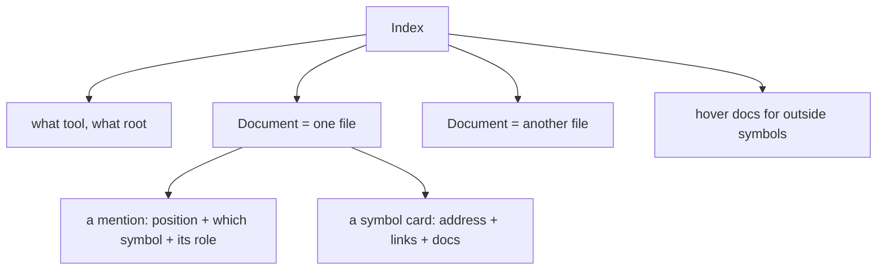

# SCIP as a data model: plain words

Plain-language sibling to the research doc. No citations, no file paths, nothing
left assumed. Read this if you want the shape without the receipts.

## Table of contents

- [What SCIP is, in one breath](#what-scip-is-in-one-breath)
- [The three-level shape](#the-three-level-shape)
- [The symbol, the address](#the-symbol-the-address)
- [The nested name (descriptors)](#the-nested-name-descriptors)
- [Locals](#locals)
- [Roles on a mention](#roles-on-a-mention)
- [The four links between symbols](#the-four-links-between-symbols)
- [The parts we throw away](#the-parts-we-throw-away)
- [One real symbol, pulled apart](#one-real-symbol-pulled-apart)
- [What it buys this system](#what-it-buys-this-system)
- [The four ways forward](#the-four-ways-forward)

## What SCIP is, in one breath

SCIP is a JSON-adjacent wire format that different compiler-backed tools all emit,
so that every tool agrees on what each symbol in your code is called. You can
think of it as a shared phone book for symbols. Two tools that never talk to each
other can both say "this is package X's type Dog" and mean the same thing.

It is a picture of symbols, and only of symbols. It says nothing about how code
runs.

## The three-level shape

Every source file becomes a Document. Inside a Document live mentions
(Occurrences), which are positions that point at a symbol, and symbol cards
(SymbolInformation), which carry extra facts about symbols defined in that file.



The point of this shape: you can read an index file by file without loading the
whole codebase into memory.

## The symbol, the address

Every symbol has a single long text address, unique everywhere in the world. The
address starts with the name of the tool that made it, then the package that own
it, then the nested path down to the symbol itself.

Why a text string and not a number: strings compare and hash in every language
without a lookup table, and a wrong string hurts only the rows that mention it.
The cost of that choice is what this repo measured: the address text gets
repeated on every mention, which bloats the data.

## The nested name (descriptors)

The path part of an address is a stack of segments. Each segment says what kind
of step it is. A table of the step kinds and how they look as text:

| step kind | looks like | example |
|---|---|---|
| package / folder | name + `/` | `animal.ts/` |
| type | name + `#` | `Dog#` |
| method | name + `().` | `sound().` |
| top-level term | name + `.` | `helper.` |
| type parameter | `[name]` | `[T]` |
| parameter | `(name)` | `(id)` |
| catch-all | name + `:` | `impl` |

This is how the model says "this method belongs to this type, which lives in
this package" without a separate table.

## Locals

Variables and function parameters get a cheap, local name, like `local 7`. That
name means nothing outside its own function. Two functions each have their own
`local 7` that are unrelated.

## Roles on a mention

Each mention says more than just "this symbol appears here". It says the role:

| role | means |
|---|---|
| definition | the symbol is defined here |
| reference | it is used here but defined elsewhere |
| write / read | the value is written or read here |
| import | it is brought in here |
| generated / test | it is generated code or test code |
| forward-definition | a declaration, body elsewhere |

## The four links between symbols

A symbol card can carry links to other symbols, and each link has one of four
meanings:

| link kind | means |
|---|---|
| is_reference | find references to this symbol should include that symbol too |
| is_implementation | find implementations of this should include that |
| is_type_definition | go to type definition goes through this |
| is_definition | this symbol is the real definition of that one |

The classic case is the pair `Dog` implements `Animal`: the `Dog` card points at
`Animal` with kind "is_implementation".

## The parts we throw away

SCIP deliberately does not carry: full type shapes, function bodies, or the
arguments passed at each call site. It says a read happened here; it does not say
what the read feeds. It says a method exists; it does not say its parameter types
as a tree.

Also, one of its fields, the syntax-highlighting class, has no signal at all in
this repo's toolchain, so it is dropped.

## One real symbol, pulled apart

Take this address from an actual fixture:

```
scip-typescript npm . . `animal.ts`/Dog#
```

| piece | value | meaning |
|---|---|---|
| tool | `scip-typescript` | who produced it |
| package manager | `npm` | how it is shipped |
| package name | `.` | a root package, no real name |
| package version | `.` | no version |
| step 1 | `` `animal.ts` `` with `/` | the file, written in backticks because it has odd characters |
| step 2 | `Dog` with `#` | the type Dog in that file |

A method in that type stacks one more step on the end, so `Dog#sound()` means
the type Dog, then the method sound on it.

## What it buys this system

The most useful fact anyone has written about SCIP here is small and concrete:
out of a test corpus, nine references could only be found by the type checker,
because they point at a symbol reached through an inferred type, with no import
statement. No cheap name-matcher can ever find those nine; only a tool that
understands types can. That is the whole unique value of SCIP here, and it is a
narrow value: nine edges in a corpus, nothing broader.

So the decision is not "do we adopt SCIP". The decision is which of its ideas we
copy into our own shape, where we use dense ids instead of text strings.

Surrogate-key rule this repo lives by: stored relations key on integer ids; the
natural text name is stored once in a dictionary table and looked up at read
time. That is the same idea as SCIP's address, with the string swapped for an id.
The idea transfers; the text does not.

## The four ways forward

| fork | what it is | the one-line trade |
|---|---|---|
| A. adopt the symbol model, not the wire | our own id table with the split-apart name as columns | fastest and smallest storage, but you build the id layer |
| B. adopt the link kinds only | add "implements / references / etc" as a relation | the cheapest win; but a syntax scanner fills these wrong on inferred types |
| C. on-demand type-checker facts | run the compiler tool only when you need inferred-type links | the only place SCIP gives information nothing else can |
| D. do nothing | keep the syntax scanner | cheapest, and it keeps today's blind spot permanent |

The three that do work are not rivals. D is the do-nothing; A is the base layer the
others sit on; B is the small win; C is the only one that finds the nine.

Nothing in any fork reimplements an indexer. This repo already calls the real
tools (rust-analyzer, scip-typescript, scip-go) and already decodes their output
with the official library. The only new code-shaped thing under fork A would be
this repo's own id table. That is this repo's own identity layer; SCIP itself is
never implemented here, only read from.
