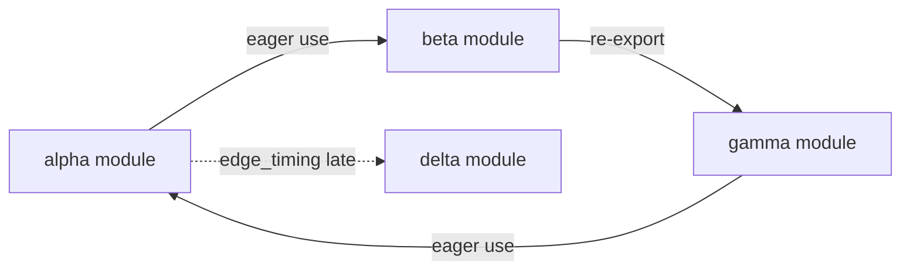
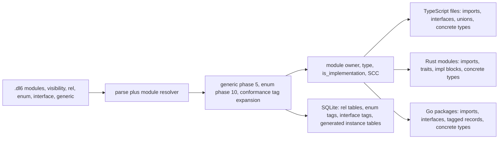

# TypeSpec parity: module, visibility, and nominal type IR research

> Historical research. `issues/remove-rel-is/item.md` removed the relation
> conformance suffix used in examples below on 2026-08-23.

## TOC

1. [Context and receipts](#context-and-receipts)
2. [TypeSpec 1.15.0, the named six](#typespec-1150-the-named-six)
3. [Foreign-source parse survey](#foreign-source-parse-survey)
4. [Enum, interface, trait](#enum-interface-trait)
5. [Fork prices](#fork-prices)
6. [Decisions](#decisions)
7. [Cycles](#cycles)
8. [Verification](#verification)
9. [Staffing](#staffing)
10. [Pass 2: rel roles and conformance](#pass-2-rel-roles-and-conformance)
11. [Pass 2: generic rel arguments](#pass-2-generic-rel-arguments)
12. [Pass 2: closed codegen picture](#pass-2-closed-codegen-picture)

## Context and receipts

The repository has catalog identity and membership for modules. The current type emitters render every type relation into one text stream and bind the row module id to `_ModuleId`; they have no placement or import pass. Receipt: `v6/prolog/lower.pl:1379-1406`, `:1411-1474`; `v6/prolog/compile/4_emit_jsonschema.pl:35-45`; `v6/prolog/compile/7_emit_ts_types.pl:15-36`; `v6/prolog/compile/8_emit_rust_types.pl:15-36`.

| Fact | Receipt |
|---|---|
| Entry module row | `lower.pl:1388-1389` |
| `use "path"` module rows | `lower.pl:1411-1424` |
| First declaration owner wins `rel_module_map/3` | `lower.pl:1429-1452` |
| Existing edge rows have consumer parent and producer module id | `lower.pl:1454-1474` |
| JSON Schema selects relations by module id | `4_emit_jsonschema.pl:39-45` |
| TS and Rust type renderers discard module id | `7_emit_ts_types.pl:15-20`; `8_emit_rust_types.pl:15-20` |
| Shared resolver claim | `wc -l v6/prolog/use_resolve.pl` prints `333 v6/prolog/use_resolve.pl`; both compiler doors import it: `rg -n 'use_resolve' v6/prolog -g '*.pl'` |
| Earlier type-output frontier and emitter prices | `plans/2026-08-12-type-ir-polyglot.PLAN.md:12-16`, `:342-390`; human companion `plans/2026-08-12-type-ir-polyglot.PLAN.visual.human.unga.md` |

Checked TypeSpec version: `npm view @typespec/compiler version` printed `1.15.0` on 2026-08-12. The package source was inspected with `npm pack @typespec/compiler@1.15.0`; visibility implementation exports appear in `package/dist/src/core/visibility/core.d.ts:120-155`, lifecycle cache in `:lifecycle.js:5-20`, and Node ESM package resolution in `package/dist/src/module-resolver/module-resolver.js:3-184`.

## TypeSpec 1.15.0, the named six

| Feature | Surface syntax | Compiler representation | Emitter consumption | Deliberate boundary | Receipt |
|---|---|---|---|---|---|
| Visibility | `@visibility(Lifecycle.Create, Lifecycle.Read) p: string;`, `@removeVisibility(Lifecycle.Update)`, `@invisible(Lifecycle)` | Every `ModelProperty` has a set of `EnumMember` values per visibility-class enum. `getVisibilityForClass(program, property, enum)` returns that set. | REST maps HTTP method/request or response context to a lifecycle filter. OpenAPI makes a visibility-specific schema when required, with a read-only optimization for `Read`. | It applies to model properties. A custom enum has effect only when a consumer recognizes it. | [visibility](https://typespec.io/docs/language-basics/visibility/), [HTTP operations](https://typespec.io/docs/libraries/http/operations/), package receipt above |
| Re-export expression | No source re-export expression exists. `using One;` supplies local bindings, and `alias B = A;` creates a declaration in the current namespace. | Program namespaces merge declarations across imported files; aliases are TypeSpec declarations. | Emitters traverse the resolved `Program`, declarations, and namespaces, then choose output files. | `export { x } from`, star re-export, and source-file export tables are absent. | [namespaces](https://typespec.io/docs/language-basics/namespaces/), [emitters](https://typespec.io/docs/extending-typespec/emitters-basics/) |
| ESM bare specifier | `import "@typespec/rest";` | Compiler module resolver parses package name/subpath and follows the package `exports` `typespec` condition, then `tspMain` or `main`. | Import loads declarations and JS decorators into one Program. It does not prescribe generated-language import statements. | The TypeSpec import string is compilation input, not a target ESM import declaration. | [imports](https://typespec.io/docs/language-basics/imports/), package receipt above |
| Path aliasing | No TypeSpec path-alias syntax. Relative `./` and `../`, absolute paths, package names, and package export subpaths are accepted. | Resolver uses Node package lookup and ESM `exports`; package resolution is recorded by compiler loading, rather than a user-visible alias declaration. | Same as bare import. | `tsconfig paths`, an `as` binding, and a module-graph alias node have no TypeSpec spelling. | [imports](https://typespec.io/docs/language-basics/imports/) |
| Circular import | No distinct surface marker. Imported `.tsp` files contribute namespaces to one compilation Program. | Compiler loads files and resolves declaration namespaces. | Emitters receive one resolved `Program`, then decide file placement. | The documentation does not define a target-runtime loading order or an import-cycle codegen policy. | [imports](https://typespec.io/docs/language-basics/imports/), [namespaces](https://typespec.io/docs/language-basics/namespaces/) |
| Deferred, dynamic, async import | No surface form and no edge timing attribute. | No corresponding core module edge mode in the inspected compiler package. | An emitter can choose any target code shape, but TypeSpec provides no source fact saying an import arrives late. | `import()` and lazy-loader semantics are outside the TypeSpec language model. | [imports](https://typespec.io/docs/language-basics/imports/), `rg -n 'dynamic import|deferred import|async import' /tmp/typespec-JPYFmK/package/lib /tmp/typespec-JPYFmK/package/dist` printed no matches |

### Visibility detail

`Lifecycle` has `Create`, `Read`, `Update`, `Delete`, and `Query`. By default a property carries all modifiers of a class unless `@defaultVisibility`, `@visibility`, `@removeVisibility`, or `@invisible` changes that set. `@visibility` adds members; `@removeVisibility` removes members; `@invisible` clears the class. A property can simultaneously carry independent sets for multiple visibility classes. Receipt: [visibility](https://typespec.io/docs/language-basics/visibility/), [built-in data types](https://typespec.io/docs/standard-library/built-in-data-types/).

REST supplies these filters: response is `Read`; GET/HEAD request is `Query`; POST/PUT request is `Create`; PATCH/PUT request is `Update`; DELETE request is `Delete`. Emitters see either the original property plus the selected class/filter, or a transformed model such as `Create<T>`, `Read<T>`, `Update<T>`, and `Delete<T>`. Receipt: [HTTP operations](https://typespec.io/docs/libraries/http/operations/), [visibility transforms](https://typespec.io/docs/language-basics/visibility/).

Parse breadth and model breadth are separate prices. A foreign reader needs a raw list of source visibility tokens and their source spans. A portable generated-type model can initially retain `public`, `restricted`, and per-member visibility facts, while retaining source-specific data for `pub(crate)`, Java package access, and C# `internal`. Lifecycle classes add an operation-context filter and property-copy pass, estimated below.

### TypeSpec Program plus alloy output

TypeSpec compiles imports and merged namespaces into a `Program`. An emitter receives `EmitContext.program` and `emitterOutputDir`. Alloy then turns declarations chosen from that Program into filesystem output: `<Output>` owns formatting and symbols; `<SourceDirectory path>` nests files; `<SourceFile path>` owns file content; refkeys resolve a symbol reference to the declaration's emitted location and insert the target-language import when its language component supports that operation. Receipt: [emitter framework](https://typespec.io/docs/extending-typespec/emitter-framework/), [emitter basics](https://typespec.io/docs/extending-typespec/emitters-basics/).

For this repository, catalog module rows can supply the missing placement input. A later TS/Rust emitter needs an equivalent of `SourceDirectory` and `SourceFile`, plus a resolved symbol-to-module map before rendering imports. The existing `rel_module_map/3` supplies declaration ownership; existing renderers only require a phase that consumes it. `refkey` has no equivalent catalog row today. Receipt: `lower.pl:1431-1452`; `7_emit_ts_types.pl:15-36`; `8_emit_rust_types.pl:15-36`.

## Foreign-source parse survey

| Language | Visibility to parse | Import forms to parse | IR retained for exact source form | Loss after small portable model | Lossy? | Receipt |
|---|---|---|---|---|---|---|
| Rust | bare, `pub`, `pub(crate)`, `pub(super)`, `pub(in path)` | `use`, `pub use`, nested/group/glob use, `mod`, `as` alias | item visibility token/tree; module declaration; edge kind `use` or `reexport`; local alias; glob flag; source path | Restricted scope needs a source-language visibility term unless reduced to `restricted`; macro-expanded imports need compiler output. | Yes for macros and exact restricted paths without raw data | [Rust visibility](https://doc.rust-lang.org/reference/visibility-and-privacy.html), [Rust use](https://doc.rust-lang.org/reference/items/use-declarations.html) |
| TypeScript | `export`, `export default`, `declare`; member `public`, `private`, `protected` | bare/relative, `export * from`, `export { x as y } from`, `import()`, `import type`, `paths` aliases | declaration export mode, member modifier, edge timing, type-only bit, imported/exported symbol pairs, alias spelling and resolved path | `paths` configuration and conditional module resolution sit outside a source-file-only IR; `default` needs an explicit export slot. | Yes unless resolver config is retained | [TS modules](https://www.typescriptlang.org/docs/handbook/modules/reference.html), [TS classes](https://www.typescriptlang.org/docs/handbook/2/classes.html) |
| Go | exported by initial Unicode uppercase, otherwise package-local | import path, local alias, `_`, `.` | declared source name and computed export bit; edge local binding mode | Capitalization convention needs the original identifier. Dot import maps many names and blank import has an effect-only purpose unavailable in type-only output. | Yes for dot/blank effects | [Go declarations](https://go.dev/ref/spec#Exported_identifiers), [Go imports](https://go.dev/ref/spec#Import_declarations) |
| Python | module public convention, `_name`, `__all__`; class member conventions | `import x as y`, `from x import y as z`, `from x import *`, relative imports | source token, `__all__` contents, edge members/alias/relative level | Runtime mutation, `__getattr__`, and import side effects need execution or a checker. | Yes | [Python import](https://docs.python.org/3/reference/import.html), [Python `__all__`](https://docs.python.org/3/tutorial/modules.html#importing-from-a-package) |
| Java | `public`, `protected`, package-private, `private` | `import`, static import, package name | item/member modifier; static bit; package; imported symbol/alias-free edge | Package accessibility requires package identity; wildcard imports require a deferred name lookup. | Yes for wildcard resolution without classpath | [Java access control](https://docs.oracle.com/javase/specs/jls/se21/html/jls-6.html#jls-6.6), [Java imports](https://docs.oracle.com/javase/specs/jls/se21/html/jls-7.html#jls-7.5) |
| C# | `public`, `private`, `protected`, `internal`, `protected internal`, `private protected`, file | `using`, alias `using X =`, `global using`, `using static` | declaration/member accessibility enum; import mode/alias/static/global bit | Friend assemblies and file visibility require project and source-file context. | Yes without assembly context | [C# accessibility](https://learn.microsoft.com/en-us/dotnet/csharp/language-reference/keywords/access-modifiers), [C# using](https://learn.microsoft.com/en-us/dotnet/csharp/language-reference/keywords/using-directive) |

## Enum, interface, trait

The supplied probe is reproducible from `v6/prolog/compile/dl_view/enum_decl_variant_rows_round_trip_through_tag_view.dl6`; parser and expansion test receipts are `v6/prolog/compile/test/plunit_tests.pl:2338-2358`, `v6/prolog/0_enum_expand.pl:55-80`, `:122-199`. `rel body(page(view: text) ; redirect(to: text)).` creates `body_page`, `body_redirect`, and `body_tag`; a later `payload: body` is retargeted to an integer enum instance id at `0_enum_expand.pl:69-80`. It is therefore already a reusable named sum type at the storage layer. `option(body)` currently reaches `option_of_enum_unsupported` at `0_option_expand.pl:42-43`, because option is phase 5 and enum is phase 10 (`1_expansion.pl:28-29`). This phase ordering affects enum-plus-option coverage, not module, import, or visibility facts.

| Kind | Go | Rust | TypeScript | TypeSpec | Floor and ceiling receipt |
|---|---|---|---|---|---|
| Enum | `const ( A Kind = iota )`; no sum type | `enum E { A, B { x: i32 } }` | `enum E` or tagged union | `enum E { A }`; payload alternatives use named `union` | [Go const](https://go.dev/ref/spec#Const_declarations), [Rust enum](https://doc.rust-lang.org/reference/items/enumerations.html), [TS unions](https://www.typescriptlang.org/docs/handbook/2/everyday-types.html#union-types), [TypeSpec enums](https://typespec.io/docs/language-basics/enums/), [TypeSpec unions](https://typespec.io/docs/language-basics/unions/) |
| Interface | `type I interface { M() }`, structural satisfaction | `trait T { type A; fn m(); }` plus `impl T for X` | `interface I { m(): void }`, structural | `interface I { op m(): string; }`, operation grouping | [Go interfaces](https://go.dev/ref/spec#Interface_types), [Rust traits](https://doc.rust-lang.org/reference/items/traits.html), [TS interfaces](https://www.typescriptlang.org/docs/handbook/2/objects.html), [TypeSpec interfaces](https://typespec.io/docs/language-basics/interfaces/) |
| Trait | No declaration distinct from interface | trait declaration, explicit implementations, associated items, bounds, default methods, blanket implementations, coherence | interface/type composition | No data-type trait. Interfaces compose operations. | Rust receipt above; [TypeSpec interfaces](https://typespec.io/docs/language-basics/interfaces/) |

| Question | Priced boundary |
|---|---|
| Go floor | Carry a named interface with a method signature set, plus structural satisfaction at target emission. Carry an enum as named constants or as the existing tagged-sum representation. Go has no trait implementation declaration or payload enum syntax. |
| Rust ceiling | Carry associated types, generic parameters and bounds, method signatures and defaults, explicit `impl`, and blanket-impl pattern if source retention targets Rust. Coherence is a compiler checking rule involving crate ownership, so an IR can retain the facts but cannot decide cross-crate legality alone. |
| Structural versus nominal | `interface` as a relation with method rows can support either query. Structural reachability evaluates required method sets. Nominal reachability reads an explicit `implements(Type, Interface)` row. Supporting both stores both facts; a source can omit the explicit row for structural languages. |
| `implements` spelling | `implements(Type, Interface).` follows the existing Prolog fact style and matches SCIP's `is_implementation` relation direction. It carries source nominal intent and supplies a stable emitter input. Receipt for local catalog relationship rows: `lower.pl:1454-1474`; SCIP names: [SCIP symbol information](https://github.com/sourcegraph/scip/blob/main/scip.proto). |
| Existing enum-rel | Storage has enough for variants, fields, discriminator, and an enum instance id. Named export requires retained `enum_decl` metadata after expansion, a public type name, and selected target tag spelling. A distinct declaration form is not required for that data, but is a fork if source-level category distinction must survive. |
| Exhaustiveness | Current match expansion checks all variants: `v6/prolog/src/checks.pl:14`, `v6/prolog/0_enum_expand.pl:30-47`. Rust checks exhaustive `match`; TypeScript checks only when code narrows to `never`; Go `switch` has no compiler exhaustiveness check; TypeSpec has no value-level match. Receipts: [Rust match](https://doc.rust-lang.org/reference/expressions/match-expr.html), [TS narrowing](https://www.typescriptlang.org/docs/handbook/2/narrowing.html), [Go switch](https://go.dev/ref/spec#Switch_statements), [TypeSpec language overview](https://typespec.io/docs/language-basics/overview/). |

## Fork prices

Baseline receipts: JSON Schema is 176 lines (`wc -l v6/prolog/compile/4_emit_jsonschema.pl`), OpenAPI 103 (`5_emit_openapi.pl`), TS types 69 (`7_emit_ts_types.pl`), and Rust types 69 (`8_emit_rust_types.pl`). Prices below are code plus targeted tests, measured against those files and the earlier recon's emitter estimate of 450-800 lines for a complete target path (`plans/2026-08-12-type-ir-polyglot.PLAN.md:382-390`). No branch is selected.

| Feature / fork | IR change | New `.dl6` spelling? | Emitter cost per target | Enables | Forecloses |
|---|---|---|---|---|---|
| Visibility A: raw source facts only | `visibility(Source, Scope, Span)` attached to declaration/member | No | 0-20 lines to ignore or copy comments; 80-160 tests | Foreign parse breadth and later policy | Target access control and lifecycle views |
| Visibility B: portable access | `visibility(Item, public)` or `visibility(Item, restricted)` | Yes, `public(...)` / `restricted(...)` facts or attributes | TS 30-70, Rust 30-70, Go 20-50, plus 80-150 tests | Public export filtering | Rust restricted paths and C# access matrix without raw facts |
| Visibility C: TypeSpec lifecycle | class/member/filter rows and operation-context rows | Yes | 150-300 per API emitter, 180-320 tests | Request/response views | A small declaration-only emitter unless it also receives operations |
| Re-export A: relation-level alias | producer relation id, consumer module id, local name | Yes, `reexport(From, Name, As).` | TS 40-90, Rust 40-90, Go 40-90, 100-180 tests | named re-export | star/default/export-list distinctions |
| Re-export B: complete export table | module export rows, star/default/type-only/member selectors | Yes | TS 120-220, Rust 80-160, Go 70-130, 200-350 tests | TS and Rust source round-trip classes | Exact foreign resolver behavior without language adapter |
| Bare A: resolved-only package edge | resolved producer module plus original specifier string | No | 20-50 target path printing, 50-100 tests | package-level target imports | Re-running source package lookup |
| Bare B: resolver configuration | package conditions, search roots, package metadata | No new `.dl6`, config file required | 80-180 shared resolver, 150-300 tests | reproducible source resolution | lockfile/compiler-specific conditions absent from config |
| Alias A: resolved edge plus original alias | edge `local_name`, original specifier, resolved module | No if catalog edge row grows | 30-80 per target, 80-140 tests | alias-preserving imports | target alias rewrite policies |
| Alias B: author-facing alias fact | alias name to real location | Yes, `alias(Name, Path).` | 60-130 shared resolution, 100-220 tests | `.dl6` path aliases | TypeScript `paths` wildcard behavior unless added |
| Cycle A: permit and record SCC | graph edge rows plus `scc(Module, Group)` derived catalog output | No | TS 20-60, Rust 30-90, Go 30-90, 100-200 tests | legal graph cycles and diagnostics | deterministic total topological order |
| Cycle B: annotate source cycle policy | edge timing plus cycle policy row | Yes | 40-100 per target, 120-240 tests | target-specific diagnostics | cycle-free assumption in every emitter |
| Late A: edge timing bit | `edge_timing(Edge, eager|late)` | Yes | TS 60-130, Rust 80-180, Go 40-100, 120-250 tests | IR can say an edge arrives late | target runtime loading semantics without a second decision |
| Late B: target loader data | timing, loader kind, return/result type, failure channel | Yes | TS 150-300, Rust 180-350, Go 120-260, 250-500 tests | `import()`, lazy static, loader API generation | a target-independent runtime contract |

## Decisions

No fork is selected. The source facts and prices are presented for a later user decision.

## Cycles



| Target | Eager cycle behavior | Failure boundary | Late-edge shape | Receipt |
|---|---|---|---|---|
| TypeScript ESM | Module records link before evaluation. Cyclic live bindings exist; reading an uninitialized lexical binding during evaluation throws. CommonJS output has partial exports instead. | top-level initialization order and emitted module mode | `import("specifier")` yields a promise module namespace | [ECMAScript modules](https://tc39.es/ecma262/multipage/ecmascript-language-scripts-and-modules.html), [TS dynamic import](https://www.typescriptlang.org/docs/handbook/modules/reference.html) |
| Rust | `mod` declarations form one crate graph; item references can be cyclic. Separate crate dependency cycles are rejected by Cargo. Recursive value layout needs indirection such as `Box`. | Cargo package graph and infinite-size type layout | `once_cell`, `LazyLock`, or explicit async loader are library/application choices | [Rust modules](https://doc.rust-lang.org/reference/items/modules.html), [Cargo resolver](https://doc.rust-lang.org/cargo/reference/resolver.html), [Rust recursive types](https://doc.rust-lang.org/book/ch15-01-box.html) |
| Go | Imports must form an acyclic package graph. Type declarations inside a package can be recursive subject to valid type recursion. | compile error `import cycle not allowed` | no language dynamic import; explicit registration/factory/runtime loader is application code | [Go import declarations](https://go.dev/ref/spec#Import_declarations), [Go package initialization](https://go.dev/ref/spec#Package_initialization) |

An SCC has no total topological order. The recon's deterministic topological order survives only after condensation: topologically order SCC groups, then use a deterministic local ordering inside each group. The IR can permit cycles, detect SCCs, and annotate every edge with timing. A late edge can break an eager cycle only when the selected target loader moves the dependency read past eager initialization. Receipt: `lower.pl:1454-1474` supplies the directed edge row; [ECMAScript modules](https://tc39.es/ecma262/multipage/ecmascript-language-scripts-and-modules.html) supplies ESM linking/evaluation separation.

## Verification

| Check | Receipt |
|---|---|
| Base before any commit | `git log --oneline -1` printed `0447d771 Merge pull request #215 from hafley66/feature/emit-rust-close-the-loop` |
| Pass-1 source | `c57a06da` was absent from this worktree and present on `plans/typespec-module-ir`; cherry-pick created `1437957e` with the unchanged two pass-1 artifacts before this append |
| Required hook setup | `cargo build --release --features cli --bin extract`, `v6/tsv2 pnpm install`, and `v6/sprefa-store/js pnpm install` returned 0 before `1437957e` |
| Enum probe | `v6/prolog/compile/dl_view/enum_decl_variant_rows_round_trip_through_tag_view.dl6`; expansion receipts in the enum section |
| Pass-2 reference probe | temporary `.dl6` with `point` and `line` returned 0 and emitted INTEGER `line.a` and `line.b` |
| Pass-2 enum probe | temporary `.dl6` with `body` and `response` returned 0 and emitted the three `body_*` tables plus INTEGER `response.payload` |
| Pass-2 generic probe | temporary curried `pair` returned 2 at line 1, column 12 |
| Option phase | `0_option_expand.pl:42-43`; `1_expansion.pl:28-29` |
| Module receipts | Context table |
| TypeSpec version | `npm view @typespec/compiler version` printed `1.15.0` |
| Owned paths | only this document and `plans/2026-08-12-typespec-module-ir.RESEARCH.visual.human.unga.md` |

## Staffing

| Item | Value |
|---|---|
| Work | two documentation artifacts only |
| Agent | Codex, one lane |
| Base | `0447d771` |
| Pass-1 import commit | `1437957e` |
| Pass-2 commit | pending |

## Pass 2: rel roles and conformance

### Reproduced probes and current rel roles

All three supplied probes were rerun through `v6/prolog/compile/scripts/compile_dl6.sh` on 2026-08-12. The reference program and enum program returned `rc=0`. `rel pair(T)(first: T, second: T).` returned `rc=2`, with `dl_parse_error/2` at line 1, column 12, the second `(`. The parser has two `rel` declaration arms: enum at `compile/parse_dl.pl:610-621`, ordinary columns at `:623-644`; the ordinary arm consumes one parenthesized column list and then modifiers or `.`.

| What the declaration carries | Current role | Current storage | Receipt |
|---|---|---|---|
| columns plus `key(...)` | keyed stored rel | its own set table: `__id INTEGER PRIMARY KEY`, columns, `UNIQUE` over the declared key when the rel is an arrival target or rule head | `compile.pl:198-235`; `lower.pl:874-900`, `:2104-2144` |
| columns only | set rel | its own table: `__id INTEGER PRIMARY KEY`, columns, `UNIQUE` over all columns | `lower.pl:861-872`, `:2104-2144`; reproduced `point` and `line` DDL |
| variants `(a(...) ; b(...))` | closed sum type | one table per variant plus `name_tag(id, tag)` | `0_enum_expand.pl:55-80`, `:122-199`; reproduced `body_page`, `body_redirect`, `body_tag` |
| named as a column type | reference | the owner table's column is `INTEGER NOT NULL`, containing the target row `__id`; current lowering emits no SQLite `FOREIGN KEY` clause | `0_type_plane.pl:181-204`; `lower.pl:2160-2165`; reproduced `line.a` and `line.b` |
| rule head | derived rel | its own table, selected by `derived_refs/2` out of arrival targets | `compile.pl:204-215`; `lower.pl:2084-2144` |

The table supports the observation: `rel` presently covers stored relation, relation value type, closed sum declaration, and derived relation. The missing declaration category is an instance-free interface. Every current non-enum relation reaches `declared_refs/2` and `rel_ddl/6`; an interface needs a discriminator before that path so it produces no ordinary instance table.

### Open tag set

The enum lowering has the proposed graph shape. For each closed variant `body_page(Id, ...)`, `0_enum_expand.pl:122-163` generates one rule, `body_tag(Id, page) <- body_page(Id, ...)`; `:55-80` retargets an enum column to `int`. The tag table is a derived set rel, so it currently has `__id`, `id`, `tag`, `__refcount`, and `UNIQUE(id, tag)` in the reproduced program.

An interface can use the same tag relation pattern with member declarations discovered from conformance rows rather than variant terms:

```text
rel addressable(path: text, digest: text) interface.
rel file(path: text, digest: text, bytes: int) is addressable.

file(__id, path, digest, bytes)
  -> addressable_tag(id = __id, which_rel = file)
```

The physical tag requires two INTEGER columns: `id` and `which_rel`. `which_rel` is the existing catalog relation id, rather than a repeated relation-name string. The pair is unique. `id` alone is not global, since every rel table has its own `__id` sequence. The existing compiler deliberately omits SQLite foreign-key clauses for relation references because SQL cascades conflict with retraction; the interface tag follows that same storage rule. `__rel` already supplies the dictionary row for relation identity (`lower.pl:836-900`, `:1369-1710`).

| Source form | Variant membership source | Tag rows | Membership set |
|---|---|---|---|
| `rel body(page(...) ; redirect(...)).` | enum declaration | `body_tag(id, tag)` | closed at the enum declaration |
| `rel addressable(...) interface. ... rel file(...) is addressable.` | conformance clause on each member rel | `addressable_tag(id, which_rel)` | open across declared member rels |

The emitter delta is limited to reading a new interface and conformance record and emitting the tag relation rule/table. The existing enum expander is 199 lines; its reusable mechanism is 42 lines from `expand_enum_program/2` through column retargeting (`:55-96`) plus 78 lines for variant declaration/rule expansion (`:122-199`). An open tag needs no variant parser, no enum column retargeting, and no generated content tables. A bounded initial estimate is 35-70 shared compiler lines plus 60-120 targeted tests, before target-language type rendering.

### Interface discriminator and content floor

| Marking fork | Whole-program read | Parser and IR price | Failure boundary |
|---|---|---|---|
| explicit `interface` modifier | declaration owns its category | one parser modifier, one relation-kind or declaration record, 25-45 shared lines and 35-70 tests | a conformance target must name an interface declaration |
| infer from conformance plus no population | every declaration, rule head, schedule target, and seed must be examined | no initial keyword, then 70-130 shared lines and 80-150 tests for classification and diagnostics | a later rule or arrival changes an earlier declaration from interface to stored rel |

Use the explicit `interface` modifier as the leading spelling. Inference makes declaration meaning depend on the complete program and requires a late check before `declared_refs/2` builds `RelPlans`.

Columns are the initial interface floor. They are required to check the shared value shape and to render TypeScript fields, Rust associated data through a generated row type, and Go field access helpers. Rules on an interface introduce default-method semantics. Rust traits permit defaults, Go interfaces have method signatures without defaults, and TypeScript interfaces describe shape only. The initial declaration should therefore reject interface rules as TODO. Keys, `log`, `keep`, arrivals, seeds, and ordinary relation references are also absent because an interface has no instance table.

| Member rel kind | Meaning of `member is addressable` | Tag rule source |
|---|---|---|
| stored rel | every stored member row produces one `(member.__id, member rel id)` tag row | generated edge rule from the member table |
| derived rel | every current derived member row produces one tag row; retraction follows the derived row's retraction | generated edge rule from the derived member table |

### Conformance link

The current `.dl6` source has one written rel-to-rel link: a column type such as `line(a: point)`. The parser turns a referenced relation into `type_decl/2` metadata at `compile/parse_dl.pl:990-1036`; `column_storage/3` turns the name into `ref(Name)`; `column_def/4` stores that endpoint as INTEGER. Conformance adds an is-a link. It has a different cardinality and expansion: one member rel can name many interfaces, and each member row produces a tag row for each named interface.

| Spelling | Parse consequence | Price | Result |
|---|---|---|---|
| `rel file(...) is addressable.` | add a keyword-led clause after ordinary modifiers; `is` is currently unclaimed by the declaration parser | 20-35 parser lines, 30-60 tests | leading choice: reads as a clause on the existing rel |
| `rel file(...) implements addressable.` | same position and parser shape, longer reserved word | 20-35 parser lines, 30-60 tests | retains the prior document's SCIP-aligned word |
| `implements(file, addressable).` | new fact declaration path, separate from the rel | 35-60 parser lines, 45-80 tests | repeats the member name and permits a detached source location |
| `file <- addressable` | conflicts with the already declared xfx rule arrow | parser conflict and rule ambiguity | unavailable |

The leading surface is `is`, with an IR row named `is_implementation(MemberRelId, InterfaceRelId)`. `is` keeps conformance on the rel declaration and supplies the user-visible clause; the IR spelling follows SCIP's existing `is_implementation` relationship kind. `is_type_definition` serves a different relation: it connects a symbol occurrence to its defining symbol, while this row connects a member declaration to an interface declaration. The prior document's `implements(Type, Interface)` text can remain a foreign-source adapter spelling or a diagnostic rendering, without minting a second IR relation kind.

| Conformance mode | Determining data | Shared price | Target consequence |
|---|---|---|---|
| structural | compare member columns with required interface columns | 70-120 compiler lines and 90-160 tests | Go and TypeScript can infer satisfaction; source intent is unavailable to catalog and Rust output |
| declared | retain `is_implementation(member, interface)` | 35-70 compiler lines and 60-120 tests | Rust `impl`, Go compile-time satisfaction witness, TypeScript `extends` or assignment check have a stable source |

Declared conformance is the leading mode. A declaration supplies the requested written link and a catalog relationship that remains available after source parsing. A future structural query can run over the same column records without changing the declared row.

The generated Rust shape is per member relation, generated by the Rust type emitter after it has the module placement and name map from pass 1:

```rust
pub trait Addressable {
    fn path(&self) -> &str;
    fn digest(&self) -> &str;
}

impl Addressable for FileRow {
    fn path(&self) -> &str { &self.path }
    fn digest(&self) -> &str { &self.digest }
}
```

The compiler emits neither an author-declared `impl` entity nor a relation named `my_impl`. The conformance clause yields the catalog row and the tag rule. The Rust emitter reads that row and writes the `impl` block.

If a member conforms to two interfaces whose column names collide, each interface keeps its own declared column list and its own tag table. The member must satisfy each column type independently. Rust method names collide when two traits expose the same method name, but trait-qualified calls select one; Go and TypeScript use the same field name and type. Equal names with unequal types require a named conformance mismatch before target emission. Equal names with equal types require one member column and satisfy both checks.

### Three levels and staging

| Level | Surface | Expansion result | Existing support | Price |
|---|---|---|---|---|
| 0 | `interface` plus `is`, no generics | interface record, `is_implementation` row, open tag rule | enum tag mechanism and rel reference storage | 35-70 compiler lines plus 60-120 tests; 20-70 lines per target type emitter |
| 1 | `rel pair(T)(...)`, `pair(int)` | each ground instantiation mints a concrete rel/table | worklist, canonical naming, artifact lowering already exist for wrapper templates | 170-310 shared compiler lines plus 180-320 tests |
| 2 | generic interface plus `is container(text)` | level-1 instantiation followed by level-0 conformance | both previous records and tag rule | 60-120 additional shared lines plus 90-160 tests |

Level 0 has no type-variable parse, substitution, instance discovery, or generic artifact. It is independent of levels 1 and 2 and can be staged first. Level 2 depends on a concrete instantiation being available to conformance expansion. The source distinction remains:

| Written | Meaning |
|---|---|
| `pair(int)` | generic instantiation: mint one concrete relation value type and its table at compile time |
| `file is addressable` | conformance: link an already declared rel to an interface and expand rows into an interface tag |

## Pass 2: generic rel arguments

### Curried surface

The curried form is the leading surface:

```dl
rel pair(T)(first: T, second: T).
rel coords(point: pair(int)).
```

The current parser already recognizes the zero-parameter portion, `rel point(x: int, y: int).`, through the ordinary declaration arm at `compile/parse_dl.pl:623-644`. Its grammar change can be represented as:

```text
rel_decl ::= "rel" dotted_path generic_params? columns modifiers conformance? "."
generic_params ::= "(" ident ("," ident)* ")"
columns ::= "(" column ("," column)* ")"
conformance ::= "is" type_application ("," type_application)*
type_application ::= ident | ident "(" type ("," type)* ")"
```

After a rel name, the first parenthesized group is parameters only when a second parenthesized group follows. The parser is at the closing `)` of the first group before selecting that branch, so no arbitrary token lookahead is required. Existing declarations remain the one-parenthesized zero-parameter form. The grammar must reserve parameter names inside the template body and reject free parameters in a non-template declaration.

The Zig comparison holds at compile time: `pair` is a schema template from types to a concrete schema, and `pair(int)` selects a concrete schema. It stops at surface operations and runtime representation. Zig can execute arbitrary comptime code and produces a language type; this compiler's initial template body is a rel column list plus permitted declaration facts, and expansion produces relation declarations and SQL tables.

### Existing generic phase and user-facing delta

`0_generic_expand.pl` is 348 lines. It already executes monomorphization for four internal wrapper constructors: `list/1`, `list_entity_dense_sequence/1`, `list_interned_set/1`, and `list_entity_linked_sequence/1` (`:91-110`). The expansion runs a ground-instance worklist (`:47-89`), lowers typed artifacts to ordinary declarations (`:117-192`), keeps author declarations before minted declarations (`:194-201`), detects generated-name collisions (`:203-244`), replaces generic column types (`:246-309`), and gives each concrete type a readable stem plus 64-bit SHA-256 prefix (`:311-348`). It runs at expansion phase 5, before enum phase 10 (`1_expansion.pl:28-29`).

| Work | Existing lines | User-facing template addition | Estimate |
|---|---:|---|---:|
| ground instance discovery and fixed point | 47-115 | discover `user_template(Name, Parameters, Columns)` applications as well as wrapper terms | 35-65 lines |
| schema artifacts | 117-192 | substitute parameter bindings into template columns and key facts, then mint the concrete rel | 55-100 lines |
| deterministic minted identity | 194-244, 311-348 | reuse `canonical_type_encoding/2` and collision check; retain source template name separately | 15-30 lines |
| column replacement and type mirrors | 246-309 | retarget `pair(int)` to its minted type name/reference | 25-45 lines |
| `.dl6` parser and template IR | none | curried parameters, type applications, template declaration record, source spans | 40-70 lines |
| checks and fixtures | existing generic fixture and parser suite | arity, groundness, recursive use, collision, column/key substitution | 180-320 lines |

This places the user-facing route at about 170-310 compiler lines and 180-320 test lines. The phase has the core worklist, hashing, artifact order, and ordinary-declaration boundary already present; parser support, user template records, substitution, and checks are new.

Each distinct ground application produces tables. There is no runtime type column and no polymorphic table. The current wrapper artifact counts are concrete: `list(T)` emits 2 relations, `list_entity_dense_sequence(T)` emits 4, `list_interned_set(T)` emits 3, and `list_entity_linked_sequence(T)` emits 3 (`0_generic_expand.pl:125-175`). A program with 6 templates, 8 distinct instantiations per template, and 2 emitted relations per template instance produces 96 generated relations. The present `.dl6` corpus contains 0 curried generic declarations (`rg -n 'rel [[:alnum:]_]+\\([^)]*\\)\\(' v6 -g '*.dl6'`), so no corpus-backed user-template multiplication factor exists yet.

Generic bounds such as `rel pair(T)(...) where T is addressable` are a later arc. They need level 2's instantiated interface record plus a type-level conformance check, while level 1 only requires ground substitution. Deferring bounds retains a direct expansion order: generic instantiation first, ordinary interface conformance second.

### Wrapper prize

| Current wrapper path | Storage result | Existing receipt | Single generic-template route |
|---|---|---|---|
| `option(scalar)` | generated scalar enum id | `0_option_expand.pl:39-43` | a template needs a closed-sum artifact capability in addition to companion tables |
| `option(rel)` | companion relation with endpoint INTEGER reference | `0_option_expand.pl:44-49` | a two-artifact template can emit option identity and an endpoint relation |
| `list(T)` | list entity and member relation | `0_generic_expand.pl:125-133` | already an artifact template |
| dense, interned-set, linked list flavors | 4, 3, and 3 relation artifact sets | `0_generic_expand.pl:134-175` | already artifact templates |
| `json_list(T)` | one JSON carrier column with array check, no relation artifact | `0_type_plane.pl:77-123` | parameterized type checker/storage rule, not companion-table expansion |

The shared route can make the four relation-artifact list flavors and reference-option companion path instances of one template artifact vocabulary. `0_generic_expand.pl:117-192` is already that vocabulary boundary. Scalar option still needs enum-artifact generation, and `json_list(T)` remains a carrier/storage rule. Therefore one generic surface can route wrappers through one generic-expansion phase and a common artifact record form, while its template kinds must include relation artifacts, enum artifacts, and inline carrier rules. The current option versus enum ordering defect remains: `option(<enum>)` stops at `0_option_expand.pl:42-43` because generic/option executes at phase 5 and enum at phase 10.

## Pass 2: closed codegen picture



| Source fact | Catalog and SQL result | TypeScript output | Rust output | Go output | Missing after all listed forks |
|---|---|---|---|---|---|
| module plus visibility | module owner, edge, visibility rows; no SQL data-table change | output path, `import type`, export filter | `mod`, `use`, `pub` selection | package path and exported-name selection | source readers for each foreign-language visibility/import form; placement/import pass in current TS/Rust writers |
| SCC module cycle | SCC row, stable local order inside condensation group | ESM cycle-aware imports | same-crate item references | cycle diagnostic before package emission | target cycle policy and Go package split policy |
| enum rel | variant tables plus closed `name_tag` | discriminated union | enum or row/tag adapter | tag plus member records | target renderer selection and match helper generation |
| interface plus `is` | `is_implementation` record; open `interface_tag(id, which_rel)` | interface and declared member check | trait and emitter-generated `impl` | interface and compile-time assignment witness | interface parser/IR/tag expander; target type renderers |
| `pair(int)` | canonical generated type name and concrete table(s) | concrete interface/type alias | concrete struct/row type | concrete struct | curried parser, template substitution, source spans, generated type naming policy |
| `container(text)` conformance | concrete interface instance then `is_implementation` row/tag | instantiated interface shape | instantiated trait or generated trait form | instantiated interface shape | generic interface/bound checker and level-2 expansion |

Pass 1's module, visibility, re-export, resolver, cycle, and late-edge forks remain independent choices. Pass 2 adds no total ordering within an SCC: emit SCC groups topologically and declarations deterministically inside each group, as established in pass 1.
