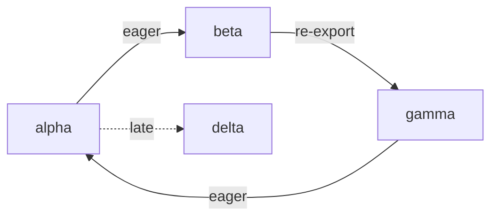

# Module and visibility choices, in plain words

## TOC

1. [What exists](#what-exists)
2. [The six module facts](#the-six-module-facts)
3. [Foreign files](#foreign-files)
4. [Enum, interface, trait](#enum-interface-trait)
5. [Prices](#prices)
6. [Cycles and late edges](#cycles-and-late-edges)

## What exists

The catalog already knows each module and which module declared each relation.

```text
file A                  catalog
------                  -------
rel apple(...)      ->  module A
use "B"              ->  module B
apple comes from A   ->  rel apple, module A
```

The JSON Schema writer selects relations from a module. The TypeScript and Rust type writers put every selected relation into one output text. They do not choose files or produce imports.

The enum spelling already has a useful storage shape.

```text
rel body(page(view: text) ; redirect(to: text)).

body_page(id, view)
body_redirect(id, to)
body_tag(id, page | redirect)
```

Another relation can carry a `body` value through its id. `option(body)` reaches an unfinished phase-order case today. That case does not change the module choices.

## The six module facts

```text
source text
   |
   v
resolver
   |                 original spelling: "@scope/package"
   v                 resolved place:    module 17
module edge ------------------------------------------------+
   |                                                        |
   | kind: use | reexport                                 |
   | local name: short                                     |
   | timing: eager | late                                  |
   v                                                        v
catalog owner map                                      target files
rel -> module                                         imports + declarations
```

Visibility has two separate containers.

```text
foreign input facts                     portable output facts

pub(crate)                              restricted
private protected                       restricted
package private                         restricted
public                                  public
```

The left container lets a future Rust or C# reader retain what it saw. The right container is small enough for common generated declarations. Lifecycle visibility is another layer: a field can be shown for create, read, update, delete, or query operation shapes.

```text
one stored model

id          read
name        create + read
description create + read + update + delete + query

create view: name, description
read view:   id, name, description
update view: description
```

Re-export needs a mapping from a producer declaration to a consumer declaration name. Bare package names and path aliases need both the original text and the final resolved module. A late edge needs a timing label. The timing label alone says when the edge is wanted. Target code generation decides whether that becomes a JavaScript `import()`, a Rust lazy value, or an application loader.

## Foreign files

| Source | Things that need retention | Portable output loss |
|---|---|---|
| Rust | every `pub(...)` scope, `use`, `pub use`, `mod`, aliases | exact restricted paths and macro results need source facts or compiler data |
| TypeScript | exports, default export, member visibility, type-only import, `import()`, `paths` | path configuration and conditional resolution live outside one file |
| Go | original identifier case, alias, blank import, dot import | blank and dot import behavior has no declaration-only target shape |
| Python | underscore names, `__all__`, relative and star imports | runtime import behavior can change the names |
| Java | access word, package, static/wildcard imports | package and classpath data is required for final access and wildcard names |
| C# | access word, global/static/alias `using` | friend assembly rules need project data |

## Enum, interface, trait

```text
enum
  one name
  one selected variant
  optional fields per variant

interface
  one name
  method signature set
  structural satisfaction can be computed from methods

trait
  interface facts
  explicit implementation facts
  associated types, generic bounds, default methods
```

Go supplies the floor. Its interfaces are structural. Its enum-like form is a set of constants. A Go target can render method sets and constants, but it has no direct spelling for a payload enum or explicit trait implementation.

Rust supplies the upper retained shape. A trait can have associated types, generic implementations, bounds, default methods, blanket implementations, and crate-wide coherence checks. A neutral graph can retain those declarations and implementation facts. A target compiler decides coherence.

```text
structural route                         nominal route

required methods                         explicit source declaration
       |                                      |
       v                                      v
method rows                           implements(Type, Interface)
       |                                      |
       +------------ target query -----------+
```

SCIP already uses relationships for implementation and type-definition links. An `implements(Type, Interface)` fact follows that relation shape.

| Target | Payload enum | Interface or trait | Match coverage |
|---|---|---|---|
| Go | helper records plus a tag | structural interface | switch allows an omitted case |
| Rust | direct enum | trait plus `impl` | compiler checks all cases |
| TypeScript | discriminated union | structural interface | `never` pattern can check coverage |
| TypeSpec | named union plus models | operations-only interface | no value match |

## Prices

The existing writers are small: JSON Schema has 176 lines, OpenAPI 103, TypeScript types 69, Rust types 69. Complete target work already has a 450 to 800 line estimate because naming, imports, file layout, and tests dominate the text printer.

| Choice | New source spelling | Shared work | Per target work |
|---|---|---|---|
| Keep raw source visibility | none | source facts and spans | almost none until a target uses it |
| Public/restricted visibility | yes | declaration visibility row | 20 to 70 lines |
| Lifecycle views | yes | field sets plus operation contexts | 150 to 300 lines for an API target |
| Named re-export | yes | producer, consumer, local name | 40 to 90 lines |
| Full export table | yes | default, star, type-only, selectors | 70 to 220 lines |
| Resolved bare name | none | original text plus resolved module | 20 to 50 lines |
| `.dl6` alias fact | yes | alias resolver | 60 to 130 lines |
| SCC cycle record | none | cycle groups | 20 to 90 lines |
| Late edge bit | yes | `eager` or `late` edge timing | 40 to 180 lines |
| Late loader data | yes | loader kind, result, failure data | 120 to 350 lines |

## Cycles and late edges



A cycle has no single declaration order that places every producer before every consumer. The useful ordering is:

```text
module graph
  -> cycle groups
  -> topological order of groups
  -> stable order inside each group
```

| Target | Eager cycle | Late edge |
|---|---|---|
| TypeScript ESM | linked modules have live bindings; early top-level reads can fail | `import()` returns a promise |
| Rust | item references inside a crate can cycle; Cargo crates cannot | lazy value or explicit loader code |
| Go | package import cycle is a compiler error | explicit application loader |

An eager cycle can remain in the graph. A late edge can break it only when the chosen target loader postpones the dependency read past eager initialization.
