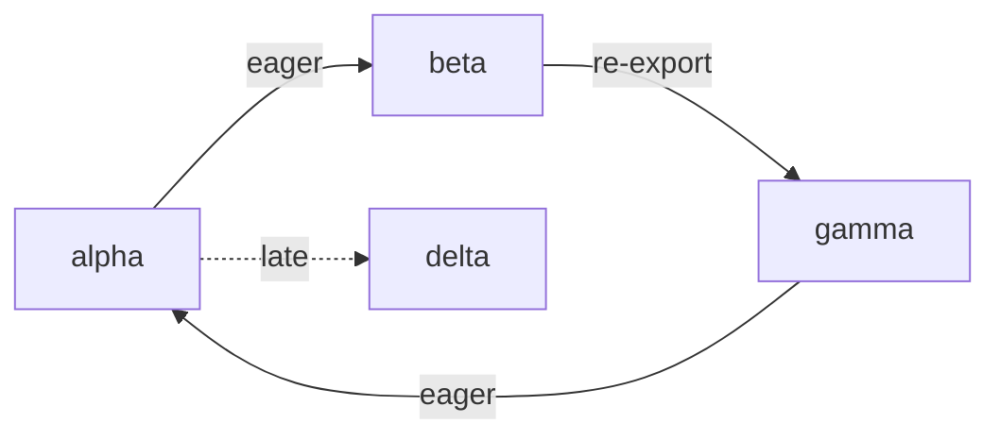
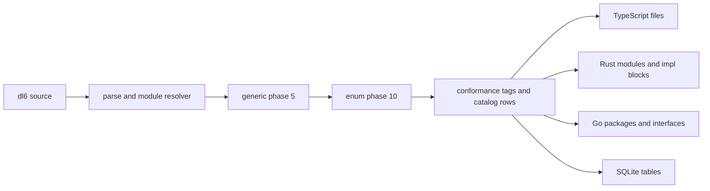

# Module and visibility choices, in plain words

> Historical research. `issues/remove-rel-is/item.md` removed the relation
> conformance suffix used in examples below on 2026-08-23.

## TOC

1. [What exists](#what-exists)
2. [The six module facts](#the-six-module-facts)
3. [Foreign files](#foreign-files)
4. [Enum, interface, trait](#enum-interface-trait)
5. [Prices](#prices)
6. [Cycles and late edges](#cycles-and-late-edges)
7. [Pass 2: rel roles](#pass-2-rel-roles)
8. [Pass 2: conformance](#pass-2-conformance)
9. [Pass 2: generic rel arguments](#pass-2-generic-rel-arguments)
10. [Pass 2: generated output](#pass-2-generated-output)

## What exists

The catalog already knows each module and which module declared each relation.

```text
file A                  catalog
------                  -------
rel apple(...)      ->  module A
use "B"              ->  module B
apple comes from A   ->  rel apple, module A
```

The JSON Schema writer selects relations from a module. The TypeScript and Rust type writers put every selected relation into one output text. They do not choose files or produce imports.

The enum spelling already has a useful storage shape.

```text
rel body(page(view: text) ; redirect(to: text)).

body_page(id, view)
body_redirect(id, to)
body_tag(id, page | redirect)
```

Another relation can carry a `body` value through its id. `option(body)` reaches an unfinished phase-order case today. That case does not change the module choices.

## The six module facts

```text
source text
   |
   v
resolver
   |                 original spelling: "@scope/package"
   v                 resolved place:    module 17
module edge ------------------------------------------------+
   |                                                        |
   | kind: use | reexport                                 |
   | local name: short                                     |
   | timing: eager | late                                  |
   v                                                        v
catalog owner map                                      target files
rel -> module                                         imports + declarations
```

Visibility has two separate containers.

```text
foreign input facts                     portable output facts

pub(crate)                              restricted
private protected                       restricted
package private                         restricted
public                                  public
```

The left container lets a future Rust or C# reader retain what it saw. The right container is small enough for common generated declarations. Lifecycle visibility is another layer: a field can be shown for create, read, update, delete, or query operation shapes.

```text
one stored model

id          read
name        create + read
description create + read + update + delete + query

create view: name, description
read view:   id, name, description
update view: description
```

Re-export needs a mapping from a producer declaration to a consumer declaration name. Bare package names and path aliases need both the original text and the final resolved module. A late edge needs a timing label. The timing label alone says when the edge is wanted. Target code generation decides whether that becomes a JavaScript `import()`, a Rust lazy value, or an application loader.

## Foreign files

| Source | Things that need retention | Portable output loss |
|---|---|---|
| Rust | every `pub(...)` scope, `use`, `pub use`, `mod`, aliases | exact restricted paths and macro results need source facts or compiler data |
| TypeScript | exports, default export, member visibility, type-only import, `import()`, `paths` | path configuration and conditional resolution live outside one file |
| Go | original identifier case, alias, blank import, dot import | blank and dot import behavior has no declaration-only target shape |
| Python | underscore names, `__all__`, relative and star imports | runtime import behavior can change the names |
| Java | access word, package, static/wildcard imports | package and classpath data is required for final access and wildcard names |
| C# | access word, global/static/alias `using` | friend assembly rules need project data |

## Enum, interface, trait

```text
enum
  one name
  one selected variant
  optional fields per variant

interface
  one name
  method signature set
  structural satisfaction can be computed from methods

trait
  interface facts
  explicit implementation facts
  associated types, generic bounds, default methods
```

Go supplies the floor. Its interfaces are structural. Its enum-like form is a set of constants. A Go target can render method sets and constants, but it has no direct spelling for a payload enum or explicit trait implementation.

Rust supplies the upper retained shape. A trait can have associated types, generic implementations, bounds, default methods, blanket implementations, and crate-wide coherence checks. A neutral graph can retain those declarations and implementation facts. A target compiler decides coherence.

```text
structural route                         nominal route

required methods                         explicit source declaration
       |                                      |
       v                                      v
method rows                           implements(Type, Interface)
       |                                      |
       +------------ target query -----------+
```

SCIP already uses relationships for implementation and type-definition links. An `implements(Type, Interface)` fact follows that relation shape.

| Target | Payload enum | Interface or trait | Match coverage |
|---|---|---|---|
| Go | helper records plus a tag | structural interface | switch allows an omitted case |
| Rust | direct enum | trait plus `impl` | compiler checks all cases |
| TypeScript | discriminated union | structural interface | `never` pattern can check coverage |
| TypeSpec | named union plus models | operations-only interface | no value match |

## Prices

The existing writers are small: JSON Schema has 176 lines, OpenAPI 103, TypeScript types 69, Rust types 69. Complete target work already has a 450 to 800 line estimate because naming, imports, file layout, and tests dominate the text printer.

| Choice | New source spelling | Shared work | Per target work |
|---|---|---|---|
| Keep raw source visibility | none | source facts and spans | almost none until a target uses it |
| Public/restricted visibility | yes | declaration visibility row | 20 to 70 lines |
| Lifecycle views | yes | field sets plus operation contexts | 150 to 300 lines for an API target |
| Named re-export | yes | producer, consumer, local name | 40 to 90 lines |
| Full export table | yes | default, star, type-only, selectors | 70 to 220 lines |
| Resolved bare name | none | original text plus resolved module | 20 to 50 lines |
| `.dl6` alias fact | yes | alias resolver | 60 to 130 lines |
| SCC cycle record | none | cycle groups | 20 to 90 lines |
| Late edge bit | yes | `eager` or `late` edge timing | 40 to 180 lines |
| Late loader data | yes | loader kind, result, failure data | 120 to 350 lines |

## Cycles and late edges



A cycle has no single declaration order that places every producer before every consumer. The useful ordering is:

```text
module graph
  -> cycle groups
  -> topological order of groups
  -> stable order inside each group
```

| Target | Eager cycle | Late edge |
|---|---|---|
| TypeScript ESM | linked modules have live bindings; early top-level reads can fail | `import()` returns a promise |
| Rust | item references inside a crate can cycle; Cargo crates cannot | lazy value or explicit loader code |
| Go | package import cycle is a compiler error | explicit application loader |

An eager cycle can remain in the graph. A late edge can break it only when the chosen target loader postpones the dependency read past eager initialization.

## Pass 2: rel roles

The supplied compiler probes were rerun through `compile_dl6.sh`.

| Written form | Result |
|---|---|
| `rel point(x: int, y: int). rel line(a: point, b: point).` | exit 0; both `line` columns are `INTEGER NOT NULL` |
| enum `body` followed by `response(payload: body)` | exit 0; `body_page`, `body_redirect`, `body_tag`, and integer `response.payload` |
| `rel pair(T)(first: T, second: T).` | exit 2 at line 1, column 12, the second `(` |

```text
columns + key       -> stored table, explicit unique key
columns             -> stored table, unique all columns
variants            -> variant tables + closed tag table
column type         -> integer endpoint to another rel row
rule head           -> derived table
interface           -> no member table; open tag table fed by conformance
```

Every ordinary `rel` reaches the table planner today. An interface needs its own declaration category so it stops before ordinary table creation.

```text
closed sum

body page(...)      ----> body_tag(id, page)
body redirect(...)  ----> body_tag(id, redirect)

open interface

file(...) is addressable ----> addressable_tag(file.__id, file rel id)
url(...)  is addressable ----> addressable_tag(url.__id, url rel id)
```

The interface tag stores two integers. `id` names a row within one member relation. `which_rel` names that relation through the existing relation catalog. A pair is required because table-local `__id` values are not global.

The enum expansion owns 199 lines. Its tag/rule and declaration-generation portion is 78 lines. Open tags reuse the rule/table pattern and skip enum variant parsing, content tables, and enum-column retargeting. Initial shared compiler estimate: 35-70 lines plus 60-120 tests.

## Pass 2: conformance

```dl
rel addressable(path: text, digest: text) interface.
rel file(path: text, digest: text, bytes: int) is addressable.
```

`is` is the leading surface spelling. `<-` is already the rule arrow. `implements` has the same parser position and can remain an adapter or diagnostic word. The type IR row is `is_implementation(member_rel_id, interface_rel_id)`, matching SCIP's implementation relationship term. `is_type_definition` is a different source-to-definition relationship.

| Marking method | Data needed | Price |
|---|---|---|
| explicit `interface` | category on the declaration | 25-45 shared lines, 35-70 tests |
| infer from conformance and no writes | complete program scan of rules, seeds, schedule, and references | 70-130 shared lines, 80-150 tests |
| structural conformance | compare column sets and types | 70-120 shared lines, 90-160 tests |
| declared conformance | `is_implementation` row | 35-70 shared lines, 60-120 tests |

Columns are the first interface content. Interface rules would need default-method behavior. Rust traits permit defaults; Go interfaces and TypeScript interfaces supply declaration shapes. Keys, arrivals, seeds, and ordinary references do not apply to an instance-free interface.

Stored and derived member rels both feed interface tags. A derived member's tag rows retract when its rows retract.

```rust
pub trait Addressable { fn path(&self) -> &str; }
impl Addressable for FileRow { fn path(&self) -> &str { &self.path } }
```

The source declares no `impl` block and no `my_impl` relation. The Rust writer emits the `impl` from the conformance row. A rel can conform to two interfaces. Equal field names require equal types; unequal types are a named conformance mismatch. Rust trait-qualified calls select a duplicated method name.

## Pass 2: generic rel arguments

```dl
rel pair(T)(first: T, second: T).
rel coords(point: pair(int)).
```

```text
rel declaration
  = rel name + optional parameter group + column group + modifiers + optional is clause

one parenthesized group   = existing zero-parameter rel
two parenthesized groups  = template parameters, then columns
```

The parser reaches the first closing parenthesis before choosing whether a second group follows. Existing rel declarations retain one group.

```text
level 0  interface + conformance
level 1  generic rel types
level 2  generic interface plus conformance to an instantiation
```

Level 0 needs neither parameters nor substitution and can land independently. `pair(int)` mints a concrete type/table. `file is addressable` adds an interface tag row for an existing rel. No `impl` entity is declared.

`0_generic_expand.pl` has 348 lines. It already has a ground-instance worklist, typed artifact lowering, collision checking, canonical 64-bit hash names, and replacement of generic column types. It currently supports four wrapper constructors. User-facing rel templates add parser records, parameter substitution, template application discovery, and checks. Estimate: 170-310 shared compiler lines and 180-320 tests.

| Existing wrapper | Tables per ground instance |
|---|---:|
| `list(T)` | 2 |
| dense entity sequence | 4 |
| interned set | 3 |
| linked entity sequence | 3 |

Six templates with eight ground applications each and two tables per application yield 96 generated relations. The present `.dl6` corpus has 0 curried user-template declarations.

One generic-expansion phase can carry relation-artifact wrappers and reference-option companion relations through a common artifact vocabulary. Scalar option needs enum artifacts. `json_list(T)` remains an inline JSON carrier. `option(<enum>)` remains blocked by current ordering: option runs at phase 5 and enum at phase 10.

Generic bounds, such as `where T is addressable`, require instantiated interfaces and type-level conformance checks. They belong after levels 0 and 1.

## Pass 2: generated output



| Source feature | SQL/catalog | TypeScript | Rust | Go |
|---|---|---|---|---|
| module and visibility | module owner, edges, visibility | paths, imports, exports | modules, use, visibility | packages, exported names |
| enum | variants + closed tag | discriminated union | enum or row/tag form | tag plus records |
| interface and `is` | open tag + `is_implementation` | interface plus member check | trait plus generated `impl` | interface plus assignment witness |
| `pair(int)` | generated concrete table(s) | concrete type | concrete row type | concrete struct |

The current TS and Rust type writers still need file placement/import work. Interface parsing, conformance rows, open tag expansion, curried templates, template substitution, and generic interface expansion remain unbuilt. Module SCC ordering remains condensation order followed by deterministic local order.
