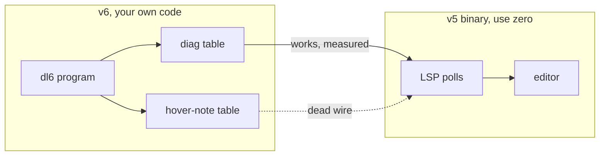
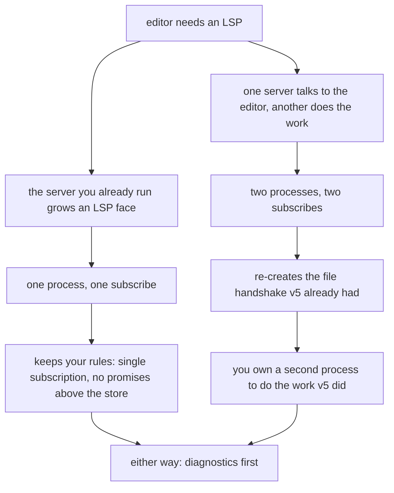

# v6 stops borrowing v5's LSP. The human read.

Plain words, zero citations. The plan doc next to this one carries every
file and line.

## TOC

1. The one sentence
2. Where v6 leans on v5 today
3. The findings nobody expected
4. The buy decision
5. The two roads forward
6. What happens to the hover work
7. The one next action

---

## 1. The one sentence

You said no more running v5, period. Right now the editor reads v6 by borrowing
v5: v6 writes tables, and the v5 binary's LSP watches those tables and talks to
the editor. That whole handshake has to move inside v6.

## 2. Where v6 leans on v5 today

Two tables cross the line.

Diagnostics is the one editor feature that reaches an editor through v5 and
provably works. You can measure that in the receipt script already in the tree.

Hover is the trap.

## 3. The findings nobody expected

Tables, not walls of prose.

| finding | what it means |
|---|---|
| one feature really works | diagnostics, measured end to end |
| hover never worked at all | even with v5 running, the note table v6 writes is not the one v5 reads |
| the editor's other powers are v5-only | go-to-def, references, outline, hierarchy all run from v5's own copy of the facts, not from anything v6 writes |
| some powers do not exist | formatting and autocomplete are not in v5's LSP at all |

So the honest tally: v6 leans on v5 for just two paths. One of those paths is
provably dead.

## 4. The buy decision

Do not hand-write the wire. Two small libraries already cover the framing and
the shapes, and they are standard, tiny, and carry nothing heavy.

| choice | read |
|---|---|
| buy the wire | the message framing, cancellation, framing over stdio |
| buy the types | the shapes the editor speaks (positions, ranges, notes) |
| skip the heavy framework | the full server kit arms its own async engine, which fights the rules you run under |
| skip the language framework | it wants a parser you do not have |

The heavy, fully-featured server is not dismissed. It just costs more integration
than the bare wire under your rules, so the lean option wins on price, not on a
one-line shrug.

## 5. The two roads forward

No choice made here. The roads are laid out so you can rule.

A second sub-fork is worth naming: the editor wire over stdio, which any normal
editor speaks, versus reusing the streaming channel you already have to the
panel, which only a custom panel speaks.

## 6. What happens to the hover work

The hovering behavior stays useful as data. The claim that naming a table the
v5 way makes an editor show it is wrong and should stop being the story. Keep
the data, drop the tale that it ever reached an editor.

## 7. The one next action

Pick one of the two roads, and make the first editor feature pass through v6
alone. Diagnostics is the smallest, most patient place to start, because it is
the one that already demonstrably works today.
