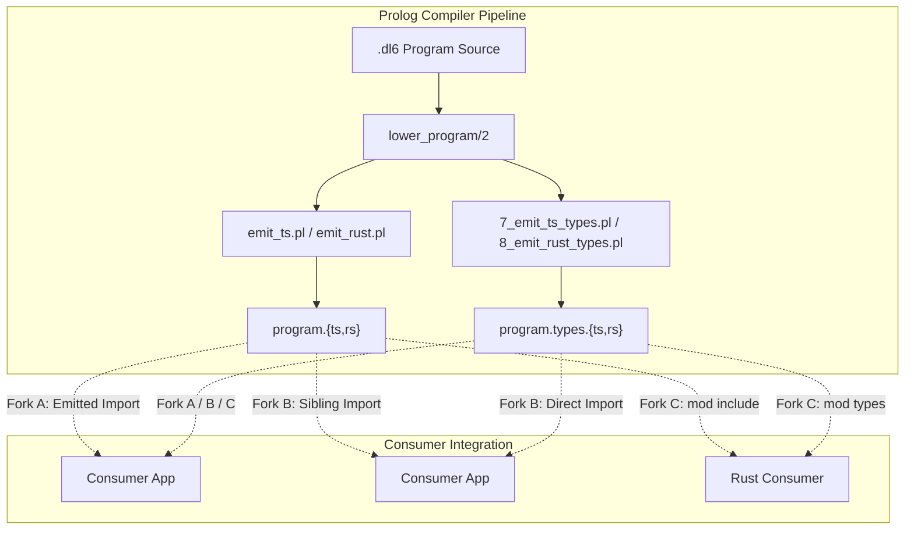

# Generated Types as Library Surface Plan

## Table of contents
- [Context](#context)
- [Architecture and artifact paths](#architecture-and-artifact-paths)
- [Design forks and pricing](#design-forks-and-pricing)
  - [Fork A: Emitter imports adjacent types file into emitted program](#fork-a-emitter-imports-adjacent-types-file-into-emitted-program)
  - [Fork B: Artifacts ship as sibling modules imported directly by consumer](#fork-b-artifacts-ship-as-sibling-modules-imported-directly-by-consumer)
  - [Fork C: Rust generated mod include per program](#fork-c-rust-generated-mod-include-per-program)
- [Cost and impact comparison](#cost-and-impact-comparison)
- [Compile-time checking gains](#compile-time-checking-gains)
- [Decisions](#decisions)
- [Verification](#verification)
- [Staffing](#staffing)

## Context
The compiler emits three typed artifacts per Datalog program: TypeScript interfaces (`.types.ts`), Rust serde structs (`.types.rs`), and JSON Schema (`.schema.json`).

Artifact emitter locations:
- `v6/prolog/compile/7_emit_ts_types.pl:1-126` (TypeScript interface generation)
- `v6/prolog/compile/8_emit_rust_types.pl:1-126` (Rust serde struct generation)
- `v6/prolog/compile/4_emit_jsonschema.pl:1-120` (JSON Schema generation)
- `v6/prolog/sweep.pl:133-156` (Batch generation of `.types.ts`, `.types.rs`, and `.schema.json` into `compile/out/`)

Today, emitted program targets (`v6/prolog/emit_ts.pl`, `v6/prolog/emit_rust.pl`) do not reference these generated type files. Emitted programs import only the static runtime machinery (`v6/tsv2/runtime/*`, `sprefa_engine_rs::*`). This document prices three architectural forks for presenting `.types.ts` and `.types.rs` as the program's public typed surface.



## Architecture and artifact paths

| Artifact | Emitter file | Emitted location | Content signature |
|---|---|---|---|
| TS types | `v6/prolog/compile/7_emit_ts_types.pl` | `compile/out/<name>.types.ts` | `export interface <RelName> { <col>: <type>; }` |
| Rust types | `v6/prolog/compile/8_emit_rust_types.pl` | `compile/out/<name>.types.rs` | `#[derive(Debug, Clone, PartialEq, serde::Serialize, serde::Deserialize)] pub struct <RelName> { pub <col>: <type> }` |
| TS program | `v6/prolog/emit_ts.pl` | `compile/out/<name>.ts` or `v6/tsv2/gen_emitted/<name>.ts` | `export const program: IIncrementalProgramPlan = ...` |
| Rust program | `v6/prolog/emit_rust.pl` | `compile/out/<name>.rs` | `pub const PROGRAM_JSON: &str = ...; pub fn program() -> ProgramJson` |

## Design forks and pricing

### Fork A: Emitter imports adjacent types file into emitted program

The compiler emitter (`emit_ts.pl`) emits an import line at the top of the emitted TypeScript file:
```typescript
import type * as Types from "./<name>.types.ts";
```
and annotates arrival arrays and return delta payloads with typed envelopes.

| Dimension | Measure / Citation | Detail |
|---|---|---|
| Emitter changes (`emit_ts.pl`) | ~35-50 lines (`emit_ts.pl:168-244` imports, `emit_ts.pl:2787-2807` exports) | Adds type import line generation and typing on public wrapper entrypoints. |
| Emitter changes (`emit_rust.pl`) | ~20-30 lines (`emit_rust.pl:460-475`) | Adds `#[path = "<name>.types.rs"] mod types;` and re-exports. |
| Graded goldens impact | High churn (all 287+ files in `v6/tsv2/gen_emitted/*.ts`) | Every single emitted file changes text signature; invalidates existing golden snapshots that check exact TS program lines. |
| File coupling | Tight | Emitted program file cannot compile or typecheck if `.types.ts` is omitted or not placed in the same directory. |

### Fork B: Artifacts ship as sibling modules imported directly by consumer

The emitted program (`<name>.ts`, `<name>.rs`) remains self-contained with untyped/runtime-typed representations. The consumer application imports the program and the sibling types module directly:

```typescript
import { program } from "./out/my_program.ts";
import type { User, ProjectEdge } from "./out/my_program.types.ts";
```

```rust
mod my_program { include!("out/my_program.rs"); }
mod my_program_types { include!("out/my_program.types.rs"); }
```

| Dimension | Measure / Citation | Detail |
|---|---|---|
| Emitter changes (`emit_ts.pl`) | 0 lines | `emit_ts.pl` is completely untouched. |
| Emitter changes (`emit_rust.pl`) | 0 lines | `emit_rust.pl` is completely untouched. |
| Graded goldens impact | 0 golden regressions | Exact program byte identity is preserved across all conformance suites. |
| File coupling | Decoupled | Consumers opt into types when needed; runtime execution does not depend on type files. |

### Fork C: Rust generated mod include per program

For Rust consumption specifically, the engine provides helper wrapper macros or the build harness declares a module structure where `<name>.rs` and `<name>.types.rs` are compiled within a single module namespace:

```rust
pub mod my_program {
    include!(concat!(env!("OUT_DIR"), "/my_program.rs"));
    pub mod types {
        include!(concat!(env!("OUT_DIR"), "/my_program.types.rs"));
    }
}
```

| Dimension | Measure / Citation | Detail |
|---|---|---|
| Emitter changes (`emit_ts.pl`) | 0 lines | TS emitter untouched. |
| Emitter changes (`emit_rust.pl`) | 5-10 lines (`emit_rust.pl:460-475`) if emitted inline, 0 lines if consumer-managed. | Optional `pub mod types { include!(...); }` in emitted program. |
| Graded goldens impact | Low/Zero (`v6/sprefa-engine-rs/grade.sh:44-46`) | `grade.sh` only tests PROGRAM_JSON parser; byte-clean count (230/392) remains steady. |
| File coupling | Cohesive module unit | Program and types reside in a predictable, single Rust module hierarchy. |

## Cost and impact comparison

| Fork | Emitter modification cost | Golden churn risk | Consumer ergonomic rating | Typing strictness |
|---|---|---|---|---|
| **Fork A** (Emitted import) | High (~70 lines across emitters) | High (invalidates all generated TS goldens) | High (single import brings types + program) | Strict (enforced on program boundary) |
| **Fork B** (Sibling import) | Zero (0 lines changed) | None (zero golden churn) | Medium (consumer imports two sibling files) | Opt-in (consumer casts/binds as needed) |
| **Fork C** (Rust `mod` include) | Minimal (0-10 lines) | None (harness-only or zero-cost macro) | High (idiomatic Rust module hierarchy) | Strict for Rust serde rows |

## Compile-time checking gains

| Target function / entrypoint | Unchecked signature (current) | Typed signature with generated types | Verified invariants |
|---|---|---|---|
| TS outside arrival ingestion | `run_incremental_tick(seam, arrivals: IArrivalBatch)` | `run_typed_tick<TArrivals>(seam, arrivals: TArrivals)` | Arrival rel names and column tuple shapes match schema at compile-time. |
| TS boundary delta subscription | `deltas.rels: IRelDelta[]` (carrying `IRow = any[]`) | `deltas.rels.<rel>: { add: RelType[], del: RelType[] }` | Output consumers cannot access nonexistent columns or misinterpret types. |
| Rust arrival construction | `Arrival { rel, sign, row: Vec<Value> }` | `RelStruct::into_arrival(self, sign)` or serde conversion | Row arity, type coercion (Int vs Text vs Real), and field names verified by `rustc`. |
| Rust host projection | `decode_output(stdout, &outputs)` into `Vec<Vec<Value>>` | `serde_json::from_str::<Vec<HostOutputStruct>>(stdout)` | Structured host output deserialization failure caught immediately. |

## Decisions
- Awaiting user decision on Fork selection (A vs B vs C).
- Fork B offers the lowest operational risk (zero emitter edits, zero golden regressions).
- Fork C is recommended for Rust consumers using standard `build.rs` / `include!` workflows.

## Verification
- Run `v6/sprefa-engine-rs/grade.sh` to confirm no byte-clean regression.
- Run `v6/tsv2/scripts/check-imports.sh` to verify import boundary rails.
- Add consumer typecheck test verifying `compile/out/*.types.ts` against `tsgo`.

## Staffing
- Implemented by coordinator lane or dedicated subagent.
- Base SHA: `a6a0b9da`
