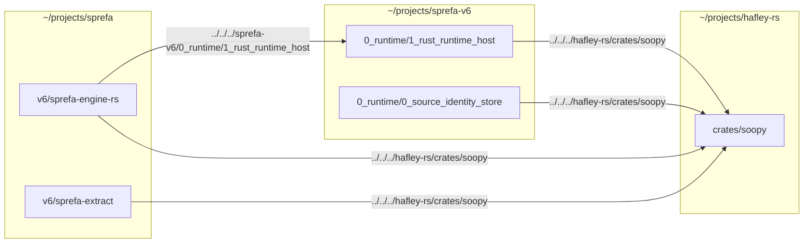

# Cross-repo relative Cargo paths break in git worktrees

ANALYSIS ONLY. No edits landed by this plan; every fix stays a proposal until
a lane executes it.

## TOC
1. The dependency edges (receipts)
2. Why worktrees break them — the exact math
3. Candidate analysis (7)
4. Verdict table
5. Recommendation + file list
6. Open items for the boop owner

## 1. The dependency edges

Three repos, one crate (`soopy`) pulled from two directions plus one crate
(`sprefa-rust-runtime-host`) pulled from a third repo:



| crate (repo) | dep | literal `path =` | resolves to (from repo-root checkout) | breaks in worktree |
|---|---|---|---|---|
| `sprefa-engine-rs` (`sprefa/v6/sprefa-engine-rs`) | `sprefa-rust-runtime-host` | `../../../sprefa-v6/0_runtime/1_rust_runtime_host` | `~/projects/sprefa-v6/0_runtime/1_rust_runtime_host` | yes |
| `sprefa-engine-rs` (`sprefa/v6/sprefa-engine-rs`) | `soopy` | `../../../hafley-rs/crates/soopy` | `~/projects/hafley-rs/crates/soopy` | yes |
| `sprefa-extract` (`sprefa/v6/sprefa-extract`) | `soopy` | `../../../hafley-rs/crates/soopy` | `~/projects/hafley-rs/crates/soopy` | yes |
| `sprefa-rust-runtime-host` (`sprefa-v6/0_runtime/1_rust_runtime_host`) | `soopy` | `../../../hafley-rs/crates/soopy` | `~/projects/hafley-rs/crates/soopy` | yes |
| `sprefa-source-identity-store` (`sprefa-v6/0_runtime/0_source_identity_store`) | `soopy` | `../../../hafley-rs/crates/soopy` | `~/projects/hafley-rs/crates/soopy` | yes |

No other `Cargo.toml` under `~/projects/sprefa`, `~/projects/hafley-rs`, or
`~/projects/sprefa-v6` has a `path =` climbing 2+ levels — checked with
`grep 'path *= *"\.\./\.\./'` over every real (non-vendored, non-fixture,
non-worktree) `Cargo.toml` in all three trees. Every other `path =` dep stays
inside its own repo (`tree-sitter-dl`, `tree-sitter-dl6`, `boop-mux`,
`sprefa-source-identity-store` from `1_rust_runtime_host`).

Edge direction is one-way: `hafley-rs` (`soopy`, `boop-mux`, `boop`) carries
zero `path =` deps that reach outside its own repo, so `hafley-rs`'s own CI
(`hafley-rs/.github/workflows/ci.yml`) is unaffected by anything below.

**CI does not currently exercise the broken edge.** `sprefa/.github/workflows/ci.yml`
does a single `actions/checkout@v6` (no sibling checkout of `hafley-rs` or
`sprefa-v6`) and runs `just green-all` (`v6/tools/green-parallel.sh`), whose
29-leg roster carries `dd-grade` but not `rust-grade`
(`v6/justfile:145-146` `rust-grade: bash {{v6}}/sprefa-engine-rs/grade.sh`).
`rust-grade` is a member of `just green` (`v6/justfile:464`), the smaller
pre-merge gate that is run locally, never by this CI workflow. So today the
cross-repo edge is a local-machine-only problem; any fix's CI impact is
currently zero, but wiring `rust-grade` into CI later (or `sprefa-extract`'s
own `cargo test`) would need the same fix CI-side.

## 2. Why worktrees break them — the exact math

`boop`'s worktree layout (`hafley-rs/crates/boop/src/lane.rs:97-103`,
`worktree_dir`) is `<repo>/.boop-worktrees/<kind>/<name>` where `<kind>` is
one of the 4 in `KINDS` (`lane.rs:17`: `feature`, `fix`, `refactor`, `chore`)
and slashes in the branch name become directory separators. Confirmed on disk:

```
sprefa/.boop-worktrees/feature/{exec-shootout-mercury,list-value-position-2,recursive-enum,hafley-rs->symlink,sprefa-v6->symlink}
sprefa/.boop-worktrees/fix/grade-sh-lock          # no symlinks here
```

From `sprefa/.boop-worktrees/<kind>/<name>/v6/sprefa-engine-rs/Cargo.toml`,
`../../../hafley-rs/crates/soopy` climbs 3 levels
(`v6/sprefa-engine-rs` → `<name>` → `<kind>`) and appends
`hafley-rs/crates/soopy`, landing on
`sprefa/.boop-worktrees/<kind>/hafley-rs/crates/soopy`. That path exists on
disk ONLY because of the hand-made symlink
`sprefa/.boop-worktrees/feature/hafley-rs -> ~/projects/hafley-rs` (same for
`sprefa-v6`) — and only for `<kind> = feature`, because that's the one kind
someone symlinked. `sprefa/.boop-worktrees/fix/grade-sh-lock` has no sibling
`fix/hafley-rs` or `fix/sprefa-v6` symlink, so any lane spawned under
`fix/*`, `refactor/*`, or `chore/*` gets `error: failed to load source for
dependency 'soopy' ... failed to read .../fix/hafley-rs/crates/soopy/Cargo.toml
... No such file or directory`. The band-aid is depth-correct but
kind-incomplete: it covers 1 of 4 kinds, and it was made by hand so it will
never cover a kind added later.

The same math applies inside `sprefa-v6`'s own worktrees
(`sprefa-v6/.boop-worktrees/<kind>/<name>/0_runtime/1_rust_runtime_host/Cargo.toml`
→ `../../../hafley-rs/crates/soopy` → `sprefa-v6/.boop-worktrees/<kind>/hafley-rs/crates/soopy`),
confirmed present: `sprefa-v6/.boop-worktrees/{chore,feature}/`.

## 3. Candidate analysis

### 3a. Absolute `path =` deps
Cargo resolves a `path =` dependency relative to the `Cargo.toml` that
declares it (cargo book, Specifying Dependencies); an absolute path sidesteps
that resolution entirely, so worktree depth is irrelevant. Mechanically: edit
5 lines across 4 files to
`path = "/Users/chrishafley/projects/hafley-rs/crates/soopy"` etc.
- **Worktree behavior**: unconditionally correct at any depth, any `<kind>`,
  forever — no per-worktree setup step at all.
- **Publish/CI impact**: none of the 4 consuming crates currently publish to
  crates.io (`sprefa-extract` explicit `publish = false`;
  `sprefa-engine-rs`, `sprefa-rust-runtime-host`,
  `sprefa-source-identity-store` have no dist/publish metadata and are
  internal runtime targets, not shipped crates). `cargo publish` would refuse
  a `path` dep without a paired `version` regardless of absolute vs relative,
  so this changes nothing on that axis. CI does not build this edge today
  (section 1); if it starts to, an absolute path baked to
  `/Users/chrishafley/projects/...` fails on any CI runner or any other
  machine outright — single-user-machine-only fix.
- **Migration cost**: 5 one-line edits, zero new files, zero tooling.
- **Verdict**: WORKS, cheapest, but hardcodes this one machine's home
  directory into 4 committed files. Fine only if nothing outside this
  machine ever builds these crates — true today, not guaranteed to stay true.

### 3b. `[patch]` in a per-worktree generated `.cargo/config.toml` (path overrides)
Cargo book (`overriding-dependencies.html`, confirmed via fetch): the
`paths = [...]` key in `.cargo/config.toml` is the **path override**
mechanism, distinct from the `[patch]` table. It requires the override target
to already be resolvable as a *published* crate the override replaces —
"cannot be used to tell Cargo how to find unpublished packages" and "cannot
change the structure of the dependency graph" (new deps, new features). Our
5 edges are plain `path =` deps with no registry/git identity to override in
the first place, so a path override has nothing to attach to.
- **Verdict**: INAPPLICABLE as stated. Would first require converting the dep
  to a registry or git dependency (folds into 3d), at which point the
  override still can't add/restructure deps, making it strictly worse than
  just fixing the path.

### 3c. `[patch.'...']` in the workspace Cargo.toml
Cargo book (same fetch): `[patch]` entries patch a *source* — crates.io
(`[patch.crates-io]`), a git URL (`[patch.'https://...']`), or another
registry. The table's values may be local paths, but the table's *keys* must
name a source that is already how the dependency is being pulled. A bare
`path = "../.."` dependency has no such external source to key on — it IS
already a local path, so there is nothing to patch it into. `[patch]` would
only become usable here if the 4 consuming Cargo.tomls first depended on
`soopy`/`sprefa-rust-runtime-host` via a git or registry source, which is
candidate 3d wearing an extra layer.
- **Verdict**: INAPPLICABLE for the same structural reason as 3b, and
  strictly more machinery than 3d if you did the conversion anyway.

### 3d. Git dependencies on the sibling repos
Replace `path = "../../../hafley-rs/crates/soopy"` with a `git` dep:
`soopy = { git = "file:///Users/chrishafley/projects/hafley-rs" }` (local
`file://`, no network) or `git = "https://github.com/hafley66/hafley-rs"`
(GitHub, needs a public/pushed repo and a tag or rev pin).
- **Worktree behavior**: worktree-depth-independent, same as absolute paths —
  cargo clones/fetches into its own git-checkout cache under
  `~/.cargo/git/checkouts`, untouched by where the *consuming* worktree sits.
- **Publish/CI impact**: `file://` URLs are local-machine-only, same
  portability ceiling as 3a. GitHub URLs are portable (work on any machine or
  CI runner with network) but pin to a **committed, pushed** revision — every
  edit to `soopy` needs a commit + push before a consumer sees it, breaking
  the current tight edit-and-rebuild loop where `sprefa-engine-rs` picks up
  uncommitted `soopy` changes on the next `cargo build`. That loop is real:
  `soopy` and `sprefa-engine-rs`/`sprefa-extract` are being developed
  together right now (both under active arcs per `CLAUDE.md`).
- **Migration cost**: 5 edits, plus for the GitHub form a rev/tag bump on
  every `soopy` or `sprefa-rust-runtime-host` change, plus `Cargo.lock`
  churn on every such bump.
- **Verdict**: WORKS mechanically but taxes the dev loop this repo is
  actively using; wrong shape while `soopy`/`sprefa-rust-runtime-host` are
  still being iterated on inside the same work session as their consumers.

### 3e. Cargo workspace unifying the repos (super-workspace or symlinked members)
A single root `Cargo.toml` `[workspace] members = [...]` spanning
`sprefa`, `hafley-rs`, `sprefa-v6` would let member paths resolve without a
`../../../` climb only if the workspace root itself is fixed relative to all
three — which restates the exact problem one level up (the workspace root's
own location moves under a worktree). A symlinked member path has the same
worktree-depth fragility as candidate 3f (needs the symlink to already
exist). Separately: `sprefa-store`, `sprefa-extract`, and `sprefa-seed` each
carry an explicit, commented `[workspace]` table of their own specifically
**to decouple from the v5 root workspace** ("Standalone crate: its own
`[workspace]` table decouples it from the v5 root workspace so `cargo test`
here is fully isolated" — `v6/sprefa-store/Cargo.toml:1-3`,
`v6/sprefa-extract/Cargo.toml:1-3`). A cross-repo super-workspace is the
opposite of that standing decision: one `cargo update`/`cargo test` in the
merged workspace now touches all three repos' dependency graphs at once.
- **Verdict**: REJECTED. Contradicts an existing, deliberate in-repo design
  choice (workspace isolation), and does not actually remove the
  worktree-relocation problem — it moves it to the workspace root.

### 3f. boop generates the compensating symlinks automatically (mechanize the band-aid)
Formalize what's already on disk by hand: at worktree creation, after
`git worktree add` (`hafley-rs/crates/boop/src/worktree.rs:30-40`,
`prepare_spawn_dir`), ensure a symlink from
`<repo>/.boop-worktrees/<kind>/<sibling-repo-name> -> ~/projects/<sibling-repo-name>`
exists for every kind actually used, for every repo that has cross-repo
edges. `worktree.rs:27-28` already does
`std::fs::create_dir_all(parent)` where `parent` is exactly
`<repo>/.boop-worktrees/<kind>` — the natural insertion point is right after
that line, before `git worktree add` runs.
- **Worktree behavior**: correct at the depth these 5 edges actually climb
  (3 levels: crate-dir → `<name>` → `<kind>`), for every kind, automatically,
  the moment a lane is created — no more manual `ln -s` after the fact.
  Fragile to any *future* dependency that climbs a different number of levels
  (a new crate one directory deeper needs a symlink one level up); the fix is
  keyed to today's directory depths, not derived from them.
- **Publish/CI impact**: none — purely a local dev-loop convenience, same
  local-machine ceiling as 3a/3d-file. Does not touch any Cargo.toml, so
  zero diff risk to what ships.
  Would need the repo->sibling map to be either hardcoded (which repos need
  which symlinks) or derived by parsing `path =` deps that escape the repo
  root at spawn time — the latter is more correct but is new logic, not just
  a symlink call.
- **Migration cost**: one function in `hafley-rs/crates/boop/src/worktree.rs`
  (owned by whoever owns `boop` right now, not this plan), zero Cargo.toml
  edits, keeps every relative path as-is.
- **Verdict**: WORKS, matches the grain of the existing (manual) band-aid,
  and is the only candidate that fixes the problem without editing a single
  `Cargo.toml`. Its correctness is coupled to the current `../../../` depth
  in the 5 edges above — a depth change on either side (new crate location,
  new worktree nesting) silently reopens the gap with no compile-time
  signal until someone runs `cargo build` in a fresh worktree.

### 3g. Vendoring (`cargo vendor`)
`cargo vendor` snapshots every dependency (including path deps) into a local
`vendor/` directory and rewrites `.cargo/config.toml` to source from it. It
is designed for build reproducibility / offline builds from a frozen
dependency set, not for live cross-repo development — every edit to `soopy`
would need a re-vendor (`cargo vendor` re-run + commit) to be seen by
`sprefa-engine-rs`, which is a slower loop than even the git-dependency
candidate (3d) since it's a manual local step with no tag/rev bookkeeping to
signal "did I re-vendor."
- **Worktree behavior**: worktree-depth-independent once vendored (the
  vendored copy lives inside the consuming repo).
- **Publish/CI impact**: none of these crates publish (section 3a). Vendoring
  would bloat each of the 4 consuming repos with a full copy of `soopy` (and
  `sprefa-rust-runtime-host`'s own tree), duplicated per repo, needing a
  re-sync on every source change during active co-development.
- **Migration cost**: highest of all 7 — new `vendor/` trees, `.cargo/config.toml`
  changes, a re-vendor step added to the dev workflow, and a decision on
  whether `vendor/` is committed (repo bloat) or regenerated (defeats
  reproducibility, the entire point of vendoring).
- **Verdict**: REJECTED. Solves a problem this repo doesn't have (offline/
  frozen builds) at the cost of the problem it does have (fast, uncommitted,
  cross-repo edit loop).

## 4. Verdict table

| # | candidate | worktree-safe | edits a `Cargo.toml` | preserves live edit loop | verdict |
|---|---|---|---|---|---|
| 3a | absolute `path =` | yes | yes (5 lines) | yes | WORKS, machine-pinned |
| 3b | `.cargo/config.toml` path override | n/a | n/a | n/a | INAPPLICABLE (no source to override) |
| 3c | `[patch]` in workspace root | n/a | n/a | n/a | INAPPLICABLE (no source to patch) |
| 3d | git dependency (sibling repo) | yes | yes (5 lines + lock churn per bump) | no (needs commit+push per change) | WORKS, wrong loop for active co-dev |
| 3e | super-workspace / symlinked member | no (relocates, doesn't remove) | yes (new root manifest) | yes | REJECTED (contradicts existing workspace-isolation decision) |
| 3f | boop auto-symlinks at spawn | yes | no | yes | WORKS, matches current band-aid's grain |
| 3g | `cargo vendor` | yes | yes (config + vendor tree) | no (manual re-vendor per change) | REJECTED (wrong tool for live co-dev) |

## 5. Recommendation

**3f — mechanize the symlink boop already makes by hand — is the
recommendation.** It is the only candidate that fixes every one of the 4
`<kind>` directories (including the `fix/` case that's broken right now) with
zero edits to any tracked `Cargo.toml`, and it keeps the uncommitted,
same-session edit loop across `sprefa` / `hafley-rs` / `sprefa-v6` that the
other viable candidates (3a, 3d) each degrade in a different way (3a pins one
machine's path into the repo forever; 3d forces a commit+push cadence onto
in-flight cross-repo work).

Files this needs (not edited by this plan — `boop` is owned by another lane
right now, per the task brief):
- `hafley-rs/crates/boop/src/worktree.rs` — add the symlink step inside
  `prepare_spawn_dir`, right after the existing
  `std::fs::create_dir_all(parent)` at line 28 and before the
  `git worktree add` call at line 30. Needs a repo → sibling-repo-name map
  (`sprefa` → `hafley-rs`, `sprefa-v6`; `sprefa-v6` → `hafley-rs`) sourced
  either from a small hardcoded table or from parsing each repo's
  `path = "../../../<name>/..."` deps that escape the repo root — the latter
  is more correct (self-updating as new cross-repo deps appear) but is new
  parsing logic, not a one-line change.
- `hafley-rs/crates/boop/src/worktree.rs` tests (existing test module in the
  same file, `worktree_spawn_creates_a_branch_at_the_base` etc.) — add a
  fail-first case: spawn a worktree under a `<kind>` with no pre-existing
  symlink, assert the sibling symlink now exists and resolves.
- No `Cargo.toml` in `sprefa`, `hafley-rs`, or `sprefa-v6` needs to change
  under this recommendation.

As a zero-code stopgap ahead of the `boop` code landing: hand-symlink the 3
missing pairs today (`sprefa/.boop-worktrees/{fix,refactor,chore}/hafley-rs`
and `.../sprefa-v6`; `sprefa-v6/.boop-worktrees/{fix,refactor,chore}/hafley-rs`)
the same way `feature/` was already done — this plan does not perform that
symlinking (out of scope: "do not touch `.boop-worktrees`"), it only names it
as the manual equivalent of what 3f should do automatically.

## 6. Open items for the boop owner

- Hardcoded repo→sibling map vs. parse-`path=`-at-spawn-time: a design call,
  not priced further here.
- Whether the symlink step belongs in `prepare_spawn_dir` unconditionally (a
  no-op for repos with no cross-repo edges) or gated behind a per-repo config
  flag so `boop` doesn't need to know about `soopy`/`sprefa-v6` by name.
- A depth-change alarm: if `../../../` ever becomes `../../../../` (a crate
  moves deeper) or a new sibling repo pair appears, 3f's symlink target moves
  with it silently — worth a `cargo metadata`-driven check that flags any
  `path =` dep resolving outside the git worktree's real repo root, so the
  gap is caught by a fixture instead of a `cargo build` failure discovered by
  a lane mid-task.
