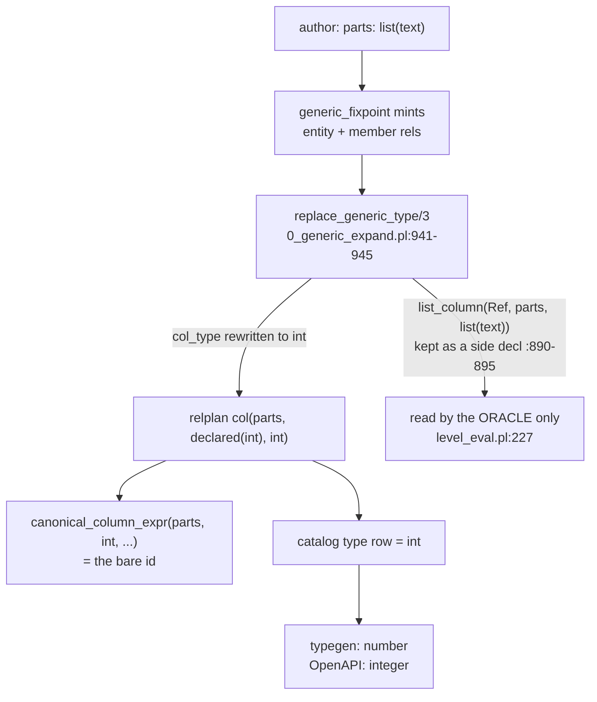
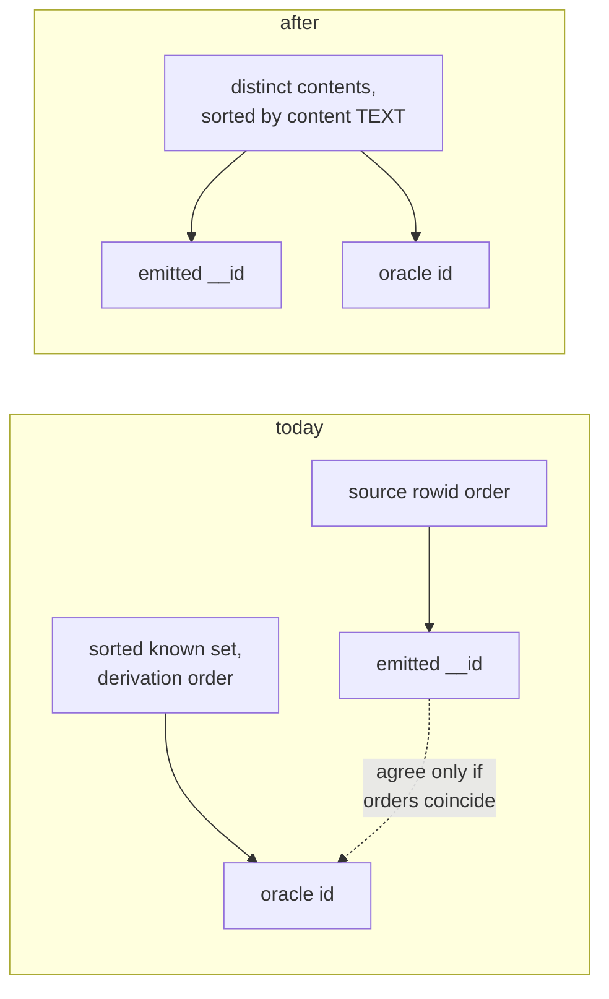

# list(T) ergonomics: the consumer sees the VALUE, never the interned id

Asked 2026-08-14: "Make the list ID stuff as ergonomic as possible, basically
have a non-materialized view, or a way to say that. There needs to be an
ergonomic way to say that."

PLAN ONLY. No implementation, no fixture edit. Ends in cited forks.

## TOC

1. [What is asked, in engine terms](#1-what-is-asked-in-engine-terms)
2. [Receipts: where a list value lives today](#2-receipts-where-a-list-value-lives-today)
3. [The one erasure that causes all of it](#3-the-one-erasure-that-causes-all-of-it)
4. [Candidates](#4-candidates)
   - [a. Emitted non-materialized read surface](#a-emitted-non-materialized-read-surface)
   - [b. Hydration in the runtime row readers](#b-hydration-in-the-runtime-row-readers)
   - [c. A dl-surface spelling](#c-a-dl-surface-spelling)
   - [d. Keep `number`, keep spread (the do-nothing bound)](#d-keep-number-keep-spread-the-do-nothing-bound)
5. [Candidate comparison](#5-candidate-comparison)
6. [Canonical sorted mint order](#6-canonical-sorted-mint-order)
7. [Cited forks for Chris](#7-cited-forks-for-chris)
8. [Slices](#8-slices)
9. [Validation](#9-validation)
10. [Ownership and laws](#10-ownership-and-laws)
11. [Corrections from landing (PRs #253, #256)](#11-corrections-from-landing-prs-253-256)

## 1. What is asked, in engine terms

```mermaid
flowchart LR
  A["author writes<br/>parts: list(text)"] --> B["storage: INTEGER id"]
  B --> C{"what crosses<br/>the boundary?"}
  C -->|today| D["1"]
  C -->|asked| E["[\"usr\",\"local\",\"bin\"]"]
```

Three separate planes have to agree, and today only the storage plane is built:

| plane | today | asked |
|---|---|---|
| storage | INTEGER id into the minted entity | unchanged |
| read boundary (tick log, final select, serve) | the id, as a number | the elements, as an array |
| type (typegen, OpenAPI, jsonschema) | `number` / `{"type":"integer"}` | `Array<T>` / `{"type":"array"}` |

"Non-materialized" is the constraint on how the read boundary gets there: derive
at read, add no table, add no maintained rule.

## 2. Receipts: where a list value lives today

| fact | citation |
|---|---|
| a `list(T)` column mints an entity rel (`content`) plus a member rel keyed `(list_id, idx)` | `v6/prolog/0_generic_expand.pl:766-774` |
| the entity's `content` column is declared `text`, so it physically stores a `__str` id, not the array text | `0_generic_expand.pl:769` plus `lower.pl:2435-2439` `interned_id_sql/2` |
| the member's `value` column is the element type, so a `list(text)` member value is also a `__str` id | `lower.pl:2365-2367`, the insert selects `s."__id"` |
| the expression-position value IS the entity id | `lower.pl:678-691` `list_intern_sql/6`, `list_entity_id_lookup/3` |
| the four intern statements per producing rule | `lower.pl:2348-2369`, called from five arm sites (`lower.pl:3553, 3665, 5148, 5218, 5832`) |
| `decode(Parts, [... Part])` over a `list(T)` source is rewritten to a member-rel atom for BOTH doors, before lowering | `0_generic_expand.pl:56-103` |
| the oracle mints by first appearance, non-backtrackable global | `conformance/body.pl:432-446`, `conformance/level_eval.pl:205-253` |
| oracle mint order is derivation order over a sorted known set | `conformance/level_eval.pl:190-198` (`sort/2` at 197) |
| the boundary read decides id-versus-value per column type, in ONE predicate | `lower.pl:6083-6113` `canonical_column_expr/3` |
| a `ref(T)` column already reads its VALUE at that boundary, never its id | `lower.pl:6093-6097` -> `lower.pl:2752-2758` `dictionary_render_expr/3` |
| an interned text column already restores its characters through a non-materialized TEMP VIEW | `lower.pl:2501-2548` `text_view_ddl/6`, selected by `text_read_table/4` at `lower.pl:2583-2587` |
| the delta/snapshot/final-state reads all consume that same expression text | `lower.pl:5869-5888` `delta_statement/3` |
| the tick log encodes by declared boundary type, TS and Rust identically | `v6/tsv2/runtime/ticklog.ts:54-72`, `v6/sprefa-engine-rs/src/ticklog.rs:80-101` |
| the TS boundary type vocabulary | `v6/tsv2/runtime/types.ts:28` `"text" \| "int" \| "bool" \| "float" \| "ref" \| "json"` |
| the Rust mirror, with an unknown name falling back to Text | `v6/sprefa-engine-rs/src/types.rs:8-28` (fallback at `:26`) |
| the Rust boundary `Value` has no array variant | `v6/sprefa-engine-rs/src/types.rs:37-42` |
| the TS row reader, one place, type-driven | `v6/tsv2/runtime/rows.ts:26-51` `row_value_from_sql` |
| the Rust row reader, the mirror | `v6/sprefa-engine-rs/src/sql.rs:149-190` `result_rows` / `normalize_boundary_value` |
| typegen renders `json_list` as `Array<T>` and has no `list` arm | `v6/prolog/compile/7_emit_ts_types.pl:124-126`; the dl6 rail mirror at `v6/dl/typegen/render_ts.dl6:46-56` |
| OpenAPI renders `json_list` as `{"type":"array"}` and would render a list column as `{"type":"integer"}` | `v6/tsv2/serve/openapiDoc.ts:35-65` |
| the catalog builds a `json_list` type row per distinct list type | `lower.pl:1940-1985`, kind atom at `:1978` |
| ruling: `json_list(T)` is the inline-JSON spelling at every layer; `list(T)` is the relational one | `conformance/rulings.pl:435-436` |
| ruling: a bare `list(T)` is dense + owned + sequence | `conformance/rulings.pl:718-719` |
| ruling: generic templates mint DECLARATIONS ONLY, no maintained rules per instance | `conformance/rulings.pl:~750` (`generic_template_rules`) |
| ruling: JS is never the row engine; if SQLite can compute it, the emitter emits it | `conformance/rulings.pl:~745` (`js_never_the_row_engine`) |
| the landed contract this builds on | `plans/2026-08-14-list-value-position.PLAN.md`, PR #248 (`e10d6d9c`, `109c46d5`) |

Blast radius, measured today: 11 of 56 conformance fixture files mention
`list(` (`0_decl_order`, `0_generic_expand`, `0_list_text_door`, `10_list_elements`,
`13_option_list_columns`, `14_option_wrapper_walk`, `15_string_split`,
`18_recursive_list_arg`, `19_list_value_position`, `5_value_plane`, `json_arm`),
and 6 `dl_view` programs carry a `: list(` column.

### Probes run for this plan (2026-08-14, system sqlite3 3.43.2)

| probe | result |
|---|---|
| `json_group_array(value ORDER BY idx)` | SYNTAX ERROR on 3.43.2 (`near "ORDER"`). The in-aggregate ORDER BY landed in SQLite 3.44; `@libsql` bundles 3.45.1 and would accept it. A construct only one of the two builds has cannot be emitted, the same reason `jsonb` is banned at `lower.pl:2680-2687`. |
| ordered-subquery form `(SELECT json_group_array(s.value) FROM (SELECT value FROM member WHERE list_id = t.col ORDER BY idx) s)` | works on 3.43.2, answers `["a","b","c"]` |
| EXPLAIN of that form against `UNIQUE(list_id, idx)` | `CORRELATED SCALAR SUBQUERY` -> `CO-ROUTINE` -> `SEARCH m USING INDEX (list_id=?)`. No temp b-tree for the ORDER BY: the UNIQUE index supplies the order. |
| same, with the `__str` join a `list(text)` element needs | adds `SEARCH d USING INTEGER PRIMARY KEY (rowid=?)`, answers `["usr","local","bin"]` |

Both EXPLAIN shapes are SEARCH, never SCAN, so the SEARCH-not-SCAN law is met by
the storage that already exists. No new index is owed by any candidate here.

## 3. The one erasure that causes all of it



`replace_generic_type(Type, Instances, int)` (`0_generic_expand.pl:941-945`)
collapses the declared type to `int` before the relplan is built. The
information survives as a `list_column/3` decl (`0_generic_expand.pl:890-895`)
that only the oracle reads (`conformance/level_eval.pl:227`). Every ergonomic
gap downstream is that one collapse.

The repo already has the pattern for keeping a declared type while storing a
surrogate: `column_storage(Types, Name, ref(Name))` at `0_type_plane.pl:129`
keeps `ref(T)` all the way to `canonical_column_expr/3` while `column_def/4`
writes INTEGER. `json_list(T)` does the same with TEXT storage
(`0_type_plane.pl:118`, `lower.pl:2676`). A `list(Element)` storage kind with
INTEGER physical storage is that same shape, third instance.

## 4. Candidates

Every sketch below assumes this program:

```
rel row_text(name: text, body: text).
rel row_parts(name: text, parts: list(text)).
row_parts(Name, Parts) <- row_text(Name, Body), Parts := split(Body, '/').
```

### a. Emitted non-materialized read surface

Two sub-shapes, both non-materialized, both derived at read.

**a1, the correlated render expression (mirrors `ref`).** One new clause in
`canonical_column_expr/3` (`lower.pl:6083`), beside the `ref` clause at `:6093`:

```prolog
% lower.pl, pseudo, beside canonical_column_expr(Column, ref(T), Expr)
canonical_column_expr(Column, list(Element), Expr) :-
    % (SELECT json_group_array(<element expr>)
    %    FROM (SELECT <value or __str.content> AS v
    %            FROM <member> m WHERE m."list_id" = <Column>
    %          ORDER BY m."idx") s) AS <Column>
    list_render_expr(Element, Column, Expr).
```

`<element expr>` is `m."value"` for int/float/bool elements and a `__str` join
for text elements (member values are interned, `lower.pl:2365-2367`).

**a2, a named TEMP VIEW per list entity.** `CREATE TEMP VIEW "__list_<entity>"
("list_id", "content") AS SELECT ...`, then a1's expression becomes a probe of
that view. `__txt_<table>` (`lower.pl:2524-2538`) and `__ref_<name>`
(`lower.pl:2706-2711`) are the two existing precedents, and the catalog already
carries `view`-kind rows for the `__txt_` pair (`lower.pl:1240-1258`), so a
third view family costs a catalog arm and nothing structural.

| axis | answer |
|---|---|
| both-door lowering | emitted: the expression above, reached by every read because `delta_statement/3` (`lower.pl:5869-5888`) builds snapshot, delta and final-state SQL from the same `ColumnExprs`. Oracle: DELETE work. `level_eval.pl:205-253` mints the id INTO the row; the value it already had is what the boundary should print, so the oracle's boundary keeps the pre-mint term and prints it, which is `ticklog.pl:98-105` unchanged (a prolog list prints through `value_json/2`, `ticklog.pl:104-110`). |
| oracle parity | the id becomes storage-only on both sides. `final(row_parts/2, [row_parts(path, 1)])` in fixture 19 becomes `row_parts(path, ["usr","local","bin"])`. Entity and member finals stay exactly as they are, so the interning stays observable and testable. |
| EXPLAIN | measured above: `SEARCH m USING INDEX (list_id=?)` plus, for text elements, `SEARCH d USING INTEGER PRIMARY KEY`. No temp b-tree. Formerly-quadratic guard: the render is one correlated probe per ROW, not per element pair, so the COUNT test is "statements per tick unchanged" plus the EXPLAIN assertion, additive to `v6/tsv2/tests/structPlane.test.ts:366`. |
| typegen | needs section 4's type-row work: a `list` kind row in the catalog (`lower.pl:1940-1985` grows a sibling to `catalog_list_types/2`) and a `ts_kind(..., list, ElementId, 'Array<T>')` arm at `7_emit_ts_types.pl:124`, mirrored in `8_emit_rust_types.pl` and in the dl6 rail `v6/dl/typegen/render_ts.dl6:46-56`. |
| JSON boundary | this is the expensive half. The tick-log bytes for every list-typed column change from `1` to `["usr",...]`, in the emitted door AND the oracle, and every list fixture's expectations move. OpenAPI (`openapiDoc.ts:64`) and jsonschema (`4_emit_jsonschema.pl`) start saying array. |
| rx lowering | the column is a `map` over the row that replaces the id with the member rel's rows for that id, ordered by `idx`: `rows$.pipe(map(row => ({...row, parts: members.filter(m => m.list_id === row.parts).sort(byIdx).map(m => m.value)})))`. No new subscription, no state, no Subject: a pure projection of two already-subscribed rels, which is what "non-materialized view" means in rx. |
| cost | one prolog clause plus a type-row arm on the emitted side; the byte-contract churn on the fixture side is the real bill. |

### b. Hydration in the runtime row readers

The id stays in storage; the TS and Rust readers turn it into an array at the
boundary.

| axis | answer |
|---|---|
| both-door lowering | `v6/tsv2/runtime/rows.ts:26` `row_value_from_sql` grows a `"list"` arm that `JSON.parse`s the column; `v6/sprefa-engine-rs/src/sql.rs:174` `normalize_boundary_value` grows the mirror. `IRowColumnType` (`types.ts:28`) and `RowColumnType` (`types.rs:8`) each gain `list`. `Value` (`types.rs:37`) gains a `List(Vec<Value>)` variant or carries the array text as `Text`. |
| the catch | the reader can only parse text the SQL already produced. Assembling an array in JS from member rows is row work in JS, which the `js_never_the_row_engine` ruling forbids by name (`rulings.pl`, "if sqlite can do it, our emitter should predict that"). So (b) is not an alternative to (a); it is (a) plus a parse step. State that plainly rather than pricing it as a separate road. |
| oracle parity | identical to (a): the oracle holds the real list already. |
| EXPLAIN | identical to (a); the reader adds no SQL. |
| typegen | same type-row work as (a). The reader arm is what makes `Array<T>` true rather than aspirational: without it typegen would claim `Array<string>` for a value that crosses as a string. |
| JSON boundary | `RowColumnType::parse` falls back to `Text` on an unknown name (`types.rs:26`), so an OLD emitted program run by a NEW Rust runtime degrades silently to the array TEXT rather than failing. That is a quiet-wrong path and wants a named check, not a fallback. |
| rx lowering | `map` at the seam: `select_rows(...).pipe(map(rows => rows.map(hydrate)))`. Still one subscription, still no state. |
| cost | four small files, two of them Rust, plus the `Value` variant decision. |

### c. A dl-surface spelling

The ask says "a way to say that". Four spellings, vocabulary law applied
(rxjs, prolog, or SQL words only).

| spelling | shape | verdict |
|---|---|---|
| c1: `decode(Parts, PartsValue)` binds the whole value | `decode/2` already exists and already means unpack; the spread arm is the element fan-out (`0_generic_expand.pl:80-87`, parser at `parse_dl_dcg.pl:1261-1267`). A non-spread pattern over a `list(T)` source binds the array. | works, but it makes the VALUE the opt-in and the ID the default, which is the shape the user is complaining about |
| c2: the column type IS the statement | `parts: list(text)` always renders elements at the boundary; the id is an internal detail exactly like a `__str` id or a `ref` `__id`. Zero new grammar, zero new keyword. | matches the existing `ref(T)` treatment (`lower.pl:6093`) and matches "as ergonomic as possible" literally: the ergonomic spelling is no spelling |
| c3: a rel-level `view` kind, `rel parts_of(...) view <- ...` | SQL's own word for a derived, never-stored relation. Real and wanted, but it is a whole arc: every derived rel is materialized today, and a view rel changes fixpoint, delta and retention semantics. | NAME IT, DEFER IT. Not this arc. |
| c4: an aggregate at the read site, `Parts := json_group_array(Element)` | already the `json_list` road (`lower.pl:5696`), and it re-materializes into a json column. | wrong plane; it produces a `json_list`, not a `list` |

The rx lowering of c2 is (a)'s: the column projection. The rx lowering of c1 is
the same projection made explicit at one call site. c3's rx lowering is a
`ReplaySubject`-free derived Observable per rel, which is exactly why it is its
own arc.

### d. Keep `number`, keep spread (the do-nothing bound)

Priced honestly, because it is not free and it is not zero-value.

| axis | answer |
|---|---|
| what the author writes today | two rules: one binds `parts: list(text)`, the next spreads it. The spread is already sugar-free and already a keyed member join (`0_generic_expand.pl:56-103`), EXPLAIN-clean. |
| what the app sees | an integer with no meaning outside the db, in the tick log, in the OpenAPI response, and in the generated TypeScript. Section 2's `sql-relational-design` law says "human-readable output is a JOIN or view at the read boundary" and this is the case where that boundary was never built. |
| typegen consequence | `number`. The generated interface is not wrong about storage and is useless to a consumer. |
| JSON boundary consequence | an id that is stable only within one database file crosses into HTTP responses. |
| cost of choosing it | zero engineering, and it keeps the fixture byte contract still. |
| when it is right | if list columns are only ever consumed by other dl rules and never by an app boundary. The corpus says otherwise: 6 `dl_view` programs already declare list columns. |

## 5. Candidate comparison

| axis | a (read surface) | b (reader hydration) | c2 (type says it) | d (do nothing) |
|---|---|---|---|---|
| non-materialized | yes, correlated read | yes | yes | n/a |
| new tables | none | none | none | none |
| new maintained rules | none (respects `generic_template_rules`) | none | none | none |
| SQL statements per tick | unchanged | unchanged | unchanged | unchanged |
| EXPLAIN | SEARCH x2, measured | inherits a | inherits a | n/a |
| typegen | `Array<T>` after the type row lands | `Array<T>` becomes true | `Array<T>` | `number` |
| tick-log bytes | CHANGE on every list fixture | inherits a | inherits a | stable |
| oracle work | delete the mint-into-row step at the boundary | none | none | none |
| files touched | `lower.pl`, `0_type_plane.pl`, `0_generic_expand.pl`, 2 typegen emitters, `render_ts.dl6` | `rows.ts`, `types.ts`, `sql.rs`, `types.rs`, 2 ticklog files | none beyond a and b | none |

a, b and c2 are one design in three layers, not three roads. d is the bound they
are measured against.

## 6. Canonical sorted mint order

Standing decision this session (coordinator, user-delegated): the emitted door
sorts distinct list contents before minting. The sorted-fixture contract dies.

Why it exists at all: today the emitted entity gets its `__id` from insert
order, which is the source rel's rowid order, while the oracle mints in
derivation order over a `sort/2`-ed known set (`level_eval.pl:197`). The two
agree only when the two orders coincide, which is why the fixture headers say
INITIAL ROWS ARE SORTED and call it a contract
(`conformance/fixtures/15_string_split.pl:16-19`,
`conformance/fixtures/19_list_value_position.pl:8-10`).



Implementation sites, both doors:

| door | site | change |
|---|---|---|
| emitted | `lower.pl:2359-2361` (`EntityInternSql`) | append `ORDER BY <ArraySql>`. NOT `ORDER BY "content"`: the entity's `content` column holds a `__str` id (`lower.pl:2435-2439`), so ordering by the column orders by string-arrival order. The raw array text expression is the thing to sort by. |
| oracle | `conformance/level_eval.pl:205-232` (`mint_heads/4`, `mint_values/5`) | collect the tick's distinct contents, `msort/2` them, mint in that order, then substitute ids into the derived heads. Minting inline per head is what ties the oracle to derivation order today. |
| fixture contract | `fixtures/15_string_split.pl:16-19`, `fixtures/19_list_value_position.pl:8-10` | delete the paragraphs; add one fixture whose initial rows are deliberately UNSORTED and whose ids still agree. That fixture is the whole point of the change. |

Two facts to carry into the slice:

- Prolog `msort/2` on atoms compares by code point; SQLite `BINARY` collation
  compares UTF-8 bytes. UTF-8 preserves code point order, so the two agree on
  every string, ASCII or not. No collation clause is owed.
- `sqlite-costs` names ORDER BY on an insert's SELECT a measured loser for
  throughput. The cost here is one sort over the DISTINCT list contents of one
  rule arm per tick, not over the row set, and it buys door agreement. Price it
  in the slice with a statement-count assertion, do not hand-wave it.

## 7. Cited forks for Chris

Every row is a decision point with its throw site or its decision site. Nothing
below is implemented.

| # | fork | option A | option B | recommended default | site |
|---|---|---|---|---|---|
| F1 | does a list column's BOUNDARY value print the id or the elements? | id (today) | the elements | **B, the elements.** A `ref(T)` column already prints its value and not its id at this exact predicate; a list is the same story with an ordered child set. | `lower.pl:6083-6113`, ref arm at `:6093` |
| F2 | how does an author SAY "value here"? | opt-in per read (`decode(Parts, PartsValue)`) | the column type says it, always | **B, the type says it.** "As ergonomic as possible" reads as no spelling; the id becomes an internal detail like `__str`. | `0_generic_expand.pl:941-945`; parser arm would be `parse_dl_dcg.pl:1261-1267` |
| F3 | does the runtime hand the app `Array<T>` or the array TEXT? | `Array<T>` (new `list` boundary type in both runtimes) | the TEXT, typed `json` | **A, `Array<T>`.** B makes typegen's `Array<T>` a lie and pushes a `JSON.parse` into every consumer. | `v6/tsv2/runtime/types.ts:28`, `v6/sprefa-engine-rs/src/types.rs:8-28`, `:37-42` |
| F4 | inline correlated expression, or a named `__list_<entity>` TEMP VIEW? | inline (mirrors `ref`) | named view (mirrors `__txt_`/`__ref_`) | **A, inline**, unless the serve layer wants a name to query, in which case B is additive later. | `lower.pl:2752-2758` vs `lower.pl:2524-2538` |
| F5 | mint order (already decided; the residual is the oracle half) | emitted sorts only | BOTH doors sort by content text | **B.** Sorting one door alone does not make them agree, because the oracle's order is derivation order over a sorted known set, not content order. | `lower.pl:2359`, `conformance/level_eval.pl:205-232` |
| F6 | the Rust unknown-type fallback | keep `_ => Text` | name the unknown type and fail | **B, name it.** A new emitted program run by an old runtime silently degrades to array TEXT today. | `v6/sprefa-engine-rs/src/types.rs:26` |
| F7 | `rel ... view` as a first-class never-stored rel kind | do it now | name it, defer it | **B, defer.** It changes fixpoint, delta and retention semantics; it is its own arc, and c2 delivers the ask without it. | new; nearest existing kind switch is `relplan_parts/6` `Kind` at `0_rel_record.pl:69` |

## 8. Slices

One commit each, fail-pre-fix test first, 1 to 2 slices per lane.

| lane | slice | content | gate |
|---|---|---|---|
| L1 | S1 | `list(Element)` survives to the relplan: a `column_storage/3` arm (`0_type_plane.pl`, beside `:118` and `:129`), a `column_def/4` arm writing `INTEGER NOT NULL` (`lower.pl:2676` neighbourhood), and `replace_generic_type/3` stops collapsing to `int` (`0_generic_expand.pl:941`). Physical DDL byte-identical; only the relplan term changes. | plunit; sweep byte-identical count unchanged |
| L1 | S2 | catalog `list` type row (sibling to `catalog_list_types/2`, `lower.pl:1940-1985`) plus the `Array<T>` arms in `7_emit_ts_types.pl:124`, `8_emit_rust_types.pl`, `v6/dl/typegen/render_ts.dl6:46-56`, and the array arm in `openapiDoc.ts:58-65` and `4_emit_jsonschema.pl`. | typegen goldens; OpenAPI golden |
| L2 | S3 | boundary render: the `canonical_column_expr(Column, list(Element), Expr)` arm with the ordered-subquery form (NOT in-aggregate ORDER BY, 3.43.2 rejects it); oracle boundary keeps the pre-mint value; fixture 15 and 19 expectations move from id to array. Add the EXPLAIN assertion (SEARCH, no temp b-tree) and the statement-count assertion. | conformance, sweep, grade.sh |
| L2 | S4 | runtime hydration: `list` in `IRowColumnType` and `RowColumnType`, the `rows.ts` and `sql.rs` arms, the two ticklog arms, and F6's named unknown-type behaviour. | tsv2 tests, rust tests, grade.sh |
| L3 | S5 | sorted mint order both doors, delete the sorted-fixture contract paragraphs, add the deliberately-unsorted fixture. | conformance, sweep |

S3 depends on S1. S4 depends on S3. S5 is independent of all of them and can run
first or last.

## 9. Validation

Per slice, all four, never two `grade.sh` in one shell line, and measure a leg
three times before reporting it.

```
cd v6/prolog/conformance && swipl -g go -t halt go.pl
cd v6/tsv2 && bash scripts/sweep.sh
cd v6/prolog && swipl -q -l compile/test/plunit_tests.pl -g run_tests -g halt
bash v6/sprefa-engine-rs/grade.sh
```

The failing plunit set must equal `.github/CI-KNOWN-RED.md` exactly. Baselines
from `plans/2026-08-14-list-value-position.PLAN.md` section 4, measured
2026-08-14 on `91da6781`: conformance 421/0, sweep total 317 identical 314 wrong 0
rejection 3, plunit 5 known-red, RUST-GRADE graded 421 byte-clean 313. Re-measure
on the arc's actual base sha before trusting any of those.

## 10. Ownership and laws

- Every worktree agent's first action is `git merge --ff-only <coordinator sha>`;
  failure or missing tree means STOP AND REPORT.
- Disjoint ownership: L1 owns `0_type_plane.pl`, `0_generic_expand.pl`, the two
  typegen emitters, `render_ts.dl6`, `openapiDoc.ts`, `4_emit_jsonschema.pl`.
  L2 owns `lower.pl` and the four runtime files. L3 owns
  `conformance/level_eval.pl` and the two fixture headers. `lower.pl` is L2-only
  after S1 lands; S1's `column_def` edit is L1's single reach into it and must be
  committed before L2 starts.
- FORBIDDEN to all three: `compile/parse_dl_dcg.pl` (no surface change in this
  arc; F2's recommended default needs no grammar).
- Lang design lands with Chris in the room. A lane that hits an unlisted fork
  reports it with the throw site; it does not settle it.
- No `eprintln!` in `src/**`. Comments state only constraints the code cannot
  show. dl variable names descriptive everywhere. Banned in prose and in
  identifiers: provenance, substrate, load-bearing, regime, refusal.
- Formerly-quadratic paths get COUNT or EXPLAIN tests, additive, never end-state
  equality alone.

## 11. Corrections from landing (PRs #253, #256)

| plan claim | what landed |
|---|---|
| section 3: "every ergonomic gap downstream is that one collapse" (`replace_generic_type/3`) | the erasure had FIVE implicit `int`-readers beyond the named one; one was a real WRONG (a derived head fed by a list column rendered its id as text). PR #253. |
| section 4a element expr covers int/float/bool/text only | `list(<rel ref>)` is legal and shipping; EVERY column type is an element type. The ref arm joins the child's `__rendered` (`json(r."__rendered")`). PRs #253, #256. |
| section 8 S2 catalog row as one build | the catalog list row build split id-map from row-build, to run after rel ids exist. PR #253. |
| section 4a ordered correlated subquery, "no temp b-tree" | the measured plan for that form on 3.43.2 WAS `USE TEMP B-TREE FOR GROUP BY`. Landed shape (F4 as user-amended): named non-materialized `TEMP VIEW __list_<entity>` with plain `GROUP BY m."list_id"` joined on the outer column; `UNIQUE (list_id, idx)` carries grouping and element order, no temp b-tree, no correlated subquery. EXPLAIN pins verbatim in the #256 PR body. PR #256. |
| section 4b hydration reuses `IRowValue` | `IRowValue` split: `IRowScalar` names the SQL-parameter seam so a binder cannot take an array (was 65->412 tsgo errors unsplit). Rust mirror landed as panics; user decision 2026-08-14 "no panics for lists" -> follow-up arc replaces them with a scalar enum + typed errors. PR #256. |
| oracle reads `list_column/3` only at the boundary | the oracle needed list-position propagation: a derived rel carries no col_type decl, so `level_eval.pl` now closes list-ness over rules positionally, mirroring the relplan. Fixture `list_bare_text_door`. PR #256. |
