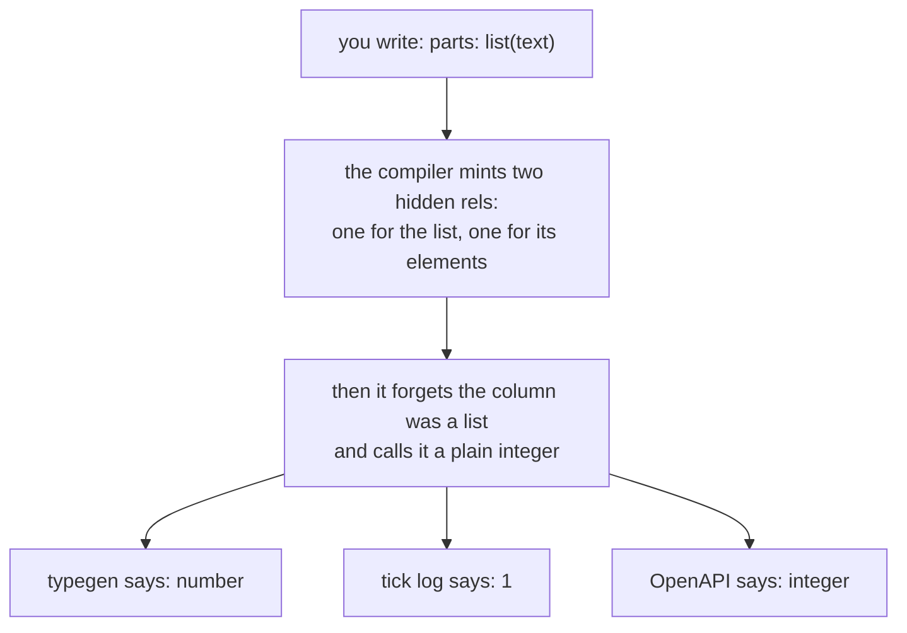
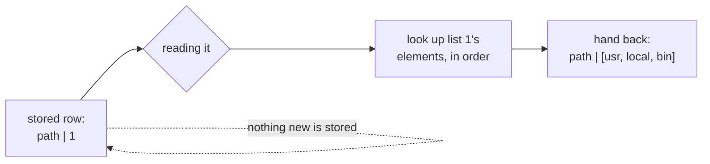
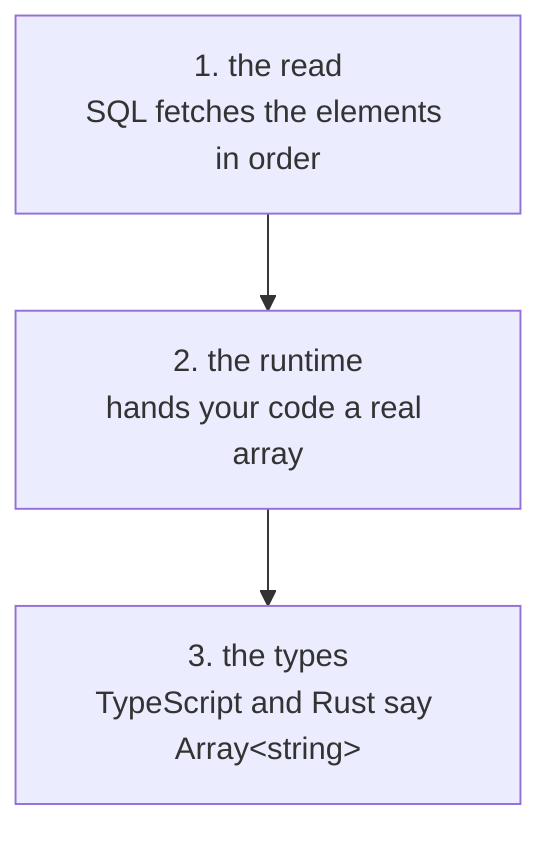
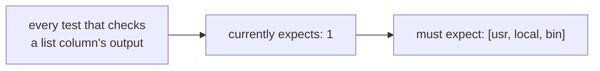
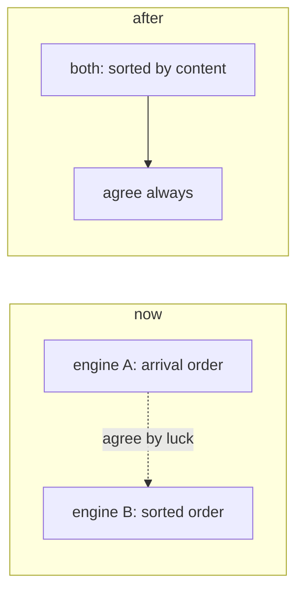
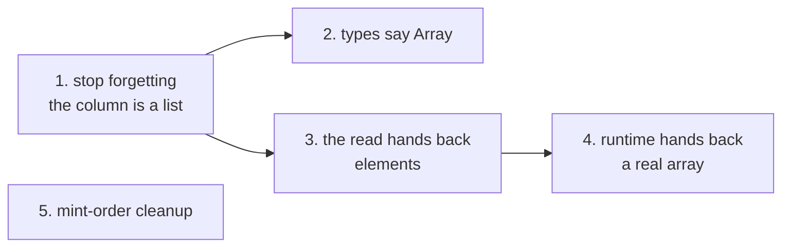

# Lists should hand you the list

## TOC

1. [The complaint](#1-the-complaint)
2. [Why it happens](#2-why-it-happens)
3. [The fix, in one picture](#3-the-fix-in-one-picture)
4. [Three layers, one design](#4-three-layers-one-design)
5. [What it costs](#5-what-it-costs)
6. [The do-nothing option, priced](#6-the-do-nothing-option-priced)
7. [The mint-order cleanup](#7-the-mint-order-cleanup)
8. [What I need from you](#8-what-i-need-from-you)
9. [Order of work](#9-order-of-work)

## 1. The complaint

You write this:

```
rel row_parts(name: text, parts: list(text)).
```

You get this back at the boundary:

```json
{"name": "path", "parts": 1}
```

You wanted this:

```json
{"name": "path", "parts": ["usr", "local", "bin"]}
```

The `1` is real and correct as storage. It is the id of an interned list. It is
also meaningless to anything outside the database file, and it is what the
generated TypeScript, the OpenAPI schema and the tick log all show you today.

## 2. Why it happens



One line in the compiler throws the word "list" away right after it finishes
using it. Everything downstream only ever sees an integer, so everything
downstream tells you about an integer.

The elements never went anywhere. They are sitting in a table, in order, keyed
so a lookup is a index probe.

## 3. The fix, in one picture



Nothing gets written. Nothing gets cached. No extra table, no extra rule, no
extra work per tick. The lookup happens while reading, the same way a struct
column already hands you the struct and not its row number.

That last part matters: this is not a new idea in the engine. Reference columns
already do exactly this. Interned strings already do exactly this, through a
view. Lists were the one thing left holding an id in public.

I measured the lookup today. It uses the index, both hops. No scans, no
temporary sort, no new index needed.

## 4. Three layers, one design

It reads as three candidates and it is really one thing in three places.



| layer | what changes | how big |
|---|---|---|
| the read | one new rule in the SQL builder, next to the one structs already use | small |
| the runtime | one arm in the TypeScript row reader and one in the Rust mirror | small |
| the types | the compiler stops calling the column an integer, so typegen, OpenAPI and JSON Schema all say array | small each, four files |

And a fourth question, the one you actually asked: how do you SAY it?

My answer: you already did. Writing `list(text)` is the saying. The id becomes
an internal detail, like the string ids the engine already hides from you. No
new keyword, no new punctuation, nothing to remember.

The alternative was a per-use spelling, something you write at each read site to
ask for the values. That makes the useless answer the default and the useful
answer the opt-in, which is backwards.

## 5. What it costs

One real bill, and it is not the code.



Eleven of fifty-six test fixtures mention lists, plus six sample programs. Their
expected output changes on both sides, the reference engine and the compiled
one. That is mechanical, and it is most of the work.

Everything else is cheap: no new tables, no new indexes, no extra statements per
tick, no change to how anything is stored.

## 6. The do-nothing option, priced

Keeping today's behaviour is a real option and it is not free.

| you keep | you pay |
|---|---|
| all tests stay green, zero engineering | your app sees an integer that means nothing outside the db file |
| storage unchanged | generated TypeScript says `number` for a list of strings |
| no risk | OpenAPI responses ship a database row number to clients |
| the two-rule pattern still works inside dl | six of your own sample programs already declare list columns |

Do-nothing is right only if list columns are never read by an app. They already
are.

## 7. The mint-order cleanup

Separate, smaller, worth doing in the same arc.

Right now the two engines number lists differently. One numbers them in the
order rows arrived, the other in sorted order. They only agree when the test
data happens to already be sorted, so several test files carry a comment saying
"the rows in this file are sorted on purpose, do not touch".



Fix: both sides sort before numbering. The comments come out, and a new test
goes in with deliberately unsorted data to prove it holds.

One warning I checked: sorting has to happen on the actual text, not on the
column that looks like the text. That column secretly holds another id.

## 8. What I need from you

Seven calls. My recommendation is in bold. The first three are the real ones.

| # | question | my answer |
|---|---|---|
| 1 | should a list column show its elements at the boundary instead of its id? | **yes.** Struct columns already do this; lists are the odd one out. |
| 2 | do you SAY "give me the value" somewhere, or does writing `list(text)` say it? | **writing it says it.** No new syntax. |
| 3 | does your code get a real array, or a string it has to parse? | **a real array.** Otherwise the generated type is lying. |
| 4 | build the lookup inline, or give it a name you can query by hand? | **inline for now.** A named version can be added later without redoing anything. |
| 5 | mint-order fix: one engine, or both? | **both.** One alone does not make them agree. |
| 6 | Rust runtime currently guesses "text" when it meets a type it does not know. Keep guessing? | **no, make it say so.** Today an old runtime silently degrades. |
| 7 | a real `view` rel kind, relations that are never stored at all | **write it down, do it later.** It changes how derived rels, deltas and retention all work. Its own arc. Not needed for anything above. |

## 9. Order of work



Five steps, three parallel workers, two steps each at most. Step 5 is
independent and can go first, last, or alongside.

Nothing here is written yet. This is the plan and the seven questions.
