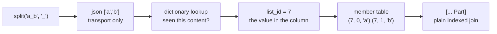

# lists become real values

One idea: a list stops being a json string and becomes a NUMBER — the id of a
row in a table that holds the elements. Same trick the string table already
does for text.

What you gain:

- the compiler knows it is a `list(text)`, elements typed, no erasure
- two equal lists share one id, so `=` on lists is integer compare
- reading elements is an index hit on (list_id, idx), never re-parsing json
- re-deriving the same split hits the dictionary and stops (digest early-out)

What it costs: rendering the array text once per new content to intern it, and
one extra UNIQUE content column on the minted list table.

Four slices: content column on the mint, split returns the id, spread joins
instead of parsing, oracle + fixtures. Each slice lands with the full gate
numbers in the commit.
