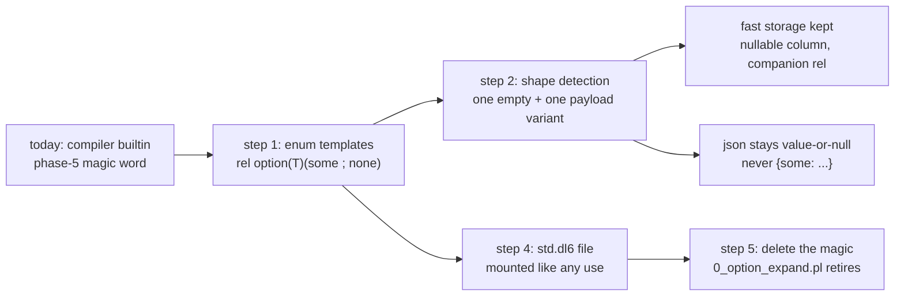

# option becomes library code

One idea: option stops being a magic word baked into the compiler and becomes
five lines of dl6 in a standard library file. The compiler keeps the fast
storage tricks, but they trigger on the SHAPE of the enum, so your own enums
get them too.

```
rel option(T)(some(value: T) ; none).
```



What you gain:

- `option(<enum>)` and self-referencing options stop being errors — they were
  only forbidden because the magic path never learned them
- any enum shaped like option (one empty arm, one carrying arm) gets the same
  cheap storage and clean json — `result`, `maybe`, whatever you name
- the parens spelling you picked already covers it; zero new syntax

What it rides on: the `use ... as` mount work already on this branch — a
stdlib file is just a file somebody mounts for you.

Five slices, safest first: templates for enums (proven on a non-option enum),
shape detection, boundary rendering, the std file, then delete the builtin.
Every slice holds byte-parity on every existing option fixture.

Four calls are yours; the plan doc lists them. The big one: does bare
`option(` keep working everywhere (prelude style), or does everything spell
`std.option(`.
