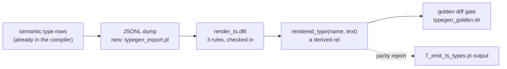

# typegen written in dl6

One idea: the compiler already keeps every type as rows. Dump the rows, feed
them to a 3-rule dl6 program, and the .types.ts text comes out of a rel — the
language generating its own bindings.

The 3 rules (proven live on 2026-08-13, artifacts since deleted, shape kept):

1. each column becomes a field line via `concat`
2. lines fold into a body via `group_concat(line, sep, ordinal)`
3. body wraps into `interface Name { ... }` via `concat`

PascalCase is `replace(initcap(name), '_', '')` — every string function this
needs landed in the last two days, which is why this arc is ready now.

Not in this arc: writing files to disk (needs the fs-effects door, separate
arc) and replacing the prolog emitter (it stays; slice 3 only reports where
the two disagree and why).
