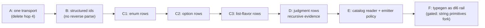

# Type-system unity: the prolog compiler refactor that makes codegen a fold

> Historical plan. `issues/remove-rel-is/item.md` removed relation conformance
> suffixes, implementation rows, and implementation semantic IDs on 2026-08-23.

## TOC
- North star and the one invariant
- Current chain (measured, cited)
- Phase map
- Phase A: one transport
- Phase B: ids stop being strings you re-parse
- Phase C: every expander becomes a row producer
- Phase D: judgments as rows (unlocks nested bounded generics)
- Phase E: one catalog reader + emitter policy
- Phase F: typegen leaves the compiler (gated on user fork)
- Signatures
- Lifetimes, storage, uniqueness
- Gates per phase
- Decision rows for Chris

## North star and the one invariant

One generic (or enum, option, interface, list flavor) has ONE identity: its
rows in the semantic graph. Everything else is a producer into the graph or a
rendering of it. Codegen = a fold over frozen rows with a policy argument.

Invariant to enforce at every phase boundary: a construct's fate is decided
on the COMPLETED graph, never inside one expansion phase. Receipt for why:
`drop_minted_keyed_on_derived` had to move to a single late pass in both
doors after the per-phase version diverged
(`v6/prolog/1_expansion.pl:90`, `0_match_expand.pl:27`, pinned by
`enum_first_preserves_expanded_terms`), and the recursive-evidence wall below
is the same failure shape.

## Current chain (measured, cited)

| hop | representation | where |
|---|---|---|
| 1 | surface text | `compile/parse_dl_dcg.pl:470-540` |
| 2 | parser terms `rel_template/3`, `interface_decl/2`, `rel_is_implementation/2` | same |
| 3 | semantic rows `declaration/5, parameter/4, member/5, constraint/3, application/2, argument/4, implementation/3, derived_from/2` | `0_generic_expand.pl:65-237` |
| 4 | transport decls `generic_decl/3, generic_instance/3, semantic_type_rows/1` | `0_generic_expand.pl:340-381` |
| 5 | catalog `row/11` (+ new kinds `generic_rel, type_parameter, constraint, interface, implementation, concrete_type, generic_column`) | `lower.pl` (staged) |
| 6 | emitter views | `compile/4_emit_jsonschema.pl`, `7_emit_ts_types.pl`, `8_emit_rust_types.pl` |

Known defects the plan absorbs:

| defect | receipt |
|---|---|
| nested bounded application throws | probed: `generic_bound_unsatisfied(pair(document), json_encodable)`; structural closure at `0_generic_expand.pl:478-499` cannot see that a minted instance satisfies a bound |
| ids are strings that get re-parsed | `atom_concat('decl:interface:', Name, Id)` reverse-parses at `0_generic_expand.pl:252,267,271,362`; `declaration_name/2` at `:338` |
| hop 4 duplicates hop 3 | `catalog_generic_decl/4` re-derives surface types FROM rows to rebuild decl terms the rows already encode (`:356-373`) |
| overlap check is exact-match only | `validate_unique_implementations/1` uses `memberchk` (`:280-286`); mercury lab probe 14 shows unifiable-head overlap must also reject |
| enum/option/match expanders bypass the graph | they rewrite decl lists; the graph never sees their output as rows |

## Phase map



A and B are deletion-heavy and small. C is the grind, sliced to one expander
per PR. D is the first user-visible feature (nested bounded generics
compile). E delivers "easy codegen". F deletes typegen from the compiler.
Surface ergonomics (`<...>`, `where`) are orthogonal and ride whenever Chris
picks the spelling; nothing below depends on them.

## Phase A: one transport

`semantic_type_rows/1` becomes the ONLY generic freight between expansion and
lower. `generic_decl/3` and `generic_instance/3` stop being built; the two
consumers that want them derive views from rows at the point of use.

- Edit: `0_generic_expand.pl:340-354` (build rows only),
  `catalog_generic_decl/4` moves to the consumer or dies.
- Find consumers first: `grep -rn "generic_decl\|generic_instance" v6/prolog`.
- Emitted artifacts must not change: manifest bucket diff = zero.

## Phase B: ids stop being strings you re-parse

Keep atom ids if convenient for row/11, but construction AND deconstruction
live in one module with no `atom_concat` recovery anywhere else.

- New module `0_type_ids.pl`: `decl_id/3`, `param_id/4`, `member_id/4`,
  `constraint_id/3`, `impl_id/3`, `app_id/3`, `arg_id/3`, plus
  `id_kind_name/3` as the single inverse.
- Every current reverse-parse site (`0_generic_expand.pl:252,267,271,338,362,375-380`)
  switches to `id_kind_name/3` or, better, a row lookup.
- Rail: a plunit test greps none of `atom_concat('decl:` outside the id
  module (count test, additive).

## Phase C: every expander becomes a row producer

Today enum (phase 10), option, match rewrite decl lists and the graph never
hears about it. After C, each expander ALSO emits rows tying its mints to
their origin, and the graph is complete after the last phase.

- C1 enum: `enum_decl` -> `declaration(kind=enum)` rows + variant
  `member` rows + `derived_from(variant_rel, enum)` edges.
- C2 option: `option_column/3` -> rows linking companion rel to parent
  column (`derived_from` + a new `origin(companion, option(Parent, Col))`
  row shape if `derived_from` is too coarse).
- C3 list flavors: the four families' minted rels get `derived_from`
  edges to their application row (they already have application rows via
  `generic_fixpoint`).
- Each slice is one PR, full battery per slice. The decl-list rewriting
  stays untouched in C; rows are ADDITIVE. Deleting decl-list plumbing is a
  later arc once every consumer reads rows.

## Phase D: judgments as rows

Bounds checking becomes data, computed late on the completed graph.

Row vocabulary (from the d2 board, section 5):
`well_formed(AppId)`, `substitution(AppId, ParamId, ArgType)`,
`obligation(Id, AppId, InterfaceId, ArgType)`,
`resolved_by(ObligationId, Evidence)`,
`specialization(AppId, ConcreteId)` (exists as `derived_from`, keep name).

Evidence = `impl(ImplId)` | `structural(Path)`. Resolution is a worklist to
fixpoint, so an application discharges a bound when its arguments do, which
fixes the nested-bounded throw. Fixture first: a conformance fixture with
`pair(pair(document))` under `T: json_encodable`, currently throwing, flips
to PASS as the phase gate.

Also lands here (mercury-lab imports, cheap now that heads are rows):
- overlap: reject unifiable implementation heads, test pinned to a fixture
  mirroring `tagged(pair(T,T))` vs `tagged(pair(T,U))`.
- unresolved obligation error carries the full path
  (declaration -> application -> argument -> failing leaf), replacing the
  bare `generic_bound_unsatisfied/2` payload.

## Phase E: one catalog reader + emitter policy

Emitters stop hand-walking `row/11`. One reader module, one policy term.

- `compile/catalog_read.pl`: typed accessors (signatures below). The three
  emitters rewrite onto it; behavior identical (goldens pin it).
- `emit_types(Lang, Policy, Rows, Text)` with
  `Policy = monomorphize | preserve_generics | hybrid`.
  JSON schema: `monomorphize` only. TS/Rust: both paths.
- Receipt demanded by `plans/2026-08-13-generic-interface-type-ir.md:219`:
  one catalog renders BOTH preserved and monomorphized output, tested.
- External gates: `tsc --noEmit` over emitted TS, `grade.sh` byte-clean
  count not lower than pre-phase.

## Phase F: typegen leaves the compiler (gated)

Blocked on the string split/format primitives fork (Chris's call). When it
lands: export the frozen graph as dl6 facts, port the probed 3-rule TS
renderer (2026-08-13 session) into a real rail, demote `7_emit_ts_types.pl`
to bootstrap. Not scheduled here; listed so no phase above paints over it.

## Signatures

```prolog
% ---- graph build (A-C) ----
% semantic_graph(+Decls, +Rules, -Graph)
%   Graph: sorted ground list of row terms. Built once after module
%   resolution, EXTENDED by each expander, frozen before judgments.
% pseudo:
%   base rows from surface decls (exists: normalized_type_rows/2)
%   ; each expander appends its origin rows
%   ; sort/1, then freeze.

% expander contract (C):
% expand_<kind>(+Context, +prog(Decls,Rules), -prog(Decls1,Rules1), -Rows)

% ---- ids (B) ----
% decl_id(+Kind, +Name, -Id).        % construction, total
% id_kind_name(+Id, -Kind, -Name).   % THE inverse, only exported one

% ---- judgments (D) ----
% judge(+Graph, -Judged)
%   Judged = Graph ++ well_formed/substitution/obligation/resolved_by rows.
% pseudo:
%   findall obligations from constraint rows x application args (after sigma)
%   ; worklist: discharge by impl row | structural closure | argument
%     applications already resolved
%   ; fixpoint; leftover obligations -> throw with path.

% ---- reading + emit (E) ----
% catalog_rels(+Rows, -RelIds).
% catalog_columns(+Rows, +RelId, -Columns).   % Columns = [col(Name, TypeRef)]
% catalog_generics(+Rows, -GenericIds).
% catalog_instances(+Rows, +GenericId, -InstanceIds).
% emit_types(+Lang, +Policy, +Rows, -Text).
```

## Lifetimes, storage, uniqueness

- Graph: per compile invocation, threaded as an argument. No assert; the
  compiler stays assert-free (also port-prep, per the mercury feasibility
  receipts: 719 untyped-surgery sites is already enough to retype).
- Rows: in-memory sorted list; `row/11` in SQLite remains a projection built
  once in `lower.pl` from the frozen graph.
- Uniqueness: ids unique by construction; `sort/1` dedupes; digest-name
  collisions keep the existing throw (`0_generic_expand.pl:716-718`).
- Two doors law: every new pass wires into BOTH `expand_program_run` and
  `expand_match_program`, pinned by a door-equivalence test, same as
  `drop_minted_keyed_on_derived`.

## Gates per phase

Every phase: `cd v6/prolog/conformance && swipl -g go -t halt go.pl` (0 FAIL),
`cd v6 && just plunit` (only the 5 CI-KNOWN-RED), `cd v6/tsv2 && bash
scripts/sweep.sh` (wrong=0, manifest diff reviewed), `bash
v6/sprefa-engine-rs/grade.sh` (byte-clean not lower). Measure a leg three
times when it wobbles. One PR per phase slice, receipts in the PR body.

Fail-pre-fix fixtures added before code: D's nested-bounded fixture; C1's
enum-origin row fixture; E's dual-policy golden.

## Decision rows for Chris

| decision | options | blocks |
|---|---|---|
| surface spelling | `<...>` + `where` now, or after C | nothing below C |
| string primitives fork | build split/format/substr | F only |
| `option(<enum>)` stop at `0_option_expand.pl:43` | fold into C2 or separate arc | C2 scope |
| generics WIP PR slicing | staged index is already the generics slice | when A starts |
