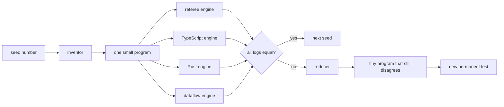
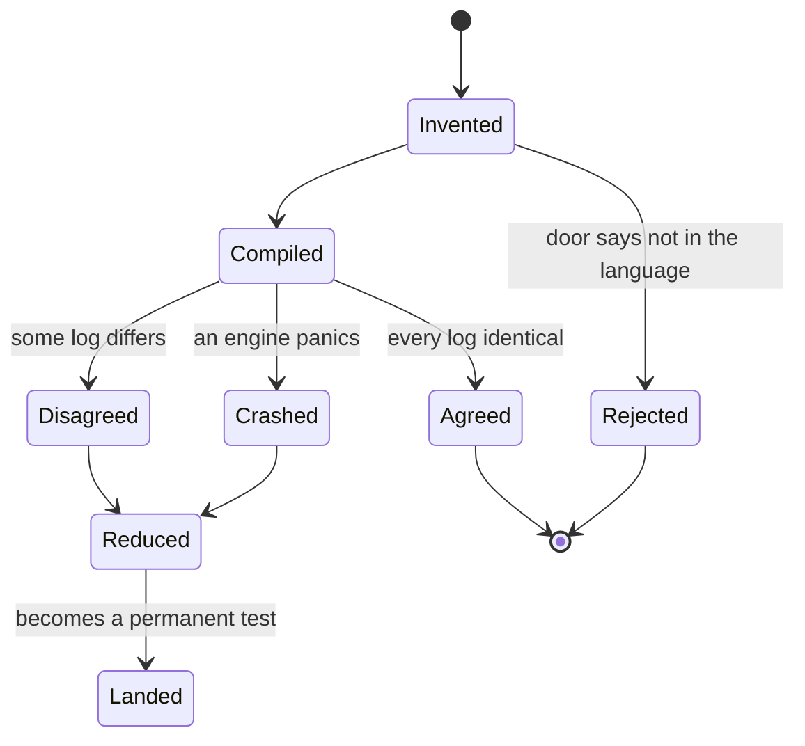
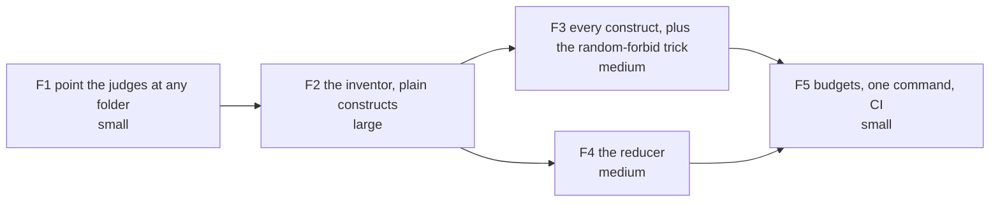

# Grammar fuzzer, three doors: the plain version

## TOC

| § | thing |
|---|---|
| 1 | [The one-sentence idea](#1-the-one-sentence-idea) |
| 2 | [What already exists](#2-what-already-exists) |
| 3 | [The pipeline](#3-the-pipeline) |
| 4 | [What one program goes through](#4-what-one-program-goes-through) |
| 5 | [How a program gets built](#5-how-a-program-gets-built) |
| 6 | [Buy or build](#6-buy-or-build) |
| 7 | [Shrinking, step by step](#7-shrinking-step-by-step) |
| 8 | [The arcs](#8-the-arcs) |
| 9 | [Numbers](#9-numbers) |
| 10 | [Two things the issue got wrong](#10-two-things-the-issue-got-wrong) |

---

## 1. The one-sentence idea

Write a machine that invents small legal programs in our language, run each one
through all three engines, and shout when the three engines disagree.

---

## 2. What already exists

| piece | status |
|---|---|
| the reference engine (the referee) | built |
| the TypeScript engine | built, byte-graded |
| the Rust engine | built, byte-graded, and it reads a program at runtime, so no compiler runs per program |
| a fourth engine, the dataflow one | built, two variants |
| a byte-diff of tick logs | built |
| a per-construct coverage check | built, currently pointed at one hand-written program |
| the printer and parser round-trip check | built |
| **the program inventor** | **missing. This is the whole job** |
| **the counterexample reducer** | **missing. The issue thought it existed** |

---

## 3. The pipeline



Every engine writes a log of what happened on each tick. The check is byte
equality of those logs. Not the final answer alone: a bug that fixes itself by
the end of the run is still a bug, and we had one that hid that way for three
arcs.

---

## 4. What one program goes through



`Rejected` is allowed but capped: at least nine in ten invented programs must
compile, otherwise the inventor is wasting the budget on programs no engine
ever runs.

---

## 5. How a program gets built

The trick borrowed from the database world: do not generate text from a
grammar and hope it type-checks. Generate from the catalogue, keeping the
program legal at every step, so almost everything you produce actually runs.

```
step 1  pick 2 to 6 relation names
step 2  give each one columns, with types drawn like the real corpus
step 3  split them: some are fed by the schedule, the rest are computed
step 4  order the computed ones so nothing reads a later one
step 5  write 1 to 3 rules per computed relation
step 6  place shared variables ONLY where the column types match
step 7  invent a nine-tick schedule, run it at 0 rows, 1 row and 100 rows
step 8  hand the whole thing to the engines
```

Step 6 is the part no off-the-shelf tool can do. Our language refuses to
compare or join columns of different types on purpose, so a generator that
ignores types writes programs that die at the front door and test nothing.

One extra trick, free: for each program, randomly forbid a chunk of the
language. Programs that contain everything explore nothing deeply. On a C
compiler, this one change found 104 crash classes in a week instead of 73.

---

## 6. Buy or build

| job | decision |
|---|---|
| the test loop, the seed handling, the retry-until-smaller recursion | **buy**, an existing SWI-Prolog property-testing pack, which exposes exactly the two hooks we need |
| random number drawing | **buy**, standard library |
| the design of "generate from the catalogue, stay legal" | **copy the idea** from SQLsmith and Csmith. Their code is for SQL and C, so only the idea travels |
| grammar-file fuzzers (the ANTLR family) | **no.** They need a second grammar file for our language, kept in sync with the real parser by hand, and they still produce mostly-illegal programs |
| the Python reducers | **no.** They reduce text through that same second grammar. Our failing case is already a tree, so reducing it in place is cheaper and better |
| the program inventor itself | **build.** Nothing on the market knows our relations, our types, or our layering rules |
| the reducer | **build**, about 120 lines, using the well-known hierarchical algorithm on our own tree |

---

## 7. Shrinking, step by step

A found bug is usually a 40-line program. Nobody debugs that. The reducer
repeatedly throws part of it away and asks "does it still disagree?".

```
start   6 relations, 9 rules, 9 ticks     disagrees
cut 1   drop rules one at a time          4 rules left, still disagrees
cut 2   drop unused relations             2 relations left, still disagrees
cut 3   drop body items                   1 rule with 2 items, still disagrees
cut 4   drop columns                      each relation down to 2 columns
cut 5   drop ticks                        2 ticks left, still disagrees
cut 6   shrink the values themselves      numbers to 0, strings to empty
end     2 relations, 1 rule, 2 ticks      disagrees. Ship this as the test
```

The reducer never needs its own idea of right and wrong. It reruns the exact
same check that found the problem.

---

## 8. The arcs



| arc | done when |
|---|---|
| F1 | the new judge runs over today's test folder and reproduces today's numbers exactly, changing nothing |
| F2 | 1000 invented programs, nine in ten compile, rerunning the same seeds gives byte-identical programs |
| F3 | a 1000-program batch touches every construct in the language by name, and finds the two constructs we already know the referee mishandles |
| F4 | three planted bugs each reduce to two relations and one rule |
| F5 | one command, every leg time-capped, a wedged program is killed and named |

F1 is the only arc that edits existing files, so it goes first and alone. F3
and F4 touch nothing in common and run at the same time.

---

## 9. Numbers

| thing | number |
|---|---|
| constructs in the language | 83 |
| of those, live and generatable | 49 |
| live constructs used five times or fewer in the whole test corpus | 24 |
| live constructs used **zero** times | 1 |
| test programs in the corpus today | 448 |
| of those, that compile | 341 |
| cost to plan and lower one program | 1.8 milliseconds |
| cost to run one program through the referee | 8.4 milliseconds |
| so, cost of a 1000-program batch, engine side | about 11 seconds |
| hard cap per program | 2 seconds, then it gets killed by name |

The corpus has 448 programs written by people over months. This machine writes
1000 in a batch, and the interesting ones are exactly the combinations nobody
thought to write down.

---

## 10. Two things the issue got wrong

**1. The reducer does not exist.** The issue points at a file and calls it the
shrinker. That file is the fourth engine's plan writer. The two things share
the letters "dd" and nothing else. Reducing is real work in this plan, one
arc's worth.

**2. The construct list is not the whole grammar.** The registry has 83 rows
and they are correct, but six declaration forms that every real program uses
have no row at all. The inventor reads the registry plus that mined list, or
it will write programs that declare nothing.
