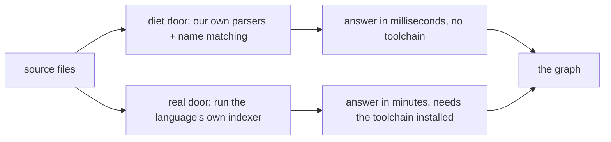
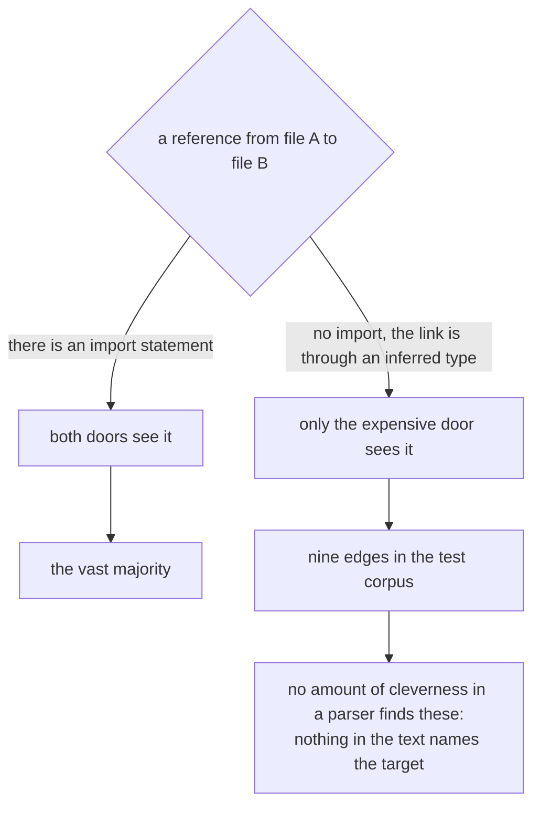
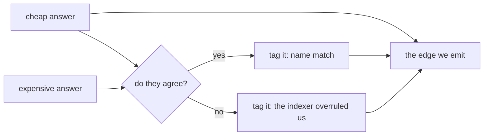
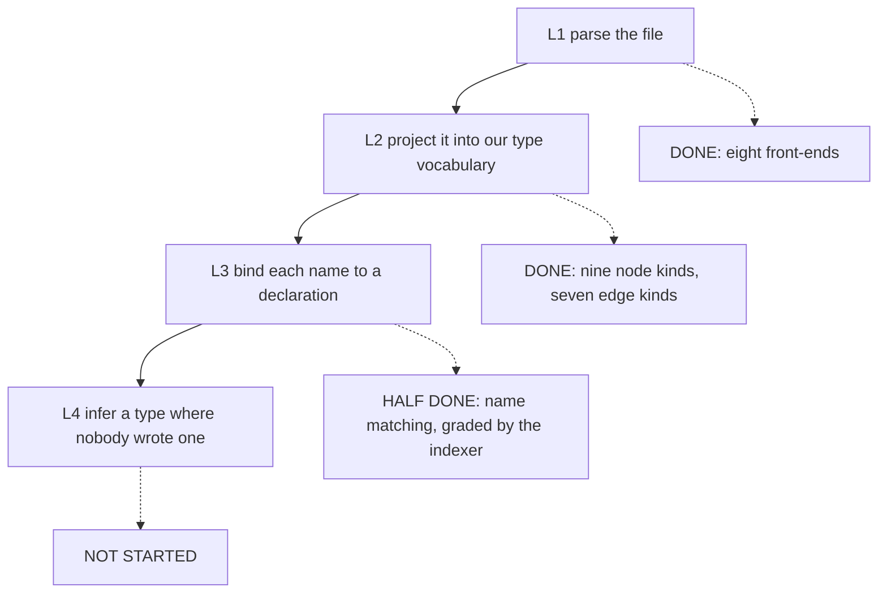
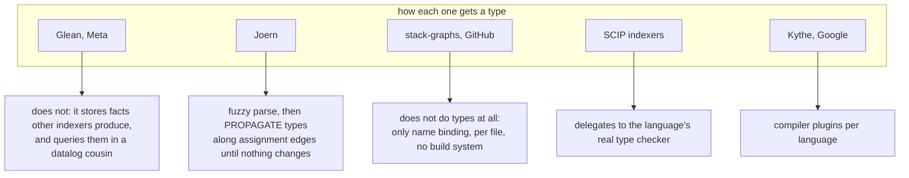
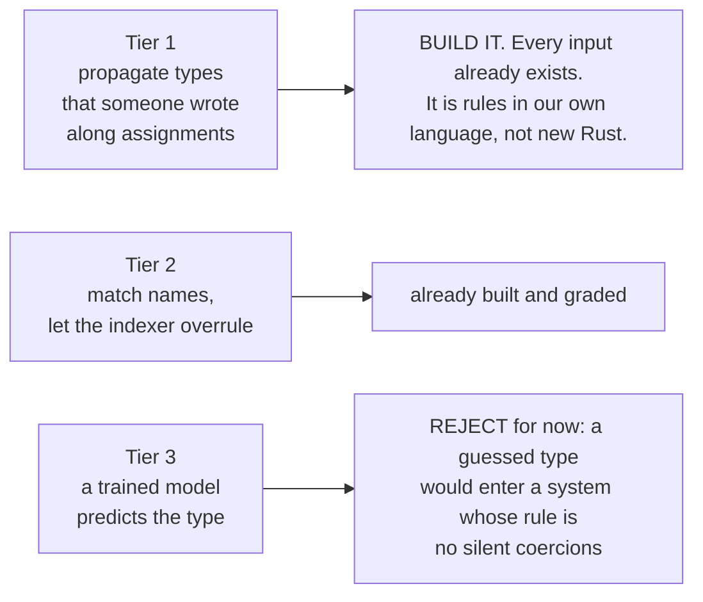
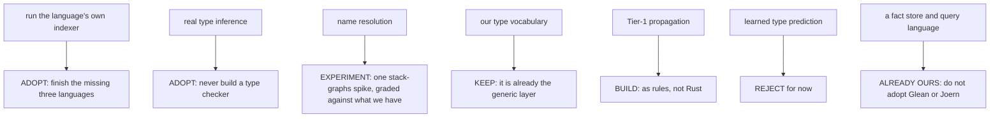

# Types, cheap and expensive: the picture

Plain words. No citations. The receipts version is
`plans/2026-08-16-extract-generic-typesystems.PLAN.md`.

## Table of contents

1. [The two doors](#1-the-two-doors)
2. [The one real difference between them](#2-the-one-real-difference-between-them)
3. [What we already do that is smart](#3-what-we-already-do-that-is-smart)
4. [The four layers of getting a type](#4-the-four-layers-of-getting-a-type)
5. [What the big systems do](#5-what-the-big-systems-do)
6. [The three tiers of guessing](#6-the-three-tiers-of-guessing)
7. [Adopt or build, at a glance](#7-adopt-or-build-at-a-glance)
8. [Five things only you can decide](#8-five-things-only-you-can-decide)

---

## 1. The two doors

We can answer "what refers to what" two ways.

The cheap door parses the file itself and matches names. The expensive door
shells out to the real thing, which is the language's own type checker wearing a
different hat.

## 2. The one real difference between them

We measured both against an outside referee on a real corpus. The cheap door
scored perfectly. That perfect score is misleading, and we already wrote down
why.

That is the whole gap. Everything else where the two doors disagreed turned out
to be a configuration problem on the expensive side, not a resolution problem.

So the question is not "cheap or expensive". It is "what do we do about the one
shape the cheap door structurally cannot see".

## 3. What we already do that is smart

We did not pick a door. We use the expensive one to grade the cheap one, in the
test suite, per language, and we record disagreement as data rather than
throwing it away.

The consumer can always tell which kind of answer it got. That pattern is the
best thing in this part of the codebase and every proposal below either extends
it or gets rejected for violating it.

## 4. The four layers of getting a type

The important surprise: **the "generic type-system import" you asked about is
mostly already built.** Layer 2 is a small closed vocabulary, and every language
we support fills the same one. Adding Python does not extend the vocabulary, it
just fills it again.

The open work is layer 4, plus one honest question about layer 2 (see the
decisions at the end).

## 5. What the big systems do

The short version of each:

| system | one-line verdict |
|---|---|
| Glean | it is a fact store plus a datalog. We have both. Do not adopt. Steal one idea: keep a language-neutral layer above the per-language facts. |
| Joern | JVM, its own graph store. Do not adopt the tool. Steal the algorithm: propagate types along assignments to a fixpoint. |
| stack-graphs | the only real buy candidate. It is Rust, it is per-file with no build system, which is exactly our shape. Worth one experiment on one language. |
| SCIP indexers | already adopted. Finish the roster: three of six languages have no wiring yet. |
| Kythe | needs compiler plugins, and the team behind it was cut. Skip. |

## 6. The three tiers of guessing

"Diet type guesser" means: work out a type without running a type checker. Three
ways, in increasing ambition and decreasing defensibility.

Tier 1 is the recommendation and it is cheaper than it sounds. We already record
every assignment as an edge, every literal, every constructor, and every written
annotation. We already have a fixpoint engine, because that is what this repo IS.
The guesser is a set of rules over facts we already emit.

One thing blocks it: propagation stops at a function boundary until the
argument-to-parameter hop exists, and that hop is a design decision waiting on
you.

## 7. Adopt or build, at a glance

## 8. Five things only you can decide

Nobody has decided any of these. Each blocks work behind it.

| # | the question | side A | side B |
|---|---|---|---|
| 1 | Does our type vocabulary need to carry a type SYSTEM, or just a type GRAPH? | seven edge kinds is enough; nesting and function types stay out | it grows function types, type application and bounds as real things |
| 2 | Where does Tier-1 propagation live? | as rules in our own language, engine does the fixpoint | as Rust, riding the single parse |
| 3 | Does a guessed type get its own label? | yes, so a consumer can refuse guesses | no, guessed and written types are one relation |
| 4 | Do we spend a week on a stack-graphs experiment? | yes, one language, graded against what we already measure | no, spend it finishing the indexer roster instead |
| 5 | How does dataflow cross a function boundary? | a new edge kind on the existing graph | a separate graph | a join written in our own language |

Number 5 is the one that unblocks the most: Tier-1 guessing cannot cross a
function call until it is answered.
