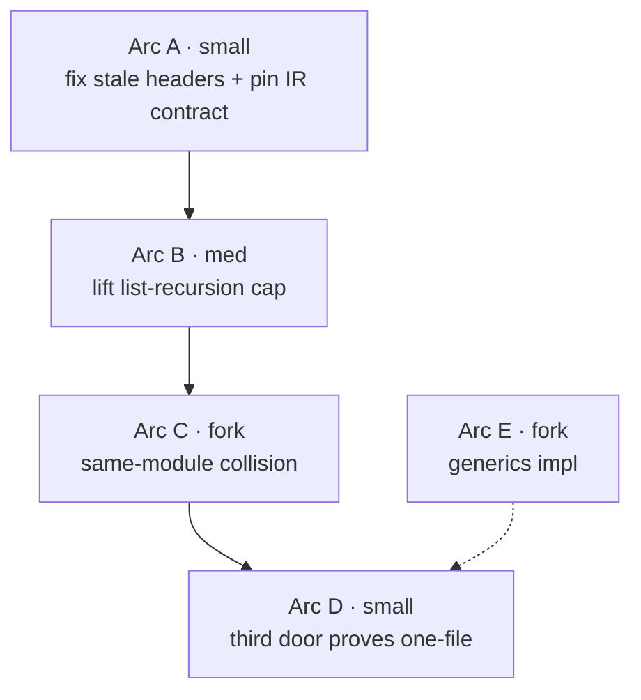

# polyglot typegen vs TypeSpec — gap census and arc sequence

## TOC

1. [Receipts](#1-receipts)
2. [Inventory verdict](#2-inventory-verdict)
3. [Seven comparison axes](#3-seven-comparison-axes)
4. [Arc sequence](#4-arc-sequence)
5. [Forks for Chris](#5-forks-for-chris)

## 1. Receipts

| fact | command (run 2026-08-16, tree 320464bf) | result |
|---|---|---|
| compile coverage | `python3 -c "import json;from collections import Counter;m=json.load(open('v6/prolog/compile/out/manifest.json'));print(Counter(f['bucket'] for f in m))"` | `Counter({'compiled': 342, 'unsupported': 110})`, total 452 |
| render doors on disk | `ls v6/dl/typegen/` | `render_rust.dl6` `render_ts.dl6` |
| IR export module | `grep -rn "type_row" v6/prolog/compile/typegen_export.pl | head` | `dump_type_rows/2`, `row/11 -> type_row/7` mapping at `:6` |
| type wrapper inventory | `grep -n "type_wrapper" v6/prolog/0_type_plane.pl` | `:153-157`, five rows |
| golden gate fixtures | `ls v6/prolog/compile/test/typegen_golden/*.types.ts | wc -l` | 12 TS goldens; 12 RS goldens; 9 `.type_rows.jsonl` |
| out/ type artifacts | `ls v6/prolog/compile/out/*.types.ts | wc -l` and `.types.rs` | 338 + 338 = 676, all tracked |
| total type artifacts (incl golden) | `find v6 -name "*.types.*" | wc -l` | 704 (350 ts + 350 rs + 4 json) |
| sanity gate | `cd v6 && just plunit` | 718 tests, **5 fail** (unrelated to typegen; see below) |

The five `plunit` failures are pre-existing on HEAD and none touch the typegen
surface: `catalog_plane_rail:level_plane_family_corpus_counts` (plunit_tests.pl:1397),
`rel_zero_arity:a_root_rel_zero_still_has_no_storage` (:6421),
`json_merge_patch:json_patch_lowers_with_the_null_stand_in_guard` (:8607),
`merge_patch_stops_on_the_json_null_stand_in` (:8662),
`merge_patch_stops_on_a_nested_json_null_stand_in` (:8666). The typegen
golden gate is a separate script (`bash v6/prolog/compile/test/typegen_golden.sh`)
and is not part of `plunit`.

## 2. Inventory verdict

| seed row | verdict | correction |
|---|---|---|
| prolog emitters, six files | confirmed | none |
| dl6 render doors + `type_row/7` IR | confirmed | none |
| render_ts "declared scope" = header | **stale** | header still says module-prefix + generic-rel are "future arcs", but the body implements both (see below) |
| type plane wrapper inventory `compile/0_type_plane.pl:145-151` | **stale** | file is `v6/prolog/0_type_plane.pl`, wrappers at `:153-157` |
| compile coverage 342/452 | confirmed (re-run) | none |
| "~780 untracked `out/*.types.{ts,rs}`" | **stale** | 676 files, **tracked** (committed), not untracked |

`render_ts.dl6` header lines 10-12 claim scope is "interfaces + option columns
+ list columns, single module, no type-name collisions. Module-prefix and
generic-rel emission are future arcs". The body contradicts this:
`module_prefix/2` at `render_ts.dl6:98-107`, `emitted_type_name/2` with a
prefix arm at `:114-118`, `generic_head/2` + `generic_body/2` +
`rendered_type` part-1 generic arm at `:257-288`. Round 2 of the Phase F arc
closed module-prefix and generic-rel (plans/2026-08-14-phase-f-typegen-dl6.REPORT.md:48-49).

## 3. Seven comparison axes

### Axis 1 — type expressivity

| feature | dl6 (sprefa) | TypeSpec |
|---|---|---|
| primitives | int, float, text, bool, json (`render_ts.dl6:25-28` leaf_type) | scalars + built-in types (string, int, float, boolean, null, bytes, datetime, etc.) |
| option | `option(T)` / `T?`; desugars to `__opt_T` enum or companion split rel (`0_option_expand.pl:53-76`) | optional props `?`, union with `null` |
| list | `list(T)`, `json_list(T)`, three named flavors (`0_type_plane.pl:154-157`) | `T[]`, `Array<T>`, `Record<T>` |
| enums | `enum_decl`, semicolon variants in rel decl (ruling enum_variant_separator) | named string/numeric enums, enum spread |
| named reusable type | an enum rel IS a reusable named type; a rel ref renders as the rel's PascalCase name (`render_ts.dl6:29`) | `alias`, named models, named unions |
| unions | string-literal unions only (via enum); no anonymous general unions | anonymous + named unions over general types |
| templates/generics | `rel_template` mints decls only, rules stay author-written (ruling generic_template_rules); `generic_rel` renders with params | templates on aliases/models/ops/interfaces, `extends`, defaults, `valueof` |
| absence-vs-null | VALUE plane spells it (`none`/`some`), COLUMN/wire plane cannot: JSON Schema renders required-and-nullable `anyOf` (`4_emit_jsonschema.pl:121-146`) | `null` type is first-class; `?` vs union-with-null is a spelling choice |
| recursive types | acyclic self-option guarded, companion rel (`0_option_expand.pl:168-173`); recursive rel refs render by name | models can self-reference |

### Axis 2 — emitter targets

| target | sprefa | TypeSpec |
|---|---|---|
| TS | `render_ts.dl6` (dl6-first) + `7_emit_ts_types.pl` (parity judge) | ecosystem emitter |
| Rust | `render_rust.dl6` + `8_emit_rust_types.pl` | ecosystem emitter |
| JSON Schema | `4_emit_jsonschema.pl` (prolog only; no dl6 door) | `@typespec/json-schema` |
| OpenAPI | `5_emit_openapi.pl` (prolog only; 3.1.0 at `:37`) | `@typespec/openapi3` (3.0/3.1/3.2) |
| Protobuf | none | `@typespec/protobuf` |
| client/server codegen (C#/Java/JS/Python/Go) | none (the dl6 rel IS the runtime, not a client) | emitters + SDK tooling |

Note the asymmetry: sprefa's TS and Rust are the dl6-first product; JSON Schema
and OpenAPI are prolog parity judges with no dl6 door. TypeSpec's OpenAPI3,
JSON Schema, Protobuf are first-party emitters; the ~5-language client/server
claim in the seed is UNVERIFIED against a specific emitter list — it flows
from the TypeSpec docs' OpenAPI3 target feeding existing codegen tools.

### Axis 3 — constraint/validation vocabulary

| decorator | TypeSpec | sprefa |
|---|---|---|
| `@minLength`/`@maxLength`/`@pattern` | built-in (documented) | absent |
| `@minValue`/`@maxValue`/`@minItems`/`@maxItems` | built-in | absent |
| `@format`/`@encode`/`@secret`/`@key` | built-in | absent |
| the `@` surface | decorators + libraries | ruling annotation_at_curry (rulings.pl:659): `@ann(args)` MVP scoped, **no parser today** (`module_identity_bytes` ARCH.pl:934: "zero hits in compile/parse_dl.pl") |

sprefa's answer to constraints today is structural, not decorative: `keyed`,
the option `none`/`some` tag, the list-flavor dedup, and the `acyclic` guard.
There is no length/range/pattern/format vocabulary, and the annotation surface
that would host one is ruled but unbuilt.

### Axis 4 — versioning

| | TypeSpec | sprefa |
|---|---|---|
| mechanism | `@added`/`@removed` decorators, `@typespec/versioning` (documented via the "Versioning" REST guide) | **nothing** |
| citation | typespec.io docs, versioning guide | absence: `grep -rn "added\|removed\|version"` across the type emitters returns only the OpenAPI `info.version` field (`5_emit_openapi.pl:36`), a document version, not a per-type lifecycle |

sprefa has no per-type added/removed/deprecated lifecycle. Schema evolution is
a runtime concern (retraction, the cascade), not a codegen concern; whether a
type-level lifecycle belongs in the wire types is an open design call (fork 4).

### Axis 5 — extensibility (a new language target)

| | TypeSpec | sprefa |
|---|---|---|
| add a target | write an emitter against the emitter framework (JS API: `$emit`, `EmitContext`, semantic walker) | write one `render_*.dl6` that reads `type_row/7` and emits surface text |
| current proof | two emitters already port the framework | two dl6 doors (`render_ts`, `render_rust`) prove the IR is language-neutral |
| friction | TypeScript, npm, compiler API | the renderer is a checked-in dl6 program run on the tsv2 runtime; a 3rd language is a copy with surface-syntax swap |

The `type_row/7` IR (`id, parent, ordinal, name, kind, type_id, module_id`) is
the language-neutral seam. Two doors already consume it. The claim "a new
language target is one `render_*.dl6` file" is mostly true today and is the
arc-4 gate to prove.

### Axis 6 — what TypeSpec cannot do

A dl6 rel is storage + reactive runtime + wire type at once. TypeSpec is a
spec/emit compiler: it produces the schema and the client/server types, then
stops. The running engine (semi-naive cascade, retraction, reach, the served
tick log) has no TypeSpec analog — TypeSpec compiles a model to artifacts; it
does not execute a Datalog body, materialize a frontier, or retract on a
reverse edge.

This is a scope difference, not free superiority. TypeSpec's win is breadth of
wire artifacts and ecosystem; sprefa's win is that the type IS the live
relation, so there is no spec/implementation drift. A sprefa user never
regenerates a client against a stale schema; the type and the storage are one
declaration.

### Axis 7 — build-vs-buy: could a foreign emitter consume `type_row`?

Candidate-by-candidate. The question is whether a foreign spec/emit tool can
consume the `type_row/7` IR (or a serialization of it) and produce the wire
artifacts, instead of us writing more `render_*.dl6` files.

| candidate | can it consume type_row? | what it buys | cost / verdict |
|---|---|---|---|
| TypeSpec emitter framework | only if we serialize type_row into TypeSpec source (`.tsp`) first, then run its OpenAPI3/JSON Schema/Protobuf emitters | breadth (Protobuf, OpenAPI 3.2) + ecosystem | two-hop (our IR -> .tsp text -> TypeSpec compiler). Adds a TypeScript/npm compiler dependency to the pipeline and a second spec language to maintain. The type_row -> .tsp serializer is nearly the work of a renderer anyway. |
| protobuf descriptors (`FileDescriptorProto`) | no — descriptors are the OUTPUT of protoc from `.proto`; type_row would need a `.proto` serializer first | a binary IR that protoc/plugins already consume | same two-hop shape; Protobuf's type system is narrower than sprefa's (no option-vs-null distinction, no reactive semantics, maps/oneof are the escape hatches). |
| Smithy | no — Smithy models compile from Smithy IDL; type_row needs a Smithy serializer | strong AWS service-modeling + traits | Smithy's trait system maps closest to a decorator/annotation surface, but we have no annotation surface yet (axis 3). Adopting Smithy's trait vocabulary is a bigger commitment than the gap it closes. |
| quicktype | no — quicktype consumes JSON Schema/TS/JSON, not a row IR | cheap multi-language type output from one JSON Schema input | we already EMIT JSON Schema (`4_emit_jsonschema.pl`); quicktype could consume that output as a downstream step, no type_row change. This is the only candidate that drops in with zero IR work. |

Verdict: every candidate is a two-hop serializer (our IR -> foreign IDL ->
foreign compiler) EXCEPT quicktype, which slots in after our existing JSON
Schema emitter. None of them close the core gap — the running engine (axis 6)
— and each adds a foreign-language compiler to the build. The cheapest buy is
quicktype-as-a-downstream-of-JSON-Schema; the honest build answer is that
`render_*.dl6` is already the serialization work, and the IR is already
language-neutral. No candidate replaces the renderer; at most quicktype
augments the JSON Schema arm.

## 4. Arc sequence

Goal: "a new language target is one `render_*.dl6` file." Smallest set of arcs
that makes that true and honest. Sizes per `issues/AGENTS.md` (small=flash4,
med=pro4, large=opus).

| arc | size | files owned | gate | blocked on |
|---|---|---|---|---|
| **A** — correct render_ts/render_rust headers + pin `type_row/7` as the door contract | small | `v6/dl/typegen/render_ts.dl6`, `render_rust.dl6` (header comments only) | headers match bodies; the IR contract line names module-prefix + generic-rel as implemented, not future | pure work |
| **B** — lift the list-nesting cap (5 strata -> self-recursive `list_type`) | med | `render_ts.dl6`, `render_rust.dl6`, `typegen_golden/shape_list_nesting_depth_five.type_rows.jsonl` + goldens | a depth-6 list golden renders identical in both doors, no fifth/first strata special-case | pure work (REPORT.md:67-70 shows self-recursive list_type LOADS; the reason to unroll was one-tick settlement) |
| **C** — same-module type-name collision (`type-name-non-injective`) | med | `render_ts.dl6`, `render_rust.dl6` (+ `7_emit_ts_types.pl`/`8_emit_rust_types.pl` as parity judges if ruled) | two same-module colliding rels emit two distinct names, no silent overwrite | **user fork** (fork 1) |
| **D** — a third language door (e.g. `render_go.dl6` or `render_python.dl6`) as the proof | small | new `v6/dl/typegen/render_<lang>.dl6` + goldens + one row in `typegen_golden.sh` | golden holds for the third language; the renderer is one file reading `type_row/7` | pure work; leans on A-C |
| **E** — generics implementation (templates with rules, beyond decl-only) | large | generics expansion + both renderers + parity judges | a template with a body renders and compiles end-to-end | **user fork** (fork 2); inspection written, impl needs Chris |

Arcs A, B, D are pure work and sequence linearly. Arc C (collision) and Arc E
(generics) are user forks; the plan presents their throw sites and does not
settle them.

## 5. Forks for Chris

One line each, throw site or absent-code citation, unsettled.

| # | fork | proof it is real |
|---|---|---|
| 1 | same-module type-name collision resolution (prefix? suffix? error?) | `type_name/2` non-injective, `compile/7_emit_ts_types.pl:172` + `8_emit_rust_types.pl:172`; both renderers' `colliding_type_name` only fires cross-module, same-module `foo_bar`/`fooBar` silently overwrite (plans/2026-08-15-metamorphic-renames.REPORT.md:89-107) |
| 2 | generics: templates mint decls only, rules stay author-written | ruling generic_template_rules (rulings.pl:749); `docs/generics-wrapper-inspection.md` is inspection, no impl |
| 3 | option over enum (`option(<enum>)`) — allow, or keep the throw? | `0_option_expand.pl:69` `throw(unsupported_construct(option_of_enum_unsupported(...)))` |
| 4 | per-type added/removed lifecycle (a TypeSpec `@added` analog) | absent-code: no lifecycle in any emitter; axis 4 |
| 5 | a constraint vocabulary (`@minLength` etc.) — adopt, or structural-only? | absent-code: no length/range/pattern anywhere; the `@` parser is unbuilt (axis 3) |
| 6 | the 676 tracked `out/*.types.{ts,rs}` — keep, regenerate, or drop from git | seed's "~780 untracked" is stale: they are tracked; their fate is open |
| 7 | list-of-rel (`list(rel)`) — refuse, or admit? | `0_type_plane.pl:123` `throw(unsupported_construct(list_of_relation_refs(...)))` |
