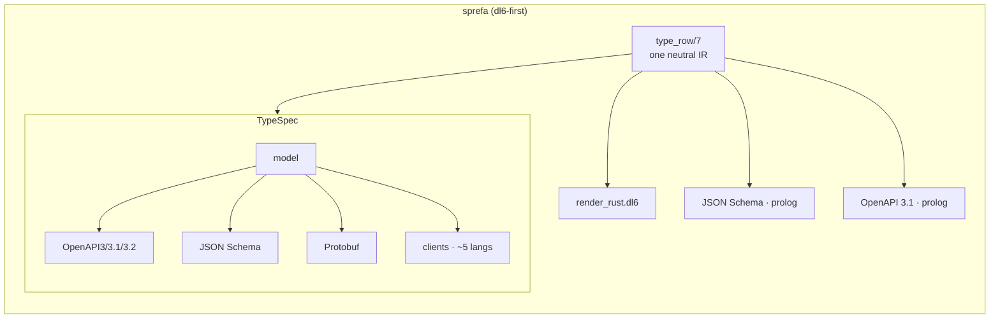
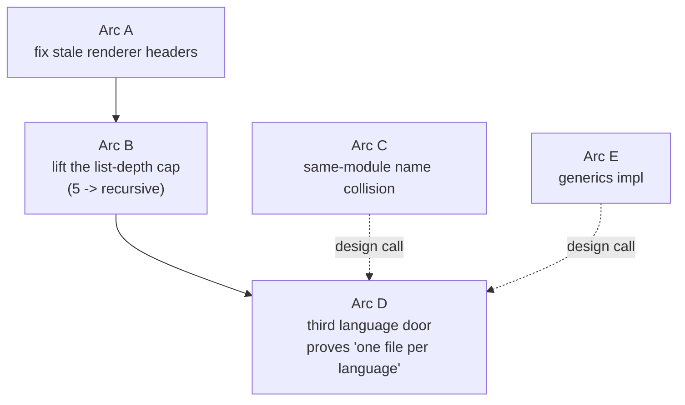
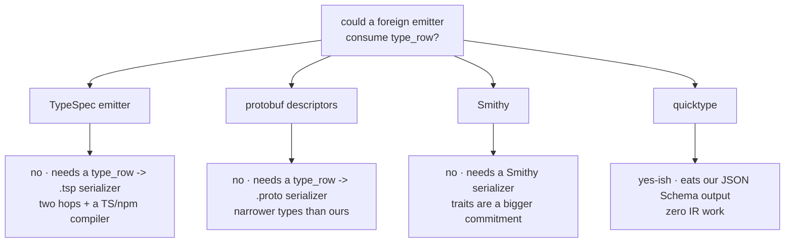

# TypeSpec parity — the plain picture

One question, answered in pictures: how far is dl6's typegen from TypeSpec's,
and what is the cheapest path that closes the gaps worth closing?

## Contents

1. [The one-line answer](#the-one-line-answer)
2. [What we have vs what TypeSpec has](#what-we-have-vs-what-typespec-has)
3. [The gaps worth closing](#the-gaps-worth-closing)
4. [The build-vs-buy picture](#the-build-vs-buy-picture)
5. [What you must decide](#what-you-must-decide)

## The one-line answer

dl6 already emits TS and Rust from one neutral IR; the gaps worth closing are
three pure-work arcs plus two design calls, and TypeSpec wins only on the
breadth of wire artifacts we do not need because the rel IS the runtime.

## What we have vs what TypeSpec has

The same type, two jobs:

| sprefa rel | TypeSpec model |
|---|---|
| storage + runtime + wire type in ONE declaration | schema only; then emitters make artifacts |
| the type is the live relation; no stale client | spec and code can drift |
| no Protobuf, no 5-language client | has Protobuf + 5-language clients |

## The gaps worth closing

| arc | size | what it fixes | gate |
|---|---|---|---|
| A | small | headers still claim module-prefix/generics are "future" — they are built | header matches body |
| B | med | lists render to depth 5 by five copy-pasted strata | depth-6 list renders, one recursive rule |
| C | med | two rels `foo_bar` and `fooBar` in ONE module silently collide | two names, no overwrite |
| D | small | a new language should be ONE render file | a third language passes the golden |
| E | large | templates only mint decls, not rules | a template with a body renders + compiles |

## The build-vs-buy picture

Four foreign tools, all measured against the same question: can it eat
`type_row` and spare us writing more renderers?

Three of four need a serializer we would write anyway (that serializer IS a
renderer). quicktype drops in after our existing JSON Schema emitter. The
buy that makes sense: quicktype as a downstream of JSON Schema. The build that
makes sense: the renderer is already the serializer.

## What you must decide

| call | what it is |
|---|---|
| same-module collision | prefix? suffix? error? (two rels, one PascalCase name, one module) |
| generics | templates with rules, or decl-only forever? |
| option-of-enum | allow, or keep the named throw? |
| type lifecycle | add a per-type added/removed, or let retraction own it? |
| constraints | adopt `@minLength`-style vocabulary, or stay structural? |
| the 676 `.types` files | keep, regenerate, or drop from git? |

The two binding rules already set (dl6 carries codegen alone; module prefix on
cross-module collision; no coercions) are not re-opened here.
