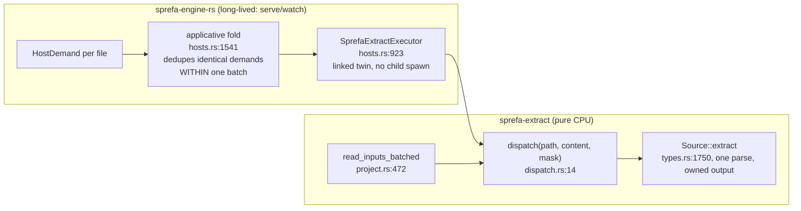

# extract leaf infra: content-keyed cache + parallel dispatch

Card `@extract-blob-cache-parallel`. Build-vs-buy analysis for the cache half,
measurement for both halves, receipts re-verified at `origin/main` 55e15e747.

## TOC

1. [What the seam actually is](#1-what-the-seam-actually-is)
2. [Receipts, re-verified](#2-receipts-re-verified)
3. [Measurements](#3-measurements)
4. [Candidate-by-candidate: the cache](#4-candidate-by-candidate-the-cache)
5. [Candidate-by-candidate: the parallel half](#5-candidate-by-candidate-the-parallel-half)
6. [Verdicts](#6-verdicts)
7. [Open for Chris](#7-open-for-chris)

## 1. What the seam actually is

Two facts the card does not state, and both decide the design:

| fact | receipt |
|---|---|
| extract runs IN-PROCESS inside a long-lived engine, one call per file | `v6/sprefa-engine-rs/src/hosts.rs:46`, `:923` |
| identical demands already fold WITHIN one batch, so intra-tick duplicates are already free | `hosts.rs:82` (`is_applicative`), `:1541` (the group key) |

The fold keys on `(execution, template, inputs)`, which is the PATH. So what the
content-keyed cache adds is exactly two things: the same path across TICKS, and
two different paths holding identical bytes.

## 2. Receipts, re-verified

The card's line numbers rotted at 331a2fa21. Current truth:

| card claim | status at 55e15e747 |
|---|---|
| declaration at `types.rs:1838-1839` | MOVED to `types.rs:2304-2305`, text now says `(ContentId, lang, mask)` |
| cache-key note at `types.rs:50-53` | GONE; that range is `content_id_of` / `ZERO_CONTENT_ID` |
| phase-2 key spec at `types.rs:1077-1081` | MOVED to `types.rs:1445-1449` |
| "BlobHash deleted, ContentId adopted crate-wide" (extract-driver note) | CONFIRMED: zero `BlobHash` hits under `v6/sprefa-extract/src` at 55e15e747; `project.rs:137,147` carry `ContentId` |
| `BlobSource` impls exist, so "impls + the cache are PENDING" is stale | CONFIRMED stale at `types.rs:1192`; impls at `project.rs:750` (`FsBlobSource`, test-only), `:765` (`SourceTreeBlobSource`) |
| dispatch is one file, one thread | CONFIRMED, `dispatch.rs:1-16` |
| rayon absent from `[dependencies]` while the description claims it | CONFIRMED, `Cargo.toml:14` |

## 3. Measurements

Release binary at 55e15e747, this machine, 12 logical cores (8 performance).

| measurement | value | how |
|---|---|---|
| whole-corpus IN-PROCESS pass, single thread | **4.3-4.7 s** wall, 4.0 s user | `extract --resolve` over all 2343 tracked source files, three runs |
| peak RSS holding all 2343 `ExtractOutput`s resident | **400 MB** (170 KB per file mean) | `/usr/bin/time -l` on that run |
| whole-corpus pass, one process PER FILE | 24.3 s, 10.4 ms each | 2343 spawns, full JSONL emission |
| whole-corpus wire output | 1084 MB JSONL | same full pass |
| process startup | under 5 ms, not the cost | empty `.rs` file |
| wire output per source byte | 35-37x | 120-file and 60-file samples |
| per-file wire output spread | p50 306 KB, p90 1.24 MB, max 2.9 MB | 120-file sample |
| in-corpus duplicate blobs (sprefa) | 164 of 2346 files, **7.0%** | sha256 over tracked source files |
| in-corpus duplicate blobs (hafley-rs) | 0 of 95, **0.0%** | same |

The two pass numbers measure different things and both matter. 4.3 s is the
parse-and-extract cost with nothing serialized, one thread, `user` time within
7% of `real` (so it is genuinely single-threaded and CPU-bound). 24.3 s is what
the same corpus costs when every file also pays a process spawn and writes its
full wire form; the 20 s difference is serialization and process setup, not
parsing.

Three conclusions fall straight out.

1. The parallelizable core is 4.3 s on one core with 8 performance cores idle.
   That is the parallel half's payoff and it is measured, not projected.
2. The intra-run cache win is 7% at best on this corpus and 0% on a smaller one.
   The cache pays across TICKS, in the engine's long-lived process, not inside a
   one-shot CLI run.
3. Holding the WHOLE corpus resident costs 400 MB measured, and per-file value
   size spans 170 KB mean against a 2.9 MB worst case on the wire. **An
   entry-count bound does not bound memory here.** Any cache that lands must be
   WEIGHT-bounded, which by itself kills three of the five candidates.

## 4. Candidate-by-candidate: the cache

Key `(ContentId, lang, FamilyMask)`, value `Arc<ExtractOutput>`
(`types.rs:1735`: owned, no lifetimes, not `Clone`).

Already in BOTH lockfiles, so free to depend on: `hashbrown`, `equivalent`,
`crossbeam-epoch`, `crossbeam-utils`, `foldhash`. Absent from both: `rayon`,
`parking_lot`, `dashmap`, `ahash`, `crossbeam-channel`, `once_cell`.

| candidate | version | weight bound | concurrent | new crates | verdict |
|---|---|---|---|---|---|
| **quick_cache** | 0.7.0 | YES, `with_weighter(items, weight_capacity, weighter)` | YES, sharded, `&self` methods, `Send+Sync`, no background thread | **0** (`equivalent` + `hashbrown` both already resolved) | **ADOPT** |
| moka (sync) | 0.12.16 | YES, `.weigher()` + `max_capacity` in weight units; `get_with` coalesces concurrent misses on one key | YES | 6 new (`crossbeam-channel`, `parking_lot`, `portable-atomic`, `smallvec`, `tagptr`, `uuid`) | runner-up |
| lru | 0.18.2 | NO, `NonZeroUsize` entry count only | needs an external `Mutex`, `&mut self` API | 0 | REJECT on the bound |
| plain `HashMap` + `Mutex` | n/a | NO, unbounded | serializes every hit against the rayon half | 0 | REJECT on the bound |
| dashmap | 6.2.1 | NO eviction at all | YES | 6 new | REJECT on the bound |

Two candidates outside the card's set, checked so the set is not taken on faith:

| also considered | why not |
|---|---|
| clru 0.6.3 | HAS a `WeightScale`, 1 dep, but is `&mut self`/single-threaded; the parallel half would serialize on its `Mutex` |
| schnellru 0.2.4 | HAS memory-usage limiters, but single-threaded, pulls `ahash`, and last released 2025-01-03 |
| foyer 0.22.3 | hybrid in-memory + DISK. 12 required deps including `tokio`. The leaf's own header says "No DB, no async" (`Cargo.toml:14`) |
| cached 3.0.0-rc | macro-first, still release-candidate, pulls `thiserror`+`parking_lot`+`web-time` |

`quick_cache` wins on the two axes that the measurements made decisive: it is
the only candidate that is BOTH weight-bounded and concurrent-without-a-global-
lock, and it costs zero new crates in a workspace whose two lockfiles were just
forced into one soopy closure (PR #332). moka is the better-known crate and its
`get_with` coalescing is a real feature the others lack, but it buys that with
6 new transitive crates including `uuid`, and coalescing matters only when two
threads miss the SAME key at the same instant, which is exactly the case the
engine's applicative fold already collapses upstream.

**Regardless of the crate, the lane must write a weigher.** `ExtractOutput`
holds a `Strings` interner plus four `Option<FamilyBundle<F>>`; nothing today
reports its heap size, and a cache bounded on anything else does not bound
memory. That weigher is the one piece no library can supply.

## 5. Candidate-by-candidate: the parallel half

Per-file extraction is pure CPU with no shared mutable state
(`Source::extract` owns its arenas, `types.rs:1748-1750`), so the job is a
parallel map over a file list.

| candidate | verdict |
|---|---|
| **rayon 1.12** | ADOPT. 3 new crates (`rayon`, `rayon-core`, `either`). `par_iter` over the path list is a small change at each of the two `read_inputs_*` loops (`project.rs:456`, `:472`). Work stealing handles the 10x per-file spread that a static chunk split would not |
| `std::thread::scope` + manual chunking | REJECT for the same reason: p50 306 KB vs max 2.9 MB output means static chunks leave cores idle. Rebuilding work stealing is exactly the "write our own" the standing law forbids |
| tokio blocking pool | REJECT. Async is banned above the SqlRunner seam and the leaf declares "No DB, no async" |

Cap: the pool must be a DEDICATED `rayon::ThreadPoolBuilder`, never the global
pool, so nothing else in the process inherits it, and it must leave the machine
usable ("nothing seizes the machine").

## 6. Verdicts

| arc | verdict | payoff |
|---|---|---|
| PARALLEL | rayon, dedicated capped pool, `par_iter` at `project.rs:456` and `:472` | 4.3 s -> under 1 s on 8 performance cores, whole corpus |
| CACHE | `quick_cache::sync::Cache` with a hand-written `ExtractOutput` weigher | zero intra-run gain on a cold pass; the whole win is cross-tick in the engine |

Dispatch order is PARALLEL first: it is mechanical, its payoff is measured, and
it does not touch the seam the cache changes.

## 7. Open for Chris

The cache half is NOT dispatchable until two numbers exist.

1. **The memory cap.** A weight-bounded cache needs a byte budget. Holding this
   whole corpus resident measured 400 MB; anything smaller is a policy choice
   about what the engine may keep. No default in the repo covers this.
2. **The public signature.** Handing back a cached value means
   `dispatch(path, content, mask)` returns `Option<Arc<ExtractOutput>>` rather
   than `Option<ExtractOutput>`, which changes the leaf's public API at
   `dispatch.rs:14`, `lib.rs`, both `project.rs` call sites, the bin, and the
   engine's linked twin. The alternative is a second entry point
   (`dispatch_cached`) leaving `dispatch` byte-identical.

Both are Chris's call. The candidate analysis above stands whichever way they go.
