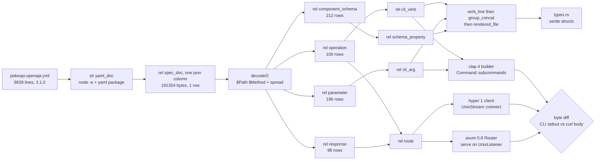

# OpenAPI spec -> dl6 -> clap CLI + HTTP-over-UDS server

Research lane, no code landed. Epic card `issues/openapi-clap-uds-lab/item.md`.
Tree `7d22a3cbf5ca95bce62680e0c52593c13b033486`, measured 2026-08-17.

## TOC

1. [Receipts](#1-receipts)
2. [Card corrections](#2-card-corrections)
3. [Q1 candidates: OpenAPI parsing in Rust](#3-q1-candidates-openapi-parsing-in-rust)
4. [Q1b candidates: YAML to JSON](#4-q1b-candidates-yaml-to-json)
5. [Q2 candidates: clap tree from a spec](#5-q2-candidates-clap-tree-from-a-spec)
6. [Q3 candidates: HTTP over a Unix domain socket](#6-q3-candidates-http-over-a-unix-domain-socket)
7. [Q4: where dl6 sits](#7-q4-where-dl6-sits)
8. [Prior art in tree](#8-prior-art-in-tree)
9. [The dl6 rel schema](#9-the-dl6-rel-schema)
10. [Construct census per rule](#10-construct-census-per-rule)
11. [Pipeline](#11-pipeline)
12. [Minimal lab plan](#12-minimal-lab-plan)
13. [Open forks for Chris](#13-open-forks-for-chris)

## 0. Decision 2026-08-17: dl6 is the thing (F0, chosen)

User decision, supersedes F1 and F5 below and the lab binary in section 12.
No clap generation, no OpenAPI crate, no new emitter, no `sprefa-openapi-lab`
crate. The dl6 program IS the API and the CLI is a generic client of it.

| layer | how |
|---|---|
| spec -> rels | the dl6 rules of sections 9-10 (compile today, receipts in section 1) |
| API | `sprefa-engine-rs` grows a `serve` seam: axum 0.8 router on `tokio::net::UnixListener`, copied from v5 `src/daemon/shell/http.rs:117-142`; `GET /rel/<name>` reads rows typed by the emitted `.types.rs`, `POST /arrive` folds a tick through `driver.rs` |
| CLI | one generic binary that reads `cli_verb`/`cli_arg` rows from the running socket and dispatches; `--help` is a rel read |
| upstream calls (`pokemon get 25` reaches pokeapi) | one host row per operation, from->to like every `sh` host |
| yaml -> json | one plain `sh` host, `node -e` + the `yaml` package already in the TS runtime's dependencies (user 2026-08-17: keep `sh`, stop reaching for extract or new crates) |

rx lowering of the server: `arrivals$.pipe(concatMap(batch => driver.tick(batch)))`; reads are a `latest` projection.

Order: (1) all 342 `.types.rs` compile (audit finding 2, S); (2) `serve` seam (M); (3) Rust golden: pokeapi program on a socket, `curl --unix-socket` one rel, byte-diff (M). Card: `issues/engine-rs-serve-uds`.

## 1. Receipts

Every row below was produced by the command in it, in this worktree, on this tree.

| fact | command | result |
|---|---|---|
| spec size | `wc -l v6/dl/fixtures/pokeapi.openapi.yml` | 9839 lines, 274745 bytes, `openapi: 3.1.0` |
| operations in spec | `grep -c operationId:` | 100, all `get` |
| parameters in spec | `grep -c '\bin: '` | 196 (146 query, 50 path) |
| `$ref` occurrences | `grep -c '\$ref:'` | 355 |
| component schemas | json1 `json_each($.components.schemas)` | 212 |
| yaml -> json | one plain `sh` host, `node -e` with the `yaml` package the TS runtime already depends on (`v6/tsv2/package.json:31`) | user 2026-08-17: keep `sh`, no extract detour, no new crate |
| fixture compile coverage | `python3` over `v6/prolog/compile/out/manifest.json` | `compiled 342`, `unsupported 110`, total 452 |
| proposed rel schema compiles | `bash v6/prolog/compile/scripts/compile_dl6.sh /tmp/oa-research/openapi_spec.dl6 out.ts` | rc=0, `total=108/724001` (108ms) |
| risky-construct probe compiles | same, `/tmp/oa-research/probe2.dl6` | rc=0, `total=78/900993` (78ms) |
| emitted plan run on the real spec | emitted `spec_parameter` SQL against `pokeapi.json` in sqlite3 3.43.2 | 196 rows, first row `('/api/v2/ability/','get','limit','query','integer')` |
| 200-response `$ref` rows | emitted `status_schema` SQL | 98 of 100 operations |
| the target operation | same | `('/api/v2/pokemon/{id}/','get','#/components/schemas/PokemonDetail')` |
| every emitted relation table | `grep 'CREATE TABLE' out.ts` | every table opens `"__id" INTEGER PRIMARY KEY`; every `text` column lowers to `INTEGER NOT NULL` into `__str` |

`/tmp/oa-research/` holds the two probe `.dl6` files, the converted json, and the
SQL receipt script. Nothing was written under the repo except the two plan docs.

## 2. Card corrections

Four claims on the epic card and in tree docs do not hold on this tree.

| claim | where | correction |
|---|---|---|
| prior art at `sprefa-lanes/pokeapi.openapi.yml` and `dl/fixtures/pokeapi_shape.dl6` | epic card | both live under `v6/`: `v6/dl/fixtures/pokeapi.openapi.yml`, `v6/dl/fixtures/pokeapi_shape.dl6`. `sprefa-lanes/` holds only BRIEF files |
| "`5_emit_openapi.pl` already emits OpenAPI from dl6 programs" | epic card | half. `v6/prolog/compile/5_emit_openapi.pl:88-99` hard-codes the served engine's own six routes as `api_route/5` facts. Only `components.schemas` comes from the program, through `4_emit_jsonschema.pl:module_defs/4`. Paths are a fixed table, not derived from any rel |
| "`docs/effect-inventory.md` (uds.rs sites)" | epic card | `src/daemon/shell/uds.rs` no longer exists. `ls src/daemon/shell/` is `http.rs mod.rs timers.rs watch.rs`; the UDS listener folded into `src/daemon/shell/http.rs:117-142` (`spawn_uds`). `docs/effect-inventory.md:90,354,356` still names the deleted file |
| "There is no string aggregate in the registry (count/sum/min/max/avg only), so the N lines of a zone cannot be folded into one column and handed to one command" | `v6/tsv2/labs/staged-writes/2-apply.dl6:20-26` | stale. `group_concat/1` and `group_concat/2` are `live` at `registry.pl` (CONSTRUCT-REFERENCE row), `ordered_group_concat_value` and `ordered_group_concat_ordinal` are `compiled` in the manifest, and `v6/dl/typegen/render_rust.dl6` uses `group_concat(LineText, '\n', Ordinal)` today. Probe F below compiles the fold-to-one-column-then-one-write-host shape rc=0 |
| "string split/substr primitive" awaiting the user | `CLAUDE.md`, Awaiting user word | stale. `split/2` at `registry.pl:294`, `substr/2` at `:285`, `substr/3` at `:286`, `instr/2` at `:287`, `length/1` at `:288`, all with `expression/5` rows and typed lowering. Ten `split_*` manifest fixtures, all `compiled` |

## 3. Q1 candidates: OpenAPI parsing in Rust

Requirement set: read OpenAPI **3.1** (the corpus spec is `3.1.0`), preserve
document order, expose paths x methods x parameters x responses x component
schemas, and round-trip if the loop is to close both directions.

| crate | latest (date) | license | what it gives | what it lacks | verdict |
|---|---|---|---|---|---|
| `oas3` | 0.22.0 (2026-05-06) | MIT | `oas3::from_yaml(String) -> Result<Spec, Error>` and `oas3::from_json`; 3.1.x model; order-preserving `oas3::Map` for paths, component maps, schema properties, responses, callbacks; `yaml-spec` feature parses YAML directly; MSRV 1.87; 429k recent downloads | smaller ecosystem than `openapiv3`; README warns 3.0.x specs "may have trouble" parsing | **WINNER** if a typed model is wanted at all. Only candidate that reads the corpus spec's own version |
| `openapiv3` | 2.2.0 (2025-06-02) | MIT/Apache-2.0 | `serde_json::from_str::<openapiv3::OpenAPI>(data)`; clean enum-per-schema-kind model; 2.87M recent downloads, the field's default | README: "Note this does not cover OpenAPI v3.1 which was an incompatible change." Non-goal, verbatim: "Deserialization and subsequent re-serialization are 100% the same" | rejected on the corpus. The spec in tree is 3.1.0 |
| `progenitor` | 0.14.0 (2026-04-24) | MPL-2.0 | full client codegen; `Generator::generate_tokens(&spec)`; `Generator::cli()` emits a clap CLI; `Generator::httpmock()`; 1.30M recent downloads (Oxide) | spec type is `openapiv3::OpenAPI`, so 3.0.x only. Generated client is `reqwest`-based, and `cargo info reqwest` 0.13.4 lists no unix feature (`socks` yes, unix absent), so the generated client cannot reach a UDS socket. MPL-2.0 | rejected for this epic on two independent counts. Its `cli` generator is the shape to copy, not the crate to take |
| `utoipa` | 5.5.0 (2026-05-04) | MIT/Apache-2.0 | 12.9M recent downloads; `#[derive(ToSchema)]` + `#[utoipa::path]` -> an `OpenApi` document at compile time; adapters for axum/actix/rocket | emit side only. There is no spec-in path: the Rust types are the source and the document is the output. Exactly backwards for "spec in" | rejected for parsing. Candidate for the OTHER direction if the epic ever wants a second emitter beside `5_emit_openapi.pl` |
| `paperclip` | 0.9.7 (2026-04-20) | MIT/Apache-2.0 | 72k recent downloads; v2 (Swagger) + v3 models, actix macros, a client generator | anchored on actix; 43 deactivated features; the v3 half trails the v2 half; no UDS story anywhere | rejected. Framework-anchored to a stack this repo does not run |
| `okapi` | 0.7.0 (2024-01-14) | MIT | plain structs for OpenAPI documents, `schemars`-backed | dormant 2+ years; Rocket-oriented (`rocket_okapi`); 3.0 model | rejected on cadence |
| `apistos` | 1.0.0-pre-release.14 (2026-06-08) | MIT/Apache-2.0 | actix-web OAS3 documentation generator | pre-release for 14 iterations; actix-anchored; emit side | rejected |
| `openapi` | 0.1.5 (2017-04-30) | n/a | n/a | last release 2017; `openapiv3`'s own README lists it as the "similar crate" it replaced | rejected on cadence |
| `openapi-generator` (java) | 7.x | Apache-2.0 | ~50 language generators, mature templates | a JVM in the build path, Mustache templates as the extension surface, and it generates a whole client crate that the dl6 rules would then have to read back. Contradicts "one spec, rules derive everything" | rejected. A second code generator beside dl6 is a second source of truth |

**Verdict.** For the dl6 route, no OpenAPI model crate is on the critical path.
The spec IS a JSON document and dl6's json plane reads it directly
(section 7). `oas3 0.22.0` is the pick for the one job a model crate is
still good for: a **validation gate** in front of the pipeline that answers
"is this a well-formed 3.1 document" before any rule runs. Its exact call is
`oas3::from_yaml(std::fs::read_to_string(path)?)`, one line, `yaml-spec`
feature on.

## 4. Q1b candidates: YAML to JSON

The dl6 route needs only this. One plain `sh` host; the served TS runtime
already depends on the `yaml` package. User decision 2026-08-17: keep `sh`,
no detour through extract or a new Rust crate.

| candidate | latest (date) | what it gives | what it lacks | verdict |
|---|---|---|---|---|
| `node -e` + `yaml` 2.9 (already in `v6/tsv2/node_modules`) | the TS runtime's own yaml dependency, one `sh` line, both doors spawn it | nothing; it is a runtime dep the server already carries | **WINNER** (user decision 2026-08-17: plain `sh`, no extract family, no new crate) |
| `serde-saphyr` 1.1.0 (2026-08-15) | serde YAML 1.2 crate | a new crate + a new extract family for a job one `sh` line does | rejected (user 2026-08-17) |
| system `ruby -ryaml -rjson` | ships with macOS today | one line, zero crate | an OS interpreter as a runtime dep of a Rust engine; Apple has deprecated scripting runtimes and CI images differ | rejected (user decision 2026-08-17) |
| `serde_yaml` | 0.9.34**+deprecated** (2024-03-25) | 86.8M recent downloads, dtolnay | the version string is literally `+deprecated`; upstream retired it | rejected. Adding a self-declared deprecated crate is a defect |
| `serde_norway` | 0.9.42 (2024-12-21) | maintained fork of `serde_yaml`, 2.58M recent, API-compatible | fork governance; a Rust dep for a job a one-line host does | second choice if `serde-saphyr` misbehaves on the corpus; API-compatible with the retired crate. Only if the pipeline moves inside a Rust binary |
| `serde_yaml_ng` | 0.10.0 (2024-05-26) | second maintained fork, 4.84M recent | two competing forks of the same dead crate is an ecosystem fork risk | third choice |
| `yq` (CLI) | n/a | `yq -o=json` | not installed on this machine (`which yq` empty); two incompatible `yq` projects (python and go) share the name | rejected on availability |
| `python3 -c 'import yaml'` | n/a | matches the existing `toml_json` host body style | `python3 -c "import yaml"` fails on this machine: PyYAML is not stdlib. The toml case works only because `tomllib` IS stdlib | rejected, measured |

## 5. Q2 candidates: clap tree from a spec

Requirement set: one verb per operation, args from parameters, help text from
`summary`/`description`, the tree shaped by DATA that arrives at runtime (spec
rows), no second parser, clap 4 (the version this repo already runs at
`v6/sprefa-extract/Cargo.toml:123-126` and root `Cargo.toml:94`).

| candidate | latest (date) | what it gives | what it lacks | verdict |
|---|---|---|---|---|
| `clap` 4 **builder** API at runtime | 4.6.6 (2026-08-06), 214.9M recent | `Command::new(name)`, `Command::subcommands(impl IntoIterator<Item = impl Into<Command>>)` (`clap_builder-4.6.6/src/builder/command.rs:558`), `Command::args(impl IntoIterator<Item = impl Into<Arg>>)` (`:207`), `Arg::new(id).long(..)` (`arg.rs:228`) `.required(bool)` (`:755`) `.value_parser(..)` (`:1048`) `.action(..)` (`:986`), `Command::try_get_matches_from` (`command.rs:813`), `ArgMatches::subcommand() -> Option<(&str, &ArgMatches)>` (`arg_matches.rs:922`), `ArgMatches::get_one::<T>(id)` (`:118`) | nothing. The two iterator-taking builders ARE the fold over spec rows | **WINNER.** The library is bought; the code that remains is one `.fold()` over `cli_verb` rows and one over `cli_arg` rows. No codegen, no build script, no second crate |
| `clap` 4 **derive** + generated Rust | same crate | compile-time checked structs, the shape `v6/sprefa-extract/src/bin/extract.rs:40` uses today | the verb set becomes a compile-time constant. A spec edit needs a regenerate-and-rebuild cycle, and the generated file becomes a second artifact to keep in sync. It also needs a NEW dl6 emitter to write the `#[derive(Parser)]` text | runner-up. Take it only if a static binary with no spec at runtime is a requirement |
| `clap-serde` | 0.5.1 (**2022-10-01**) | `serde_json::from_str::<clap_serde::CommandWrap>(json)?.into() -> clap::Command`: the literal "a JSON document IS the command tree" API | `cargo` dependency list for 0.5.1: `clap ^3.2.16`. It would pull a SECOND clap major into a clap-4 tree. Dormant 3 years and 10 months, 19.9k recent downloads | rejected with evidence. Same class as the `rouille`/`tiny_http` rejections in `plans/2026-07-18-infra-library-adoption.md:181-186` |
| `clap_complete` | 4.6.9 (2026-08-06), 25.1M recent | `clap_complete::aot::generate<G: Generator, S: Into<String>>(generator: G, cmd: &mut Command, bin_name: S, buf: &mut dyn Write)` (`clap_complete-4.6.9/src/aot/generator/mod.rs:284`) | nothing; it takes the same `&mut Command` the builder produced | **ADOPT alongside.** Shell completions for the generated verb tree cost one call. `clap_mangen` 0.3.3 is the man-page twin |
| `progenitor` `Generator::cli()` | 0.14.0 | a whole generated CLI crate from the spec | build.rs only; `openapiv3` 3.0.x model; `reqwest` client with no unix transport | rejected, same two counts as section 3 |
| a maintained serde-to-clap-4 crate | none found | n/a | crates.io search for `clap dynamic runtime command` returned `veks-completion`, `clap-dyn-autocomplete`, `flag-rs`, `rclap`, `abscissa`; none deserializes a clap 4 `Command` | no candidate exists. The builder fold is the answer |

## 6. Q3 candidates: HTTP over a Unix domain socket

**This question is already answered and shipped in this repo.** The written
candidate-by-candidate analysis is `plans/2026-07-18-infra-library-adoption.md`
section 2 (ten candidates: axum, actix-web, poem, warp, rouille, tiny_http,
hyper direct, salvo, tarpc, jsonrpsee), the verdict is section 2.4, and the code
is `src/daemon/shell/http.rs`. Re-measured 2026-08-17:

| leg | crate | latest (date) | the exact call in tree | verdict |
|---|---|---|---|---|
| server | `axum` 0.8 | 0.8.9 (2026-04-14), 106.5M recent | `axum::serve(tokio::net::UnixListener::from_std(std_listener)?, app).with_graceful_shutdown(async move { cancel.cancelled().await })` at `src/daemon/shell/http.rs:128-137`. One `Router` (`:63-71`), two thin listeners, one `CancellationToken` | **HOLDS.** `tokio::net::UnixListener` implements `axum::serve::Listener` in 0.8 |
| path syntax | `axum` 0.8 | same | axum 0.8 path parameters are `"/users/{id}"` (`axum-0.8.9/src/extract/path/mod.rs:610,630`), byte-identical to OpenAPI's own path template. `/api/v2/pokemon/{id}/` needs ZERO transform | new finding. Removes a whole rewrite rule from the pipeline |
| client | `hyper` 1 + `hyper-util` | 1.11.0 (2026-07-20) / 0.1 | `hyper::client::conn::http1::handshake(hyper_util::rt::TokioIo::new(tokio::net::UnixStream::connect(sock).await?))` at `src/daemon_client.rs:47-53`, then `SendRequest::send_request(req)` at `:83` | **HOLDS.** One non-pooled connection per client needs no connector or URI layer |
| client, rejected | `hyperlocal` | 0.9.1 (2024-07-22), 15.0M recent | the `Uri::new(socket, path)` + connector layer | rejected in the 2.5 open question and again here: the connector/URI layer buys nothing for one connection, and 2024-07 is the last release |
| client, rejected | `reqwest` | 0.13.4 (2026-05-25) | n/a | `cargo info reqwest` feature list has `socks` and no unix/uds feature at all. It cannot reach a UDS socket. This is also what disqualifies progenitor's generated client |
| listener flavor | `tokio-listener` | 0.5.2 (2025-09-11), 17.3k recent | `axum08` feature, one runtime-selectable listener across tcp/unix/inetd/systemd | OPTIONAL. Named as optional in the 2.4 verdict and still optional. 17.3k recent downloads is thin; two `axum::serve` calls cost less than the dependency |
| middleware | `tower` / `tower-http` | 0.5.3 / 0.6 | `tower_http::trace::TraceLayer` for the request span, already wired | **HOLDS** |
| v6 TS side | node `http` | n/a | `v6/tsv2/serve/4_http.ts:493` calls `server.listen(port, ...)`. Node's `net.Server.listen` takes a PATH for a UDS socket with no new dependency | one-line change if the tsv2 runtime is to serve over UDS too |

**Verdict.** Nothing to decide. axum 0.8 server + raw hyper 1 client over
`UnixStream`, exactly as `src/daemon/shell/http.rs` and `src/daemon_client.rs`
already do it. The v6 lab copies those two files' shape.

## 7. Q4: where dl6 sits

The card proposes `sh`/`json_each` for the EDB rows. **`json_each/2` is not the
door.** `registry.pl:86` reads:

```prolog
surface(json_each/2,    guard,     no_refs,  wrapper(expr_pair, refuse(goal)),  refused).
```

and the manifest agrees: fixture `json_each_fans_out` is `unsupported` with
reason `level_body_goal(repo_lang(A),json_each(B,A))`.

The door that IS live is `decode/2` (`registry.pl:85`) with the json value axis
(`'{}'/1` at `:129`, `spread/1` at `:131`, `'**'/0` at `:133`), and its lowering
IS `json_each`: `v6/prolog/conformance/fixtures/json_arm.pl:94` states "the
lowering is json_each's own (key,value) columns". The user surface is `decode`;
`json_each` is what the compiler writes.

The corpus already holds the exact fixture this epic needs, and it is
`compiled`:

```prolog
% v6/prolog/conformance/fixtures/json_arm.pl:105-119
% Two key holes nested: v4/examples/openapi-cardinality-markdown.sprf, the
% path x method fan-out.
(operation(Path, Method, Id) <-
   spec(Body),
   decode(Body, {paths: {$Path: {$Method: {operationId: Id}}}}))
```

The four planes, and where each already lives:

| plane | mechanism | status |
|---|---|---|
| spec file -> json | `sh yaml_json(path, digest) -> (doc: json)` | live. Same shape as `toml_json` in the config golden |
| json -> spec rows | `decode/2` + key capture `$Var` + `spread/1` | live, `compiled`, and the fixture is literally the OpenAPI fan-out |
| spec rows -> clap tree, router table | ordinary level rules, `replace/3`, `concat/1`, `instr/2` | live |
| rows -> emitted text | `field_line` -> `group_concat(..., ordinal)` -> `concat` wrap, the `v6/dl/typegen/render_rust.dl6` three-rule IR shape | live, gated by `v6/prolog/compile/test/typegen_golden.sh` |

**No new construct is needed for the dl6 half of this epic.** That is a measured
statement, not an assertion: sections 9 and 10 compile.

## 8. Prior art in tree

| path | what it already does | what this epic takes |
|---|---|---|
| `v6/dl/fixtures/pokeapi.openapi.yml` | the corpus spec, 3.1.0, 100 operations, 196 parameters, 212 component schemas | the lab input, unchanged |
| `v6/dl/fixtures/pokeapi_shape.dl6` | 216 lines of `rel <name>_detail(...)`/`_summary(...)` hand-derived from the spec's component schemas; nested/recursive shapes fall back to `json` columns | the target shape the schema plane must reproduce, and the evidence that the component half is already writable as rels |
| `v6/dl/typegen/render_rust.dl6` | dl6 renders Rust structs from `type_row/7` arrivals: `leaf_type` -> `field_line` -> `body_text(group_concat(...))` -> `rendered_type` | the emitter pattern, verbatim. A `render_clap.dl6` is the same three strata |
| `v6/dl/typegen/render_ts.dl6` | the TS twin | same |
| `v6/prolog/compile/typegen_export.pl` | `dump_type_rows/2`, `row/11 -> type_row/7`, the JSONL IR the render doors consume | the IR-export pattern if the clap tree ever needs compile-time rows |
| `v6/prolog/compile/test/typegen_golden.sh` | runs a `.dl6` renderer on the real tsv2 runtime with JSONL arrivals, assembles `rendered_type` rows into a file, diffs against goldens | the gate shape for `render_clap.dl6` |
| `v6/prolog/compile/5_emit_openapi.pl` | emits OpenAPI 3.1.0 for the served engine's six hard-coded routes; schemas from the program's types | the OTHER direction, and the loop-closing diff target |
| `v6/prolog/compile/4_emit_jsonschema.pl` | `module_defs/4`; option columns render as `anyOf` with null (`:121-146`) | the schema plane's existing renderer |
| `src/daemon/shell/http.rs` | ONE axum `Router` over TCP and UDS, SSE, `TraceLayer`, one shutdown token | the server half, copied into the v6 lab |
| `src/daemon_client.rs` | hyper 1 client-conn over `UnixStream`, sync wrapper, watched wait | the client half |
| `plans/2026-07-18-infra-library-adoption.md` section 2 | the ten-candidate HTTP/UDS analysis and the axum 0.8 verdict | Q3, closed |
| `v6/tsv2/labs/staged-writes/2-apply.dl6` | staged edits as rows, `armed(zone)` as the human yes, one `sh put_line` per line | the write seam, with its "no string aggregate" limit corrected |
| `docs/bootstrap-typegen-lab-vs-typespec.md` | the retired bootstrap lab emitted Rust structs, a std-only Rust HTTP server, typed runtime path matchers, and a JS fetch client from one schema | proof the one-spec-many-emitters shape ran end to end once; its server was hand-written std, which is what "infra is bought" now forbids |
| `plans/2026-08-16-typespec-parity-typegen.PLAN.md` | the gap census; confirms the dl6 render doors and the `type_row/7` IR | the arc-sequencing precedent |

## 9. The dl6 rel schema

Declarations only. Compiles rc=0 (receipt row 8 in section 1).

**Design correction, measured.** The surrogate-key law does not need a
hand-declared `_id: int` column and does not want `key(...)` on a derived rel.
Two receipts:

1. Every emitted relation table already opens `"__id" INTEGER PRIMARY KEY`, and
   every `text` column lowers to `INTEGER NOT NULL` referencing
   `__str ("__id" INTEGER PRIMARY KEY, "content" TEXT NOT NULL UNIQUE)`. The
   emitted DDL for the schema below carries **zero TEXT columns in any relation
   table**. The dictionary encoding the law asks for is the lowering's own work.
2. `key(...)` on a rel that a level rule derives is not built yet:
   `keyed_level_head(spec_doc/2)` came back from
   `compile_dl6.sh` on the first draft, and the manifest carries the same name
   for `current_value/2`. `key(...)` belongs on the EDB and dictionary rels.

```dl6
# ── the source ──────────────────────────────────────────────────────────────
rel spec_file(spec_id: int, path: text, digest: text) key(1).

sh yaml_doc(path: text, digest: text) -> (doc: json) =
  `: {digest}; node -e 'const y=require("yaml");process.stdout.write(JSON.stringify(y.parse(require("fs").readFileSync(process.argv[1],"utf8"))))' {path}`.
# plain sh host (user 2026-08-17: keep sh, no extract detour). The served TS
# runtime already depends on `yaml` (v6/tsv2/package.json:31); the Rust door
# runs the same line through ShellExecutor.

rel spec_doc(spec_id: int, doc: json).

# ── the spec planes ─────────────────────────────────────────────────────────
rel operation(operation_name: text, path_template: text, method: text,
              summary: option(text), description: option(text)).

rel operation_tag(operation_name: text, tag_name: text).

rel parameter(operation_name: text, parameter_name: text, location: text,
              required: option(bool), scalar_type: text,
              description: option(text)).

rel response(operation_name: text, status_code: text, media_type: text,
             schema_name: text).

rel component_schema(schema_name: text, kind: text).

rel schema_property(schema_name: text, property_name: text,
                    property_type: text, nullable: option(bool),
                    ref_schema_name: option(text)).

# ── derived: the clap tree ──────────────────────────────────────────────────
rel cli_group(group_name: text, about: text).
rel cli_verb(operation_name: text, group_name: text, verb_name: text,
             about: text).
rel cli_arg(operation_name: text, arg_name: text, long_flag: option(text),
            positional: bool, required: bool, value_kind: text, help: text).

# ── derived: the router table ───────────────────────────────────────────────
rel route(operation_name: text, method: text, axum_path: text,
          handler_name: text).

# ── derived: the rendered text ──────────────────────────────────────────────
rel verb_line(operation_name: text, ordinal: int, line_text: text).
rel verb_block(operation_name: text, block_text: text).
rel rendered_file(file_name: text, file_text: text).
```

`operation_name` is the OpenAPI `operationId`, unique per document by the
specification, so it is the natural key and the compiler interns it once into
`__str`. `path_template` carries the OpenAPI template verbatim; section 6 shows
axum 0.8 takes it unchanged.

## 10. Construct census per rule

Every rule the pipeline needs, with its construct and the receipt that it
compiles. All six probes are in `/tmp/oa-research/probe2.dl6`, compiled
together, rc=0.

| rule | construct | receipt | gap |
|---|---|---|---|
| `spec_doc <- spec_file, yaml_json(...)` | `sh` host decl + host call | `openapi_spec.dl6` rc=0; same shape as `ghcacher_env_golden` `toml_json` | none |
| `operation <- decode(Doc, {paths: {$Template: {$Method: {operationId: Name: text}}}})` | `decode/2` + two `$` key captures + typed capture | manifest `json_key_capture_nests_and_fans_out` = `compiled`; probe rc=0 | none |
| `parameter <- decode(Doc, {paths: {$T: {$M: {parameters: spread({name: N: text, in: L: text, schema: {type: S: text}})}}}})` | `spread/1` under two key captures | probe C rc=0; emitted SQL is a 3-level `json_each`; run on the real spec it answers **196 rows** | none |
| `response <- decode(Doc, {... {responses: {'200': {content: {'application/json': {schema: {'$ref': R: text}}}}}}})` | quoted string keys `'200'`, `'application/json'`, `'$ref'` in a brace pattern | probe A rc=0. `ruling(json5_subset, unquoted_keys_only)` at `rulings.pl:431` reads "exactly json plus bare identifier keys", so quoted keys are the json half. Run on the real spec: **98 rows** | none |
| `schema_name := replace(RefText, '#/components/schemas/', '')` | `replace/3` | `registry.pl:275`, probe B rc=0. `#/components/schemas/PokemonDetail` -> `PokemonDetail` | none |
| `route(Name, Method, Template, Handler)` | none. axum 0.8 takes the OpenAPI template verbatim | `axum-0.8.9/src/extract/path/mod.rs:610` | none |
| `cli_verb` naming: `replace`, `instr`, `initcap`, `split` | `expression/5` rows at `registry.pl:265-294` | `split_initcap_and_fold_render_pascal_case` = `compiled` | none |
| `verb_block(Op, group_concat(LineText, '\n', Ordinal))` | ordered `group_concat/2` | `ordered_group_concat_ordinal` = `compiled`; `render_rust.dl6` uses it; probe F rc=0 | none |
| write the file: one `sh write_file(path, body) -> (bytes: int)` fed one folded column | `group_concat` fold + host | probe F rc=0; emitted SQL folds to one `__str` row then one host demand. **Disproves `2-apply.dl6:20-26`** | none |
| `required: option(bool)` for a parameter with no `required` key | `option/1` on a scalar | probe D rc=0; `__opt_bool_tag` table in the emitted DDL | none. Note the recorded limit: `option(T)` says value-or-none, and cannot distinguish key-absent from key-present-null (`CLAUDE.md`, Open needing the user) |
| `$ref` chasing to a NESTED component schema, transitively | recursive level rule over `schema_property` | `mutual_recursion_matches_oracle` = `compiled`; `recursive_closure_passes_both_build_guard_arms` = `compiled`; BUT `built_text_in_recursive_head(chain/1)` = `unsupported` | **GAP.** A recursive rule may not build TEXT in its own head. `$ref` chasing that concatenates a qualified type name per hop is not built yet. Chasing that only carries already-interned names is fine. **STOP HERE, this is a language shape** |
| a rel whose column type is another rel (`generation: generation_summary`, as `pokeapi_shape.dl6` writes) built from spec rows | reference column | `pokeapi_shape.dl6` compiles today by hand. Deriving one BY RULE makes the target both source and arrival: `CLAUDE.md` records that the oracle silently returns a duplicated row with nothing in `analyze.pl` naming it | **GAP.** Split-and-union is the right shape; the silence is the defect. **STOP HERE** |
| writing the rendered file from inside dl6 | there is no file-write sink construct | `render_rust.dl6` ends at a `rendered_type` rel; `typegen_golden.sh` reads the rel and writes the file. `2-apply.dl6` uses an `sh` write host instead | not a gap, a fork. Two shapes exist and both work. Fork F4 below |

## 11. Pipeline

18 shapes.



Two arms leave the rows. The **runtime arm** (`cli_verb`/`cli_arg` -> clap
builder, `route` -> axum router) needs no code generation at all: the rows are
read at boot and folded into a `Command` and a `Router`. The **emitter arm**
(`verb_line` -> `group_concat` -> `rendered_file`) generates the serde structs
for the response bodies, which must be types at compile time.

## 12. Minimal lab plan

Target: `pokemon get 25` prints the same bytes as
`curl --unix-socket /tmp/pokeapi.sock http://localhost/api/v2/pokemon/25/`.

### Files the lab owns

| path | what |
|---|---|
| `v6/dl/labs/openapi-clap/spec.dl6` | the rel schema of section 9 plus the six rules of section 10 |
| `v6/dl/labs/openapi-clap/render_clap.dl6` | the `render_rust.dl6` three-stratum shape, emitting `types.rs` |
| `v6/sprefa-engine-rs/src/serve.rs` | the UDS serve seam of section 0 (replaces the lab binary; decision 2026-08-17) |
| `v6/tsv2/goldens/openapi_uds/run.sh` | the receipt driver |

### The commands a reader runs

```bash
cd v6

# 1. the spec becomes json (the sh host body, run by hand first)
node -e 'const y=require("yaml");process.stdout.write(JSON.stringify(y.parse(require("fs").readFileSync(process.argv[1],"utf8"))))' dl/fixtures/pokeapi.openapi.yml > /tmp/pokeapi.json

# 2. the spec program compiles
bash prolog/compile/scripts/compile_dl6.sh \
  dl/labs/openapi-clap/spec.dl6 /tmp/spec.ts
# expect: rc=0, "wrote /tmp/spec.ts"

# 3. the rows come out (served tsv2 runtime, one arrival = the spec path)
cd tsv2 && npm run serve -- --program /tmp/spec.ts &
curl -s -XPOST localhost:17500/edb/events \
  -d '{"batch":[{"rel":"spec_file","sign":"add","row":[1,"'"$PWD"'/../dl/fixtures/pokeapi.openapi.yml","d0"]}]}'
curl -s localhost:17500/idb/operation | jq '.rows | length'   # expect 100
curl -s localhost:17500/idb/parameter | jq '.rows | length'   # expect 196
curl -s localhost:17500/idb/cli_verb  | jq '.rows | length'   # expect 100

# 4. the lab binary boots with those rows, serves on the socket
cargo run -p sprefa-openapi-lab -- \
  --rows http://localhost:17500 --socket /tmp/pokeapi.sock &

# 5. THE RECEIPT: the CLI and curl must print the same bytes
cargo run -q -p sprefa-openapi-lab -- \
  --socket /tmp/pokeapi.sock pokemon get 25 > /tmp/cli.out
curl -s --unix-socket /tmp/pokeapi.sock \
  http://localhost/api/v2/pokemon/25/ > /tmp/curl.out
cmp /tmp/cli.out /tmp/curl.out && echo "IDENTICAL"

# 6. the status-to-exit-code mapping
cargo run -q -p sprefa-openapi-lab -- \
  --socket /tmp/pokeapi.sock pokemon get no-such-pokemon
echo "exit=$?"   # expect 44 for HTTP 404
```

### The gate

| leg | pass condition |
|---|---|
| spec compiles | `compile_dl6.sh` rc=0 |
| row counts | 100 / 196 / 98 / 212, matching section 1's receipts |
| CLI verb inventory | `sprefa-openapi-lab --help` lists one group per `tag`, one verb per operation; count equals the `cli_verb` row count |
| **byte diff** | `cmp /tmp/cli.out /tmp/curl.out` exits 0 |
| status mapping | HTTP 404 -> exit 44, HTTP 400 -> exit 40, HTTP 200 -> exit 0 |
| completions | `clap_complete::aot::generate(Shell::Bash, &mut cmd, "pokeapi", &mut stdout())` writes a non-empty script |
| socket hygiene | socket file mode 0600, stale socket unlinked at boot, never a TCP port |

The upstream PokeAPI is the fixture's source, so leg 5 can also run against a
canned response body checked in beside the spec, keeping the gate offline.

## 13. Open forks for Chris

F1 and F5 are closed by section 0 (F0 chosen). F3, F4, F6 stay open.

| fork | options | what each costs |
|---|---|---|
| **F1. clap tree: rows at runtime, or generated Rust** | (a) `Command::subcommands()` folded from `cli_verb` rows at boot. (b) a `render_clap.dl6` emitter writing `#[derive(Parser)]` structs | (a) zero new emitter, zero codegen, spec edit takes effect on restart, `--help` text is data. Cost: the binary needs the rows, so it reads a snapshot file or the engine at boot. (b) compile-time checked, one self-contained binary, `clap_complete` at build time. Cost: a NEW dl6 emitter plus a golden gate, and a regenerate-and-rebuild cycle per spec edit |
| **F2. the OpenAPI model crate** | (a) none: the json plane reads the spec directly. (b) `oas3 0.22.0` as a validation gate in front. (c) `oas3` as the parser, feeding rows | (a) fewest moving parts; a malformed spec surfaces as missing rows rather than an error. (b) one dep, one line, a loud error on a bad document, and the pipeline stays json-native. (c) a Rust pre-pass owns the shape, and the dl6 rules read its output instead of the spec, which puts the model crate's opinions between the spec and the rules |
| **F3. `$ref` chasing depth** | (a) one hop only: `response.schema_name` names a component, and nested `$ref`s stay as `json` columns, exactly what `pokeapi_shape.dl6` does today. (b) transitive closure over `schema_property.ref_schema_name` | (a) compiles today, 212 component schemas flatten to one level, and the nested shapes carry as `json`. (b) needs a recursive level rule, and `built_text_in_recursive_head(chain/1)` is `unsupported` in the manifest, so the closure may not build a qualified name in its own head. It CAN carry already-interned names. Whether that is enough is a language-shape call, and it is yours |
| **F4. where the rendered file is written** | (a) a `rendered_file` rel plus a shell driver, the `typegen_golden.sh` shape. (b) an `sh write_file(path, body)` host inside the program, the `2-apply.dl6` shape, now that the whole file folds into one column | (a) the write is outside the program, so the tick log never carries it, and the gate is a `diff`. (b) the write is a row, so it is reviewable, retractable, and in the tick log, and an `armed(file)` row is the human yes. Cost: a program that writes to the tree, and the ordering of two writes to one file is delta order |
| **F5. the socket, and which runtime serves it** | (a) a new `v6/sprefa-openapi-lab` Rust crate copying `src/daemon/shell/http.rs`. (b) `v6/tsv2/serve/4_http.ts:493` grows a UDS path (node `listen(path)`, zero new dependency). (c) both, and the byte diff runs across the two runtimes | (a) matches the v6 Rust direction and reuses a shipped, gated shape. (b) one line, and the served engine that already holds the rows is the server. (c) the strongest receipt this epic can produce, and twice the work |
| **F6. one verb per operation, or REST-shaped verbs** | (a) `pokeapi pokemon-retrieve --id 25`, the `operationId` verbatim. (b) `pokeapi pokemon get 25`, tag as group and the method as the verb | (a) mechanical, total, and every operation reachable, at the cost of ugly verbs. (b) reads like a CLI, matches the epic's own `pokemon get <name>` wording, and needs a collision rule: this spec has 100 operations over 50 path templates, tag+method is not unique, so `list` vs `retrieve` must come from whether the template ends in a `{param}` segment |
| **F7. status-to-exit-code mapping** | (a) `2` for every non-2xx, clap's own convention. (b) the HTTP status mod 100 plus a base, so 404 -> 44. (c) a `rel exit_code(status_code, code)` in the spec program | (a) loses information. (b) mechanical and memorable, and it is what the lab plan above assumes. (c) the mapping becomes data like everything else, and a spec can override it, at the cost of one more rel |
| **F8. `option(T)` and the absent key** | (a) `required: option(bool)` and treat none as false. (b) wait on the recorded `option(T)` question | a parameter with no `required` key and a parameter with `required: null` are the same row under (a). The spec's 196 parameters include both shapes (`required: false` explicit, and `required` absent on the `q` query parameters). Whether that collapse is acceptable is the same call as the recorded one in `CLAUDE.md` |
| **F9. the stale-doc sweep** | (a) fix the five corrections in section 2 in this lane. (b) file them as cards | `2-apply.dl6:20-26`'s "no string aggregate" line has been false since ordered `group_concat` landed, and an agent reading it will price a real capability as impossible. Same for `CLAUDE.md`'s split/substr row and `docs/effect-inventory.md`'s `uds.rs` |
