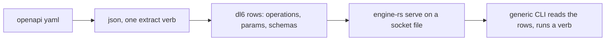
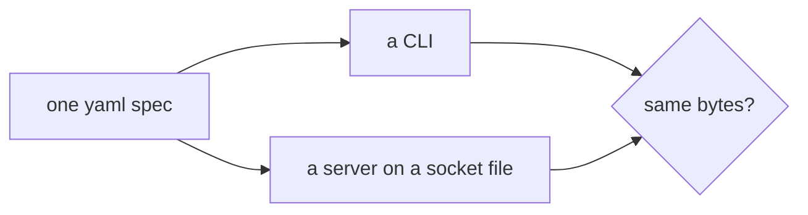
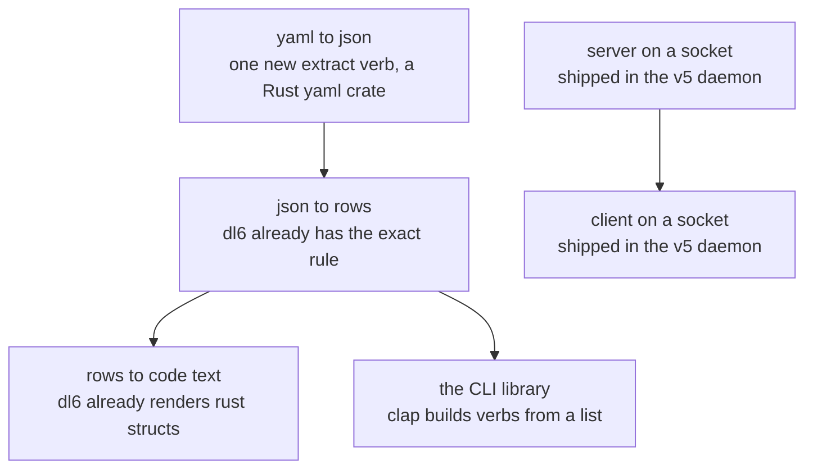
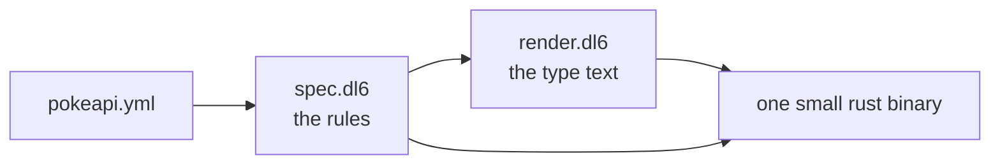
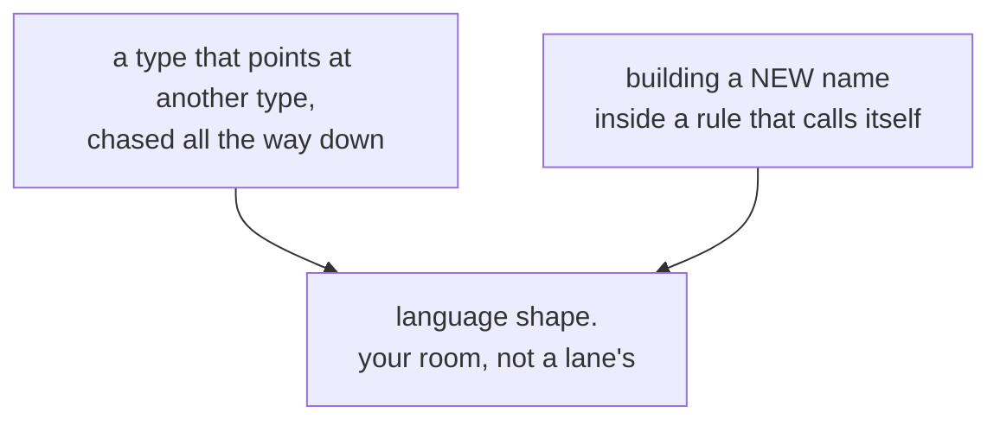

# One spec. One CLI. One socket. (the human page)

## TOC
1. What we want
2. What already works
3. What we would build
4. The two real gaps
5. The calls that are yours

## 0. The decision (2026-08-17)

dl6 is the thing. The engine serves the spec's rows on a socket file. One tiny generic CLI talks to that socket. Nothing gets generated except what dl6 already emits.

First three steps: make every emitted `.types.rs` compile, add the serve seam to engine-rs, prove it with pokeapi over `curl --unix-socket`.

## 1. What we want

One YAML file describes an API. From that one file:

- a CLI whose verbs are the API's operations
- a server listening on a socket FILE, never a port
- the CLI and `curl` printing the same bytes

## 2. What already works

Better news than expected. Almost none of this is new.

The single best find: the dl6 test corpus already carries a rule that reads an
OpenAPI file's paths and methods and turns them into rows. It was written for
this exact shape and it passes today. Someone anticipated this epic.

Second best find: the OpenAPI path spelling `/pokemon/{id}/` and the server
library's path spelling are now the SAME spelling. Nothing to rewrite.

I ran the whole thing on the real Pokemon spec:

| thing | count |
|---|---|
| operations | 100 |
| parameters | 196 |
| response shapes | 98 |
| type definitions | 212 |
| time to compile the dl6 program | 108 milliseconds |

## 3. What we would build

Small. Four files.

The rust binary does two things and neither is clever: it reads the rows and
folds them into a command tree, and it reads the rows and folds them into a
router. Both libraries take a plain list. There is no code generator to write
for the CLI at all.

## 4. The two real gaps

Everything else compiled on the first or second try. These two did not, and I
stopped rather than guess.

Plain version:

- **Nested types.** A Pokemon has a species, a species has a colour, a colour
  has names. Following that chain by rule needs a rule that calls itself. The
  engine can do that, but only while carrying names it already knows. The
  moment the chain wants to MAKE a new name as it goes, it stops.
- **A type as a column.** The existing hand-written Pokemon file already spells
  `generation: generation_summary`. Deriving that same shape BY RULE makes one
  table both a source and a destination, and today the engine quietly hands
  back a duplicated row instead of saying so. That silence is the actual
  defect, and it is bigger than this epic.

Neither blocks the demo. Both block the pretty version.

## 5. The calls that are yours

Nine forks. The four that matter:

| # | question | the trade |
|---|---|---|
| 1 | Should the CLI's verbs be data read at startup, or baked into the binary? | data = edit the spec, restart, done. baked = one self-contained binary, but every spec edit needs a rebuild |
| 2 | Should the verb read `pokemon get 25` or `pokemon-retrieve --id 25`? | the pretty one needs a tie-break rule, because 100 operations share 50 paths |
| 3 | Should the program WRITE its generated file itself, or hand the text to a script? | writing it itself makes the write reviewable and undoable like every other row, and needs a "yes" row from you to fire |
| 4 | Chase nested types one hop, or all the way? | one hop works today. all the way is gap 1 above |

Five smaller ones are in the long doc.

## One more thing

Four claims in the tree are out of date and one of them will cost someone real
work. A lab file says the engine cannot fold many lines into one value and
hand it to one command. It can, and has been able to for a while. I compiled
the proof. Anyone reading that comment would price a working feature as
impossible.
