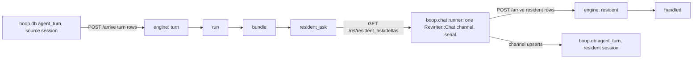

# boop resident coroutine, and hosts as plain arrivals

1. [Decision](#decision)
2. [What exists](#what-exists)
3. [Target program](#target-program)
4. [Runner contract](#runner-contract)
5. [Phases and lanes](#phases-and-lanes)
6. [Cost to the clock model](#cost-to-the-clock-model)

## Decision

Chris, 2026-08-18:

| word | meaning |
|---|---|
| any base rel | insertable from outside at any tick as an ordinary arrival; that is what a "host" is |
| `rel x(in) -> (out).` | result-arrow sugar, generic; says nothing about who writes it |
| `sh x(in) -> (out) = \`cmd {in}\`.` | sanctioned shorthand: the ENGINE runs the shell line, checks the template, serial, claim-once, applicative fold. Shell only. |
| `bind` | goes away; `watch`/`interval` become base rels a runner inserts into |
| in-process runners (`sprefa_extract`, `soopy_mutation`, `boop.chat`) | wired by a runner config outside the syntax (executor -> demand rel, response rel), never by sniffing an `sh` template |

The concatmap loop is one operator:

```
session_turns$.pipe(
  bufferWhile(same role),                       // run
  pairwise(),                                   // bundle (ai_run, user_run)
  concatMap(bundle => resident.send(bundle))    // one resident chat, serial
)
```

The resident (small model) owns a live `seq.d2` and folds each bundle in. Its
replies are its own session's turns in `~/.agent/boop.db`. "Handled" is a query.
No cursor file, no done markers, no coalesce, no out dir.

## What exists

| piece | where | state |
|---|---|---|
| `POST /arrive` (`ArrivalDto{rel, sign, values}`), `GET /rel/{name}`, `/health` on UDS | `v6/sprefa-engine-rs/src/serve.rs:225-246` | on main |
| host executor runs after tick T deltas, its rows are arrivals for T+1 | `hosts.rs:1840` `collect(&TickDeltas) -> Vec<Arrival>` | on main; same shape as an outside push |
| executor sniffing from `sh` template / name | `v6/prolog/compile/registry.pl:333-388`, `hosts.rs:46-49` | to delete |
| `bind` keyword, `bind_definition` | `parse_dl_dcg.pl:812`, `registry.pl:324-329`, `1_host_expand.pl:413`, `source_bind.rs`; 19 fixtures use `bind` | phase 2 |
| clock checker knows nothing host-specific | `3_clock_check.pl` (zero demand/response refs); level plane freezes after arrivals `:377` | no change needed |
| `group_concat/1,2,3` | `registry.pl:174-178` | on main |
| resident chat channel `Rewriter::Chat` | hafley-rs `crates/boop/src/concatmap.rs:156-215` | on main, reachable only from the Rust loop |
| `sh boop_oneshot` + `BoopExecutor` + `boop host oneshot` | sprefa `27b15b2`, hafley-rs `6b6315f`, unmerged | superseded; JSON-on-stdin shape reusable |

## Target program

```dl6
# resident-coroutine.dl6

rel turn(session: text, turn: int, ts: int, role: text, said: text).   # boop inserts source-session turns

rel run_start(session: text, turn: int, role: text).
run_start(Session, Turn, Role) <-
  turn(Session, Turn, _, Role, _), not(prev_same_role(Session, Turn)).
rel prev_same_role(session: text, turn: int).
prev_same_role(Session, Turn) <-
  turn(Session, Turn, _, Role, _), turn(Session, Prev, _, Role, _), Prev == Turn - 1.

rel run_member(session: text, run_turn: int, turn: int).
run_member(Session, RunTurn, Turn) <-
  run_start(Session, RunTurn, _), turn(Session, Turn, _, _, _),
  RunTurn <= Turn, not(later_start_between(Session, RunTurn, Turn)).
rel later_start_between(session: text, run_turn: int, turn: int).
later_start_between(Session, RunTurn, Turn) <-
  run_start(Session, Later, _), RunTurn < Later, Later <= Turn.

rel run(session: text, run_turn: int, role: text, text: text).
run(Session, RunTurn, Role, Text) <-
  run_start(Session, RunTurn, Role), run_member(Session, RunTurn, Turn),
  turn(Session, Turn, _, _, Said), Text := group_concat(Said, '\n').

rel bundle(session: text, ai_run: int, user_run: int, ai_text: text, user_text: text).
bundle(Session, AiRun, UserRun, AiText, UserText) <-
  run(Session, AiRun, 'assistant', AiText), run(Session, UserRun, 'user', UserText),
  AiRun < UserRun, not(run_between(Session, AiRun, UserRun)).
rel run_between(session: text, ai_run: int, user_run: int).
run_between(Session, AiRun, UserRun) <-
  run_start(Session, Mid, _), AiRun < Mid, Mid < UserRun.

# demand: derived. The runner reads its deltas.
rel resident_ask(session: text, user_run: int, prompt: text).
resident_ask(Session, UserRun, Prompt) <-
  bundle(Session, _, UserRun, AiText, UserText),
  Prompt := concat(['<ai>\n', AiText, '\n</ai>\n<user>\n', UserText, '\n</user>']).

# response: base rel, no rules. boop.chat inserts rows. `->` is only sugar.
rel resident(session: text, user_run: int) -> (reply_turn: int, reply: text).

rel handled(session: text, user_run: int).
handled(Session, UserRun) <- resident(Session, UserRun, _, _).
```

## Runner contract



| rule | who enforces | test |
|---|---|---|
| one reply per demand, in `user_run` order | runner (`concatMap`, sort by `user_run` inside a delta batch) | COUNT: N asks -> N resident rows, order pinned |
| a demand is answered once, across restarts | runner: skip asks whose `resident` row already exists (`GET /rel/resident`) | restart golden |
| response lands at tick T+1 or later | engine (arrivals) | same as `hosts.rs:1840` today |
| runner name spelling | runner config, outside the language | none |

## Phases and lanes

| phase | lane | owns | delivers |
|---|---|---|---|
| 1a DONE sprefa #369 `33994b67b` | sprefa `feature/rel-deltas-route` (terra) | `v6/sprefa-engine-rs/src/serve.rs`, `tests/serve_uds.rs`, `v6/dl/fixtures/resident-coroutine.dl6`, `v6/prolog/conformance/fixtures/<n>_resident_coroutine.pl`, `v6/prolog/3_clock_check.pl` (one `clock_boundary(externally_fed(Rel))` row), `compile/out/**` | `GET /rel/{name}/deltas?since=<tick>` (long-poll, JSON `{tick, add:[..], del:[..]}`); fixture compiles rc=0 and its Rust golden runs with test-side arrivals into `turn` and `resident`; boundary row named, never refused |
| 1b DONE hafley-rs #26 | hafley-rs `feature/boop-chat-runner` (terra) | `crates/boop/src/runner.rs` (new), `crates/boop/src/concatmap.rs` (delete cursor/done/coalesce/out; keep `Rewriter::Chat` seam), `crates/boop/src/main.rs` (`boop run <program.dl6> --session <src> --resident-model <m>`) | runner: compiles+serves the program over UDS (shell out to the engine binary; no engine crate link yet), pushes source-session turns, follows `resident_ask` deltas, one chat channel, serial, posts `resident` rows; `boop concatmap` prints a pointer to `boop run` |
| 2 | sprefa `feature/no-sniff-no-bind` (opus, after 1a) | `registry.pl:324-400`, `parse_dl_dcg.pl:812-841`, `1_host_expand.pl`, `hosts.rs:46-49`, `source_bind.rs`, 19 `bind` fixtures + `extract`/`source_stage` fixtures, `manifest.json` regen | executor sniffing gone (`sh` = shell only), runner config file for in-process executors, `bind` deleted |

Order: 1a and 1b in parallel (disjoint repos); 1b integrates against 1a's route once merged. Phase 2 after 1a.

## Cost to the clock model

None. A response rel is a base rel; arrivals from a socket at tick T+1 are what
`hosts.rs:1840` already produces. The checker gains one stated boundary row for
a base rel that rules read but nothing in-program writes; the runner contract
(serial, one reply, no drop) is a runner test, not a language check. `sh` keeps
engine-side checking for shell.
