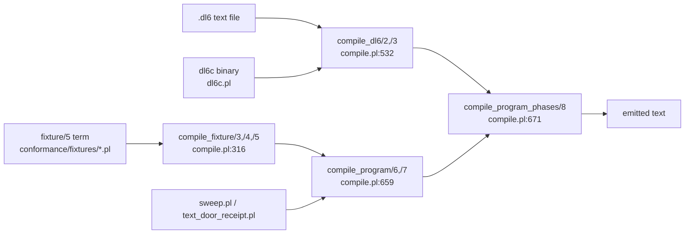
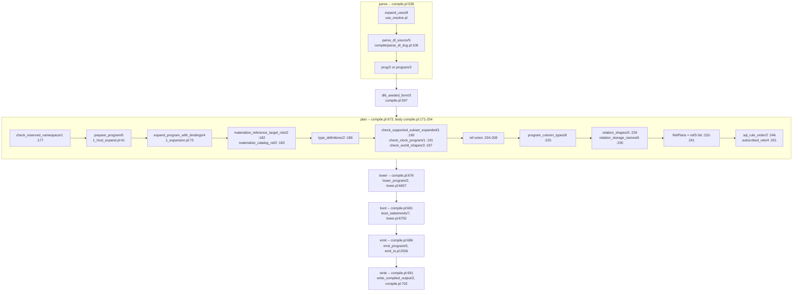
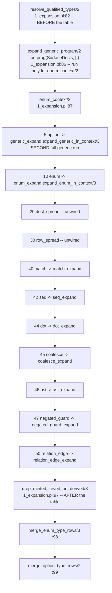

# v6 prolog compiler: internals dataflow

One compile traced end to end, every phase's term shapes named by functor and
arity, every piece of global mutable state listed by key, and the full IR
inventory between `.dl6` text and emitted text.

## TOC

1. [Rig](#rig)
2. [Doors: the five entry points](#doors-the-five-entry-points)
3. [The phase spine](#the-phase-spine)
4. [Phase timings, one real program per size class](#phase-timings-one-real-program-per-size-class)
5. [Phase 1: parse](#phase-1-parse)
6. [Phase 2: plan](#phase-2-plan)
7. [Phase 3: lower](#phase-3-lower)
8. [Phase 4: boot](#phase-4-boot)
9. [Phase 5: emit](#phase-5-emit)
10. [Phase 6: write](#phase-6-write)
11. [IR inventory](#ir-inventory)
12. [The expansion pipeline, order and enforcement](#the-expansion-pipeline-order-and-enforcement)
13. [Global mutable state register](#global-mutable-state-register)
14. [IR sizes for six real programs](#ir-sizes-for-six-real-programs)
15. [Hot predicates in one compile](#hot-predicates-in-one-compile)

## Rig

| item | value | command |
| --- | --- | --- |
| worktree | `sprefa-worktrees/prolog-compiler-anatomy` | |
| HEAD | `4e2c21a82c41df12dd478dfbb89994425e75b99d` | `git log -1` |
| branch | `lab/prolog-compiler-anatomy` | `git rev-parse --abbrev-ref HEAD` |
| swipl | 10.0.2 arm64-darwin | `swipl --version` |
| machine | Apple M2 Pro, macOS 14.6.1 | `sysctl -n machdep.cpu.brand_string` |
| traced program | `v6/dl/fixtures/self-map.dl6`, 707 lines | `wc -l` |
| trace command | `swipl -q -l v6/prolog/compile.pl -g "compile_dl6('<f>','<out>')" -g halt` | writes `COMPILE-TRACE` on stderr, `compile.pl:826` |

Source size, `wc -l` in `v6/prolog`:

| file | lines | file | lines |
| --- | --- | --- | --- |
| `lower.pl` | 6800 | `0_dot_expand.pl` | 773 |
| `emit_ts.pl` | 2700 | `1_host_expand.pl` | 621 |
| `0_generic_expand.pl` | 2080 | `emit_rust.pl` | 619 |
| `analyze.pl` | 1843 | `compile/registry.pl` | 600 |
| `compile/parse_dl_dcg.pl` | 1424 | `3_clock_check.pl` | 579 |
| `0_type_plane.pl` | 1022 | `compile/4_emit_jsonschema.pl` | 488 |
| `0_program_check.pl` | 964 | 30 more root `.pl` | 4189 |
| `compile.pl` | 846 | 8 more `compile/*.pl` | 1130 |
| `compile/8_emit_rust_types.pl` | 769 | | |
| `compile/6_isolated_compiler_dd.pl` | 752 | **root total** | **25989** |
| `print_dl.pl` | 831 | **compile/ total** | **5351** |

## Doors: the five entry points



`compile_dl6/3` runs `parse` itself (`compile.pl:538`), then delegates the
remaining five phases to `compile_program_phases/8`. The term door skips
`parse` entirely and substitutes a zero measurement (`compile.pl:667`).

## The phase spine



The `boot` phase reads `LevelStatements` out of the `lowered/8` term
(`compile.pl:680`), so it is downstream of `lower` by data, not only by
sequence.

## Phase timings, one real program per size class

Three back-to-back runs each. `wall_ms/inferences` per phase from
`COMPILE-TRACE`. Inference counts are byte-stable across runs; wall time is not.

| program | lines | parse | plan | lower | boot | emit | write | total wall |
| --- | --- | --- | --- | --- | --- | --- | --- | --- |
| `crawl_org.dl6` | 127 | | | | | | | not traced |
| `devlog.dl6` | 202 | 110-113 / 415,188 | 22 / 340,645 | 24-25 / 168,192 | 0 / 1,960 | 49-50 / 510,999 | 3-4 / 754 | 211 ms |
| `flagship-flow.dl6` | 181 | 129-145 / 496,618 | 53-55 / 820,794 | 55-58 / 472,824 | 0-1 / 3,423 | 98 / 997,016 | 5 / 938 | 344-357 ms |
| `v5-parity.dl6` | 383 | 245-269 / 599,840 | 47-50 / 736,110 | 58-64 / 525,732 | 1 / 3,775 | 92-96 / 931,548 | 5-7 / 1,283 | 449-482 ms |
| `pokeapi_shape.dl6` | 216 | 240-251 / 1,184,629 | 285 / 3,778,462 | 65-66 / 304,549 | 1 / 11,045 | 290-293 / 3,162,205 | 12-16 / 271 | 896-912 ms |
| `self-map.dl6` | 707 | 1070-1124 / 1,444,218 | 227-244 / 3,631,237 | 170-176 / 1,868,701 | 1 / 9,430 | 274-294 / 2,842,538 | 10-15 / 3,031 | 1752-1854 ms |

Shape of the bill: `parse` is the single largest phase on the largest program
(1,070 ms of 1,752 ms, 61%). `emit` and `plan` are next. `lower`, the 6,800-line
file, is 10% of self-map's wall clock. `boot` is 1 ms everywhere.

Predecessor measurement for scale: `v6/labs/shared_frontier/REPORT.md` F10
recorded `pokeapi` compiling in 526.4 s with 517.9 s in `plan`, at worktree
HEAD `b7fbbf6c9`. Commit `4e2c21a82` (this HEAD) is the fix; `pokeapi_shape`
now spends 285 ms in `plan`.

## Phase 1: parse

| item | value |
| --- | --- |
| entry | `compile.pl:538`, `run_compile_phase(parse, expand_uses(...))` |
| implementation | `use_resolve.pl:120` `collect_all/8`, `compile/parse_dl_dcg.pl:106` `parse_dl_source/5` |
| input | file path (atom) plus include roots |
| output | `prog(Decls, Rules)` **or** `program(Decls, Rules, Queries)` (`parse_dl_dcg.pl:124-128`), plus `Bindings` as a `Name=Var` list and `Findings` as a list |
| shape choice | `prog/2` when there are no queries, no `sh_decl/4` and no `bind_decl/2`; `program/3` otherwise (`parse_dl_dcg.pl:124`) |
| global reads/writes | `nb_setval` on `parse_input_length`, `parse_furthest_remaining`, `parse_line_starts`, `parse_line_count`; `b_setval` on `dl_vars`; `assertz`/`retractall` on `finding_fact/1`, `rel_column_order_fact/2`, `host_signature_fact/3`, `source_statement_fact/3`; `assertz`/`retract` on `parse_count_fact/2` (`use_resolve.pl:360-367`) |
| reset point | `parse_dl_source/5` retracts all four fact tables at `parse_dl_dcg.pl:107-109`, once per FILE |
| entry parses last | `use_resolve.pl:119` states it: children first, entry last, so the surviving `source_statement_fact/3` rows are the entry file's only |

Every `Decls` element the parser can emit, measured on `pokeapi_shape.dl6`
(1,246 surface decls):

```
col_type/3=786  rel_module_decl/2=212  semantic_decl_module/3=212
type_decl/2=33  entry_module_decl/1=1  module_decl/2=1  module_storage_decl/2=1
```

## Phase 2: plan

`program_plan/3`, `compile.pl:171-254`. Input `fixture(Name, SugaredProg,
Initial, Schedule, Expectations)-Bindings` plus an option list; output
`plan/9`.

| step | line | calls | in | out |
| --- | --- | --- | --- | --- |
| clear the body-use table | `compile.pl:174` | `analyze:reset_body_use_cache/0` | | abolishes the `body_ref_uses/2` answer table |
| reserved-namespace check | `:177` | `check_reserved_namespace/1` | `prog/2` | throws `unsupported_construct(reserved_rel_namespace/1)` |
| host pre-pass | `:178` | `host_expand:prepare_program/5` | `prog/2` or `program/3` | `prog(Decls, Rules)`; `HostPlans`, `BindPlans`, `QueryPlans` are **discarded** (`compile.pl:130`) |
| sugar expansion | `:181` | `expansion:expand_program_with_bindings/4` | `prog/2` | `prog/2` |
| materialize ref targets | `:182` | `materialize_reference_target_rels/2` | `prog/2` | `prog/2` with extra `col_type/3` |
| materialize catalog | `:183` | `materialize_catalog_rel/2` | `prog/2` | `prog/2` with catalog `col_type/3` |
| type table | `:186` | `type_plane:type_definitions/2` | `Decls` | `Types` = list of `type_def(Name, Columns, ColumnTypes)` |
| subset check | `:190` | `analyze:check_supported_subset_expanded/1` | `prog/2` | throws or succeeds; 38 named classes (`0_program_check.pl` `program_violation/3` clause count) |
| clock check | `:191` | `clock_check:check_clock_program/1` | `prog/2` | throws or succeeds |
| world-row shape | `:197` | `check_world_shapes/3` | `prog/2`, `Initial`, `Schedule` | throws or succeeds |
| ref union | `:204-207` | `program_refs/2`, `declared_refs/2`, `seeded_refs/2` | `Rules`, `Decls`, `Initial` | `AllRefs`, a sorted `Name/Arity` list |
| arity collision | `:208` | `check_single_arity_per_name/1` | `AllRefs` | throws `rel_arity_collision/3` |
| arrival targets | `:209-214` | `derived_refs/2` + `subtract/3` | `AllRefs`, `DerivedRefs` | `ArrivalTargets` |
| per-ref columns | `:222-224` | `analyze:rel_columns/5` | `Decls`, `Rules`, `Bindings` | `RefColumns`, `Ref-Columns` pairs |
| typing fixpoint | `:225` | `analyze:program_column_types/8` | `Decls, Types, Rules, Initial, Schedule, AllRefs, RefColumns` | `RefTypes`, `Ref-ColumnTypes` pairs |
| storage shapes | `:229` | `relation_shapes/5` | `RefColumns`, `RefTypes` | `Shapes`, `Ref-shape(Kind, [column(Name,Type)], KeyOrNone)` |
| physical names | `:230` | `relation_storage_names/6` | `Shapes`, `Decls` | `StorageNames`, `Ref-Atom`; digest from `short_hash/2` truncated to 12 chars (`compile.pl:400`) |
| rel records | `:232-241` | `rel_record:rel_cols/4` | all of the above | `RelPlans`, a `rel(Ref, StorageName, Kind, Cols, KeyOrNone)` list |
| edge head types | `:245` | `analyze:check_edge_head_column_types/2` | `RelPlans`, `Rules` | throws or succeeds |
| rule order | `:246` | `strat:sql_rule_order/2` | `Rules` | `RuleOrder`, level rules in stratum order |
| edge rules | `:247` | `include(rule_is_edge)` | `Rules` | `EdgeRules` in program order |
| queries | `:250` | `findall(query(Q), member(_, Decls))` | `Decls` | `Queries`, re-extracted from `Decls` after `prepare_program/5` folded them in at `1_host_expand.pl:61` |
| subscribe cone | `:251` | `2_subscribe:subscribed_rels/4` | `Decls, Rules, Queries` | `SubscribedRels`, sorted `Name/Arity` |
| intern mode | `:252` | `lower:intern_mode/2` | options | atom, default `dict` (`compile.pl:165`) |

Global state in this phase: `reset_body_use_cache/0` at `:174` is the only
write. `analyze:body_ref_uses/2` is `:- table`d (`analyze.pl:109`), so every
later caller in any phase reads that process-global answer table.

## Phase 3: lower

| item | value |
| --- | --- |
| entry | `lower.pl:6657` `lower_program/2`, one clause |
| body | `lower.pl:6661-6740` `lower_program_in_context/2`, ONE clause, ~30 sequential goals |
| input | `plan/9` |
| output | `lowered(Name, Ddl, ArrivalStatements, EdgeStatements, LevelStatements, DeltaStatements, RelPlans, ArrivalTargets)` |
| global write | `assertz(physical_storage_name/2)` per RelPlan, installed by `with_storage_context/2` at `lower.pl:200-208`, retracted on exit; declared `:- thread_local` at `lower.pl:197` |
| reason for the global | `lower.pl:192-196`: SQL helpers take semantic `Ref` values far below the `RelPlans` argument that owns the map |

Output element shapes, as the code constructs them (**not** as the module
header at `lower.pl:1-23` documents them; see the critique):

| slot | element functor/arity | header claims | built at |
| --- | --- | --- | --- |
| `Ddl` | plain SQL strings | strings | `lower.pl:6740` |
| `ArrivalStatements` | `arrivalstmt/6` | `arrivalstmt/6` | `lower.pl:6677` |
| `EdgeStatements` | `edgestmt/9` | `edgestmt/7` | `lower.pl:6684-6686` |
| `LevelStatements` | `levelstmt/7` and `retentionstmt/3` | `levelstmt/5` | `lower.pl:6704-6706` |
| `DeltaStatements` | `deltastmt/5` | `deltastmt/4` | `lower.pl:6735` |

## Phase 4: boot

| item | value |
| --- | --- |
| entry | `lower.pl:6755` `boot_statements/7` |
| input | `Mode, Decls, Types, RelPlans, Initial, LevelStatements` |
| output | list of `bootstmt(Rel, Sql, Params)` |
| internal shape | `bootstmt(Sql, Params)` (arity 2) is what the seed builders produce (`lower.pl:6577`, `:6603`, `:6653`); `tag_boot_statements/3` at `lower.pl:6779-6781` rewrites each to arity 3 by prepending the rel name |
| global write | `with_storage_context/2` again, a SECOND full `assertz` of the storage map for the same program (`lower.pl:6755`) |
| why it is separate from lower | `Initial` is not carried by `plan/9`; `compile.pl:683` supplies it as the phase argument |

## Phase 5: emit

| item | value |
| --- | --- |
| entry | `compile.pl:686-690`, `call(Emitter, Name, Plan, Lowered, BootStatements, Text)` |
| default emitter | `emit_ts:emit_program/5`, `emit_ts.pl:2556` (`compile.pl:569`) |
| alternative emitters | `emit_rust:emit_program/5` (`emit_rust.pl:519`); `emit_type_artifact:emit_ts_types/5`, `emit_rust_types/5`, `emit_jsonschema/5` (`compile/9_emit_type_artifact.pl:22,26,30`); `isolated_compiler_dd:compile_program/5` |
| out-of-band input | `dd_compile_context(Initial, Schedule)`, `:- thread_local` at `compile.pl:34`, asserted by `with_emit_context/3` at `compile.pl:713` and retracted after the call |
| output | `Text`, a code list |

`emit_ts:emit_program/5` re-destructures its `Plan` argument at
`emit_ts.pl:2563`, `:2575`, `:2593` and `:2655`, each time binding a different
subset of the nine positions.

## Phase 6: write

`compile.pl:702-707`. Opens the output file, `format(Stream, "~s", [Text])`,
prints `wrote <path>` on stdout. Under 20 ms on every program measured.

## IR inventory

Every representation between `.dl6` text and emitted text.

| IR | functor / arity | produced by | consumed by | invariants checked |
| --- | --- | --- | --- | --- |
| source codes | code list | `use_resolve:strip_entry/4` | `parse_dl_dcg:parse_dl_source/5` | none |
| CST node | `cst_shape/2` table rows, `parse_dl_dcg.pl:38-63` | parser | `0_cst_query.pl`, `print_dl.pl`, `0_ast_expand.pl` | none |
| surface program | `prog/2` or `program/3` | `parse_dl_dcg.pl:124-128` | `1_host_expand:program_parts/4` (`1_host_expand.pl:66-67`) | none; the two shapes are distinguished by clause order |
| declaration list | flat list of ground terms, 10 functors observed | parser + every expander | 246 `member/memberchk` sites across 23 files | none |
| host program | `prog/2` | `1_host_expand:prepare_program/5` | `1_expansion:expand_program_with_bindings/4` | duplicate host names (`1_host_expand.pl:48`) |
| host plan | `host_plan/N` via `host_plan_contract/2` | `1_host_expand.pl:181` | `emit_ts.pl:485`, `emit_rust.pl:563` | column shape (`validate_columns/2`) |
| enum context | `enum_context/2` output | `0_enum_expand.pl` | `1_expansion.pl:94` fold, `0_match_expand.pl` | none |
| expanded program | `prog/2` | `1_expansion:expand_program_run/4` | `compile.pl:182` | 38 classes at `compile.pl:190` |
| type table | `type_def(Name, Columns, ColumnTypes)` | `0_type_plane.pl:67` | 20 call sites | `type_cycle` (`0_program_check.pl`) |
| semantic type rows | `semantic_type_rows([row/11, ...])`, ONE decl in `Decls` | `0_enum_expand.pl:96-116`, `0_anonymous_expand.pl:307-309` | `0_enum_expand.pl:156`, `0_anonymous_expand.pl:291` | none |
| column storage kind | `int`/`text`/`bool`/`float`/`json`/`bytes`/`json_list(T)`/`list(T)`/`ref(N)`/`idref(N)` | `0_type_plane:column_storage/3` | `lower:column_def/4`, `ir_column_storage/5` | throws `column_type_unknown/1` at `0_type_plane.pl:151` |
| ref set | sorted `Name/Arity` list | `compile.pl:207` | `compile.pl:214`, `:223`, `:233` | one arity per name (`compile.pl:208`) |
| column types | `Ref-[Type, ...]` pairs | `analyze:program_column_types/8` | `compile.pl:229`, `:237` | `join_column_type_mismatch` (`lower.pl:347`), `comparison_type_mismatch` (`lower.pl:2319`) |
| relation shape | `shape(Kind, [column(Name, Type)], KeyOrNone)` | `compile.pl:433` | `compile.pl:230` storage digest only | none |
| storage name map | `Ref-Atom` pairs | `compile.pl:355` | `compile.pl:234`, `lower.pl:200` | ASCII-fold uniqueness (`compile.pl:514`) |
| rel record | `rel(Ref, StorageName, Kind, Cols, KeyOrNone)` | `compile.pl:232` | `0_rel_record.pl` accessors, 51 `relplan_parts/6` sites | none |
| **compile plan** | `plan(Name, Prog, Types, RelPlans, ArrivalTargets, RuleOrder, EdgeRules, SubscribedRels, InternMode)` | `compile.pl:253` | 29 positional destructure sites in 12 files | none |
| storage context | `physical_storage_name/2` thread-local facts | `lower.pl:210` | `lower:table_name/2` `lower.pl:213` | none |
| **lowered module** | `lowered(Name, Ddl, ArrivalStatements, EdgeStatements, LevelStatements, DeltaStatements, RelPlans, ArrivalTargets)` | `lower.pl:6662` | 10 sites | none |
| arrival statement | `arrivalstmt/6` | `lower.pl:6677` | `emit_ts.pl` x4, `emit_rust.pl` x4 | none |
| edge statement | `edgestmt/9` | `lower.pl:6685` | `emit_ts.pl:1301,1321,1669,1670` | none |
| level statement | `levelstmt/7` | `lower.pl:6704` | `emit_ts.pl:1350,1353,2045,2048` | none |
| retention statement | `retentionstmt/3` | `lower.pl:6705` | `emit_ts.pl:1411,2700`, `emit_rust.pl:306,619` | none |
| delta statement | `deltastmt/5` | `lower.pl:6735` | `emit_ts.pl:351,1091,1119,1164` | none |
| fixpoint IR | `rel_or_retracted/1`, `ir_source_ref/2`, `ir_seed_source/6`, `ir_literal/2` (`lower.pl:5086` section) | `lower.pl:5086-5606` | `emit_ts.pl:1584` | none |
| boot statement | `bootstmt/2` then `bootstmt/3` | `lower.pl:6577` then `lower.pl:6780` | `emit_ts.pl:1049`, `emit_rust.pl:105` | none |
| typegen row | `row/11` | `lower:catalog_type_rows/6` | `compile/4_emit_jsonschema.pl` (34), `compile/8_emit_rust_types.pl` (29), `compile/7_emit_ts_types.pl` (22), `compile/typegen_export.pl` (9) | none |
| type relation | `type_relation(OwnerId, SelfMemberId, InputMemberIds, ReturnMemberId, KeyMemberIds)` | `0_generic_expand:type_relation_rows/2` | `compile/8_emit_rust_types.pl:178` | `rust_validate_self/4` |
| emitted text | code list | emitter | `write_compiled_output/2` | none |

Two IRs have accessor layers rather than positional matching: `rel/5` (five raw
sites, `0_rel_record.pl` supplies 16 accessors) and `measurement/12` (one raw
site, `compile.pl:840` reader). Every other IR is matched positionally at every
use.

## The expansion pipeline, order and enforcement

`1_expansion.pl:31-65` declares nine ordered phases in an `expansion_phase/3`
fact table. Two rewrites run OUTSIDE that table.



What each phase rewrites, and where the order constraint lives:

| # | phase | module | rewrites | order constraint stated |
| --- | --- | --- | --- | --- |
| pre | qualified types | `0_dot_expand:resolve_qualified_types/2` | dotted type paths to flat names | `1_expansion.pl:80-81` comment: before phase 5 because `list(orchard.tree)` mints its artifact name from the element |
| pre | enum context seed | `0_generic_expand:expand_generic_program/2` | nothing kept; discards the rules half | `1_expansion.pl:85` comment |
| 5 | option | `0_generic_expand` | schema templates, anonymous products/sums, option decls, key wrappers, compiler relations. 14 sub-steps at `0_generic_expand.pl:52-67` | file header: "closes schema templates before enum expansion" |
| 10 | enum | `0_enum_expand` | `enum_decl/2` to variant rels plus a tag rel | none in the table |
| 20 | decl_spread | none | `unwired` (`1_expansion.pl:33`) | |
| 30 | row_spread | none | `unwired` (`1_expansion.pl:34`) | |
| 40 | match | `0_match_expand` | `match/2` to one rule per arm | none |
| 42 | seq | `0_seq_expand` | `seq/1` to four rules plus a cursor rel | none |
| 44 | dot | `0_dot_expand` | `dot_get/2` chains to brace patterns | `1_expansion.pl:37-43`: after match, before coalesce |
| 45 | coalesce | `0_coalesce_expand` | one rule to two clauses | `1_expansion.pl:45-55`: after match, before relation_edge |
| 46 | ast | `0_ast_expand` | `ast/N` to CST queries | none |
| 47 | negated_guard | `0_negated_guard_expand` | `not(X > 1)` to `X =< 1` | `1_expansion.pl:58-61`: after coalesce, before relation_edge |
| 50 | relation_edge | `0_relation_edge_expand` | relation-shaped head values to membership atoms | consumer of 45 and 47 |
| post | minted key drop | `0_enum_expand:drop_minted_keyed_on_derived/3` | drops minted keyed rels whose target became derived | none |
| post | enum rows | `0_enum_expand:merge_enum_type_rows/3` | appends `semantic_type_rows/1` | none |
| post | option rows | `0_enum_expand:merge_option_type_rows/2` | appends `semantic_type_rows/1` | none |

Ordering enforcement: the integer key in `expansion_phase/3` is the only
mechanism. `msort/2` at `1_expansion.pl:91` sorts the facts; nothing asserts a
dependency, nothing fails if a phase is moved. Three of the nine phases carry
a prose constraint in a comment; six carry none. The five rewrites that run
outside the table (two pre, three post) are hard-wired into
`expand_program_run/4` and are invisible to `expansion_phase/3`.

Files named `0_*.pl` that are NOT expansion phases: `0_type_plane.pl`,
`0_program_check.pl`, `0_rel_record.pl`, `0_body_walk.pl`, `0_graph.pl`,
`0_cst_query.pl`, `0_type_ids.pl`, `0_compiler_relations.pl`,
`0_unsupported_messages.pl`, `0_option_expand.pl`, `0_anonymous_expand.pl`,
`0_relation_pattern.pl`. The last three ARE rewrites but run nested inside
`0_generic_expand.pl` (`0_option_expand:expand_option_decls/2` at
`0_generic_expand.pl:65`, `0_anonymous_expand` at `:57`) or belong to the
oracle only (`0_relation_pattern.pl`, imported by
`conformance/engine.pl:79` and by nothing in the compiler).

## Global mutable state register

Every key, every dynamic predicate, every table in the compiler proper. Test
harnesses, `ARCH.pl`, `sweep.pl` and `tools/` excluded.

| kind | name | file:line | written by | read by | reset |
| --- | --- | --- | --- | --- | --- |
| `nb_setval` | `parse_input_length` | `parse_dl_dcg.pl:111` | `parse_dl_source/5` | `remaining_line_column/3` `:145` | per file parse |
| `nb_setval` | `parse_furthest_remaining` | `parse_dl_dcg.pl:112,141` | `parse_dl_source/5`, `mark/1` | `parse_failure/1` `:132` | per file parse |
| `nb_setval` | `parse_line_starts` | `parse_dl_dcg.pl:169` | `build_line_starts/1` | `:147` | per file parse |
| `nb_setval` | `parse_line_count` | `parse_dl_dcg.pl:170` | `build_line_starts/1` | `:148` | per file parse |
| `b_setval` | `dl_vars` | `parse_dl_dcg.pl:114,423` | `parse_dl_source/5`, var collector | `:120`, `:462`, `:1051` | per file parse, backtrackable |
| `nb_setval` | `jsonschema_row_indexes` | `compile/4_emit_jsonschema.pl:43` | jsonschema emitter | same file | per emit |
| `nb_setval` | `diag_stream` | `diag.pl:60` | `emit_diag_file/2` | `diag.pl` | per diag write |
| `nb_setval` | `diag_blame` | `diag.pl:146` | `emit_diag_file/2` | `diag.pl` | per diag write |
| `dynamic` | `finding_fact/1` | `parse_dl_dcg.pl:30` | `unsupported/1` `:83` | `:123` | `:107` per file |
| `dynamic` | `rel_column_order_fact/2` | `parse_dl_dcg.pl:30` | `:85-86` | `lookup_column_order/2` `:87` | `:107` per file |
| `dynamic` | `host_signature_fact/3` | `parse_dl_dcg.pl:31` | `:89-90` | same file | `:107` per file |
| `dynamic` | `source_statement_fact/3` | `parse_dl_dcg.pl:31` | `:223` | `parse_dl_line_for_reason/2` `:197,200` | `:107` per file, so only the ENTRY file's rows survive |
| `dynamic` | `parse_count_fact/2` | `use_resolve.pl:25` | `:364` | `parse_count/2` | `reset_parse_counts/0` `:367` |
| `thread_local` | `physical_storage_name/2` | `lower.pl:197` | `with_storage_context/2` `:210` | `table_name/2` `:213` | setup_call_cleanup, `:206-208` |
| `thread_local` | `dd_compile_context/2` | `compile.pl:34` | `with_emit_context/3` `:714` | `isolated_compiler_dd:compile_program/5` | `retractall` `:715` |
| `table` | `body_ref_uses/2` | `analyze.pl:109` | SWI tabling | `strat.pl`, `analyze.pl`, `2_subscribe.pl` | `reset_body_use_cache/0` `:111`, called ONLY from `compile.pl:174` |
| `dynamic` | `unsupported_inventory_memo/1` | `0_unsupported_messages.pl:137` | `:143` | `:139` | `:148` |
| `dynamic` | `compile_dir_fact/1` | `compile/1_emit_registry_docs.pl:21` | file-locating boilerplate | same file | never |
| `dynamic` | `compile_dir/1` | `compile/2_emit_cli_inventory.pl:14`, `compile/3_emit_trace_schema.pl:14` | as above | same file | never |
| `dynamic` | `oracle_dump_dir_fact/1` | `compile/oracle_dump.pl:12` | as above | same file | never |
| `dynamic` | `dl6c_build_sha/1` | `dl6c.pl:32` | build stamp | `dl6c.pl` | never |

Assert/retract call sites per file, `grep -c`:

```
ARCH.pl 19   lower.pl 17   emit_ts.pl 9   compile/parse_dl_dcg.pl 7
use_resolve.pl 4   compile.pl 3   0_unsupported_messages.pl 2   emit_rust.pl 1
analyze.pl 1   0_type_plane.pl 1
```

`emit_ts.pl`'s nine hits are all the substring `retract` inside SQL and
message strings, not calls. `lower.pl`'s 17 are the same except for
`:210-211`, the two real ones.

## IR sizes for six real programs

Each row from one `program_plan/3` plus `lower_program/2` run.

| program | surface decls | surface rules | queries | plan decls | plan rules | types | relplans | arrival targets | rule order | edge rules | subscribed | ddl stmts | arrivalstmt | edgestmt | levelstmt | deltastmt |
| --- | --- | --- | --- | --- | --- | --- | --- | --- | --- | --- | --- | --- | --- | --- | --- | --- |
| `crawl_org` | 28 | 4 | 0 | 74 | 7 | 0 | 14 | 7 | 7 | 0 | 0 | 147 | 7 | 0 | 7 | 14 |
| `devlog` | 98 | 27 | 0 | 125 | 29 | 0 | 20 | 3 | 29 | 0 | 0 | 231 | 3 | 0 | 17 | 20 |
| `flagship-flow` | 147 | 27 | 4 | 269 | 36 | 1 | 43 | 11 | 36 | 0 | 42 | 489 | 11 | 0 | 32 | 43 |
| `v5-parity` | 155 | 51 | 2 | 204 | 69 | 0 | 46 | 5 | 69 | 0 | 26 | 531 | 5 | 0 | 41 | 46 |
| `self-map` | 403 | 211 | 4 | 501 | 220 | 0 | 117 | 8 | 220 | 0 | 117 | 1294 | 8 | 0 | 109 | 117 |
| `pokeapi_shape` | 1246 | 0 | 0 | 1434 | 8 | 33 | 224 | 220 | 8 | 0 | 0 | 1903 | 220 | 0 | 4 | 224 |

`edgestmt` is 0 on all six. The 6,800-line `lower.pl` carries a 312-line edge-rule
section (`lower.pl:3729-4040`) that no `.dl6` in `v6/dl/fixtures` reaches; the
edge path is exercised by the `conformance/fixtures/*.pl` term door only.

## Hot predicates in one compile

`library(prolog_profile)` over `compile_dl6('v6/dl/fixtures/self-map.dl6', ...)`,
call counts, top 20 by calls:

| calls | predicate |
| --- | --- |
| 409,572 | `rel_record:relplan_parts/6` |
| 190,331 | `system:functor/3` |
| 170,432 | `system:char_type/2` |
| 132,176 | `system:memberchk/2` |
| 130,290 | `lists:member/2` |
| 128,326 | `body:rel_ref/2` |
| 128,229 | `lists:member_/3` (543,185 redos, 659,193 exits) |
| 117,366 | `rel_record:rel_cols/4` |
| 108,391 | `system:code_type/2` |
| 94,585 | `error:has_type/2` |
| 90,872 | `analyze:body_ref_uses/2` (tabled) |
| 88,660 | `analyze:rule_body/2` |
| 86,680 | `analyze:rule_head/2` |
| 85,216 | `system:between/3` |
| 80,513 | `lists:append/3` |
| 73,616 | `system:atom_codes/2` |
| 58,686 | `system:format/3` |
| 54,222 | `parse_dl_dcg:@/3` |
| 44,576 | `registry:surface/5` |
| 40,711 | `analyze:rule_head_ref/2` |

Scale: self-map has 117 relplans and 220 rules. `relplan_parts/6` runs 3,500
times per relplan. `type_definitions/2` runs 12 times per compile, each a full
`findall/3` over the 501-element `Decls` list.

`format/3` holds the largest self-time frame at 16.0% of 1.826 s.
