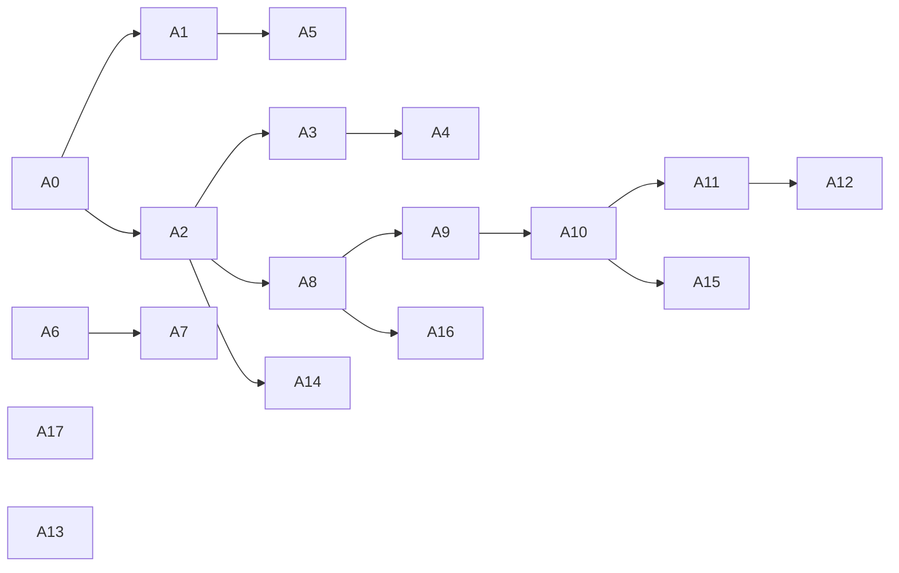

# v6 prolog compiler refactor: ordered arcs

Reads on: `plans/2026-08-19-prolog-compiler-anatomy.md` (the dataflow) and
`plans/2026-08-19-prolog-compiler-critique.md` (the defect ledger `D1`-`D21`
and the forks `F1`-`F7`). Human companion:
`plans/2026-08-19-prolog-compiler-refactor.PLAN.visual.human.unga.md`.

## TOC

1. [Constraints](#constraints)
2. [Gates](#gates)
3. [Arc table](#arc-table)
4. [Arc detail](#arc-detail)
5. [Collision map against the shared-frontier arc](#collision-map-against-the-shared-frontier-arc)
6. [What this plan does not do](#what-this-plan-does-not-do)
7. [Design forks needing Chris before any arc can start](#design-forks-needing-chris-before-any-arc-can-start)

## Constraints

| # | constraint | source |
| --- | --- | --- |
| C1 | no language or type-system semantics change without Chris in the room | CLAUDE.md, Standing laws |
| C2 | every arc ships a byte-identical emitted corpus unless the arc says otherwise, graded by `text_door_receipt.sh` plus `sweep.sh` | CLAUDE.md, PR-per-arc |
| C3 | the shared-frontier implementation card is a separately planned arc; no arc here may edit `lower.pl:6213-6533` or `lower.pl:6293-6444` | `v6/labs/shared_frontier/REPORT.md`, PR #374 |
| C4 | infra is bought, never built; any new indexing uses `library(assoc)`, `library(rbtrees)`, `library(nb_set)` or SWI tabling after a written candidate comparison | CLAUDE.md, build-vs-buy |
| C5 | `just green-all` is red by design; the judge is `.github/CI-KNOWN-RED.md`, re-measured per arc | CLAUDE.md |
| C6 | measure every leg three times, never once, never from the whole gate | CLAUDE.md |
| C7 | one lane per arc, disjoint file ownership, forbidden files named in each brief | CLAUDE.md, Dispatch |

## Gates

| gate | command | measured at HEAD `4e2c21a82` | wall |
| --- | --- | --- | --- |
| ARCH | `swipl -q -l v6/prolog/ARCH.pl -g go -g halt` | all PASS | 0.03 s |
| conformance | `cd v6/prolog/conformance && swipl -q -l go.pl -g go -g halt` | 461 PASS, 1 fail | 4.2 s |
| plunit | `cd v6/prolog/compile && swipl -q -l test/plunit_tests.pl -g run_tests -g halt` | 923 tests, 7 failed | 35.6 s |
| text door | `cd v6/prolog && bash compile/scripts/text_door_receipt.sh` | 352 compiled, 347 byte-identical, 5 failures per CI-KNOWN-RED | not re-measured here |
| sweep, 3x | `cd v6/tsv2 && bash scripts/sweep.sh` | 351 run, 337 identical, 0 wrong per CI-KNOWN-RED | not re-measured here |
| rust grade | `bash v6/sprefa-engine-rs/grade.sh` | 462 graded, 335 byte-clean per CI-KNOWN-RED | not re-measured here |
| roundtrip | `cd v6/prolog/compile && bash scripts/roundtrip.sh` | 460/462 per CI-KNOWN-RED | not re-measured here |
| prolog lint | `bash v6/prolog/tools/prolog-lint.sh` | 14 findings, baseline 0, per CI-KNOWN-RED | not re-measured here |
| compile trace | `swipl -q -l v6/prolog/compile.pl -g "compile_dl6('v6/dl/fixtures/self-map.dl6','/tmp/x.ts')" -g halt` | `parse=1070-1124 plan=227-244 lower=170-176 boot=1 emit=274-294 write=10-15` | 1.75-1.85 s |

`text-door` is the byte-identity gate. Every arc marked "byte-identical
required" is judged by it plus `sweep.sh` run three times.

## Arc table

| # | arc | goal | size | kind | blocked by | touches shared-frontier region |
| --- | --- | --- | --- | --- | --- | --- |
| A0 | header truth | make `lower.pl:1-23` describe the terms the code builds | S | mechanical | none | no |
| A1 | decl index | one indexed declaration store behind the 246 linear scans | L | judgment | A0 | no |
| A2 | plan/lowered accessors | accessor module for `plan/9` and `lowered/8`, mirroring `0_rel_record.pl` | M | mechanical | A0 | no |
| A3 | statement accessors | accessor module for `arrivalstmt/6`, `edgestmt/9`, `levelstmt/7`, `deltastmt/5`, `retentionstmt/3`, `bootstmt/3` | M | mechanical | A2 | no |
| A4 | plan carries the host plane | `plan/9` gains host, bind and query plan slots; emitters stop recomputing | M | mechanical | A2, A3 | no |
| A5 | thread the type table | `program_violation/3` takes `Types` instead of rebuilding it | M | mechanical | A1 | no |
| A6 | delete the generic-pipeline copy | fold `expand_generic_program_raw/2` into the wired path | S | mechanical | none | no |
| A7 | one expansion order | fold the five out-of-table rewrites into `expansion_phase/3` and add an order rail | M | judgment | A6 | no |
| A8 | split lower.pl part 1: the type IR | move the 13 `metadata_*` predicates and `catalog_type_*` out of `lower.pl` into a `type_ir` module | M | mechanical | A2, A3 | no |
| A9 | split lower.pl part 2: the fixpoint IR | move `lower.pl:5086-5606` into its own module | M | mechanical | A3, A8 | no |
| A10 | split lower.pl part 3: guards and expressions | move `lower.pl:310-959` into an `expr_lower` module | M | mechanical | A9 | no |
| A11 | storage context to an argument | replace the `physical_storage_name/2` thread-local with a threaded map; delete `table_name/2`'s silent fallback | L | judgment (F4) | A2, A9, A10 | partly |
| A12 | one DDL template table | collapse the 14 `CREATE TEMP TABLE` strings to 2 templates plus a spec table | M | mechanical | A11 | YES |
| A13 | statement-location table per file | keep `source_statement_fact/3` per parsed file so imported-module errors carry a line | M | judgment (F5) | none | no |
| A14 | one surface program shape | always `program/3`, queries as a real slot | M | judgment (F6) | A2 | no |
| A15 | one relation-value rewrite | one implementation shared by the oracle and the compiler | L | judgment | A10 | no |
| A16 | one type artifact run | `compile_dl6/3` emits all three type artifacts from one `row/11` build | S | mechanical | A8 | no |
| A17 | banned word sweep | `1_expansion.pl:45` and any other `load-bearing` in the compiler | S | mechanical | none | no |

Dependency order:

Suggested lane batching, disjoint file ownership:

| wave | arcs in parallel | files each lane owns |
| --- | --- | --- |
| 1 | A0, A6, A17, A13 | A0: `lower.pl` header only. A6: `0_generic_expand.pl`. A17: `1_expansion.pl`. A13: `compile/parse_dl_dcg.pl`, `use_resolve.pl` |
| 2 | A2, A1 | A2: new `0_plan_record.pl` plus call sites. A1: new `0_decl_index.pl` plus `0_generic_expand.pl`, `0_dot_expand.pl` |
| 3 | A3, A5, A7 | A3: new `0_stmt_record.pl`. A5: `0_program_check.pl`. A7: `1_expansion.pl` |
| 4 | A4, A8 | A4: `compile.pl`, `emit_ts.pl`, `emit_rust.pl`. A8: new `type_ir.pl`, `lower.pl` catalog section |
| 5 | A9, A16 | A9: new `fixpoint_ir.pl`. A16: `compile.pl`, `examples/_1_emit_types.sh` |
| 6 | A10, A14 | A10: new `expr_lower.pl`. A14: `compile/parse_dl_dcg.pl`, `1_host_expand.pl` |
| 7 | A11 | `lower.pl` |
| 8 | A15 | `0_relation_pattern.pl`, `lower.pl`, `conformance/engine.pl` |
| 9 | A12 | `lower.pl` DDL block, AFTER the shared-frontier arc lands or explicitly serialized with it |

## Arc detail

### A0. header truth

| field | value |
| --- | --- |
| goal | `lower.pl:1-23` states `plan/6`, `edgestmt/7`, `levelstmt/5`, `deltastmt/4`. The code builds `plan/9`, `edgestmt/9`, `levelstmt/7`, `deltastmt/5`. Correct the header, add the `bootstmt/2` to `bootstmt/3` retag (`lower.pl:6779-6781`) |
| files | `v6/prolog/lower.pl` lines 1-23 only |
| kind | mechanical |
| gate | none needed; comment-only. Run ARCH to confirm nothing else moved |
| size | S |
| blocked by | nothing |
| byte-identical | required and free |
| shared-frontier collision | no |

Defect: D4.

### A1. decl index

| field | value |
| --- | --- |
| goal | replace 246 `member(_, Decls)` and `memberchk(_, Decls)` scans with lookups against an indexed store |
| files | new `v6/prolog/0_decl_index.pl`; then in order `0_generic_expand.pl` (73 sites), `0_dot_expand.pl` (20), `0_program_check.pl` (17), `0_enum_expand.pl` (16), `0_option_expand.pl` (12), the rest |
| kind | **judgment**. C4 applies: write the candidate comparison first (`library(assoc)` AVL, `library(rbtrees)`, SWI `:- table` on a `decl(Functor, Args)` view, and a plain `keysort/2` + `memberchk` on a pre-grouped list), with a measured cell per candidate on `pokeapi_shape.dl6` and `self-map.dl6` |
| gate | `text_door_receipt.sh` byte-identical, `sweep.sh` 3x, plunit, conformance. Plus a count rail: `COMPILE-TRACE` inference count for `plan` on `pokeapi_shape.dl6` must not rise |
| size | L |
| blocked by | A0 |
| byte-identical | required. The index must preserve DECLARATION ORDER wherever a consumer relies on it; `1_expansion.pl:91` `msort/2` and `generic_artifact_order/3` both order by content, but `prepare_program/5`'s `append` at `1_host_expand.pl:61` and `dedupe_terms/2` at `:63` establish an order that emission may read |
| shared-frontier collision | no; `lower.pl` has only 7 of the 246 sites |

Do it one file at a time with a byte-identity run between files. Precedent:
`4e2c21a82` fixed 5 sites and took pokeapi from 526.4 s to 0.9 s. Defect: D1, D7.

### A2. plan/lowered accessors

| field | value |
| --- | --- |
| goal | one module exposing named readers for `plan/9`'s nine fields and `lowered/8`'s eight, modelled exactly on `0_rel_record.pl` (16 accessors for `rel/5`, 5 raw sites) |
| files | new `v6/prolog/0_plan_record.pl`; then the 29 `plan/9` and 10 `lowered/8` sites in `emit_ts.pl` (11+1), `lower.pl` (4+1), `emit_rust.pl` (3+1), `compile.pl` (2+1), `compile/6_isolated_compiler_dd.pl` (2+2), `6_profile.pl`, `sweep.pl`, `compile/9_emit_type_artifact.pl`, `compile/typegen_export.pl`, `compile/scripts/metamorphic_rename.pl`, `compile/scripts/arm_census.pl`, `compile/scripts/text_door_receipt.pl` |
| kind | mechanical |
| gate | `text_door_receipt.sh`, `sweep.sh` 3x, plunit, conformance, plus the three gate scripts that destructure `plan/9` must still run |
| size | M |
| blocked by | A0 |
| byte-identical | required |
| shared-frontier collision | no |

Fold `emit_ts:emit_program/5`'s four separate `Plan = plan(...)` lines
(`emit_ts.pl:2563, 2575, 2593, 2655`) into accessor calls in the same pass.
Defects: D3, D17.

### A3. statement accessors

| field | value |
| --- | --- |
| goal | named readers for `arrivalstmt/6` (10 sites), `edgestmt/9` (19), `levelstmt/7` (22), `deltastmt/5` (11), `retentionstmt/3` (5), `bootstmt/3` (4); and collapse `bootstmt/2` into `bootstmt/3` at construction so `tag_boot_statements/3` (`lower.pl:6779-6781`) disappears |
| files | new `v6/prolog/0_stmt_record.pl`; `lower.pl` construction sites `:6577, 6603, 6653, 6677, 6685, 6704, 6735, 6779`; `emit_ts.pl`, `emit_rust.pl` read sites |
| kind | mechanical |
| gate | as A2 |
| size | M |
| blocked by | A2 |
| byte-identical | required |
| shared-frontier collision | `deltastmt/5` construction is at `lower.pl:6735`, inside the delta section `6213-6533`'s neighbourhood but outside it. Read-only elsewhere. Coordinate |

Defects: D3, D15.

### A4. plan carries the host plane

| field | value |
| --- | --- |
| goal | `compile.pl:130` discards `prepare_program/5`'s `HostPlans`, `BindPlans`, `QueryPlans`; `emit_ts.pl:485, 499` and `emit_rust.pl:563` recompute them. Add three slots (or one `host_plane/3` slot) to the plan record and delete the recomputation |
| files | `compile.pl`, `0_plan_record.pl`, `emit_ts.pl`, `emit_rust.pl` |
| kind | mechanical |
| gate | as A2; plus a `COMPILE-TRACE` receipt that `emit` inference count DROPS on `flagship-flow.dl6` (which declares hosts) |
| size | M |
| blocked by | A2, A3 |
| byte-identical | required |
| shared-frontier collision | no |

Defect: D5.

### A5. thread the type table

| field | value |
| --- | --- |
| goal | `program_violation/3` rebuilds `type_definitions/2` in 10 clauses (`0_program_check.pl:226,332,344,370,425,476,521,533,731,800`) four lines after `compile.pl:186` computed it. Change the shared checker's signature to take the type table |
| files | `0_program_check.pl`, `analyze.pl` (the two `shared_unsupported/2` call blocks), `conformance/engine.pl` (the oracle calls the same `program_violation/3`) |
| kind | mechanical, BUT it crosses the oracle seam: `conformance/engine.pl:130` and `:236` are the other caller, so both doors change signature together |
| gate | conformance (the oracle's own gate), plunit, `text_door_receipt.sh`, `sweep.sh` 3x. The unsupported-construct ORDER must not change: `analyze.pl:1210-1212` says order is fixture data |
| size | M |
| blocked by | A1 (the index makes the threading trivial; without it the signature change alone still helps) |
| byte-identical | required, AND the thrown reason for a two-violation program must not change |
| shared-frontier collision | no |

Defect: D7.

### A6. delete the generic-pipeline copy

| field | value |
| --- | --- |
| goal | `expand_generic_program_raw/2` (`0_generic_expand.pl:70-87`) is a verbatim 14-goal copy of `expand_generic_program_with_bindings/3` (`:50-67`). Its only non-test caller is `compile/test/plunit_tests.pl:5113`. Delete it, point the test at the wired path with `Bindings = []` |
| files | `0_generic_expand.pl`, `compile/test/plunit_tests.pl` |
| kind | mechanical |
| gate | plunit, conformance, `text_door_receipt.sh` |
| size | S |
| blocked by | nothing |
| byte-identical | required and free |
| shared-frontier collision | no |

Defect: D6.

### A7. one expansion order

| field | value |
| --- | --- |
| goal | `1_expansion.pl` runs nine table-driven phases plus five hard-wired rewrites: `resolve_qualified_types/2` (`:82`), the enum-context generic run (`:86`), `drop_minted_keyed_on_derived/3` (`:97`), `merge_enum_type_rows/3` (`:98`), `merge_option_type_rows/2` (`:99`). Give them phase numbers, make the fold total, and add a rail that fails when a phase's declared predecessor does not exist |
| files | `1_expansion.pl` only |
| kind | **judgment**. Three phases carry a prose order constraint (`:37-43`, `:45-55`, `:58-61`); six carry none. Making the six explicit requires deciding what each one actually depends on, which is language work under C1 for any phase whose constraint is not already provable from the code |
| gate | `text_door_receipt.sh` byte-identical, `sweep.sh` 3x, conformance, plunit |
| size | M |
| blocked by | A6 |
| byte-identical | required |
| shared-frontier collision | no |

Scope guard: this arc may only WRITE DOWN the order that runs today. It may not
change any phase's position. Any position change is a fork for Chris.
Defect: D12.

### A8. split lower.pl part 1: the type IR

| field | value |
| --- | --- |
| goal | `lower.pl:960-2582` is one 1,623-line banner named "the program catalog" holding 111 predicates, 68 `catalog_*` and 13 `metadata_*`. Move the type-IR builders (`catalog_type_rows/6`, `catalog_type_relation_rows/3`, `catalog_type_transport_rows/4`, `catalog_decl_rows/6`, the 13 `metadata_*`, `semantic_*`) into a `type_ir.pl` module beside `compile/9_emit_type_artifact.pl`'s consumers |
| files | new `v6/prolog/type_ir.pl`; `lower.pl` (delete the moved predicates and their exports); `compile/9_emit_type_artifact.pl` import line |
| kind | mechanical |
| gate | plunit, `text_door_receipt.sh`, `just typegen-golden`, conformance |
| size | M |
| blocked by | A2, A3 |
| byte-identical | required for both the emitted module and the three type artifacts |
| shared-frontier collision | no; `:960-2582` is far from `:6213-6533` |

Second half of the arc: re-banner what stays behind. The 43 non-catalog
predicates in that range (guards, interning, list storage, DDL, module paths)
need their own banners. Defect: D2.

### A9. split lower.pl part 2: the fixpoint IR

| field | value |
| --- | --- |
| goal | `lower.pl:5086-5606` (521 lines) is a "backend-neutral fixpoint IR" the emitters read (`emit_ts.pl:1584`). It is a second IR, not SQL text. Move it to `fixpoint_ir.pl` |
| files | new `v6/prolog/fixpoint_ir.pl`; `lower.pl`; `emit_ts.pl` and `emit_rust.pl` import lines |
| kind | mechanical |
| gate | `text_door_receipt.sh`, `sweep.sh` 3x, `grade.sh`, plunit, conformance |
| size | M |
| blocked by | A3, A8 |
| byte-identical | required |
| shared-frontier collision | no |

Defect: D2.

### A10. split lower.pl part 3: guards and expressions

| field | value |
| --- | --- |
| goal | `lower.pl:310-959` (650 lines) is the pattern-argument compiler, positive and negative body-atom compilation, head expression compilation and guard/bind goals. Move to `expr_lower.pl`. `compile_expr/7`, `compile_comparison/4`, `canonical_column_expr/2,3` are already exported, so the seam exists |
| files | new `v6/prolog/expr_lower.pl`; `lower.pl`; the four other importers of `compile_expr/7` |
| kind | mechanical |
| gate | as A9 |
| size | M |
| blocked by | A9 |
| byte-identical | required |
| shared-frontier collision | no |

After A8 + A9 + A10, `lower.pl` drops from 6,800 lines to roughly 4,000.
Defect: D2.

### A11. storage context to an argument

| field | value |
| --- | --- |
| goal | delete the `physical_storage_name/2` thread-local (`lower.pl:197`) and the two `with_storage_context/2` installs (`:6659`, `:6755`), thread the `Ref -> StorageName` map as an argument, and make a missing entry an error instead of `table_name/2`'s silent `Ref = Table/_` fallback (`lower.pl:213`) |
| files | `lower.pl` |
| kind | **judgment** (fork F4). The fallback is currently reachable: `lower.pl:195-196` says "direct helper units retain the old Ref -> Name fallback". Turning it into a throw can turn a compiling program into a compile-time stop, which is a semantics change under C1 |
| gate | `text_door_receipt.sh`, `sweep.sh` 3x, `grade.sh`, plunit, conformance; plus a count rail on `assertz/1` calls in one `self-map.dl6` compile (834 today) |
| size | L |
| blocked by | A2, A9, A10, and Chris's answer to F4 |
| byte-identical | required |
| shared-frontier collision | **partly**. `table_name/2` is called by every transient-table name minter including the ones the frontier arc rewrites. Serialize against it |

Split into two: A11a threads the map with the fallback kept (mechanical,
byte-identical, no fork needed); A11b removes the fallback (needs F4).
Defects: D9, D16.

### A12. one DDL template table

| field | value |
| --- | --- |
| goal | 14 `CREATE TEMP TABLE` format strings in `lower.pl` (`:4581, 4595, 4600, 6301, 6316, 6318, 6332, 6348, 6358, 6396, 6411, 6414, 6429, 6436`), 9 of which are duplicates of 2 templates. Collapse to a `transient_table_spec/4` fact table plus 2 renderers, and 4 `CREATE INDEX` strings to 1 |
| files | `lower.pl` DDL block |
| kind | mechanical |
| gate | `text_door_receipt.sh` byte-identical (the emitted DDL text is the output), `sweep.sh` 3x, `grade.sh` |
| size | M |
| blocked by | A11 |
| byte-identical | **required**, and it is the whole point: the SQL text must not move |
| shared-frontier collision | **YES, direct**. This is the same block the shared-frontier arc replaces. RUN THIS ARC ONLY AFTER the shared-frontier arc lands, or drop it if the shared frontier removes the duplication for free |

Defect: D10.

### A13. statement-location table per file

| field | value |
| --- | --- |
| goal | `source_statement_fact/3` is retracted at the start of every file parse (`compile/parse_dl_dcg.pl:107-109`) and `use_resolve.pl:119` parses the entry last, so an error in an imported module carries no line. Return the statement table per parse and keep one entry per file |
| files | `compile/parse_dl_dcg.pl`, `use_resolve.pl`, `compile.pl:645-655` (`throw_text_door_error/2`), `diag.pl` |
| kind | **judgment** (fork F5): what `bop check` prints for an error inside a `use` target is user-visible |
| gate | `just bop-test` (the `file:line` receipts live there), `tsv2-test`, `text_door_receipt.sh`, conformance |
| size | M |
| blocked by | Chris's answer to F5 |
| byte-identical | emitted modules unchanged; DIAGNOSTIC TEXT changes by design |
| shared-frontier collision | no |

Defect: D8.

### A14. one surface program shape

| field | value |
| --- | --- |
| goal | the parser returns `prog/2` or `program/3` (`compile/parse_dl_dcg.pl:124-128`); `prepare_program/5` normalizes and folds `Queries` into the flat `Decls` (`1_host_expand.pl:61`); `compile.pl:250` scans `Decls` to get them back. Emit `program/3` always, keep `Queries` a real slot to the plan |
| files | `compile/parse_dl_dcg.pl`, `1_host_expand.pl`, `compile.pl`, `print_dl.pl` |
| kind | **judgment** (fork F6): `print_dl.pl` round-trips the surface term and `roundtrip.sh` grades it |
| gate | `roundtrip.sh`, `text_door_receipt.sh`, `sweep.sh` 3x, plunit, conformance |
| size | M |
| blocked by | A2, Chris's answer to F6 |
| byte-identical | required |
| shared-frontier collision | no |

### A15. one relation-value rewrite

| field | value |
| --- | --- |
| goal | `0_relation_pattern.pl` (102 lines, 6 predicates) is the oracle's implementation, imported only by `conformance/engine.pl:79`. `lower.pl:3212-3651` (440 lines) is the compiler's. One rewrite, both doors |
| files | `0_relation_pattern.pl`, `lower.pl`, `conformance/engine.pl` |
| kind | **judgment**. The two are not the same function today: the compiler's version memoizes by term identity (ARCH row `depth2_ref_fix`) and refuses under `not/1` and in edge statements; the oracle's does not need to. Deciding what the shared core is, is language work |
| gate | conformance (461 fixtures), `text_door_receipt.sh`, `sweep.sh` 3x, plunit, and the EXPLAIN hop-count receipt the ARCH row names as the only test that sees the memoization |
| size | L |
| blocked by | A10 |
| byte-identical | required |
| shared-frontier collision | no |

Defect: D14.

### A16. one type artifact run

| field | value |
| --- | --- |
| goal | `v6/prolog/examples/_1_emit_types.sh:12,16,20` runs `compile_dl6/3` three times to write `.ts`, `.rs` and `.schema.json` from one `row/11` table. Add a multi-artifact door that builds the plan once |
| files | `compile.pl` (new entry), `compile/9_emit_type_artifact.pl`, `examples/_1_emit_types.sh` |
| kind | mechanical |
| gate | `just typegen-golden`, plus a wall-clock receipt: three artifacts in one run must be faster than three runs |
| size | S |
| blocked by | A8 |
| byte-identical | required for all three artifacts |
| shared-frontier collision | no |

Defect: D20.

### A17. banned word sweep

| field | value |
| --- | --- |
| goal | `1_expansion.pl:45` uses `load-bearing` in a comment. Grep the compiler for `load-bearing`, `provenance`, `substrate`, `regime` in prose and identifiers, replace with the plain word |
| files | wherever the grep hits |
| kind | mechanical |
| gate | none beyond ARCH; comments only unless an identifier is hit |
| size | S |
| blocked by | nothing |
| byte-identical | required and free unless an identifier is hit |
| shared-frontier collision | no |

Defect: D21.

## Collision map against the shared-frontier arc

The shared-frontier implementation rewrites `lower.pl:6213-6533` (delta
statements) and the DDL block `lower.pl:6293-6444`, and replaces the name
minters at `lower.pl:218-241`, `:293`, `:4711`, `:4788-4834`.

| arc | reads that region | writes that region | verdict |
| --- | --- | --- | --- |
| A0 | no | no | safe |
| A1 | `lower.pl` has 7 of 246 sites, none in the region | no | safe |
| A2 | no | no | safe |
| A3 | `deltastmt/5` construction at `lower.pl:6735` sits just outside | reads only | coordinate, low risk |
| A4-A10 | no | no | safe |
| A11 | `table_name/2` is called by every minter in the region | changes `table_name/2`'s contract | **serialize**: land after the frontier arc, or land A11a (fallback kept) before it and A11b after |
| A12 | yes | yes | **do not run before the frontier arc**. May become unnecessary |
| A13-A17 | no | no | safe |

## What this plan does not do

| not done | why |
| --- | --- |
| change any language surface | C1 |
| change any unsupported-construct name or reason text | C1; the unsupported-construct names are fixture data (`analyze.pl:1210-1212`) |
| touch `conformance/fixtures/*` | those are the gate |
| fix `column_type_unknown('CodecDocument')` | fork F1, needs Chris |
| implement the shared frontier | separately planned, PR #374's lab is its input |
| rewrite `emit_ts.pl` (2,700 lines) or `emit_rust.pl` | out of scope; A2, A3 and A4 reduce its plan/statement coupling, nothing more |
| retire `plan/9` for a dict | SWI dicts would change every gate script; the accessor module (A2) gets the same isolation with no representation change |

## Design forks needing Chris before any arc can start

| fork | blocks | site | question |
| --- | --- | --- | --- |
| F1 | nothing here; it is the golden-flex red | `0_type_plane.pl:151` | is `CodecBox(CodecDocument)` a legal column type, and does it resolve to the minted instance rel's `ref/1`? |
| F2 | nothing here | `0_type_plane.pl:118-125` | does `json_list(T)` survive to `column_def/4` as its own storage kind? |
| F3 | A8 | `compile/7_emit_ts_types.pl:290`, `compile/8_emit_rust_types.pl:760` | one shared `type_name/2` in a neutral module, or one per target language? |
| F4 | A11b | `lower.pl:213` | is a missing storage-context entry an error, or does the semantic-name fallback stay? |
| F5 | A13 | `compile/parse_dl_dcg.pl:107`, `use_resolve.pl:119` | should an error in a `use` target report that file and line, changing what `bop check` prints? |
| F6 | A14 | `compile/parse_dl_dcg.pl:124-128` | one surface program shape (`program/3` always) or two? `roundtrip.sh` grades the answer |
| F7 | A11, A12 | `lower.pl:6293-6444`, `v6/labs/shared_frontier/REPORT.md` | already Chris's; named so the arcs stay off the range |

The first arc to run is **A0** (comment-only, no gate risk), and the first arc
that pays is **A1**.
