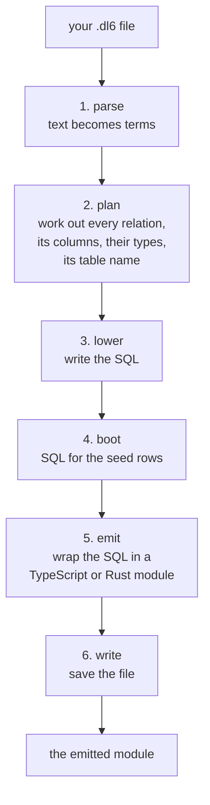
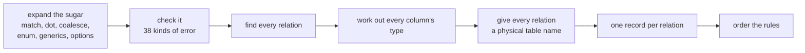
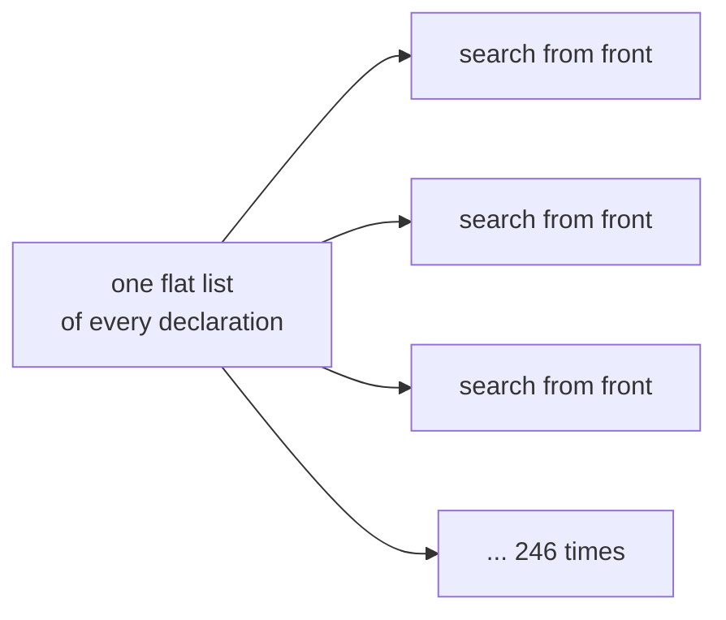

# the prolog compiler, in plain words

No citations. No line numbers. The other three docs have those.

## TOC

1. [What the compiler is](#what-the-compiler-is)
2. [How a program flows through it](#how-a-program-flows-through-it)
3. [Where the time goes](#where-the-time-goes)
4. [The four things that are wrong](#the-four-things-that-are-wrong)
5. [The arcs](#the-arcs)
6. [What we cannot decide without you](#what-we-cannot-decide-without-you)

## What the compiler is

Fifty-three prolog files, about thirty-two thousand lines. One file,
`lower.pl`, is a fifth of that on its own: six thousand eight hundred lines,
four hundred and twenty-nine predicates, one module.

It turns a `.dl6` text file into a TypeScript module, a Rust module, or a set
of type artifacts. Six steps, in order.

Between those steps sit about twenty different shapes of data. Two of them have
proper named readers. The other eighteen are read by counting positions in a
tuple.

## How a program flows through it

The plan step is where the real work happens. It does about twenty things in a
fixed order, and every later step reads its answer.

The sugar expansion has nine named steps in a table plus five more that are
hard-wired around it and are not in the table. Three of the nine say in a
comment why they must run where they do. Six say nothing.

## Where the time goes

Compiling `self-map.dl6`, the biggest program in the fixture set, seven hundred
lines. Three runs, milliseconds.

| step | time | share |
| --- | --- | --- |
| parse | 1070-1124 | 61% |
| emit | 274-294 | 16% |
| plan | 227-244 | 13% |
| lower | 170-176 | 10% |
| write | 10-15 | under 1% |
| boot | 1 | nothing |

The six-thousand-eight-hundred-line file is a tenth of the clock.

## The four things that are wrong

### One. The declaration list has no index

Everything a program declares lives in one flat list. Every part of the
compiler searches that list from the front, over and over. Two hundred and
forty-six places do this.

We know what it costs, because someone just fixed five of those places. One
program went from eight and a half minutes to under a second.

### Two. lower.pl is one room with no walls

Six thousand eight hundred lines, four hundred and twenty-nine predicates,
twenty-seven section headers. One of those headers covers sixteen hundred lines
and names a quarter of what is under it.

Three things in that file are not lowering at all: the type artifact builder,
the fixpoint description the emitters read, and the expression compiler. Those
three come out to about two thousand eight hundred lines.

### Three. Nothing has names, everything has positions

The main term passed between steps has nine fields and is taken apart by
counting positions in twenty-nine places across twelve files, three of which are
test scripts. Adding a tenth field means editing all twelve.

One term in the whole compiler does this properly. It has five fields, sixteen
named readers, and gets taken apart by hand in exactly five places.

### Four. The same work gets done twice

| thing | done | done again |
| --- | --- | --- |
| host, bind and query plans | in the plan step, then thrown away | in the TypeScript emitter, and again in the Rust emitter |
| the type table | once, and passed along | ten more times inside the checker |
| the generic expansion pipeline | once for real | once more just to look up enum names |
| that same pipeline's fourteen steps | written once | written again, character for character, in a second predicate |
| the relation-value rewrite | in the reference engine | again, differently, in the compiler |
| the whole compile | once per type artifact | three artifacts, three full compiles |

## The arcs

Seventeen. Ordered. Most are mechanical.

```mermaid
flowchart LR
  W1["wave 1<br/>A0 fix the header<br/>A6 delete the copy<br/>A17 banned words<br/>A13 error locations"] --> W2["wave 2<br/>A2 named readers<br/>A1 index the declarations"]
  W2 --> W3["wave 3<br/>A3 statement readers<br/>A5 pass the type table<br/>A7 one expansion order"]
  W3 --> W4["wave 4<br/>A4 stop recomputing hosts<br/>A8 lift out the type builder"]
  W4 --> W5["wave 5<br/>A9 lift out the fixpoint<br/>A16 one run, three artifacts"]
  W5 --> W6["wave 6<br/>A10 lift out expressions<br/>A14 one program shape"]
  W6 --> W7["wave 7<br/>A11 stop using globals"]
  W7 --> W8["wave 8<br/>A15 one relation rewrite"]
  W8 --> W9["wave 9<br/>A12 one DDL template"]
```

| arc | in one line | size | mechanical or judgment |
| --- | --- | --- | --- |
| A0 | the header comment describes terms that no longer exist. Fix it | S | mechanical |
| A1 | index the declaration list | L | judgment |
| A2 | named readers for the two main terms | M | mechanical |
| A3 | named readers for the six statement terms | M | mechanical |
| A4 | stop recomputing the host plans in every emitter | M | mechanical |
| A5 | pass the type table to the checker instead of rebuilding it ten times | M | mechanical |
| A6 | delete the character-for-character copy of the generic pipeline | S | mechanical |
| A7 | write down the expansion order that already runs | M | judgment |
| A8 | lift the type builder out of the lowerer | M | mechanical |
| A9 | lift the fixpoint description out of the lowerer | M | mechanical |
| A10 | lift the expression compiler out of the lowerer | M | mechanical |
| A11 | stop passing the table-name map through a global | L | judgment |
| A12 | fourteen near-identical CREATE TABLE strings become two | M | mechanical |
| A13 | an error in an imported file should say which file and which line | M | judgment |
| A14 | the parser returns two different shapes. Make it one | M | judgment |
| A15 | one relation-value rewrite instead of two | L | judgment |
| A16 | build the type table once and write all three artifacts | S | mechanical |
| A17 | one banned word in a comment | S | mechanical |

After A8, A9 and A10 the big file is about four thousand lines instead of six
thousand eight hundred.

Every arc has to produce the exact same output bytes it produces today, except
A13, which changes an error message on purpose.

One arc, A12, edits the same block of code the shared-frontier work is going to
replace. It waits, or it gets dropped.

## What we cannot decide without you

Seven. Each one is a language question, not a cleanup question.

| # | the question |
| --- | --- |
| 1 | `golden-flex.dl6` does not compile. It writes a template applied to a relation name in a column position, and the type resolver has no case for that. Is it legal, and if so what does it mean? |
| 2 | a typed JSON list currently collapses to plain JSON before storage, which throws away the one thing SQLite could check. Should the typed form survive to the table definition? |
| 3 | the type-naming function is duplicated in the TypeScript emitter and the Rust emitter. One shared copy, or one per language? |
| 4 | when the table-name map is missing an entry, the compiler quietly uses the logical name instead. Should that be an error? Making it one could turn a program that compiles today into a rejection |
| 5 | an error inside an imported file currently has no line number. Fixing it changes what `bop check` prints |
| 6 | the parser returns one of two different program shapes depending on what is in the file. Collapse to one? |
| 7 | the shared frontier, already yours, already planned. Named here only so nothing collides with it |

Nothing starts on 1 through 6 until you say so. A0, A2, A3, A4, A5, A6, A8, A9,
A10, A16 and A17 need none of them.
