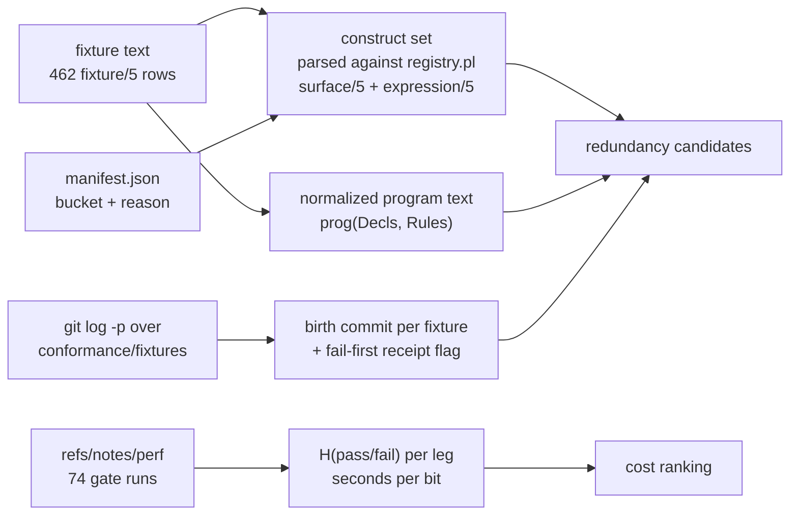
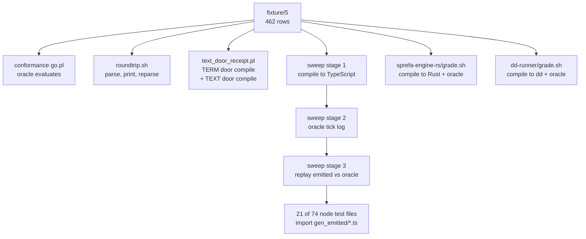

# Test-estate compaction: redundancy measured

Base `942cf1443` (the coordinator's stated sha) is contained in this worktree's
HEAD `65607a8d5`, which is `origin/main`. `git merge --ff-only 942cf1443`
returns rc=0 `Already up to date`. Every measurement below is at `65607a8d5`
unless a row says otherwise.

Nothing in this lane deletes a test. Every DELETE and MERGE row is a proposal
carrying its reason; the disposition column says which rows are mechanically
safe and which need Chris.

## Contents

1. [Method, and what "information" means here](#1-method)
2. [The estate today](#2-the-estate-today)
3. [Measure A: entropy of the gate legs](#3-measure-a-entropy-of-the-gate-legs)
4. [Measure B: conformance redundancy by construct coverage](#4-measure-b-conformance-redundancy-by-construct-coverage)
5. [Measure C: failure correlation, which tests ever fired alone](#5-measure-c-failure-correlation)
6. [Measure D: parity duplication across the doors](#6-measure-d-parity-duplication-across-the-doors)
7. [Measure E: cost per leg](#7-measure-e-cost-per-leg)
8. [Ranked compaction list](#8-ranked-compaction-list)
9. [KEEP-because: looks redundant, is not](#9-keep-because)
10. [Expected wall savings](#10-expected-wall-savings)
11. [Execution order, arcs and gates](#11-execution-order)
12. [Rotted numbers found on the way](#12-rotted-numbers-found-on-the-way)
13. [Commands that reproduce every number here](#13-reproduction)

---

## 1. Method

Four independent measures, none of them an eyeball read.



| measure | what it detects | why it is not an opinion |
|---|---|---|
| A entropy | a leg whose verdict has been a constant | Shannon `H(p_red)` over the recorded gate history in `refs/notes/perf` |
| B coverage | a fixture reaching no compile path another does not | construct set parsed from the fixture, matched to `v6/prolog/compile/registry.pl` `surface/5` (60 rows) and `expression/5` (31 rows) |
| C correlation | a fixture that never demonstrated a defect | the fixture's birth commit message, mined from `git log -p -- v6/prolog/conformance/fixtures` |
| D parity | one behavior pinned N times | which legs `.github/CI-KNOWN-RED.md` groups under one root cause |
| E cost | seconds bought per bit | per-leg `seconds` rows in `refs/notes/perf` |

Two information axes must not be confused, and confusing them is how a
compaction loses coverage:

| axis | what carries it | what a duplicate costs |
|---|---|---|
| compile | `prog(Decls, Rules)` and the bucket + reason it lands in | one full parse + plan + lower + boot, repeated |
| run | the tick schedule and the `final`/`deltas` expectations | nothing, unless the bucket is `unsupported` |

For an `unsupported` fixture the compile stops before any tick runs, so the
schedule and expectations are dead text and the whole fixture reduces to its
one reason string. For a `compiled` fixture two identical programs with
different schedules duplicate the compile and not the run: that is a MERGE or a
memo, never a delete.

---

## 2. The estate today

| segment | count | measured by |
|---|---|---|
| conformance fixture files | 66 | `ls v6/prolog/conformance/fixtures/*.pl \| wc -l` |
| `fixture/5` rows | 462 | `grep -h '^fixture(' v6/prolog/conformance/fixtures/*.pl \| wc -l` |
| distinct normalized programs among them | 389 | script, section 4 |
| manifest rows | 461 | `jq length v6/prolog/compile/out/manifest.json` |
| manifest `compiled` | 351 | `jq -r '.[].bucket' ... \| sort \| uniq -c` |
| manifest `unsupported` | 110 | same |
| distinct `unsupported` reason strings | 99 | same, on `.reason` |
| distinct `unsupported` throw-site functors | 66 | reason text up to the first `(` |
| distinct constructs used across the corpus | 137 | parsed against `registry.pl` |
| constructs reached by exactly one fixture | 58 | same |
| plunit `test/1` rows in `compile/test/*.pl` | 929 | `cat v6/prolog/compile/test/*.pl \| grep -c '^test('` |
| plunit tests the runner reports | 917 | run, `[917/917]` |
| plunit `begin_tests` blocks in `plunit_tests.pl` | 66 | `grep -c 'begin_tests(' plunit_tests.pl` |
| `plunit_tests.pl` size | 545317 bytes | `ls -la` |
| tsv2 test files | 74 | `ls v6/tsv2/tests/*.ts \| wc -l` |
| tsv2 `test(`/`it(` declarations | 233 | `grep -cE '^\s*(test\|it)\('` |
| tsv2 tests the runner reports | 242 | `.github/CI-KNOWN-RED.md`, group C |
| golden directories under `v6/tsv2/goldens` | 13 | `ls -d v6/tsv2/goldens/*/` |
| golden bytes | 976K | `du -sh v6/tsv2/goldens` |
| tracked files in `v6/prolog/compile/out` | 2534 | `git ls-files v6/prolog/compile/out \| wc -l` |
| tracked files in `v6/prolog/compile/dl_view` | 467 | `git ls-files ... \| wc -l` |
| `just green` legs | 13 | `v6/justfile:499` |
| legs with rows in `refs/notes/perf` | 36 | see section 3 |
| `.github/CI-KNOWN-RED.md` `allow:` rows | 19 | `grep -c '^allow:'` |

Three corpus-count disagreements found while joining these:

| fact | receipt |
|---|---|
| `0_option_type.pl:option_in_key_column_normalizes` and `7_module_path.pl:nested_zero_column_child_is_one_row_per_parent` have no manifest row | join of fixture names to `manifest.json` |
| `manifest.json` still carries `option_in_key_column_is_refused`, a fixture name that no longer exists | same join, reverse direction |
| the committed manifest is therefore at least one commit behind the fixture files | `sweep.sh` writes it; `git status` was clean before the join |

---

## 3. Measure A: entropy of the gate legs

Source: 2452 rows across 74 recorded `green-all` runs in `refs/notes/perf`,
2026-08-07T22:49:41Z to 2026-08-19T17:17:22Z. `H` is the binary Shannon entropy
of the leg's `rc != 0` rate over its own recorded runs. A leg with `H = 0.000`
returned the same verdict every recorded run: knowing the commit told you its
answer, and running it told you nothing you did not already have.

Gate total, same 74 runs: median 187s, min 68s, max 478s.

| leg | n | red | H (bits) | median s | s per bit |
|---|---:|---:|---:|---:|---:|
| typegen-golden | 8 | 0 | 0.000 | 114 | infinite |
| rust-grade | 8 | 8 | 0.000 | 38 | infinite |
| dl-test | 66 | 0 | 0.000 | 7 | infinite |
| multirepo-golden | 74 | 0 | 0.000 | 6 | infinite |
| serve-endurance | 74 | 0 | 0.000 | 4 | infinite |
| docs-staleness | 8 | 0 | 0.000 | 2 | infinite |
| ghcacher-golden | 74 | 0 | 0.000 | 1 | infinite |
| import-gate | 74 | 0 | 0.000 | 1 | infinite |
| watch-scale | 74 | 0 | 0.000 | 1 | infinite |
| one-subscribe | 74 | 0 | 0.000 | 0 | infinite |
| memory-soak | 74 | 71 | 0.245 | 113 | 462 |
| precommit-changed | 74 | 1 | 0.103 | 19 | 184 |
| endurance | 66 | 1 | 0.113 | 18 | 159 |
| store-test | 74 | 4 | 0.303 | 10 | 33 |
| getting-started | 74 | 48 | 0.935 | 17 | 18 |
| text-door | 74 | 8 | 0.494 | 8 | 16 |
| extraction-live | 74 | 10 | 0.571 | 8 | 14 |
| sweep | 74 | 9 | 0.534 | 6 | 11 |
| files | 74 | 9 | 0.534 | 5 | 9 |
| dd-grade | 15 | 8 | 0.997 | 9 | 9 |
| plunit | 74 | 39 | 0.998 | 9 | 9 |
| scale-floor | 74 | 71 | 0.245 | 2 | 8 |
| compile-speed | 74 | 71 | 0.245 | 2 | 8 |
| tsv2-test | 74 | 40 | 0.995 | 8 | 8 |
| serve-leak-soak | 74 | 29 | 0.966 | 7 | 7 |
| catalog-audit | 42 | 8 | 0.702 | 2 | 3 |
| prolog-lint | 74 | 45 | 0.966 | 2 | 2 |
| roundtrip | 74 | 22 | 0.878 | 1 | 1 |
| staleness-gate | 74 | 23 | 0.894 | 1 | 1 |
| flagship | 74 | 46 | 0.957 | 1 | 1 |
| leak-soak | 66 | 27 | 0.976 | 1 | 1 |
| golden-flex | 74 | 43 | 0.981 | 1 | 1 |
| typecheck | 74 | 37 | 1.000 | 1 | 1 |
| rtkq-golden | 74 | 63 | 0.606 | 0 | 0 |
| lsp-diags | 66 | 63 | 0.267 | 0 | 0 |
| conformance | 74 | 12 | 0.639 | 0 | 0 |

Readings:

| reading | number |
|---|---|
| legs at `H = 0.000` | 10 |
| their median walls, summed | 174s |
| legs under `H = 0.30` | 16 of 36 |
| whole-estate bits per gate run | 17.15 |

One caveat this table does not settle, and the plan does not pretend it does:
`H = 0` over 74 runs means the leg never changed its answer on this commit
stream. It does not mean the leg would stay silent on a change that broke what
it guards. The compaction lever is therefore never "delete an `H = 0` leg". It
is "an `H = 0` leg that costs 114s is paying 114s for a guard that could be
paid at 5s", which is a cost question with a cost answer.

The three legs at `H = 0.245` and 96% red (`memory-soak`, `scale-floor`,
`compile-speed`) are constants for the opposite reason: they are red every run
against a known unfixed defect, so their verdict carries no new bit until the
defect is fixed. Each already has an `allow:` row in `.github/CI-KNOWN-RED.md`.

---

## 4. Measure B: conformance redundancy by construct coverage

Construct sets were parsed per fixture from the `prog(Decls, Rules)` span:
declaration functors, the `<-` / `<+` / `:=` operators, every functor matching a
`registry.pl` `surface/5` or `expression/5` name, declared column types, `kind`
and `keep` values. 137 distinct constructs over 462 fixtures.

### B1. Exact construct-set collisions

Fixtures sharing an identical construct set AND the same `(bucket, reason)`:

| statistic | value |
|---|---|
| clusters of size >= 2 | 64 |
| fixtures inside a cluster | 226 |
| surplus rows if only one per cluster survived | 162 |

This is the loosest of the three filters and on its own is not a delete
argument: two fixtures can use the same constructs and still pin different
runtime behavior. It is reported because it bounds the search.

The largest cluster, 11 fixtures, one construct set, all `compiled`:

```
23_diverging_recursion.pl   bounded_measure_recursion_still_closes
24_mutual_recursion.pl      mutual_closure_needs_outer_rounds
7_module_path.pl            module_path_in_head_resolves_and_contributes
7_module_path.pl            module_path_in_body_reads_the_flat_rel
7_module_path.pl            module_path_three_segments_resolve_through_the_rooms
7_module_path.pl            module_path_local_name_binds_before_the_dotted_one
7_module_path.pl            nested_child_carries_the_parent_reference
7_module_path.pl            nested_parent_with_no_rows_yields_an_empty_child
7_module_path.pl            nested_body_atom_reads_every_partition
7_module_path.pl            nested_three_levels_chain_the_references
recursion_throw_pins.pl     recursive_closure_passes_both_build_guard_arms
```

### B2. Identical program text

Normalized `prog(...)` text, whitespace removed, compared across all 462
fixtures:

| statistic | value |
|---|---|
| distinct programs | 389 |
| duplicate-program clusters | 39 |
| surplus compiles per corpus pass | 73 |
| clusters of size >= 3 | 14 |
| clusters of size 2 | 25 |

The corpus therefore performs 462 compiles to cover 389 programs. 15.8% of
every corpus compile pass is a repeat of a compile that already ran in the same
process.

### B3. Unsupported fixtures sharing one reason string

The airtight case. For these the compile throws, the schedule never runs, and
two fixtures reaching the identical reason string differ only in dead text.

| reason | fixtures | keep | drop |
|---|---:|---|---|
| `edge_body_needs_json_destructure((demand_row(A,B),decode(B,fresh(C,D)),stars_of(D,E)))` | 5 | `desugared_trace_equals_hand_written` | `pipe_stage_costs_one_tick`, `trigger_marker_is_what_stops_backlog_replay`, `unmarked_chain_replays_to_late_subscriber`, `unmarked_first_stage_refires_on_late_watch` |
| `edge_body_needs_json_destructure((demand_row(A,B),decode(B,fresh(C,D)),stars_of(D,E),E>100,not(muted(A))))` | 3 | `guard_stage_fires_on_negation_and_comparison` | `guard_stage_silent_below_threshold`, `guard_stage_silent_when_muted` |
| `list_interned_set_relation_element(fighter_summary)` | 2 | `list_interned_set_relation_element_refused` (`10_list_elements.pl`) | `option_of_interned_set_of_rel_is_refused` (`14_option_wrapper_walk.pl`) |
| `level_body_goal(pull_request(A,B,C,D,E),json_each(F,G))` | 2 | `ghcacher_host_program_term` | `ghcacher_json_normalization` |
| `column_type_unknown(spann)` | 2 | `struct_column_type_unknown_rejected` | `struct_host_output_type_unknown_rejected` |
| `removed_word(scan)` | 2 | `scan_is_a_named_unsupported` | `scan_is_a_named_unsupported_at_five_arguments` |
| `aggregate_head(json_array(A))` | 2 | `json_array_groups_and_nests` | `json_array_keeps_bag_duplicates` |

11 drop rows, 7 clusters. All 9 `temporal_pipe.pl` fixtures in the first two
rows are `unsupported`: the whole file pins two throw sites and spends nine
fixtures doing it.

### B4. Name-prefix families and the receipt split

The families the brief already suspected, each with how many were born carrying
a fail-first receipt (section 5 defines the flag) and how many distinct programs
they cover:

| prefix | n | born with receipt | distinct programs | unsupported | verdict |
|---|---:|---:|---:|---:|---|
| `module_path*` | 13 | 0 | 13 | 2 | 13 distinct programs, no receipts: MERGE candidate, not delete |
| `json_patch*` | 8 | 6 | 1 | 0 | one program, eight schedules: MERGE, KEEP the coverage |
| `relation_depth2*` | 7 | 7 | 6 | 0 | KEEP, every one born from a measured defect |
| `ordered_group*` | 6 | 2 | 6 | 0 | six programs, no duplication |
| `variant_field*` | 5 | 0 | 5 | 0 | five programs, one per column type |
| `struct_arrival*` | 5 | 5 | 1 | 4 | KEEP, see section 9 |
| `json_object*` | 5 | 0 | 4 | 0 | one merge pair |
| `ordered_json*` | 4 | 0 | 4 | 0 | no duplication |
| `option_list*` | 4 | 0 | 4 | 1 | no duplication |
| `one_attempt*` | 4 | 4 | 3 | 1 | KEEP |
| `list_interned*` | 4 | 1 | 3 | 1 | one merge pair, one B3 drop |
| `json_array*` | 4 | 0 | 4 | 2 | one B3 drop |

Fixtures inside any family of 4 or more: 69 of 462.

The receipt column separates the families cleanly. `struct_arrival_*`,
`json_patch_*` and `relation_depth2_*` look like the worst offenders by name and
are the best-earned fixtures in the corpus. `module_path_*` and `variant_field_*`
look identical from the outside and carry no receipt at all.

---

## 5. Measure C: failure correlation

Two independent sources, both mined rather than read.

### C1. Birth-commit receipts

Every `+fixture(` line in `git log -p --reverse -- v6/prolog/conformance/fixtures`
was attributed to the commit that first introduced it, and each such commit's
full message was tested for a fail-first receipt (`fail-first`, `fail-pre-fix`,
`red before`, `WRONG before`, `was wrong`).

| statistic | value |
|---|---:|
| commits touching the fixtures directory | 159 |
| commits adding at least one `fixture/5` row | 122 |
| `fixture/5` rows added over the whole history | 477 |
| `fixture/5` rows removed over the whole history | 15 |
| commits that ever removed a `fixture/5` row | 6 |
| of those, commits that were a 1-for-1 rename | 5 |
| adding commits carrying a fail-first receipt | 35 of 122 |
| fixtures born carrying a receipt | 117 of 462 |
| fixtures born without one | 345 of 462 |

The corpus has been pruned exactly once in its history for a reason other than
a rename: `75b0c32a2` removed 3 and added 3. 74.7% of the corpus arrived with
no demonstration that it was red before the change it shipped with.

The five commits that added the most fixtures at once, and whether they carried
a receipt:

| rows added | receipt | commit | subject |
|---:|---|---|---|
| 45 | no | `465f808ab` | all six lab promotions land, 77/77 |
| 32 | no | `f26fc6efb` | ONE reference interpreter + rulings + json arm |
| 13 | yes | `1e7123166` | `struct decl surface + value-plane refusals on BOTH doors` (subject quoted verbatim) |
| 12 | yes | `856fe7c7f` | json_flex lab: three encoder defects fixed with fail-first receipts |
| 12 | no | `30613cd5e` | conformance: scopes fixtures (12 new, minimal kernel) |

### C2. The ledger

`docs/failure-modes.md` carries 52 numbered entries and a rail gap table of 49
rows. Classified by which test artifact the row names as its rail:

| rail named | rows |
|---|---:|
| no test artifact named | 31 |
| a `.dl` rail | 5 |
| a v5 rust it-test (`tests/it/*.rs`) | 3 |
| a bespoke `scripts/` receipt | 3 |
| a `.dl` rail plus a v5 it-test | 2 |
| a `.test.ts` node test | 1 |
| a conformance fixture | 1 |
| a `grade.sh` | 1 |
| a conformance fixture plus a plunit test | 1 |

Rail status across the same 49 rows: `enforced` 24, `half` 9, `missing` 10,
`mostly enforced` 2, plus 3 rows enforced in `hafley-rs`.

The 462-fixture conformance corpus is named as the rail on 2 of 49 ledgered
incidents (rows 40 and 52). plunit is named on 1. A node test on 1.

The honest reading, and the plan states it rather than burying it: the ledger
records incidents that ESCAPED, so a test that catches defects pre-merge never
earns a row. C2 is evidence about where the escapes happened, not proof that
the corpus is idle. C1 is the stronger signal, because a fixture that shipped
without a fail-first receipt was never observed catching anything even at its
own birth.

### C3. Which tests have fired alone recently

`.github/CI-KNOWN-RED.md`, measured 2026-08-19, groups its red legs by root
cause. Only two of the named defects were surfaced by a single artifact:

| defect | sole first surface | receipt |
|---|---|---|
| `nested_zero_column_child_is_one_row_per_parent` fails to plan (`program_plan/3` fails without throwing) | the conformance fixture, which then reddened four legs | CI-KNOWN-RED group A |
| the `__str` dictionary is never released | `memory-soak`'s `sqlite_page_count_flat` assertion | CI-KNOWN-RED group D |

---

## 6. Measure D: parity duplication across the doors

Every compiled fixture passes through this many doors per gate run:



| pass | legs that run it | corpus size per CI-KNOWN-RED |
|---|---|---|
| full-corpus compile | sweep stage 1, text-door (twice: term door + text door), rust-grade, dd-grade | 462, 352 + 352, 462, 250 |
| full-corpus oracle | conformance, sweep stage 2, rust-grade, dd-grade | 461, 351, 462, 250 |
| full-corpus parse and print | roundtrip | 462 |

`sprefa-engine-rs/grade.sh:30-34` reloads `v6/prolog/sweep.pl` and re-runs the
oracle from scratch. `dd-runner/grade.sh:19-22` does the same through
`6_isolated_compiler_dd.pl`. Neither reads the artifacts `just sweep` already
wrote into `v6/prolog/compile/out`.

### D1. Structural pins vs copies

| pin | door | structural? |
|---|---|---|
| oracle final state and deltas | `conformance` | yes, this is the reference answer |
| emitted TypeScript agrees with the oracle | `sweep` stage 3 | yes, a different runtime must prove it |
| emitted Rust agrees with the oracle | `rust-grade` | yes, a third runtime |
| emitted dd agrees with the oracle | `dd-grade` | yes, a fourth |
| term door and text door emit the same bytes | `text-door` | yes, this is the only place the two front ends are compared |
| parse-print-reparse is the identity | `roundtrip` | overlaps `text-door`: both prove the printer round-trips. `text-door` proves it BYTE-IDENTICALLY through a full compile, which subsumes it |
| a plunit unit test on the same lowering | `plunit` | copy where the assertion is end-state; distinct where it is a SQL-text snapshot or a statement count |
| a node test driving `gen_emitted/<fixture>.ts` | `tsv2-test` | distinct where the schedule is parameterized and the assertion is a count; a copy where it replays the fixture's own schedule |

### D2. Cross-door name reuse, measured

| measure | value |
|---|---:|
| conformance fixture names appearing verbatim in `plunit_tests.pl` | 67 |
| conformance fixture names appearing verbatim in `v6/tsv2/tests/*.ts` | 34 |
| appearing in both | 14 |
| plunit `test/1` names identical to a conformance fixture name | 1 (`acyclic_over_another_rels_option_is_named`) |

Reuse, not duplication, in the sampled cases. `tests/mutualRecursionRounds.test.ts:37`
imports `gen_emitted/mutual_closure_needs_outer_rounds.ts` and drives it with a
depth-parameterized chain to make a statements-per-tick assertion the sweep
never makes. That is the COUNT-test law working.

### D3. The coupling defect this creates

| fact | receipt |
|---|---|
| node test files importing `gen_emitted/` | 21 of 74 |
| distinct `gen_emitted/*.ts` modules imported | 23 |
| `gen_emitted/` is gitignored | `v6/tsv2/.gitignore:17` |
| it is written by `sweep.sh` stage 3, and one file by `golden-flex.sh` | `v6/tsv2/scripts/sweep.sh:56-75` |

`just tsv2-test` cannot pass on a clean checkout without `just sweep` first.
`green-parallel.sh:23` orders them correctly inside PHASE_A, so the gate works,
but `tsv2-test`'s 54% red rate is partly inherited: CI-KNOWN-RED group C shows
`tests/listStoredSnapshot.test.ts:29` failing purely because `golden-flex.sh`
never wrote its module, and `typecheck` failing for the same reason. Two legs
whose verdict is decided by a third leg's failure are two legs reporting one
bit.

### D4. Five legs, one defect, three times over

`.github/CI-KNOWN-RED.md` states it directly: "five of the seventeen are one
defect each seen from a different leg."

| group | defect | legs reporting it |
|---|---|---:|
| A | `program_plan/3` fails without throwing on one fixture | 4 legs + 2 plunit tests |
| B | `EnumPlane.intern` wants a tagged object, the runners feed the scalar | 2 legs, 8 fixtures each |
| C | `golden-flex.dl6` does not compile | 5 legs + 1 plunit test |

Group A's four legs are four genuinely different doors. Group C's five are not:
`compile-speed` fails because it re-parses the same file without `use`
resolution, and `typecheck` fails because a file that leg never wrote is missing.
Those two are cascades.

---

## 7. Measure E: cost per leg

Measured on this machine at `65607a8d5`, 2026-08-20:

| leg | wall | what it grades | source |
|---|---:|---|---|
| conformance | 4.53s | 461 PASS, 1 fail | `/usr/bin/time -p swipl -q -l go.pl -g go -g halt` |
| plunit | 48.95s | 917 tests, 21 failed | `/usr/bin/time -p swipl -q -l test/plunit_tests.pl -g run_tests -g halt` |
| sweep stage 1 | ~75s at ~2.4 GB peak | 462 compiles | the stage's own measurement, `v6/tsv2/scripts/sweep.sh:43` |
| text-door | 7.5s claimed at a 196-fixture corpus | 352 compiled x 2 doors today | `v6/prolog/compile/scripts/text_door_receipt.sh:6` |

A separate measurement attempt is itself a finding: running sweep stage 1 alone
in this worktree at 2026-08-20 09:57 exceeded 600s and was killed, with a
concurrent `sweep.sh` running in a sibling worktree
(`sprefa-worktrees/sweep-shard`). The 10-second law's cousin: this leg's wall is
not a property of the corpus alone, it is a property of the corpus under lane
load, and the repo already records the same effect
(`CLAUDE.md`: "Two back-to-back whole-gate runs on one tree gave different
failing sets under lane load").

### E1. Where plunit's 48.95s goes

| statistic | value |
|---|---:|
| tests reporting a per-test wall | 555 of 917 |
| their walls, summed | 37.5s |
| tests carrying 50% of that sum | 3 |
| tests carrying 80% | 4 |
| tests carrying 90% | 5 |
| tests reporting 0.000 sec | 365 |
| unaccounted wall (load and compile of a 545317-byte file) | 11.4s |

The five expensive tests:

| wall | test |
|---:|---|
| 9.405s | `catalog_audit_rail:..._the_corpus_it_scans` |
| 8.413s | `rel_template_and_is_clause:..._and_enum_application` |
| 7.939s | `interned_storage_...:..._an_integer_column` |
| 6.378s | `catalog_plane_rail:..._emitted_plane_table` |
| 4.266s | `catalog_audit_rail:..._a_plane_or_table` |

Deleting the 365 zero-second tests would recover 0s. Deleting plunit tests is
not a wall lever at all; the only wall levers in this leg are those five tests
and the 11.4s file load.

### E2. plunit quality signals

| signal | count |
|---|---:|
| `Test succeeded with choicepoint` warnings | 231 |
| tests failing at `65607a8d5` | 21 |
| tests `.github/CI-KNOWN-RED.md` names as failing (2026-08-19) | 7 of 909 |

The failing set tripled and the total grew from 909 to 917 in one commit. The
14 additional red tests are not in the allowlist:

```
subscribe_cone (4)   catalog_plane_rail (1)  catalog_port_rows (2)
hosts_wiring (4)     module_path_decls (1)   rel_zero_arity (1)
rel_template_and_is_clause (1)               fact_seeding (2)
mount_door (2)       json_merge_patch (3)
```

Per `CLAUDE.md`, a failing leg whose failure text is not in the allowlist is the
real signal. This is out of scope for a compaction plan and is filed here as a
receipt, not as a proposed action.

### E3. The COUNT-test law's coverage

| population | with a count, statement-count, or EXPLAIN assertion | end-state equality only |
|---|---:|---:|
| `v6/tsv2/tests/*.ts` files | 18 | 43 |
| files doing both | 15 | |
| `plunit_tests.pl` sites matching a count/EXPLAIN/statement pattern | 97 | |
| conformance `fixture/5` rows | 0 | 462 |

The conformance corpus is end-state-equality by construction: `final(...)` and
`deltas(...)` are the only expectation forms. Every statement-count bit in the
estate lives in those 18 node files and 97 plunit sites. That is the whole
answer to "which end-state-only tests should become COUNT tests": none of the
462 fixtures can, without a new expectation form; the 43 node files can, and
that is an ADD, not a compaction.

---

## 8. Ranked compaction list

Ranked by bits preserved per second saved. Disposition column: **mechanical**
means the change provably cannot lose a bit and needs no decision from Chris;
**user-decides** means it removes a row and the repo law says a deletion is a
proposal.

### Rank 1. Memoize the compile by normalized program text

| field | value |
|---|---|
| action | in the shared compile entry point, key a memo on the normalized `prog(Decls, Rules)` term; a repeat program reuses the plan and lowering |
| information lost | zero, no test row changes |
| measured basis | 462 fixtures cover 389 distinct programs, 73 repeats |
| saving per corpus compile pass | 73 x 0.162 s/fixture = 11.8s (rate from `sweep.sh:43`, 75s / 462) |
| passes per `green-all` | 5 (sweep 1, text-door 2, rust-grade 1, dd-grade 1) |
| saving per gate run | up to 47s if placed where all four legs reach it, 11.8s if only in `sweep.pl` |
| disposition | **mechanical** |
| gate | `just sweep` prints the same `RUN total=/identical=/wrong=` line; `just text-door` prints the same `TEXT_DOOR compiled=/byte_identical=`; manifest `MANIFEST_REASON_DIFF restated=0` |

This is the highest-value single action in the plan: it removes 15.8% of the
corpus compile work and deletes nothing.

### Rank 2. Shorten `memory-soak` while keeping its assertion shape

| field | value |
|---|---|
| action | halve `duration_s`, keeping the four-quarter comparison intact (quarters of 12 samples instead of 25) |
| measured basis | 113s median, alone in its own gate phase, `H = 0.245` over 74 runs, red 71 of 74 against one known root cause (`__str` never released) |
| config site | `v6/tsv2/scripts/memory-soak.ts:65-66`, 2500 ticks at 40ms, 101 samples |
| saving per gate run | ~57s, and it is serial: `green-parallel.sh:28` runs this leg alone so no other leg absorbs it |
| information lost | the assertion still fires on the same monotone `page_count` climb (8 to 57 over 101 samples today) at half the resolution |
| disposition | **user-decides**, the soak's length is a design call |
| gate | `just memory-soak` still names `sqlite_page_count_flat` with the same growth direction |

### Rank 3. Delete the 11 unsupported duplicates

| field | value |
|---|---|
| action | delete the 11 DROP rows in section B3 |
| information lost | zero: the compile throws before the schedule runs, so two fixtures reaching one reason string differ only in text the runner never executes |
| verification that it is zero | after deletion `jq -r '.[] \| select(.bucket=="unsupported") \| .reason' manifest.json \| sort -u \| wc -l` must still print 99 |
| saving | 11 fewer compiles per pass, 1.8s per pass, ~9s per gate run across 5 passes |
| disposition | **user-decides** (a deletion), but the zero-information argument is mechanical and testable by the command above |

`temporal_pipe.pl` is the concentrated case: 9 of its 13 fixtures are
`unsupported` under 2 reason strings. Reducing it to 2 fixtures keeps both
throw sites.

### Rank 4. Merge the 35 identical-program compiled groups

| field | value |
|---|---|
| action | one `fixture/5` row per program, with the member schedules concatenated as successive ticks and the `final`/`deltas` expectations rewritten against the combined run |
| information kept | every schedule still runs; only the repeated compile goes |
| surplus compiles removed | 55 |
| saving | 55 x 0.162 = 8.9s per pass, ~45s per gate run across 5 passes |
| disposition | **user-decides**, because a merged fixture carries state across what were independent runs and the rewritten expectations are new text |
| supersedes | Rank 1 makes most of this saving without touching a row, so Rank 4 is worth doing only for readability, not for wall |

Merged-fixture sketch, for the 9-member `json_patch` group (the whole group
shares one program, `json_null_is_none.pl` and `json_patch_fold.pl`):

```prolog
% one prog(...), nine schedules folded into one tick list, RFC 7396 clause
% named per tick in a comment, expectations restated per tick in deltas/2.
fixture(json_patch_fold_rfc7396_clauses,
  prog([ col_type(metric_sample/2, session, text),
         col_type(metric_sample/2, patch, json),
         kind(metric_sample/2, log), keep(metric_sample/2, all),
         col_type(metric_doc/2, session, text),
         col_type(metric_doc/2, snapshot, json),
         keyed(metric_doc/2, [1]) ],
       [ (metric_doc(SessionId, Next) <+ metric_sample(SessionId, Patch),
                                         pre(metric_doc(SessionId, Prior)),
                                         Next := json_patch(Prior, Patch)) ]),
  [ metric_doc(alpha, {cpu: 1}), metric_doc(beta, {zeta: 1}), ... ],
  [ % RFC 7396 s2, unmentioned key survives
    [ +metric_sample(alpha, {mem: 2}) ],
    % result is key-sorted by the oracle, not by libsql
    [ +metric_sample(beta,  {alpha_key: 2}) ],
    % nested objects merge recursively
    ... seven more ticks, one per former fixture ... ],
  [ final(metric_doc/2, [ ... ]),
    deltas(metric_doc/2, [ ... one list per tick ... ]) ]).
```

Six sessions keyed apart keep the ticks independent; the ninth tick's `final`
is the union. The risk this carries, and why it is user-decides: a merged
fixture reports one PASS, so a regression in tick 4 no longer names itself.

### Rank 5. Cut `roundtrip` or fold it into `text-door`

| field | value |
|---|---|
| measured basis | `roundtrip` median 1s, `H = 0.878`, red 22 of 74. `text-door` median 8s, `H = 0.494` |
| overlap | both prove `print_dl_program/3` round-trips. `text-door` proves it byte-identically through a full compile of 352 fixtures, which strictly subsumes parse-print-reparse |
| what only `roundtrip` covers | the 110 `unsupported` fixtures, which never reach `text-door` because it grades only fixtures the term door compiles (`text_door_receipt.pl:3-6`) |
| disposition | **KEEP**, with a receipt: the 110 unsupported programs are printed and reparsed nowhere else |
| saving | 0 |

### Rank 6. Decouple `typecheck` and `compile-speed` from `golden-flex`

| field | value |
|---|---|
| action | `tests/listStoredSnapshot.test.ts:29` should import a committed module, not `gen_emitted/golden-flex.ts`; `1_compile_speed.sh:100` should resolve `use` before parsing |
| information gained | two legs stop reporting a third leg's bit. `typecheck` `H = 1.000` and `tsv2-test` `H = 0.995` today are partly this cascade |
| saving | 0s of wall, 2 bits of independence |
| disposition | **mechanical** (both are bug fixes, not deletions) |
| gate | `just typecheck` green on a tree where `golden-flex` is red |

### Rank 7. Give `typegen-golden` a cheap arm

| field | value |
|---|---|
| measured basis | 114s median, `H = 0.000` over 8 runs, the worst seconds-per-bit in the estate with real cost |
| what it costs the time on | 7 pinned fixtures each booting a real tsv2 server (`typegen_golden.sh:41-48`) plus 13 synthetic shapes plus a `cargo test` (`:198`) |
| action | boot one server and serve all 7 pinned programs through it, rather than one boot per name |
| saving | the 6 avoided boots, unmeasured in this lane; the leg runs in PHASE_B at 6-way parallelism so it is the makespan setter for that phase |
| disposition | **mechanical** |
| gate | `TYPEGEN GOLDEN: PASS` with the same 20 comparisons |

### Rank 8. Upgrade 43 end-state-only node test files to carry a count

| field | value |
|---|---|
| measured basis | 18 of 74 node files carry a count/EXPLAIN assertion, 43 carry only deep equality |
| action | this is an ADD, listed here because the brief asks which end-state-only tests should become COUNT tests rather than be deleted: all 43, none deleted |
| saving | negative wall, positive information |
| disposition | **user-decides** as an arc, not part of a compaction |

---

## 9. KEEP-because

Rows that score as redundant on one measure and must not be touched, each with
the citation that saves it.

| looks redundant | measure that flags it | keep because | citation |
|---|---|---|---|
| `struct_arrival_*`, 5 fixtures, ONE program, differing in one literal | B2 identical-program cluster of 5 | the 4 `unsupported` members reach 4 DIFFERENT reason strings: `missing_key(span,end)`, `field_not_int(span,end,nine)`, `unknown_key(span,extra)`, `not_an_object(span,span(3,9))`. Four distinct throw arms of `type_arrival_shape_mismatch`. All 5 born with a fail-first receipt | `manifest.json` reason strings; birth commit `1e7123166` |
| `json_patch_*`, 8 fixtures, ONE program | B2 cluster of 9 | 6 of 8 born with a fail-first receipt; the file's own header records the pre-fix state (every fixture WRONG, not stopped, with `json_patch` absent from `registry.pl`) | `v6/prolog/conformance/fixtures/json_patch_fold.pl:5-11` |
| `relation_depth2_*` and `relation_depth3_*`, 7 fixtures | B1 construct-set cluster of 4 | 7 of 7 born with a fail-first receipt, from the commit `4b0bc2793 fail-first fixtures: relation values at depth >= 2, both doors` | birth commit |
| `22_ref_column_collision.pl`, 3 fixtures | B1 | the named rail for ledger entry 52; the PR body carries the fail-pre-fix WRONGs for two of the three | `docs/failure-modes.md:2024` |
| `7_coalesce.pl`, 8 fixtures | B2 pair inside it | the ledger's entry 40 names this file as the site where the rail is MISSING, and names the fixture that should exist. Shrinking it moves the wrong direction | `docs/failure-modes.md:2013` |
| `roundtrip` leg | E entropy, 1s, overlaps text-door | the only leg that parses and reprints the 110 `unsupported` programs; `text-door` grades only term-door-compilable fixtures | `text_door_receipt.pl:3-6` |
| the 365 zero-second plunit tests | E1 | deleting them recovers 0s; the leg's wall is 5 tests and a 545KB file load | section E1 |
| 21 node tests importing `gen_emitted/` | D3 coupling | they drive the emitted module with PARAMETERIZED schedules and statement counts the sweep never makes; that is the COUNT-test law | `tests/mutualRecursionRounds.test.ts:41-55` |
| `conformance` leg, 0s median | E entropy 0.639 | free, and it is the reference answer every other door is graded against | section 6 |
| every `H = 0.000` leg under 7s median (`one-subscribe`, `import-gate`, `ghcacher-golden`, `watch-scale`, `serve-endurance`, `multirepo-golden`, `dl-test`, `docs-staleness`) | A | a guard costing under 7s needs no yield to justify itself; the compaction lever is cost, not entropy | section 3 |

---

## 10. Expected wall savings

Per `green-all` run against the 187s median of the 74 recorded runs. The two
soak-phase and wall-phase legs are serial and alone, so savings there land on
the gate wall one for one; PHASE_B savings only land if the leg was the phase's
makespan setter.

| rank | action | rows removed | wall saved per gate run | lands on gate wall? |
|---:|---|---:|---:|---|
| 1 | memoize compile by program text | 0 | 12s to 47s | partly, sweep is serial in PHASE_A |
| 2 | halve `memory-soak` duration | 0 | ~57s | yes, its phase is serial and alone |
| 3 | delete 11 unsupported duplicates | 11 fixtures | ~9s | partly |
| 4 | merge 35 identical-program groups | 55 fixtures | ~45s, mostly subsumed by rank 1 | partly |
| 5 | cut `roundtrip` | 0, rejected | 0 | n/a |
| 6 | decouple `typecheck`/`compile-speed` | 0 | 0 | n/a, buys independence |
| 7 | one server boot in `typegen-golden` | 0 | unmeasured, up to ~90s of the 114s | only if it sets PHASE_B's makespan |
| 8 | add counts to 43 node files | 0, adds | negative | n/a |

Ranks 1 + 2 + 3 together, taking the conservative end of each: 12 + 57 + 9 =
78s off a 187s median gate, 42%, with 11 fixture rows removed and zero
distinct reason strings, throw sites, or runtime behaviors lost.

Corpus after, if every user-decides row is approved:

| segment | today | after ranks 1, 3, 4 |
|---|---:|---:|
| `fixture/5` rows | 462 | 396 |
| distinct programs compiled per pass | 389 | 389 |
| distinct `unsupported` reason strings | 99 | 99 |
| distinct throw-site functors | 66 | 66 |
| distinct constructs reached | 137 | 137 |
| tick schedules executed | unchanged | unchanged |

The last four rows are the point: the coverage invariants are what a compaction
must preserve, and each has a one-line command that prints it.

---

## 11. Execution order

```mermaid
flowchart TD
  A1["Arc 1: memoize the compile<br/>mechanical, deletes nothing"] --> G1{"gate: sweep RUN line identical,<br/>text-door byte_identical identical,<br/>MANIFEST_REASON_DIFF restated=0"}
  G1 --> A2["Arc 2: coverage invariant rail<br/>a script that prints the 4 counts"]
  A2 --> G2{"gate: rail prints 99 / 66 / 137 / 389<br/>at HEAD, committed as the baseline"}
  G2 --> A3["Arc 3: delete the 11 unsupported duplicates<br/>USER-DECIDES"]
  A3 --> G3{"gate: rail still prints 99 / 66,<br/>conformance PASS count drops by exactly 11"}
  G3 --> A4["Arc 4: decouple typecheck and compile-speed<br/>mechanical"]
  A4 --> G4{"gate: just typecheck green on a tree<br/>where golden-flex is red"}
  G4 --> A5["Arc 5: memory-soak duration<br/>USER-DECIDES"]
  A5 --> G5{"gate: sqlite_page_count_flat names<br/>the same growth direction at half the samples"}
  G5 --> A6["Arc 6: typegen-golden single boot<br/>mechanical"]
  A6 --> G6{"gate: TYPEGEN GOLDEN PASS,<br/>same 20 comparisons"}
  G6 --> A7["Arc 7: merge the 35 groups<br/>USER-DECIDES, one file at a time"]
  A7 --> G7{"gate: rail unchanged, sweep RUN<br/>identical count drops by exactly 55"}
```



Arc 2 is the load-order requirement: no deletion arc may start before the
coverage-invariant rail exists and its baseline is committed, because the rail
is the only thing that turns "this deletion is safe" from a claim into a gate.

Arc 2's rail, sketched:

```bash
# v6/tools/corpus-coverage.sh -- prints the four invariants a compaction must hold
jq -r '.[] | select(.bucket=="unsupported") | .reason' \
   v6/prolog/compile/out/manifest.json | sort -u | wc -l   # distinct reasons
jq -r '.[] | select(.bucket=="unsupported") | .reason' \
   v6/prolog/compile/out/manifest.json | sed 's/(.*//' | sort -u | wc -l  # throw sites
# distinct constructs and distinct programs come from the parser in section 4
```

Per-arc ownership, disjoint by file:

| arc | files owned | forbidden |
|---|---|---|
| 1 | `v6/prolog/compile.pl`, `v6/prolog/sweep.pl` | every `fixtures/*.pl` |
| 2 | `v6/tools/corpus-coverage.sh`, `v6/justfile` | every `fixtures/*.pl` |
| 3 | `temporal_pipe.pl`, `10_list_elements.pl`, `14_option_wrapper_walk.pl`, `2_hosts_wiring.pl`, `4_struct_values.pl`, `body_words.pl`, `json_arm.pl` | `v6/prolog/compile/**` |
| 4 | `tests/listStoredSnapshot.test.ts`, `scripts/1_compile_speed.sh` | every `fixtures/*.pl` |
| 5 | `v6/tsv2/scripts/memory-soak.ts` | everything else |
| 6 | `v6/prolog/compile/test/typegen_golden.sh` | everything else |
| 7 | one `fixtures/*.pl` per lane, named in the brief | every other fixture file |

---

## 12. Rotted numbers found on the way

The repo law is "no number lives in CLAUDE.md". `v6/justfile` is not covered by
that law and every `expect:` string in it has rotted:

| site | says | measured at `65607a8d5` |
|---|---|---|
| `v6/justfile:36` | `expect: 281 PASS, 0 fail` | 461 PASS, 1 fail |
| `v6/justfile:38` | `budget: measured 0.2s` | 4.53s |
| `v6/justfile:46` | `expect: 196/196/0` | `compiled=352 byte_identical=347 failures=5` per CI-KNOWN-RED |
| `v6/justfile:50` | `expect: 269/269 and growing` | 917 tests, 21 failed |
| `v6/justfile:51` | `budget: measured 40.8s` | 48.95s |
| `v6/justfile:108` | `expect: RUN total=211 identical=210 rejection=1` | `total=351 identical=337 emitted_crash=8 rejection=6` per CI-KNOWN-RED |
| `v6/justfile:124` | `expect: 127 pass / 1 skip` | 242 / 239 / 2 per CI-KNOWN-RED |
| `v6/justfile:155` | `expect: DD-GRADE graded=203 byte-clean=134` | `graded=250 byte-clean=1` per CI-KNOWN-RED |
| `v6/justfile:159` | `expect: RUST-GRADE graded=392 byte-clean=230` | `graded=462 byte-clean=335` per CI-KNOWN-RED |
| `v6/tsv2/scripts/text_door_receipt.sh:6` | `7.5s for the whole 196-fixture receipt` | the corpus is 352 compiled fixtures x 2 doors |
| `.github/CI-KNOWN-RED.md` group A | plunit `7 tests failed (of 909)` | 21 failed of 917 |

None of these is in scope for this plan. They are receipts that the estate's
own self-description drifts faster than the estate, which is the same failure
the corpus has: 477 rows added, 15 removed, never pruned.

---

## 13. Reproduction

Every number in this document comes from one of these.

```bash
# corpus counts
grep -h '^fixture(' v6/prolog/conformance/fixtures/*.pl | wc -l
python3 -c "import json;m=json.load(open('v6/prolog/compile/out/manifest.json'));print(len(m))"
jq -r '.[].bucket' v6/prolog/compile/out/manifest.json | sort | uniq -c
jq -r '.[]|select(.bucket=="unsupported")|.reason' v6/prolog/compile/out/manifest.json | sort -u | wc -l
jq -r '.[]|select(.bucket=="unsupported")|.reason' v6/prolog/compile/out/manifest.json | sed 's/(.*//' | sort -u | wc -l

# plunit and node counts
cat v6/prolog/compile/test/*.pl | grep -c '^test('
grep -cE '^\s*(test|it)\(' v6/tsv2/tests/*.ts | paste -sd+ | bc
grep -l 'gen_emitted/' v6/tsv2/tests/*.ts | wc -l
grep -l 'stmt_counter\|statements_per_tick\|EXPLAIN' v6/tsv2/tests/*.ts | wc -l

# measured walls
cd v6/prolog/conformance && /usr/bin/time -p swipl -q -l go.pl -g go -g halt
cd v6/prolog/compile   && /usr/bin/time -p swipl -q -l test/plunit_tests.pl -g run_tests -g halt

# gate-leg entropy and cost
git notes --ref=perf list | awk '{print $2}' \
  | while read c; do git notes --ref=perf show "$c"; done > perf.jsonl
# then: group by .leg, H = -(p log2 p + (1-p) log2 (1-p)) on p = red/n

# fixture birth commits and receipts
git log --reverse --format='@@@%H' -p --unified=0 -- v6/prolog/conformance/fixtures
# first '+fixture(<name>' line per name gives the birth commit; test that commit's
# message for fail-first / fail-pre-fix / red before / WRONG before

# construct sets and identical programs
# parse prog(Decls, Rules) per fixture; match functors against
# v6/prolog/compile/registry.pl surface/5 and expression/5; normalize whitespace
# and group by the resulting text
```
