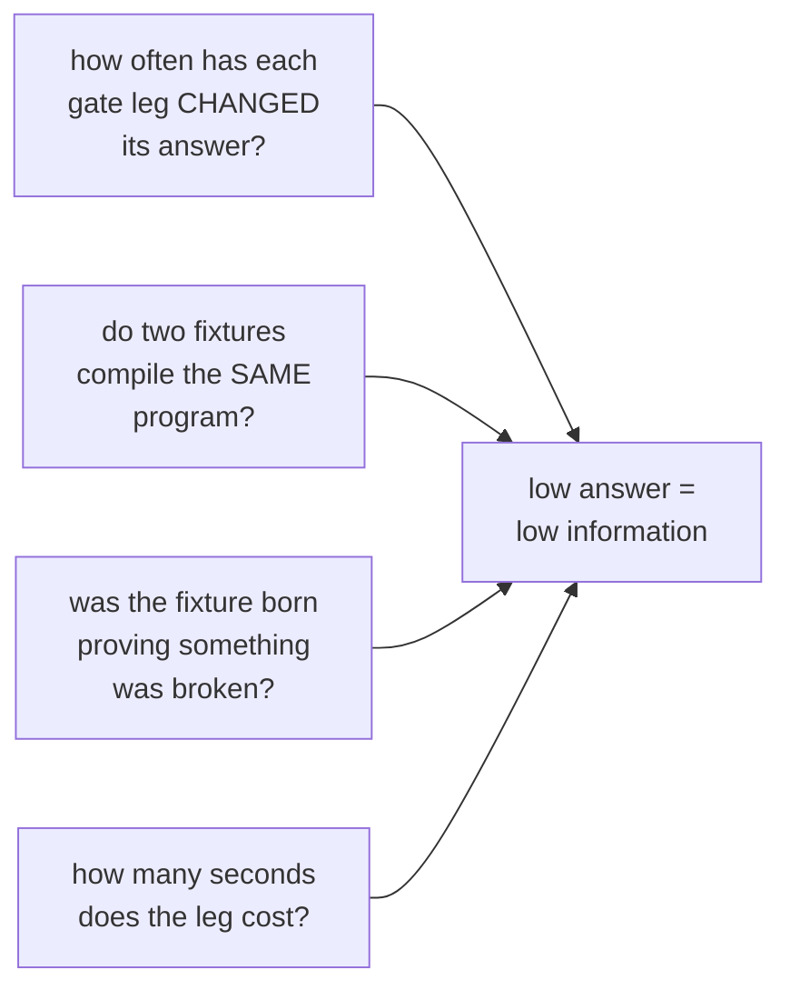
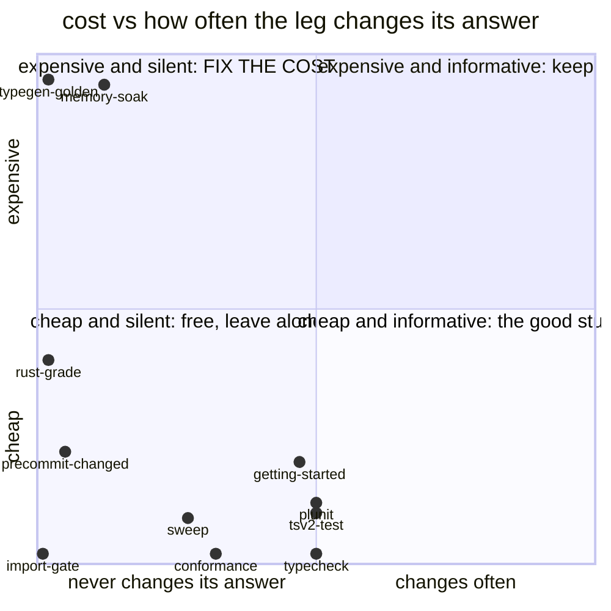
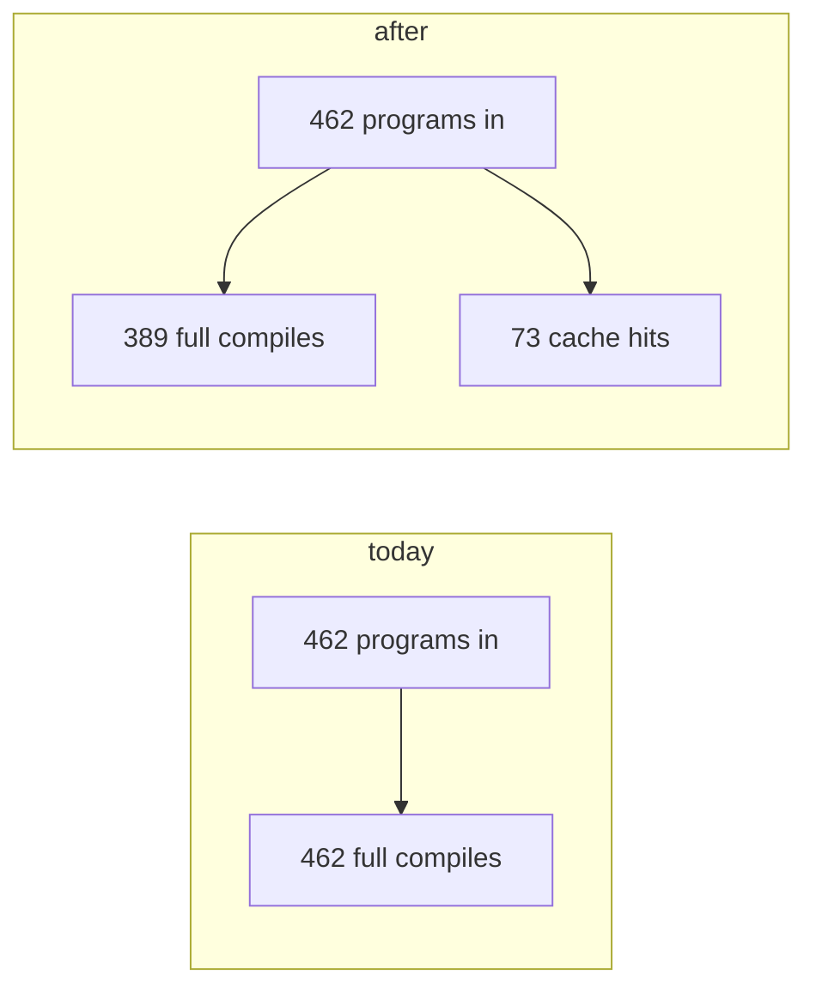
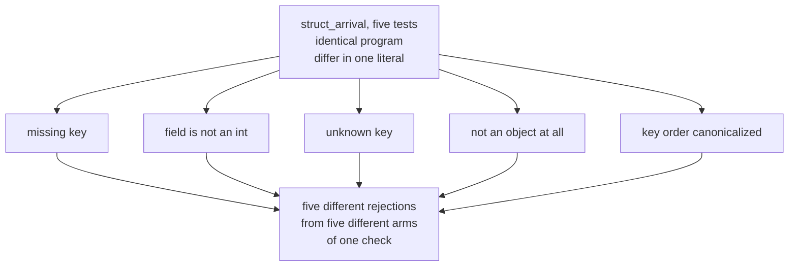
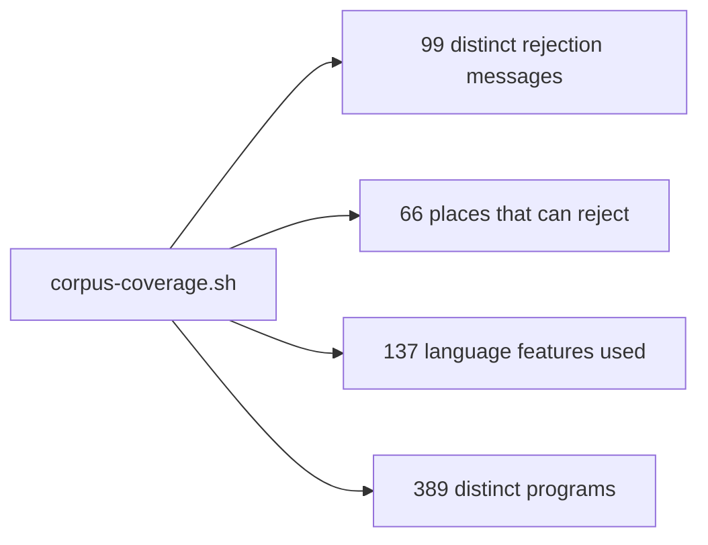
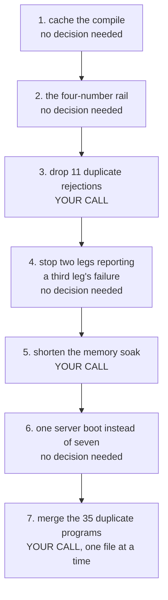

# Test estate compaction, in plain words

## Contents

1. [What we counted](#what-we-counted)
2. [The one picture](#the-one-picture)
3. [The table you asked for](#the-table-you-asked-for)
4. [The best single move](#the-best-single-move)
5. [What looks redundant and is not](#what-looks-redundant-and-is-not)
6. [Order of work](#order-of-work)

---

## What we counted

Not "does this test feel duplicated". Four measurements:

Two numbers set up everything else.

The corpus runs **462** test programs to cover **389** different programs.
73 of them are exact repeats of a program the same run already compiled.

Over the last 74 recorded full gate runs, **10 of 36 legs never once changed
their verdict**. Ten legs that always said the same thing. Their time adds to
174 seconds. Two of them cost over 100 seconds each.

---

## The one picture

Where the gate's time goes, and how much each part tells you.

Top-left corner is the whole story. Two legs sit up there. They are the
compaction targets and neither one is a test you delete.

---

## The table you asked for

| segment | count today | count after | what gets riskier |
|---|---:|---:|---|
| conformance test programs | 462 | 396 | a merged program reports one PASS, so a break in its fourth step no longer names itself. Nothing else: every rejection reason, every throw site, every construct and every schedule still runs |
| compiles the corpus performs per pass | 462 | 389 | nothing. The repeats become cache hits |
| test programs that stop at a rejection | 110 | 99 | nothing. When a program is rejected the rest of the test never executes, so two tests reaching the identical rejection message differ only in text nobody runs |
| distinct rejection messages proven | 99 | 99 | this is the number that must not move. It is the coverage |
| distinct places in the compiler that can reject | 66 | 66 | same |
| distinct language features exercised | 137 | 137 | same |
| compiler unit tests | 917 | 917 | none proposed. Deleting them saves no time: five tests carry ninety percent of that leg's clock and 365 of them finish in under a millisecond |
| node runtime tests | 242 | 242 | none proposed. 43 of the 74 files check only the final answer and never the number of statements. Those want a count ADDED, not removal |
| gate legs | 36 | 36 | none removed. Two get cheaper, two stop reporting a third leg's failure as their own |
| whole gate wall, typical | 187s | ~109s | nothing measurable. All three savings come from repeated work and one soak's length |

Everything in the "count after" column that removes a row is a proposal for
you, not a decision. Nothing was deleted in this lane.

---

## The best single move

**Remember the compile.**

The corpus contains 73 programs that are byte-for-byte identical to a program
compiled earlier in the same run. Right now each one is parsed, planned,
lowered and booted from scratch. Cache the result on the program text and they
become free.

Four separate gate legs each compile the whole corpus, and one of them does it
twice, so the same 73 repeats happen five times a gate run.

This deletes no test, changes no expectation, and cannot lose a single bit of
coverage. It is the only item on the list that needs no decision from you.

Second best: the memory soak runs alone for 113 seconds, has been red 71 of the
last 74 runs against one known unfixed problem, and its length is a free
parameter. Halving it keeps the same shape of check.

---

## What looks redundant and is not

The five test programs whose names differ by one word are the ones we most
wanted to cut. They turned out to be the best tests in the corpus.

All five were written the day the defect was found, with the broken output
recorded in the commit message. Same for the eight JSON patch tests and the
seven relation-depth tests.

The tests that came in with nobody writing down what was broken are a different
population, and they are three quarters of the corpus. The thirteen module-path
tests are the clearest case: thirteen tests, thirteen different programs, not
one of them born from an observed failure.

That split is the whole finding. It is not "families of similar names are
waste". It is "tests written to prove a fix are earned; tests written to fill a
grid are not, and they cost the same".

---

## The one thing to fix first, before any deletion

The corpus has never been pruned. In its entire history 477 test programs went
in and 15 came out, and 14 of those 15 were renames.

So there is no habit and no safety net. Before removing anything, one small
script that prints four numbers:

Commit those four numbers as the baseline. After that, any deletion that keeps
all four is provably safe, and any that moves one is caught the same minute.
Without it, every deletion is an argument. With it, every deletion is a gate.

---

## Order of work

Steps 1, 2, 4 and 6 need nothing from you. Steps 3, 5 and 7 remove or rewrite
something and are yours to approve.

Doing only steps 1, 2, 3 and 5 takes the typical gate from 187 seconds to about
109 and removes 11 test programs, none of which can tell you anything the ones
beside them do not already say.
