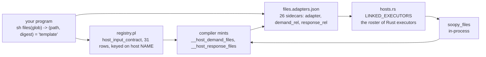
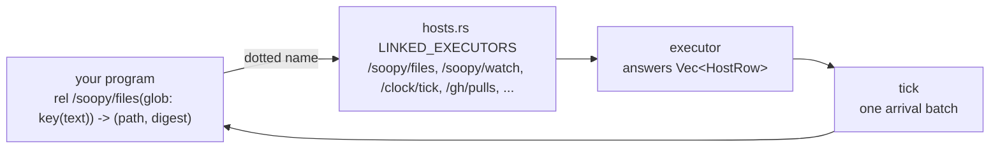
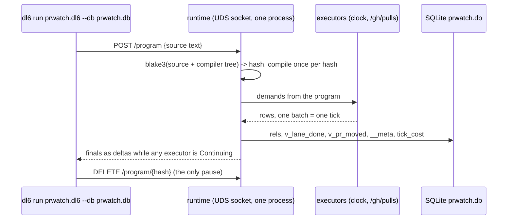

# One name: a rel, an executor path, rows in, rows out

| section | |
|---|---|
| [1. The sentence](#1-the-sentence) | what changes |
| [2. Today, four tables](#2-today-four-tables) | why it confuses |
| [3. After, one table](#3-after-one-table) | the shape |
| [4. Spelling, before and after](#4-spelling-before-and-after) | every construct |
| [5. The PR watcher, written in the after form](#5-the-pr-watcher-written-in-the-after-form) | a whole program |
| [6. A tick, step by step](#6-a-tick-step-by-step) | real values |
| [7. The resident runtime](#7-the-resident-runtime) | process shape |
| [8. What each lane builds](#8-what-each-lane-builds) | three lanes, one board |
| [9. Your four calls](#9-your-four-calls) | decisions only you make |

## 1. The sentence

A rel whose name has a dot gets its rows from the executor the dot names; `key(...)` on a column says which inputs identify an answer; every arrival batch is one tick.

## 2. Today, four tables



Four places hold one fact. Rename a host and you touch all four. The template string after `=` is dead text on the Rust door since ShellExecutor was deleted.

## 3. After, one table



One roster, in Rust, with a test that every dotted name in the conformance corpus resolves. A dotted name with no executor is a construction stop naming the roster. Goldens swap executors with a runner flag, never a sidecar:

```
dl6 run prog.dl6 --executor /gh/pulls=fixture:fixtures/pulls.jsonl
```

## 4. Spelling, before and after

| before | after | rows come from |
|---|---|---|
| `rel want(glob: text).` | unchanged | `--arrive`, a schedule, or a fact line |
| `sh files(glob: text) -> (path: text, digest: text) = '...'` | `rel /soopy/files(glob: key(text)) -> (path: text, digest: text).` | one answer per distinct `glob` |
| `bind watch(glob, path, digest).` | `rel /soopy/watch(glob: key(text)) -> (path: text, digest: text).` | same rows, re-answered on every fs change |
| `bind interval(period: int, bucket: int).` | `rel /clock/tick(every: key(int)) -> (bucket: int).` | re-answered when `floor(epoch/every)` turns over |
| `sh fetch(ep, prev, bucket) -> (status, tag, ...)` | `rel /http/fetch(url: key(text), prev_tag: text) -> (status: int, tag: text, body: json).` | one GET per distinct `url`; `prev_tag` only makes a stale answer re-ask |
| nothing | `rel /gh/pulls(repo: key(text)) -> (number: int, head_ref: text, head_sha: text, state: text, merged_at: text).` | one paginated walk per repo per tick |
| `) key(1)` suffix | `key(text)` on the column | identity is in the declaration |
| `host_input_contract` rows | deleted | |
| `*.adapters.json` | deleted | |
| `__host_demand_x`, `__host_response_x` | still minted, never written by you | internal |

The arrow keeps its one meaning: right-side columns arrive per distinct left-side question. No arrow, no executor, rows just show up.

## 5. The PR watcher, written in the after form

```
rel /clock/tick(every: key(int)) -> (bucket: int).
rel /gh/pulls(repo: key(text), bucket: int)
  -> (number: int, head_ref: text, head_sha: text, state: text, merged_at: text).

rel repo(slug: text).
repo('hafley66/sprefa').

rel pr_seen(repo: text, number: int, state: text, bucket: int) log keep(all).
rel pr_now(repo: text, number: int, state: text) key(2).
rel pr_moved(repo: text, number: int, from_state: text, to_state: text, at_bucket: int).
rel lane_done(branch: text, number: int, head_sha: text).

pr_seen(Repo, Number, State, Bucket) <-
  repo(Repo), /clock/tick(60, Bucket),
  /gh/pulls(Repo, Bucket, Number, _, _, State, _).

pr_now(Repo, Number, State) <+ pr_seen(Repo, Number, State, _).

pr_moved(Repo, Number, From, To, Bucket) <-
  pr_seen(Repo, Number, To, Bucket),
  pr_seen(Repo, Number, From, Earlier),
  Earlier < Bucket, From != To.

lane_done(Branch, Number, Sha) <-
  /gh/pulls(_, _, Number, Branch, Sha, 'MERGED', _),
  starts_with(Branch, 'feature/').

? lane_done(Branch, Number, Sha).
? pr_moved(Repo, Number, From, To, Bucket) order by Bucket desc.
```

Pure rxjs lowering, so the design holds: `/clock/tick` is `interval(60_000).pipe(map(bucket))`; `/gh/pulls` is `switchMap(bucket => fetchPulls(repo))` with `distinctUntilChanged` on the row set; `pr_seen` is `scan` appending; `pr_now` is `scan` replacing by key; `pr_moved` is a self-join over the `scan` buffer.

## 6. A tick, step by step

```
step 0  boot          repo={sprefa}               /clock/tick(60) -> demand{every:60}
step 1  clock answers bucket=29812345              tick 1: pr_seen gets 0 rows, /gh/pulls demand{repo:sprefa, bucket:29812345}
step 2  /gh/pulls      GET /repos/.../pulls?state=all, ETag miss, 200, 4 rows
                      tick 2: pr_seen += 4, pr_now = 4 rows, pr_moved = 0
step 3  60s later     bucket=29812346              tick 3: new /gh/pulls demand, GET with If-None-Match
step 4  /gh/pulls      304, 0 bytes, same 4 rows    delta at the rel boundary = 0 rows, no tick downstream
...
step 9  bucket=29812351, PR #406 state OPEN -> MERGED
                      tick 9: pr_seen += 1, pr_now replaces 1, pr_moved += 1, lane_done += 1
steady state: one GET per 60s, 0 bytes on 304, memory flat; the 10s law holds per tick
```

## 7. The resident runtime



`tick_cost(bucket, executor, wall_ms, bytes, rss_kb)` is a rel the runtime feeds from its own trace spans, so the program measures itself in the same db it measures GitHub in.

## 8. What each lane builds

| lane | owns | delivers |
|---|---|---|
| arrivals-and-ticks (fable, HELD until you say GO) | `v6/prolog/**`, `hosts.rs` roster | the after spelling in section 4, registry host rows and sidecars deleted, suffix `key(N)` rewritten where touched |
| pr-watch-resident (opus, running) | `run.rs`, `runtime.rs`, `executors/{clock,watch,pulls}.rs`, `v6/dl/prwatch/` | sections 5 to 7 on today's spelling; re-spelled when the fable lane lands |
| soopy-rev-vs-worktree (opus, running) | `change_facts.rs`, `executors/{repo_at,git_*,checkout}.rs`, crosswalk fixtures | `Revision::Worktree` vs `Commit(sha)` explicit at every read; no shell git in fixtures |

## 9. Your four calls

| call | option a | option b |
|---|---|---|
| the dot | executor path, `/soopy/files` | URL-ish, `soopy://files` |
| goldens | runner flag `--executor name=fixture:path` | keep one sidecar for fixtures only |
| list batching | `rel /http/fetch(urls: key(list(text))) -> ...`, one call per batch | one call per row, ETag makes it cheap |
| suffix `key(N)` in the 99 files | rewrite all in one lane | rewrite only what the collapse touches |

## 10. What landed, 2026-08-21

| call | your answer | where it is now |
|---|---|---|
| the dot | option a, `/soopy/files` | parser takes a slash path anywhere a dotted one was taken; both reach the same `__` atom |
| goldens | neither, yet | canned answers ride `--arrive` and the schedule file; no fixture executor exists |
| list batching | open | `HttpFetchExecutor::run` still answers one url per call |
| suffix `key(N)` | option b, only what the collapse touched | the corpus is on suffix `key(N)`; the annotation form parses and is the ruling's preferred spelling |

Two rows in section 4 are still ahead of the tree. `host_input_contract` rows
are NOT deleted: they are the fallback for a program that reaches the compiler
as terms rather than as text. `*.adapters.json` is deleted everywhere the
collapse reached, which is now every rail and rel the gates run.

`/soopy/watch`, `/clock/tick` and `/gh/pulls` are named in the roster comment
and built by the pr-watch-resident lane, not here.

## 11. One fork left, and it needs you

After merging main `3d65add5b` (#405 `dl6 run/watch`, #406 `files_at`, #407 the
resident PR watcher), three programs are red and all three are the same root:
**`bind` is gone from the surface and its replacement is not built.**

| program | spells | needs | whose file |
|---|---|---|---|
| `v6/dl/fixtures/served-watch-rail.dl6` | `rel watch(...)`, inert | `/soopy/watch` | mine, and MY regression |
| `v6/sprefa-engine-rs/tests/fixtures/tick_cost_beat.dl6` | `bind interval` | `/clock/tick` | engine tests |
| `v6/dl/prwatch/prwatch.dl6` | `bind interval`, `sh pulls`, `sh cost` | `/clock/tick` | pr-watch lane |

`served-watch-rail.dl6` is on me: commit `5dc44a3d0` rewrote its `bind watch`
line to a plain `rel watch(...)`, which arms no watcher, and no test drove that
file until #405 landed. `run.rs:753` arms the watcher off a **bindPlan**, so
today nothing else can arm it. `executors/clock.rs` and `executors/watch.rs`
do not exist in the merged tree.

| your call | what it costs |
|---|---|
| **a. build `/soopy/watch` and `/clock/tick` now** | touches `run.rs` and two new executor files, which my brief names FORBIDDEN and the pr-watch lane owns |
| **b. let `bind` parse for the two cadence forms until they land** | contradicts your "bind is DEAD (interval and watch forms included)" |
| **c. land the slash paths, hand the cadence to the pr-watch lane** | three tests stay red until that lane re-spells, which section 8 already says it will |

I did not pick. Everything not in that table is green.
