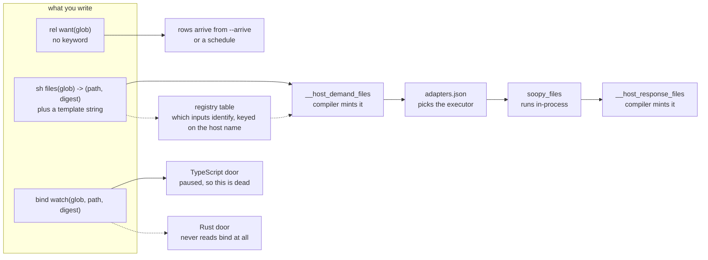
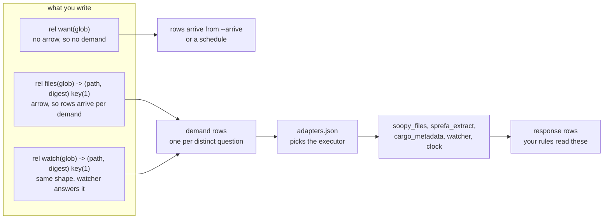
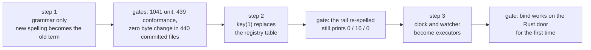

# One concept: a rel with external arrivals

## Contents

1. [The one sentence](#1-the-one-sentence)
2. [Three doors today](#2-three-doors-today)
3. [One door after](#3-one-door-after)
4. [Word today, word after](#4-word-today-word-after)
5. [A row's whole journey, with real values](#5-a-rows-whole-journey-with-real-values)
6. [The one thing blocking it](#6-the-one-thing-blocking-it)
7. [Two silent defects the collapse kills](#7-two-silent-defects-the-collapse-kills)
8. [Three steps](#8-three-steps)
9. [Four questions for you](#9-four-questions-for-you)

---

## 1. The one sentence

You said sh, bind and host are all rels that can have external arrivals. The
compiler already agrees with you and nobody finished the sentence: a rel with
no rule writing into it is already treated as a rel the outside world pushes
rows into. `sh` and `bind` are two extra keywords that say the same thing a
third and fourth way.

## 2. Three doors today



10 shapes. Two things to notice. The registry table is where the compiler
decides which of your inputs identify an answer and which just make it stale,
and that table is keyed on the host NAME, so it lives outside your program.
And `bind` reaches only the paused door, which means every clock and every
watcher in the corpus is already dead on the door you chose.

## 3. One door after



9 shapes. The arrow is the whole language change. An arrow means a demand
exists, so rows on the right side arrive once per distinct question about the
left side. No arrow means the rows just show up. `key(1)` says column 1 is what
the answer is ABOUT; every other input is only there to make a stale answer
re-ask.

## 4. Word today, word after

| word today | what it means | word after |
|---|---|---|
| `sh files(glob) -> (path, digest)` | a rel fed by a command | `rel files(glob) -> (path, digest)` |
| `bind interval(period, bucket)` | a rel fed by the clock | `rel interval(period) -> (bucket)` |
| `bind watch(glob, path, digest)` | a rel fed by the file watcher | `rel watch(glob) -> (path, digest)` |
| `rel want(glob)` | a rel fed by a seed | unchanged |
| the template string | dead text on the Rust door | gone from what you write |
| the registry table of which input identifies | invisible, keyed on the name | `key(1)` on the declaration |
| the adapters sidecar | which executor answers | unchanged |
| host, bind, sh, port | four words for one idea | rel |

## 5. A row's whole journey, with real values

Real numbers, read off the dead-module rail against your hafley-rs checkout.
The rail asks two questions: which files are tracked, and what does each one
call. Watch one file get from the first question to the second.

```
step 0  you seed one row
        want = "crates/*/src/*.rs"

step 1  the rel with an arrow turns that into a question
        demand:  identity  identity|files|glob:text=crates/*/src/*.rs
                 witness   witness|files|glob:text=crates/*/src/*.rs
                 glob      crates/*/src/*.rs

step 2  the sidecar says soopy answers this one, and it has not been
        asked before, so it runs. One git call for the whole pathspec.

step 3  the answer comes back as rows, not as text. Row 0 of 82:
        response: witness   witness|files|glob:text=crates/*/src/*.rs
                  ordinal   0
                  glob      crates/*/src/*.rs
                  path      crates/boop-acp/src/channel.rs
                  digest    589d1271765202c7cdc505fb0e64930bc58102c8

step 4  your rule reads that row and asks the SECOND question, once per file
        demand:  identity  identity|extract|path:text=crates/boop-acp/src/channel.rs
                 witness   witness|extract|path:text=crates/boop-acp/src/channel.rs
                           |digest=589d1271765202c7cdc505fb0e64930bc58102c8
                 path      crates/boop-acp/src/channel.rs
                 digest    589d1271765202c7cdc505fb0e64930bc58102c8

step 5  ... 81 more files, identical shape, one row each ...

step 6  every file with the same digest as last run is a witness already
        claimed, so it never re-runs. Steady state: zero executor calls,
        zero re-derived rows.
```

That is the steady state, not a base case. The loop stops because a witness
that has been claimed once is never claimed again, and a file whose contents
did not change produces the same witness.

Two details worth keeping. The witness is not a hash, it is the plain text you
see above, which is why you can read a demand row and know exactly what was
asked. And notice `path` carries `:text` in the witness while `digest` does not:
that is the difference between an input that identifies the answer and an input
that only makes a stale answer re-ask.

## 6. The one thing blocking it

The line you would want to write already means something else:

```
rel extract(path: text, digest: text) -> (record: text, family: text, callee: text).
```

That compiles today, cleanly, and produces a rel with THREE columns called
`path`, `digest` and `return`, where `return` is one packed value holding the
other three. The arrow on a rel already means "the last column is the answer",
and a parenthesized group after it already means "an unnamed struct type".

So the budget you set, rel syntax plus the arrow and no new keywords, is
already spent. Taking the arrow back costs exactly one line in the whole
corpus: `v6/dl/fixtures/anonymous-type-syntax.dl6` line 5. The unnamed struct
type keeps its other spelling, which puts the parentheses in a column position
instead, and the tree-sitter fixture already uses that form.

That is a language call, so it is question 1 in section 9 and no lane touches
it.

## 7. Two silent defects the collapse kills

**A rel and a host may share one name, and the host wins with no warning.**
Declare `rel files(glob, path, digest)` and `sh files(glob) -> (path, digest)`
in one program and it compiles clean. Your rules read the host. The table you
declared is created, is writable, and is never read by anything. Measured, not
guessed.

**The template string is the reason an executor runs once instead of 82
times.** The runtime groups demands by the filled-in command text, so four
declarations sharing one template collapse into one call per file. That is
where the rail's speed comes from. Take the template out of what you write and
that grouping key has to be rebuilt from the executor name and the inputs. The
plan probes this before step 1 rather than after.

## 8. Three steps



Step 1 changes nothing below the parser. The new spelling turns into the exact
same internal term the old spelling produces, which is what keeps the paused
TypeScript door byte-identical without editing it at all.

Step 3 is the only one that writes runtime code, and it has a rule attached: no
hand-written file watcher until the library options are priced in writing.

## 9. Four questions for you

1. **The arrow.** Does a parenthesized group after `->` on a rel mean response
   columns from now on? Cost is one line in the corpus. Section 6 has it.

2. **`key(1)` doing two jobs.** On an ordinary stored rel `key(...)` already
   means the unique columns of the table. On an arrival rel it would also mean
   which inputs identify the answer. Same word, two readings. Fine, or does the
   second one want its own spelling?

3. **`sh` and `bind` after this.** The plan keeps them as old spellings that
   still parse, because that is what keeps the paused door frozen. Delete them
   from the language later, or never?

4. **The fixture answers.** One kind of test host answers by having its answer
   written inside the template string. With no template, that answer has to
   move into the sidecar. Move it, or leave those tests on the old spelling?

## 10. What the lane did with the four questions (2026-08-21, brief-directed)

The arrivals-and-ticks brief said: pick the reading where a rel with outside
rows is still just a rel, write it into rulings.pl, keep going. The picks:

| question | pick | ruling row |
|---|---|---|
| the arrow | a `( name :` group after `->` IS the response column list | arrival_arrow_spelling |
| key() twice | on an arrival rel, key() = which inputs identify the answer | arrival_identity_spelling |
| sh and bind | dead now, not later; old text answers `removed_word` | sh_bind_surface_removed |
| fixture answers | a canned answer is an arrival batch (`--arrive` / schedule) | fixture_answers_are_arrivals |

One NEW question came out of the batching work and waits on you, in plain
words: six endpoints can fold into one demand through `json_group_array`, and
the executor half is built and count-tested (6 endpoints, 1 call). What blocks
the language half is that the reference engine cannot spell a json value
inside a witness digest, while the SQL door can. Section 14 of the PLAN has
the two throw sites and the two ways out.
