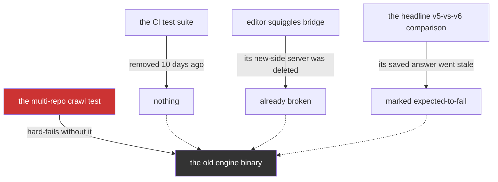
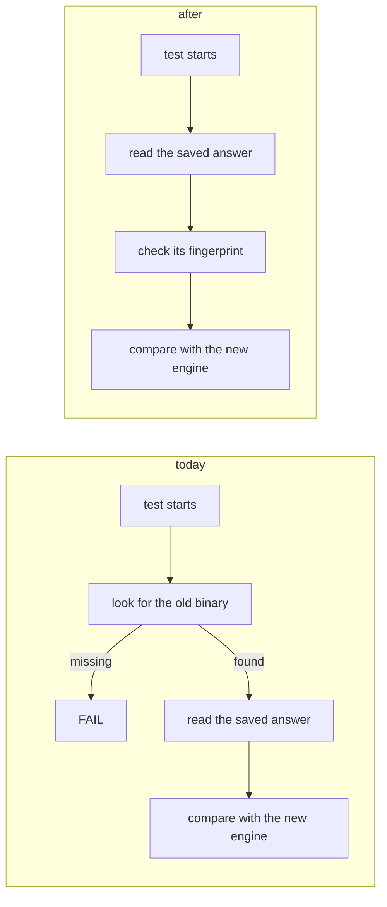
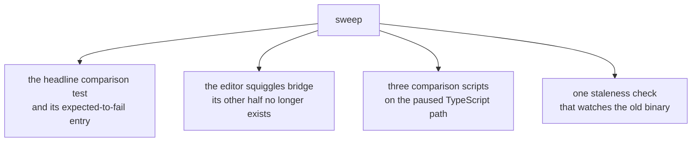
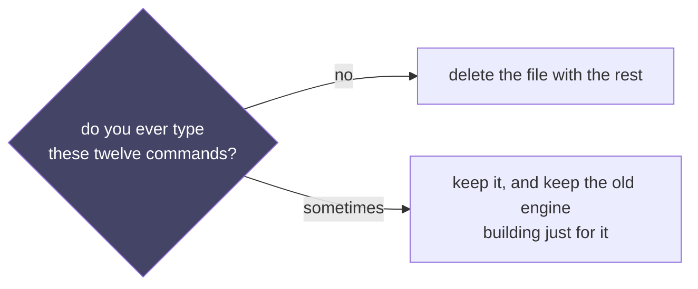
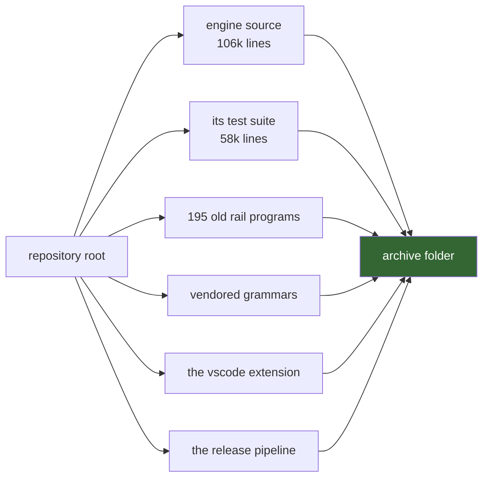
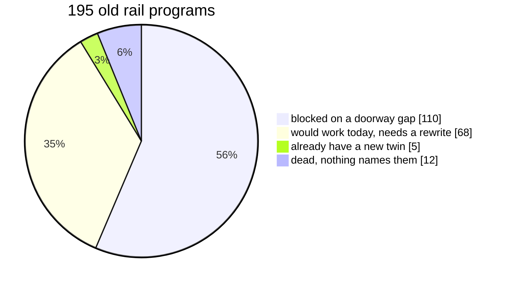
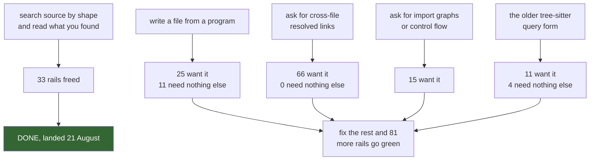

# Retiring v5, in plain words

No file paths, no line numbers. The version with receipts sits beside this one.

## Contents

- [The short version](#the-short-version)
- [Phase 0: what is actually holding v5 alive](#phase-0-what-is-actually-holding-v5-alive)
- [Phase 1: cut the last cord](#phase-1-cut-the-last-cord)
- [Phase 2: sweep the corpses](#phase-2-sweep-the-corpses)
- [Phase 3: the one thing that needs your word](#phase-3-the-one-thing-that-needs-your-word)
- [Phase 4: delete](#phase-4-delete)
- [The other story: the old rails](#the-other-story-the-old-rails)
- [What you are choosing to lose](#what-you-are-choosing-to-lose)
- [Your one next move](#your-one-next-move)

## The short version

You asked why usurping v5 is taking so long. It is not taking long any more.
One automated test still runs the old engine. Everything else that reaches it is
already broken, already marked as expected-to-fail, or a shortcut in a file
nobody runs.

The new extractor is not behind the old one. It pulls out MORE facts from source
code than v5 ever did. What is behind is the doorway: a program written in the
new language can only ask the extractor for about half of what the extractor
knows. That is wiring, and it is small.

## Phase 0: what is actually holding v5 alive

Four things were believed to depend on the old engine. Three of them stopped
working weeks ago and nobody noticed.

Only the red box is real. One test.

## Phase 1: cut the last cord

That test already has the old engine's answer saved in the repository as a
file. It does not need to re-run the old engine to compare against it; it just
insists on finding the binary first.

Delete the "look for the old binary" step, add a fingerprint check on the saved
file so it cannot silently drift. That is the whole change, and the day it lands
is the day the old engine stops building.

## Phase 2: sweep the corpses

Three scripts and one bridge that already do not work. Deleting them is not a
risk; it is admitting what is true.

After this the word "v5" appears in the new tree only in prose.

## Phase 3: the one thing that needs your word

There is a shortcuts file at the top of the repository with twelve one-line
commands that run old rails by hand. No test uses it. No CI job uses it. It is
there for a human who wants to poke at something.

This is the only decision in the whole plan.

## Phase 4: delete

Once phases 1 to 3 are done, the old engine moves to the archive folder beside
the other two archived versions. It is a large move and a boring one.

Then four helper definitions that teach an assistant how to add features to the
old engine get deleted too, so nobody is handed a checklist for a thing that no
longer exists.

## The other story: the old rails

There are 195 little programs written in the old language: lint rails, graph
reports, code generators. They are a separate question from the binary, and they
do not hold the retirement up.

That chart moved 33 slices while this census was being written. A doorway that
lets a program search source code by shape, and read the text it found, landed
on the main branch. It is the single thing 33 of those rails were waiting for,
and it is why both of the two rails you named as live now ship as ports here
rather than one shipping and one being filed as impossible.

The blocked ones are not blocked by anything missing in the extractor. They are
blocked by the doorway. Two gaps account for almost all of them:

Writing a file is now the cheapest buy: 11 rails need nothing else, and the card
for it is already open. The resolved-links gap is the biggest group but frees
nothing on its own, because every rail that wants one resolved link wants two.

The extractor knows every one of these things. Its command-line tool will print
them for you today. The engine just does not know how to ask.

## What you are choosing to lose

Seven capabilities the old engine had that the new one will not, listed so
nobody re-discovers them as bugs in six months.

| capability | last used |
|---|---|
| code similarity by embedding, and graph embeddings | 2026-07-02 |
| suggested refactorings (extract this, clone that) | 2026-07-09 |
| type-shape generalization | 2026-07-09 |
| the drawable flow panel and its graph sinks | 2026-07-20 |
| reading the assistant's own edit trail as facts | 2026-07-09 |
| the engine describing its own relations to itself | 2026-07-20 |
| who first wrote each file | 2026-07-01 |

Nothing in the last seven weeks has asked for any of them.

## Your one next move

Answer the Phase 3 question: do you ever type the twelve shortcut commands at
the top of the repository?

Yes, and the old engine keeps building for you alone. No, and it stops building
the day one small test change lands.
