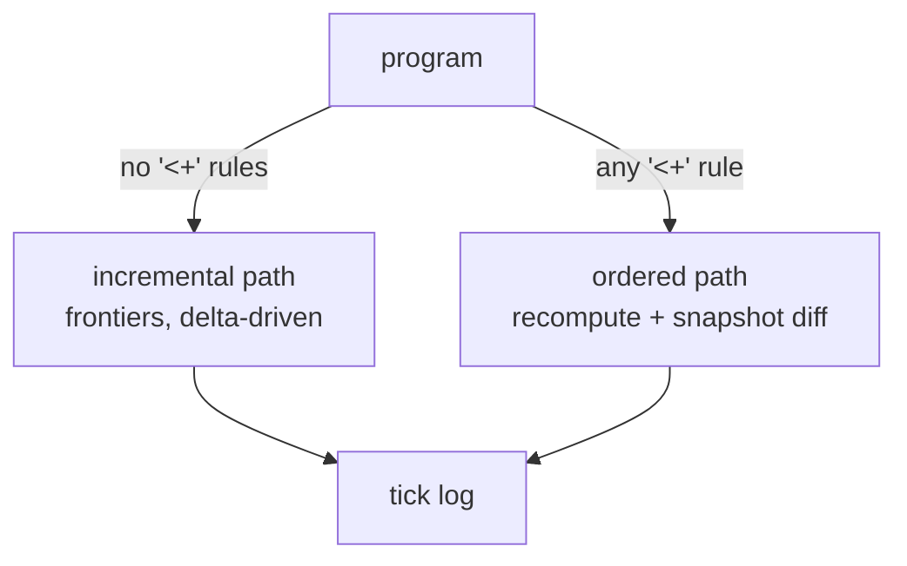
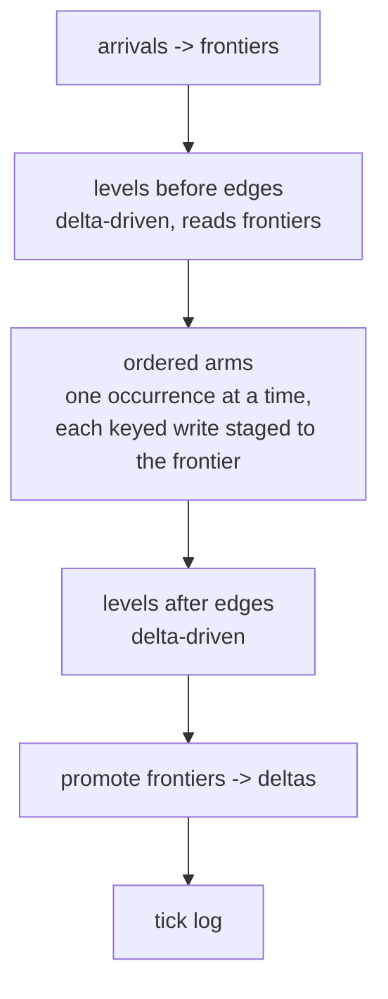

# One tick path

Design rule (Chris, 2026-08-23): invalidate red/green; a rel does work only when something it depends on changed. Recompute-everything is out.

Status: proposal, not dispatched. Read after #423 (dirty set on the ordered path) lands.

- [What a tick is](#what-a-tick-is)
- [Today: two engines](#today-two-engines)
- [Before: the ordered tick](#before-the-ordered-tick)
- [After #423: same shape, skips](#after-423-same-shape-skips)
- [End state: one path](#end-state-one-path)
- [Why the ordered path exists at all](#why-the-ordered-path-exists-at-all)
- [What changes for a program author](#what-changes-for-a-program-author)
- [Risks](#risks)
- [Order of work](#order-of-work)

## What a tick is

One tick = one batch of arrivals goes in, every derived rel settles, the tick log prints what changed.


## Today: two engines

The compiler picks the engine per program, by one property.



| | incremental path | ordered path |
|---|---|---|
| who | programs with only `<-` rules | any program with a `<+` rule, ghcache included |
| how it finds change | reads the frontier (the new rows) per rel | reads every rel before and after, diffs in Rust |
| work per idle tick | per rel: frontier clear and promote | per rel: 5 reads + 2 rebuilds |
| labelled in the trace | yes, 18 scopes | no, 0 scopes |

## Before: the ordered tick

ghcache: 154 rels, 100 derived, 52 `<+` arms. One arrival.

```
step 0  snapshot ALL 154 rels, twice            308 SELECT    "before"
step 1  insert the arrival                        1 INSERT
step 2  rebuild ALL 100 derived rels             100 x (DELETE rel; INSERT ... SELECT full join)
step 3  snapshot ALL 154 rels                    154 SELECT    "mid"
step 4  run each <+ arm that an occurrence hit    35 stmts     (the only change-sized work)
step 5  rebuild ALL 100 derived rels AGAIN       100 x (DELETE; INSERT ... SELECT)
step 6  snapshot ALL 154 rels, twice             308 SELECT    "after"
step 7  diff before/after in Rust                 0 SQL        -> the deltas
step 8  clear every rel's frontier tables        154 DELETE
        ~1,900 statements; 0 arrivals costs the same  (steady state, every tick)
```

Measured: 23 ms of SQLite per tick, ~20 µs per statement. Count, not weight.

```mermaid
flowchart LR
  subgraph one tick, before
    direction LR
    S1[snapshot all] --> R1[rebuild all] --> S2[snapshot all] --> A[arms] --> R2[rebuild all] --> S3[snapshot all] --> DF[diff]
  end
```

## After #423: same shape, skips

A per-tick dirty set. Free: SQLite already returns `rows changed` on every write.

```
step 0  dirty = {}
step 1  insert the arrival -> dirty = {pr_batch_arrival}
step 2  rebuild ONLY derived rels that read a dirty rel      ~6 rebuilds, not 100
        a rebuild that changed rows adds its rel to dirty    dirty = {.., pr_batch_response, gql_pull, ..}
step 3  snapshot ONLY dirty rels (their "before" was read lazily, just before their first write)
step 4  arms, as today
step 5  rebuild ONLY rels reading something dirtied since step 2
step 6  snapshot ONLY dirty rels
step 7  diff -> deltas, identical bytes to before
step 8  clear ONLY frontiers that were non-empty last tick
        idle tick: 0 arrivals -> dirty = {} -> ~2 statements (the clock)
```

```mermaid
flowchart LR
  subgraph one tick, after 423
    direction LR
    A0[arrival] --> D[dirty set] --> R1[rebuild readers of dirty] --> A[arms] --> R2[rebuild readers of new dirty] --> S[snapshot dirty only] --> DF[diff]
  end
```

Receipt: the tick log is byte-identical; the COUNT test caps statements per tick.

## End state: one path

The ordered path still rebuilds a derived rel from its base tables. The incremental path derives from the frontier (only the new rows joined against the rest). End state: `<+` arms run INSIDE the incremental path, between its level phases, and the ordered path is deleted.



| | ordered path today | one path |
|---|---|---|
| derive a rel | rebuild from base tables | join the frontier against base |
| find change | snapshot diff | the frontier IS the change |
| idle cost | O(rels) | O(dirty rels), near 0 |
| arms | sequential, snapshot `__pre_<rel>` per referenced rel | same sequencing, `__pre_` read from frontier + base |
| trace labels | none | the 18 that exist |
| code | `ordered.rs` 766 lines | deleted |

## Why the ordered path exists at all

A `<+` rule is a keyed fold: "when X happens, update row K". Two occurrences in one tick can touch the same key, and the second must see the first's write. The incremental path computes each level as a set all at once; it has no "one occurrence at a time" notion. So the ordered path was written as: snapshot, then walk occurrences in sequence applying each write, then rebuild everything to settle.

The sequencing part is the real requirement. The rebuild-everything part was the cheapest way to settle in July, and nothing measured it until now.

```mermaid
sequenceDiagram
  participant F as frontier
  participant A as arm (keyed <+)
  participant K as keyed rel row K
  F->>A: occurrence 1 (key K)
  A->>K: write v1
  F->>A: occurrence 2 (key K)
  A->>K: read v1, write v2
  Note over K: order matters; sets do not give it
```

## What changes for a program author

Nothing in the language. `<-` and `<+` keep their meaning and their tick log. The change is which engine code runs.

## Risks

| risk | how it is caught |
|---|---|
| a skipped rebuild that should have run | tick log byte-identity on ghcache; `grade.sh` byte-clean 444 across the corpus (many fixtures have `<+`) |
| an arm reading a `__pre_` snapshot that now comes from frontier+base and differs | the `pre_occurrence_loop` fixtures (13) grade byte for byte |
| recursion inside levels under the one path | the incremental path already handles recursive levels; ordered has its own loop; one fixture per shape |
| losing the "rebuild settles everything" safety net | the dirty-set version (#423) keeps the rebuild, only skips it when provably unread; the one-path arc comes after that has soaked |

## Order of work

1. #423 lands: dirty set, COUNT test, byte-identical log. Soak on the live ghcache run for days.
2. Trace labels on whatever remains of the ordered path (engine-tick-trace follow-up), so the next measurement names rels.
3. Design session, Chris in the room: where the arms sit inside the incremental phase order, and what `__pre_<rel>` means when read from a frontier.
4. Lane: arms inside incremental, ordered path behind a flag, both graded.
5. Flip, delete `ordered.rs`, ARCH row.
