# splitting the big prolog files, in plain words

## TOC

1. [The one-sentence version](#the-one-sentence-version)
2. [The scoreboard](#the-scoreboard)
3. [What order to land them](#what-order-to-land-them)
4. [How you know nothing broke](#how-you-know-nothing-broke)
5. [The two sharp edges](#the-two-sharp-edges)
6. The boards
   - [print_dl](#print_dl-8-parts)
   - [0_dot_expand](#0_dot_expand-6-parts)
   - [0_type_plane](#0_type_plane-6-parts)
   - [compile](#compile-8-parts)
   - [0_program_check](#0_program_check-5-parts)
   - [analyze](#analyze-14-parts)
   - [parse_dl_dcg](#parse_dl_dcg-11-parts)
   - [ARCH](#arch-6-parts)
   - [emit_ts](#emit_ts-15-parts)
   - [lower, front half](#lower-front-half-16-parts)
   - [lower, back half](#lower-back-half-19-parts)
7. [Three things I want your word on](#three-things-i-want-your-word-on)

---

## The one-sentence version

Ten files keep their names and their module lines, each grows a folder of
numbered pieces, and the file pulls its pieces back in with `include`, exactly
the way `0_generic_expand.pl` already does.

## The scoreboard

| file | today | becomes | biggest piece |
|---|---:|---|---:|
| lower | 7795 | 35 pieces | 573 |
| emit_ts | 2786 | 15 pieces | 482 |
| analyze | 1891 | 14 pieces | 308 |
| parse_dl_dcg | 1776 | 11 pieces | 447 |
| 0_type_plane | 1037 | 6 pieces | 284 |
| ARCH | 1026 | 6 pieces | 288 |
| compile | 997 | 8 pieces | 219 |
| 0_program_check | 985 | 5 pieces | 359 |
| print_dl | 905 | 8 pieces | 145 |
| 0_dot_expand | 835 | 6 pieces | 168 |

114 pieces. Nothing over 700 lines. Nothing thousands-scale left.

## What order to land them

```mermaid
flowchart LR
  A["1 print_dl<br/>no hazards"] --> B["2 0_dot_expand<br/>no hazards"]
  B --> C["3 0_type_plane<br/>no hazards"]
  C --> D["4 compile<br/>folder name clash"]
  D --> E["5 0_program_check<br/>one split predicate"]
  E --> F["6 analyze<br/>one table directive"]
  F --> G["7 parse_dl_dcg<br/>ops must lead"]
  G --> H["8 ARCH<br/>five directives move"]
  H --> I["9 emit_ts<br/>paused door, optional"]
  I --> J["10 lower<br/>waits on your tree"]
```

One PR each. The codex temporal lane touches none of these ten files, so
nothing here waits on it. `lower` waits on your uncommitted work in the main
tree, and that is the only wait.

## How you know nothing broke

One check beats all four gates. A small script loads a module and
prints every clause it holds, in order, with no line numbers anywhere in the
output. Run it before the split, run it after, diff the two. Identical means
the database the compiler sees is bit-for-bit what it was.

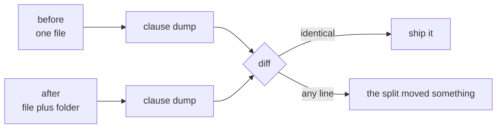

On top of that, the four gates, all measured green on the base commit before
any of this was written: conformance 445 pass 0 fail, plunit 1115 pass 0 fail,
rust grade 445 graded 341 byte-clean, arc gate 7 pass 0 fail.

Two digest files the brief asked me to compare do not exist on a clean tree.
They are build leftovers that only appear after a sweep runs. For emit_ts the
substitute is a checksum list over the emitted TypeScript, taken before and
after in one worktree.

## The two sharp edges

**One.** A directive that runs inside an included file thinks it lives in the
included file's folder, not the parent's. ARCH has exactly one such directive
and it is what makes the arc gate find its fixtures. It has to stay in the
parent file. I measured this rather than guessed it.

**Two.** Pieces must be included in the same order the clauses had. Three
predicates in this tree answer with their first matching clause, so a
reordered include list would silently change which reason a bad program
reports.

---

## The boards

Arrows read "calls into". Every board is generated from the real call
structure, not sketched.

### print_dl, 8 parts

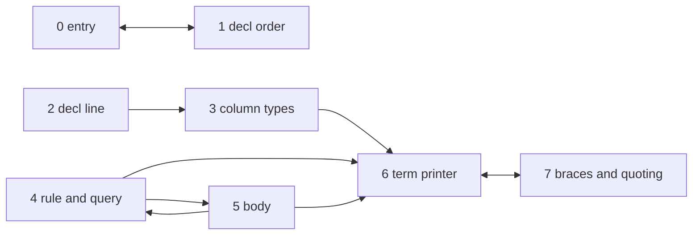

Three clean clusters: the declaration side, the rule side, and one shared term
printer everybody bottoms out in.

### 0_dot_expand, 6 parts

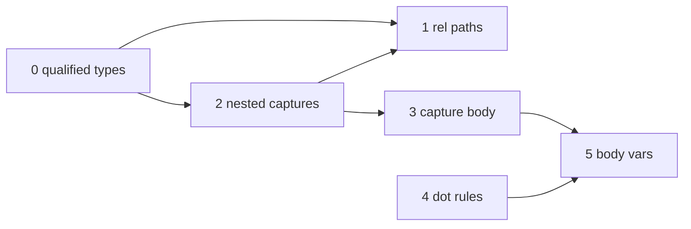

The loosest file of the ten. Six arrows total.

### 0_type_plane, 6 parts

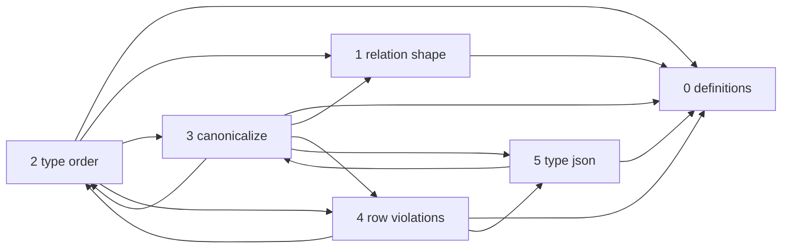

Definitions is the floor. Canonicalize and row violations lean on each other,
which is why they sit next to each other in the numbering.

### compile, 8 parts

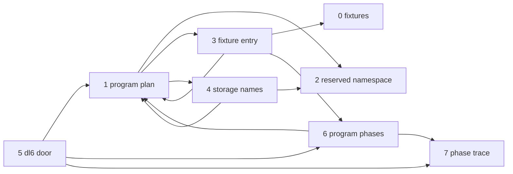

The program plan is the hub, which is right: it is the one term the two
emitters both read.

### 0_program_check, 5 parts

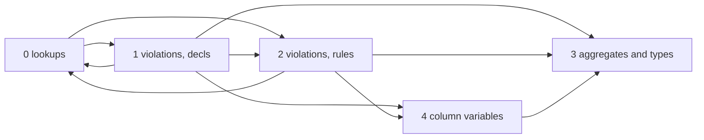

One predicate holds every violation clause and runs 670 lines. I cut it in the
middle, which is allowed because the file already declares that predicate as
spread out. If you would rather keep it whole, it becomes one 671-line piece
and the plan changes by one line.

### analyze, 14 parts

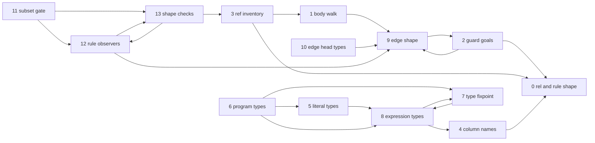

Two halves that barely talk: the type inference chain on the left, the shape
checking chain on the right.

### parse_dl_dcg, 11 parts

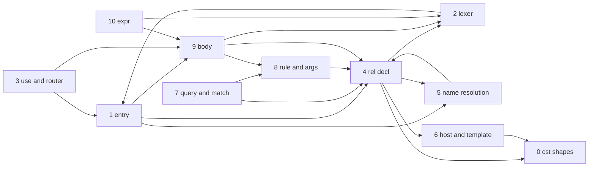

The rel declaration grammar is the biggest piece at 447 lines, and it is the
piece everything else reaches into. The lexer and the shape tables sit at the
bottom.

### ARCH, 6 parts

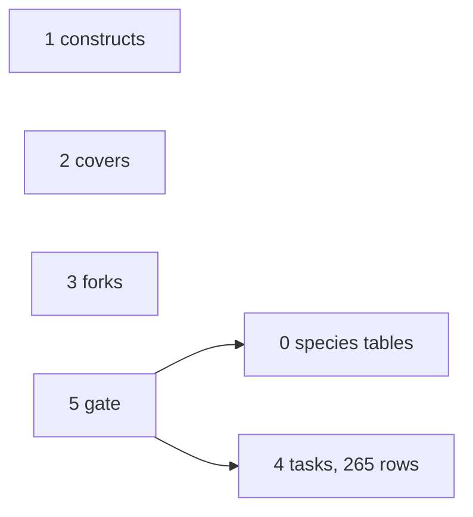

Almost no coupling, because it is data. One table per piece, and the gate at
the end reads two of them. I split by table rather than by arc family: the gate
walks every task row and every covers row at once, so keeping each table whole
is what its own code assumes.

Also worth knowing: the rows are `task(Name, Status, Deps)`, three arguments,
not five. The brief's spelling was stale.

### emit_ts, 15 parts

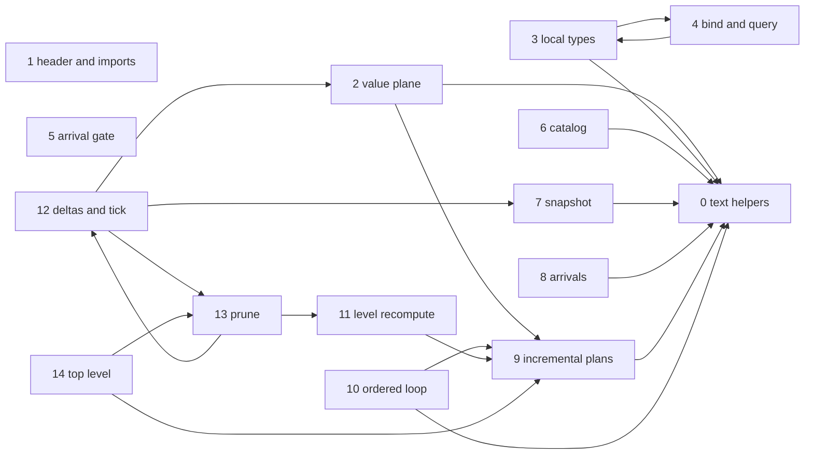

One text-helper piece that eleven others call, and one big incremental-plan
piece at 482 lines. The top level pulls all of it together.

This is the paused TypeScript door. The split is planned and gradeable, and my
recommendation is to skip it until the door un-pauses.

### lower, front half, 16 parts

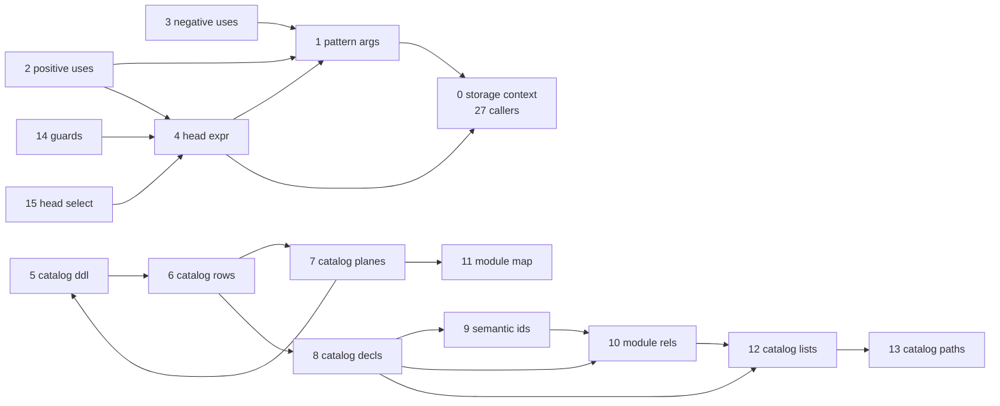

Two clusters. Body compilation on the left, the program catalog on the right.
Storage context is the shared vocabulary: table names, quoting, frontier ids,
called by 27 of the 35 pieces.

### lower, back half, 19 parts

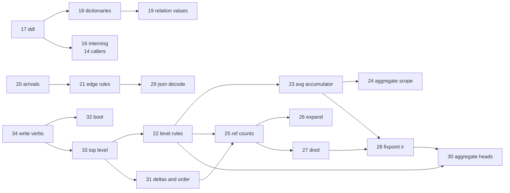

The lowering pipeline proper. Interning is the second shared vocabulary,
called by 14 pieces. Write verbs is the end of the road.

---

## Three things I want your word on

1. **What do I call `compile.pl`'s folder?** A folder named `compile` already
   exists next to it. Options: `compile_pl`, or `compile/parts`, or rename the
   file. The plan currently says `compile_pl`.
2. **Split `emit_ts` at all?** The door is paused and takes no new work. The
   plan exists if you want it; my read is skip it.
3. **Keep the 700 ceiling, or tighten to 500?** Two pieces of `lower` sit at
   573 and 519 and everything else is under 500. Tightening costs four more
   cuts in `lower` and one in `emit_ts`.

One more thing, not a question: the prolog-lint leg is red on the base commit
at 18 findings while the known-red file records 14. Not caused by this work,
not mine to fix, but that allowlist row is stale by four.
