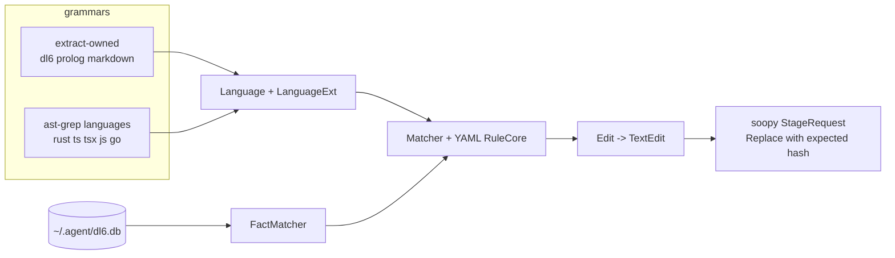
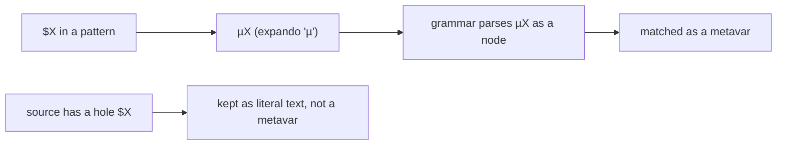
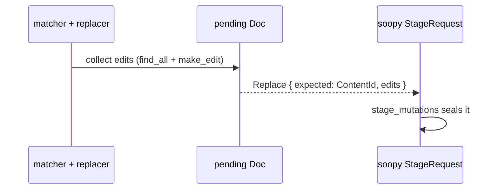
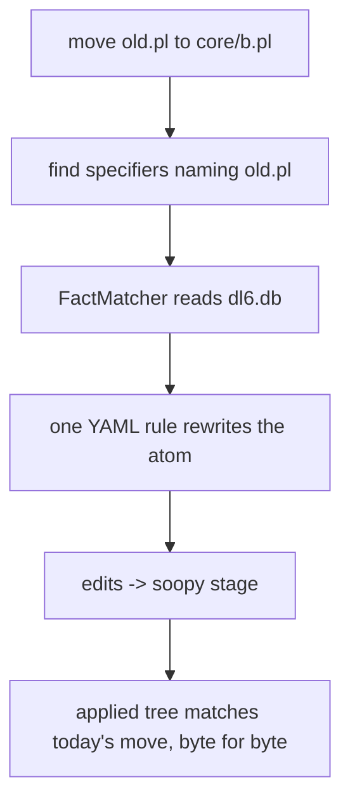

# Extract as an ast-grep extension over soopy

For Chris. Plain words, no citations.

## TOC

1. The shape
2. Who owns what
3. Arc A: make dl6, prolog, markdown real ast-grep languages
4. Arc B: drain ast-grep edits into soopy stages
5. Arc C: the move becomes one YAML rule plus a fact matcher
6. The order to build
7. What is off-limits

## 1. The shape

Today extract parses rust/ts/tsx/js/go through ast-grep and its own three
grammars (dl6, prolog, markdown) through raw tree-sitter. So ast-grep patterns
and YAML rules work on the first five and refuse the last three.

This plan makes the three grammars first-class ast-grep languages, funnels
ast-grep edits into soopy's staged-mutation pipe, and rewrites the `move` verb
as one YAML rule plus a database lookup.

## 2. Who owns what

| layer | owner | seam |
|---|---|---|
| grammar | tree-sitter | `Language` + `LanguageExt` |
| matching, patterns, YAML rules | ast-grep | `Matcher`, `RuleCore` |
| facts, which files, which nodes | extract + dl6 db | `FactMatcher` |
| edit generation | ast-grep | `Edit` -> `TextEdit` |
| staging, hash guard, commit | soopy | `StageRequest`, `SourceAction` |

## 3. Arc A: three real ast-grep languages

Wrap ast-grep's language enum in an extract-side enum with three new variants.
One enum, one root type, no duplicated query code.

The trick: each grammar needs a "metavar character". ast-grep uses `$` by
default. dl6 uses `$` for its own hole variables, so the two would collide. The
three grammars also refuse `$` as an identifier start. So the metavar is
rewritten to `z` (the same trick ast-grep uses for HTML) before the grammar
parses a pattern.

## 4. Arc B: drain edits into soopy stages

An ast-grep edit has a start, a deleted length, and inserted bytes. Soopy's
`TextEdit` has a start, an end, and replacement bytes. A one-line adapter turns
one into the other.

The bigger move: a custom `Doc` whose "apply edit" step never touches the
source string. Instead it appends each edit to a pending `Replace` action that
carries the file's content hash as the optimistic guard. So a matcher run drains
straight into a `StageRequest`.

The old `move` code stored edits as a bare `(start, end, string)` triple. That
triple dies; stages hold real soopy actions.

## 5. Arc C: the move as one YAML rule plus a fact matcher

`move` rewrites every file specifier that names the moved file. Today that is
hand-built prolog parsing. The plan replaces it with:

- one YAML rule that rewrites a specifier atom,
- a `FactMatcher` that only fires on the exact rows the db knows point at the
  moved file.

`FactMatcher` reads the live `~/.agent/dl6.db` read-only (one server, one db),
matches a node when its text shows up in a chosen relation column, and composes
with ast-grep's all / any / not combinators.

## 6. The order to build

Arc A first (unblocks patterns on the three grammars, testable alone), then
Arc B (the edit drain both A's fix path and C's move path feed), then Arc C
(the only arc with a human-held gate). Each arc ends green on
`cargo test --features cli` and byte-identical fixtures.

## 7. What is off-limits

- The soopy crate (it already does everything, no changes).
- The prolog/dl6/markdown projection logic (the new `Language` impls sit
  beside it, not inside it).
- `scripts/rehome-passes.sh` (lives on a held branch; never touched or run).
