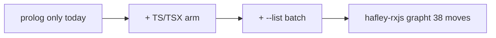
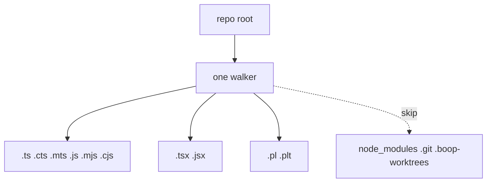
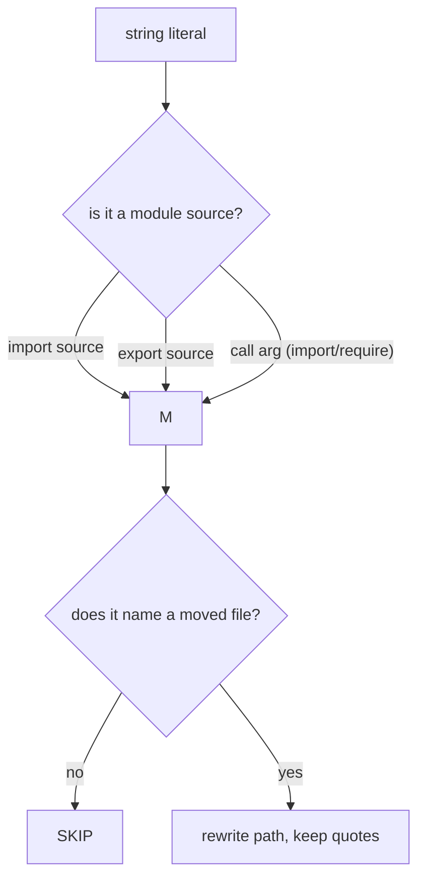
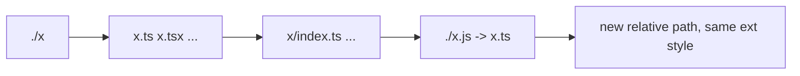
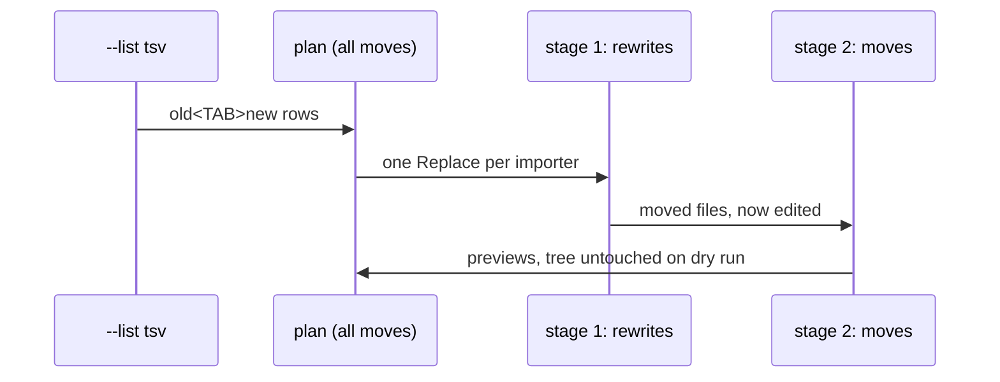

# extract move for TypeScript

For Chris. Plain words, no citations.

## TOC

1. The job
2. Corpus walk
3. The rule
4. Path resolution
5. Batch list
6. What is off-limits

## 1. The job

`extract move` today moves one prolog file and fixes every importer that named
it. This plan adds the same verb for TypeScript and lifts it to a batch that
moves many files at once. First real corpus: the hafley-rxjs grapht layout (38
flat files into 4 numbered folders), which is done by hand elsewhere and becomes
the acceptance run (dry only).

## 2. Corpus walk

Today the walker collects `.pl/.plt` and skips `node_modules`, `.git`,
`.boop-worktrees`. The TS arm collects `.ts .tsx .mts .cts` and the `.js` family
too, because the grapht corpus writes ESM-style `.js` specifiers and a `.js`
file can name a moved file. Same skip list.

## 3. The rule

A separate rule file per language (the prolog one stays; a new TS one). The TS
rule matches the whole string literal of an import/export source, and the string
argument of any call (dynamic `import()` and `require()` both land here). A
database lookup keeps only the strings that actually name a moved file, so a
`"hello"` literal is never touched and the quotes are preserved.

## 4. Path resolution

The move only asks one question: does this specifier name a file being moved?
That is a file-existence probe, not a bundler load. Relative specifiers are the
only ones that can name a moved file (bare package names live in
`node_modules`). So v1 hand-rolls the relative probe, mirroring the existing
prolog resolver and the repo's own TS extension table.

The tricky bit: ESM style writes `.js` for a `.ts` file, so
`./0_benchProtocol.js` moved into a folder becomes `./0_bench/0_protocol.js`,
keeping the `.js` and the quote.

The one case the probe cannot handle is tsconfig `paths` aliases. That is
deferred to a v2 arm using the `oxc_resolver` library (the tsconfig-paths
algorithm is exactly what it implements); it is not needed for the corpus.

## 5. Batch list

`extract move --list <tsv>` reads one `old<TAB>new` per line and moves them all.
Two files that both name a moved file get both edits in one pass on that file,
so the shared importer is touched once. Moves and rewrites split into two staged
rounds because the store allows one operation per file.

Collisions are rejected up front: a destination that already exists, equals
another move's source, or repeats another destination is a hard error.

## 6. What is off-limits

- The soopy crate (it already stages everything, no changes).
- The TS extractor's own specifier rows (the move does not read them; it scans
  on its own, so it works on any tree).
- The prolog rule file and the rehome script.
- No new dependency in v1; `oxc_resolver` stays a documented v2 arm.
