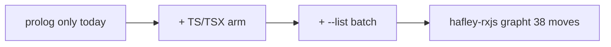
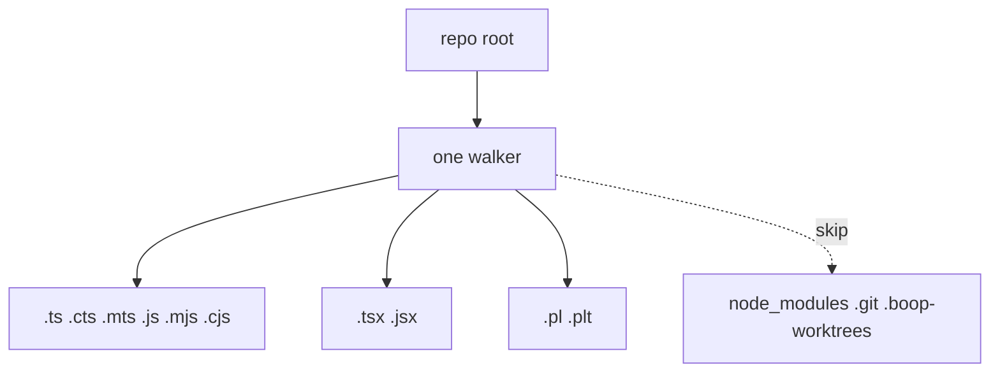
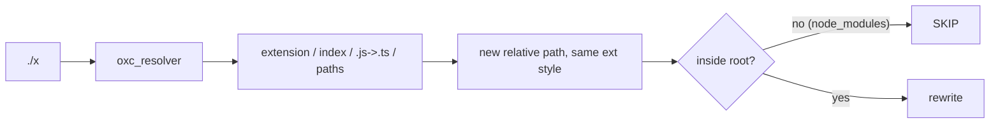
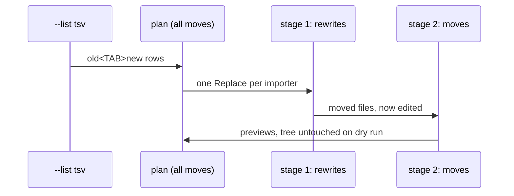

# extract move for TypeScript

For Chris. Plain words, no citations.

## TOC

1. The job
2. Corpus walk
3. Specifier sources (from the oxc parse)
4. Path resolution (bought)
5. Batch list
6. What is off-limits

## 1. The job

`extract move` today moves one prolog file and fixes every importer that named
it. This plan adds the same verb for TypeScript and lifts it to a batch that
moves many files at once. First real corpus: the hafley-rxjs grapht layout (38
flat files into 4 numbered folders), which is done by hand elsewhere and becomes
the acceptance run (dry only).



## 2. Corpus walk

Today the walker collects `.pl/.plt` and skips `node_modules`, `.git`,
`.boop-worktrees`. The TS arm collects `.ts .tsx .mts .cts` and the `.js` family
too, because the grapht corpus writes ESM-style `.js` specifiers and a `.js`
file can name a moved file. Same skip list.



## 3. Specifier sources

Nothing is reinvented. The TS parser (oxc) is already in the crate and already
reads static imports and re-exports, each with its byte span. The move reads
those rows. The two cases oxc does not yet tag, dynamic `import()` and
`require()`, are added to the same visitor as new row kinds with byte spans.
Those spans feed the staging pipe directly.

```mermaid
flowchart TD
    OXC[oxc parse] --> ROWS[Specifier rows, each with byte span]
    ROWS --> STATIC[static import / export-from]
    ROWS --> DYN[dynamic import() + require() new rows]
    STATIC --> SPAN[span -> replacement]
    DYN --> SPAN
    SPAN --> STAGE[soopy stage]
```

## 4. Path resolution

Resolution is bought, not built. `oxc_resolver` (the same project family as the
parser) handles extensionless paths, `index` files, ESM style `.js` written for
a `.ts`, tsconfig `paths` aliases, and package `exports`. One resolver per run.



The tricky bit: ESM style writes `.js` for a `.ts` file, so
`./0_benchProtocol.js` moved into a folder becomes `./0_bench/0_protocol.js`,
keeping the `.js` and the quote.

## 5. Batch list

`extract move --list <tsv>` reads one `old<TAB>new` per line and moves them all.
Two files that both name a moved file get both edits in one pass on that file,
so the shared importer is touched once. Moves and rewrites split into two staged
rounds because the store allows one operation per file.



Collisions are rejected up front: a destination that already exists, equals
another move's source, or repeats another destination is a hard error.

## 6. What is off-limits

- The soopy crate (it already stages everything, no changes).
- No tree-sitter TS rule and no new rule YAML for TS; the oxc rows carry the
  specifiers. ast-grep stays for prolog only.
- The prolog rule file and the rehome script.
- The one new dependency is `oxc_resolver`; nothing is hand-rolled for
  resolution.
