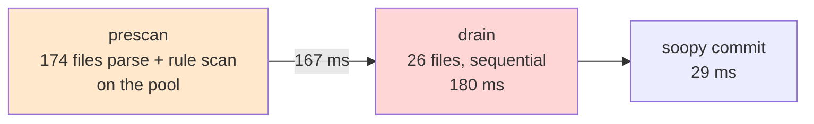
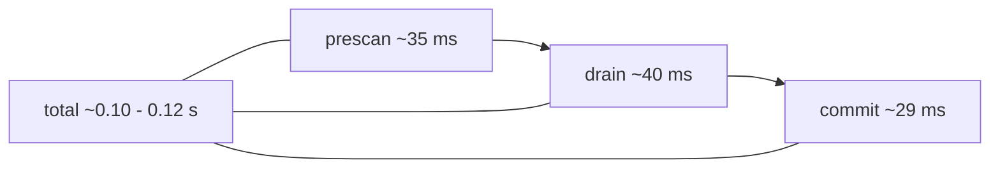

# extract move rule path: back to the 0.12 s band

## Table of contents

1. The problem
2. Where time goes
3. The three cuts
4. Projected result
5. What is already done

## 1. The problem

`extract move` dry run slowed from 0.12 s to 0.35 s when the YAML rule path
landed. Same output bytes, only cost grew. Target is the 0.12 s band with the
same output.

## 2. Where time goes

Measured on the real corpus (283 prolog files). One run is about 0.4 s wall,
0.63 s user. It splits into two work chunks plus a small tail.



The drain is the only fully sequential chunk and it is 45% of the run. The
prescan is parallel but a few huge files dominate, so it does not speed up much.

## 3. The three cuts

Three independent changes. Each one on its own is a real win; all three together
reach the target.

### Cut 1: bound the rule walks (rules/move_specifier.yml)

The rule scans every atom and, for each one, walks all previous siblings looking
for the directive name. That walk is the cost. Replace it with two bounded
checks: "my parent is a directive call" and "I am its first argument".

```mermaid
flowchart TD
    subgraph before[before]
        A1[every atom] --> A2[walk all prev siblings<br/>to find directive name]
    end
    subgraph after[after]
        B1[every atom] --> B2[parent functor is<br/>use_module / ... ?  O(1)]
        B2 --> B3[immediate prev sibling<br/>is open paren?  O(1)]
    end
```

Same 598 spec matches found. Scan cost per file drops roughly in half.

### Cut 2: gate the prescan on the moved file's name (0_move.rs)

The prescan already skips files with none of the 5 directive words (283 to 174).
Add a second skip: a file that cannot name the moved file does not need parsing
at all. A spec that names the moved file always contains its filename, so a
quick byte search for the moved file's stem is a safe gate.

174 -> 48 files actually parsed and scanned. The prescan work drops about 5x.

### Cut 3: run the drain in parallel (0_move.rs)

The drain re-reads, re-parses, and re-scans 26 files one at a time. Each file is
independent, so run them on the pool and put the results back in path order.
The 180 ms sequential chunk becomes about 40 ms. Output order does not move.

## 4. Projected result



Roughly 0.10 to 0.12 s wall, about 0.25 s user. Byte-identical output.

## 5. What is already done

These are already in place and are not new work: rule parsed once per run, fact
set loaded once per run, prescan parallel on the pool, rule walk already pruned
to atoms. No saving left there.

## How to prove it

- Run the existing move and fact-matcher test suites: byte-identical output.
- Time the dry run 3x, expect the 0.12 s band.
- Diff stdout against a base capture with stage ids normalized: empty.
