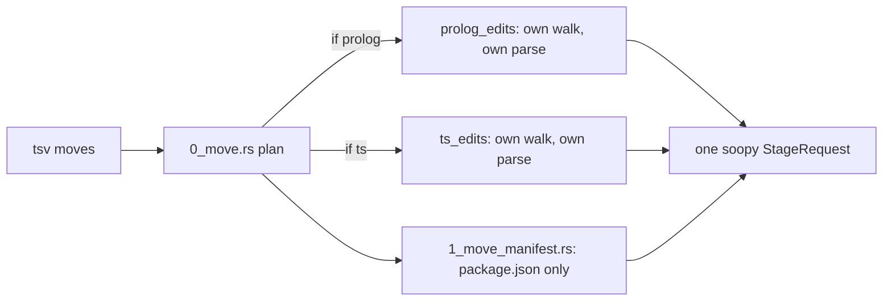
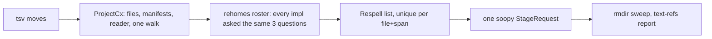

# extract move: one impl per language

Chris decided 2026-08-26: every language is its own impl; no per-language match arms anywhere.

- [Today](#today)
- [After](#after)
- [What each language answers](#what-each-language-answers)
- [Order](#order)

## Today

Three private directory walks, two hand-picked arms, one hardcoded manifest.

## After

The core never names a language. Adding rust is adding one `impl Rehome for RustSource`.

## What each language answers

| question | ts | prolog | rust |
|---|---|---|---|
| where are my import refs | oxc specifiers, `import.meta.url` literals | `use_module` strings | `mod x;`, `#[path]`, `use crate::`, `include!` |
| how do I respell one | relative from new dir | relative, no `.pl` | `#[path]` when a mod leaves its dir; `use` path by new mod tree |
| what manifests do I own | `package.json` exports/main/types/bin | none | `Cargo.toml` `[[bin]]`/`[lib]` path, workspace members |
| shim | none | reexport file | none |

## Order

1. Trait, roster, language-free core; ts and prolog move into their own files. Grapht stays at 7.
2. Rust impl; proof = the extractor moves one of its own files and `cargo check` passes.
3. `--shim` through the trait.
