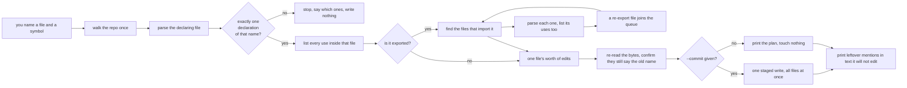
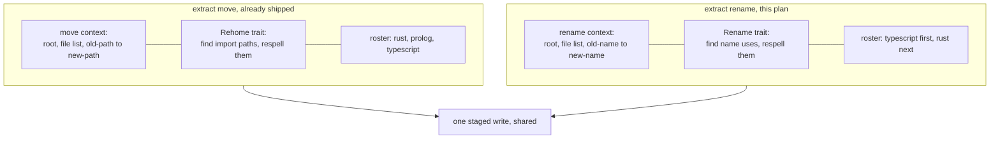
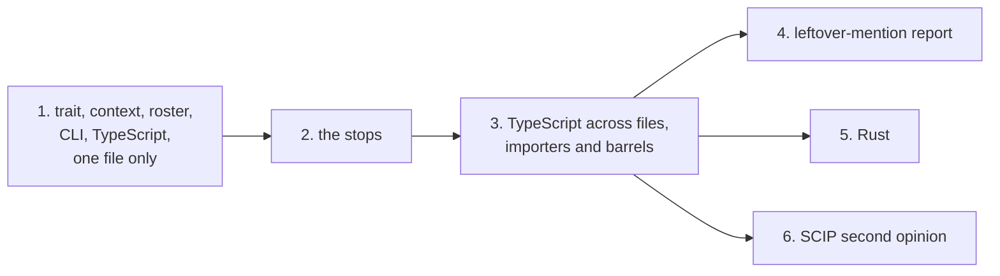

# extract rename, in plain words

- [What it is](#what-it-is)
- [The thing that surprised me](#the-thing-that-surprised-me)
- [Two ways to know where a name is written](#two-ways-to-know-where-a-name-is-written)
- [How one run goes](#how-one-run-goes)
- [What it touches, what it only tells you about](#what-it-touches-what-it-only-tells-you-about)
- [When it stops instead of guessing](#when-it-stops-instead-of-guessing)
- [New trait beside the old one, and why](#new-trait-beside-the-old-one-and-why)
- [The one new library](#the-one-new-library)
- [Order of work](#order-of-work)
- [What you type](#what-you-type)

## What it is

`extract move` renames a **file** and repairs every import that pointed at it.
`extract rename` renames a **symbol** and repairs every place that spells it.
Same corpus walk, same staged-write boundary, same dry-run-by-default
posture. Different question.

Version 1 of this repo had a symbol rename. Version 5 dropped it and never
brought it back. This is the plan to bring it back on the v6 shape.

## The thing that surprised me

The task said the rename should ride on the resolved edge plane, the part of
the extractor that answers "which declaration does this reference point at".
That plane works. It cannot drive a rename, and the reason is small and hard.

The edge plane records **which** thing a reference points at. It does not
record **where the reference's own letters are**. For a call like `a.b.c()`
it keeps the span of `a.b.c`. For a class it keeps the span of the entire
class body. For a type mention in a signature it keeps only the type's name
as text, with no position at all.

A rename needs to write exactly over the letters `c`, and nothing else. The
edge plane cannot say where they are.

Second surprise, same size: the resolve context has an empty file list. The
field exists, its type has no fields in it, and the code that builds it
constructs an empty one. So a resolve arm cannot even ask "which files in
this repo mention X". The move context, built for `extract move`, does carry
a real file list. So the rename verb gets a twin of the move context, not the
resolve one.

## Two ways to know where a name is written

```
source line          const total = oldName(1) + other.oldName(2)
                                   ^^^^^^^^^^^^^
what the extractor
has today            one span, the whole callee expression

                     const total = oldName(1) + other.oldName(2)
                                   ^^^^^^^          ^^^^^^^
what a rename
needs                one span per identifier token, nothing around it
```

Two places already give exact identifier spans:

| source | covers | cost |
|---|---|---|
| the scope analyser that ships with the TypeScript parser already in use | every binding and every reference in one file | one extra library, and it reuses the parse already happening |
| SCIP, the index format from a real language server | every occurrence in the whole repo, with roles like definition, import, read, write | minutes per run, needs an indexer binary installed, and goes stale the moment a file changes |

So: the plan is built from the scope analyser reading the current bytes. SCIP
becomes an optional second opinion that checks the plan and reports
disagreements. It never writes.

## How one run goes



The re-read step is the one a file move does not need. A move checks a whole
file's fingerprint before it writes. A rename writes into the middle of files,
so every single span gets confirmed to still hold the old name before
anything is staged. A span that says something else means the parse and the
disk disagree, and the run stops.

## What it touches, what it only tells you about

| the old name appears in | rewritten | you get told |
|---|---|---|
| the declaration itself | yes | in the plan |
| a call, a read, an assignment | yes | in the plan |
| a type annotation | yes | in the plan |
| an import or export clause | yes | in the plan |
| an import that aliases it, `{ oldName as local }` | only the `oldName` half | in the plan |
| a plain string, `container.get("oldName")` | no | a leftover-mention line |
| a computed lookup, `obj["oldName"]` | no | a leftover-mention line |
| a doc comment or a README | no | a leftover-mention line |
| a test snapshot or a golden file | no | a leftover-mention line |
| build output, `node_modules`, `target` | no | nothing, never walked |
| another repo consuming your published package | no | a warning that the name is public |

The leftover-mention report is the same one `extract move` already prints. It
names a file, a line, what it found, and what it thinks you meant. You decide.

## When it stops instead of guessing

A half-finished rename leaves a tree that compiles less often than an
untouched one. So the seam has named stops, and a stop writes nothing at all.

| stop | when | what you do |
|---|---|---|
| ambiguous | the file declares that name twice | add a byte offset to say which |
| not found | the file declares no such name | check the spelling or the file |
| inexact | a use was found but its exact letters could not be pinned | reported with file and offset, fix by hand |
| dynamic | the name is reached through a computed lookup or a runtime import | reported, fix by hand |
| collides | the new name is already taken in that scope | pick another name |
| public | the name is a published entry in a package manifest | it proceeds under `--commit`, and says so once |

## New trait beside the old one, and why



Two reasons for a sibling rather than more methods on the existing trait.

First, the batch is a different shape. A move carries pairs of paths. A
rename carries a file, an old name, and a new name. Bolting one onto the
other gives every method a field it ignores.

Second, the rosters are different sets. A language qualifies for move if it
has import paths. It qualifies for rename if it has a scope analyser with
exact spans. Those are not the same languages, and one roster per verb keeps
each list accurate about what it can actually do.

There is a third, practical reason. Six people are editing the move files
right now. The sibling shape adds one new trait block and one new roster
function, and edits nothing they are holding.

## The one new library

The build-vs-buy question was: how do we learn where a name's letters are, in
a TypeScript file, exactly?

| option | verdict |
|---|---|
| the scope analyser from the parser family already in use | **chosen**. Adds one crate. Every one of its own dependencies is already in this project's lock file, so the cost is one line in the manifest |
| run a TypeScript language server as a subprocess | rejected. A second runtime and a second parse of files already being parsed |
| SCIP index | kept, as the optional checker. Too slow and too easily stale to build the plan from |
| write our own scope analyser over a tree-sitter grammar | rejected. Scope analysis for TypeScript is a large, well-solved problem, and this is exactly the case the build-before-write rule covers |
| widen the extractor's own row types to carry identifier positions | rejected. That is the chosen library re-implemented by hand, plus a change to every golden file that pins those rows |

## Order of work



Arc 1 is deliberately tiny: rename a symbol that never leaves its own file.
Its proof is a hand-written folder. Someone writes the `after/` tree by hand,
the tool runs on a copy of `before/`, and the two folders have to come out
byte for byte identical. Zero differences, or the arc is not done.

Arc 3 gets a second proof that no assertion of ours can fake: the TypeScript
compiler runs over the result and has to be clean.

Arc 5 gets the same treatment from the Rust compiler. This crate copies
itself into a temp folder, renames one of its own types, and has to still
build.

## What you type

```
extract rename src/user/service.ts#UserService AccountService
extract rename src/user/service.ts#UserService AccountService --commit
extract rename --list renames.tsv --commit --text-refs
```

Dry run is the default. Without `--commit` it prints the whole plan and does
not touch a byte.

```
root /Users/you/projects/app
plan src/user/service.ts UserService -> AccountService
  src/user/service.ts        4 uses
  src/api/handlers.ts        3 uses  (imported)
  src/index.ts               1 use   (re-exported)
stage 7f3a dry run, tree untouched
text-ref README.md:12 UserService -> AccountService
text-ref src/di.ts:40 "UserService" -> "AccountService"
```
