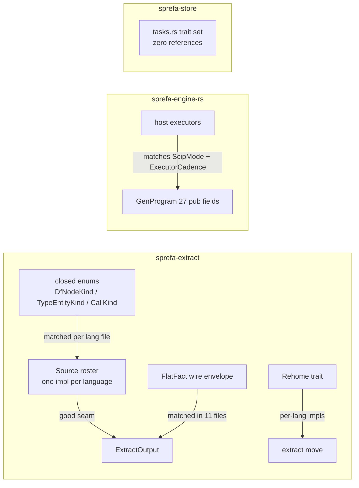

# Leaky types review, v6 Rust crates - the human read

Three crates: the extractor (sprefa-extract), the engine (sprefa-engine-rs),
the store (sprefa-store). Full receipts live in the PLAN.md twin. This doc:
what leaks, ranked, and where the fix should go.

## The one big finding

The extractor already has the right seam: one `Source` impl per language, a
uniform dispatch, per-family graphs. The leak is that the closed enums beside
that seam did not get the same treatment.

| leak | what happens today | where it should live |
|---|---|---|
| DfNodeKind, 125 sites | ts.rs, rust.rs, go.rs, kotlin.rs, prolog all match/construct one shared enum | per-lang emission owned by each lang's impl |
| TypeEntityKind, CallKind | same shape, smaller | same |
| FlatFact | every consumer matches the wire envelope | lowering methods on FlatFact itself |
| ExtractLang | an enum with one arm per language plus path-guessing | the Source roster already routes per lang; the enum should shrink to the ast-grep shim |

New language = edit the enum + edit your lang file. It should be: write your
lang file, register it, done.

## The move path (extract move)

Three cheap wins, all small:

1. `ImportRef.kind` is a free-form `&'static str`; per-lang strings float
   around and one site compares to a literal. Make it an enum.
2. `moved_names` and `stem` are copy-pasted across the rust/ts/prolog rehome
   files. Lift `moved_names` onto the `Rehome` trait as a default method.
3. Five `Rehome` default methods each have at most one impl that overrides
   them (shim: prolog only, text_spellings: ts only, plan_errors: rust only).
   Split them into small per-lang extension traits so the core seam stays 2
   methods.

## The engine hosts

- `GenProgram` wears 27 pub fields; hosts.rs reads `.plan` 16 times. Field
  list = API. Hide behind methods.
- hosts.rs matches on the extractor's `ScipMode` cross-crate. The extractor
  should hand over a resolved mode.
- `ExecutorCadence` is matched in 4 files; the scheduler should ask the
  executor, and each executor should own its cadence.

## The store

`sprefa-store/src/tasks.rs` is 366 lines of five traits (`Reach`, `Cascade`,
`Reconcile`, `GraphStore`, `GraphStorePlan`) with zero references anywhere in
the repo, and `GraphStorePlan` has no impl at all (the live one is the TS twin
in sprefa-store/js). Nothing in engine-rs or extract depends on sprefa-store
today. Delete it or privatize it until the Rust engine grows into it.

## Flag soup

- `FamilyMask` is five bools; `ExtractOutput` is five Options, same names.
  Both should be a set of `FamilyTag`, which already exists as a const on
  every family.
- One incremental struct carries four behaviour bools; they name a mode, so
  make them an enum.

## Do first (smallest blast, biggest seam value)

1. ImportRef.kind -> enum (move path)
2. moved_names/stem dedup -> Rehome default method (move path)
3. Rehome optional methods -> per-lang extension traits (move path)
4. ScipMode match out of engine hosts
5. ExecutorCadence match out of run.rs

Rows #3 (DfNodeKind), #16 (FlatFact), #2 (ExtractLang) are the deep ones and
are flagged as needing a design pass with Chris before any lane picks them up.
