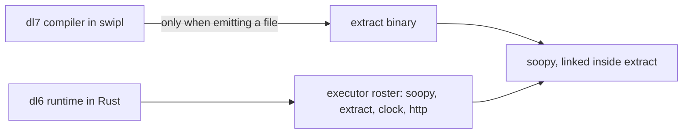
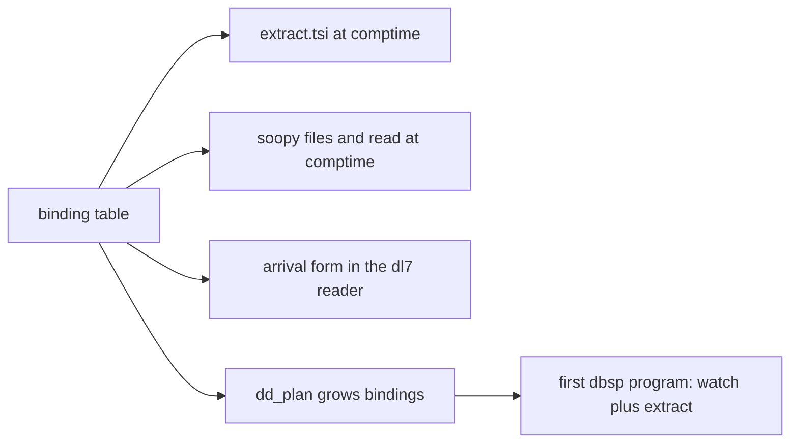

# Comptime bindings, the picture

1. [Today](#today)
2. [After](#after)
3. [The four forks](#the-four-forks)
4. [Order of work](#order-of-work)

## Today



One caption: the compiler cannot ask for files or types while compiling;
the runtime can, through a roster of named executors.

## After

```mermaid
flowchart LR
  program[.dl7 program says: use extract, use soopy] --> comptime[comptime phase]
  comptime -->|cache miss| child[spawn extract or soopy, read jsonl]
  comptime -->|cache hit| cache[cache keyed by file content id]
  child --> cache
  cache --> graph[types installed in the program]
  program --> emitter[emitter reads the same roster table]
  emitter --> dbsp[dbsp circuit: one input per binding, soopy watch feeds changes]
```

Two captions. The compiler and the emitter read one table of bindings.
The compiler spawns to answer now; the emitted program links to answer forever.

## The four forks

| fork | pick | why |
|---|---|---|
| how the compiler calls out | spawn a child and read its lines | measured 0.02 s per call; swipl has no ffi library installed; a daemon or an embedded swipl buys nothing at that cost |
| how a program spells it | the arrival form dl6 already decided, `use extract`, `use soopy`, dotted names | one spelling across both doors; dl7 just has not ported it yet |
| which extract tier at compile time | syntax by default, checker on request | syntax is instant; the checker walk is seconds and bounded by the 10-second law |
| where the cache lives | the compiler's own cache, keyed by file content | one cache; the runtime db stays the runtime's |

## Order of work



Caption: the table is first because everything else reads it.
