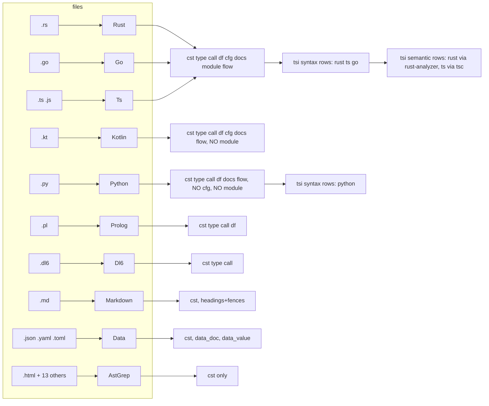
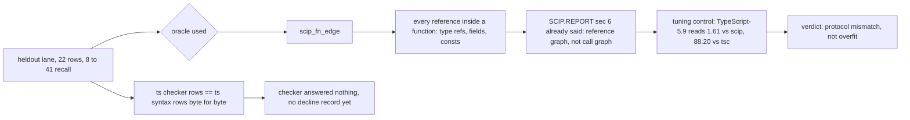
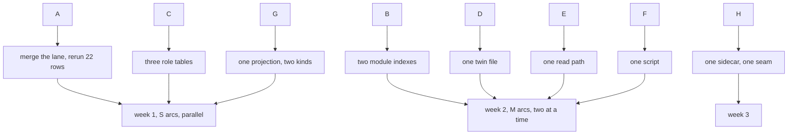

# extract: where more data can come from (plain words, 2026-09-03)

## TOC

1. What exists today, one picture
2. The language x family grid
3. Where the oracles are, and where the holes are
4. The held-out numbers: what they really say
5. Trace oracles per language
6. The v7 side
7. The top 8 arcs
8. Three surprises

## 1. What exists today



Caption: 10 source arms, 3 tiers, and kotlin is the one full arm with zero tsi rows.

## 2. Language x family grid

| language | cst | type | call | df | flow | module | cfg | docs | tsi syntax | tsi semantic | scip |
|---|---|---|---|---|---|---|---|---|---|---|---|
| rust | yes | yes | yes | yes | yes | yes | yes | yes | yes | yes | yes |
| ts/js | yes | yes | yes | yes | yes | yes | yes | yes | yes | yes | yes |
| go | yes | yes | yes | yes | yes | yes | yes | yes | yes | no | yes |
| python | yes | yes | yes | yes | yes | NO | NO | yes | yes | no | yes |
| kotlin | yes | yes | yes | yes | yes | NO | yes | yes | NO | no | binary missing |
| prolog | yes | yes | yes | yes | yes | no | NO | no | no | no | no |
| dl6 | yes | yes | yes | no | no | no | no | no | no | no | no |
| markdown | yes | partial | no | no | no | no | no | no | no | no | no |
| json/yaml/toml | yes | no | no | no | no | no | no | no | data | no | no |
| html + 13 more | yes | no | no | no | no | no | no | no | no | no | no |

Capital NO = the pieces exist (specifiers, a generic builder) and only the wiring is missing.

Grammars already compiled in, cst today, no arm: bash c cpp c-sharp css elixir haskell java javascript lua php ruby scala swift. Not compiled: xml (one crate away).

## 3. Oracles and holes

| language | call oracle | type oracle | module oracle | flow oracle | docs oracle | ratchet rows |
|---|---|---|---|---|---|---|
| ts | tsc, codeql | NONE | madge (never grinded), depcruise unused | none | none | 6 |
| go | vta, codeql | go/types | own | none | none | 4 |
| rust | ra, codeql, scip | ra | none | none | none | 8 |
| python | PyCG micro suite only | none | none | none | none | 0 |
| kotlin | none | none | none | none | none | 0 |
| prolog, dl6, md, data | none | none | none | none | none | 0 |

```mermaid
flowchart TD
  H1[hole: ts type] --> C1[tsc walk, same shape as the go type oracle]
  H1 --> C2[codeql js TypeAccess]
  H2[hole: flow, every language] --> C3[codeql dataflow library, packs installed]
  H2 --> C4[python trace with arg identity]
  H3[hole: python corpus] --> C5[PyCG on flask click requests, cloned]
  H3 --> C6[scip-python, installed]
  H3 --> C7[mypy build API for types]
  H4[hole: kotlin] --> C8[codeql java pack, installed]
  H4 --> C9[scip-java, needs coursier]
  H5[hole: go semantic tier] --> C10[go/types sidecar, walk already written]
  H6[hole: prolog, dl6] --> C11[swipl xref, the v6 compiler manifest]
```



Caption: every hole has at least one installed tool beside it.

## 4. The held-out numbers



| repo | lang | tier | recall vs scip | note |
|---|---|---|---|---|
| typescript-go (tuning) | go | syntax | 35.27 | codeql2 floor is 98.96 |
| TypeScript-5.9 (tuning) | ts | syntax | 1.61 | tsc floor is 88.20 |
| rust-analyzer (tuning) | rust | checker | 33.13 | ra floor is 93.66 |
| 9 held-out repos | 4 langs | both | 8.61 to 41.24 | same oracle, same mismatch |

What is already fixed in the lane and not on main: the `--indexer` flag, the go tuning control.

## 5. Trace oracles per language

| language | tracer | complete or sampled | installed | cost | call |
|---|---|---|---|---|---|
| python | sys.monitoring | complete | yes, 3.14.6 | S | fund |
| ts/js | node --cpu-prof | sampled, full tree | yes, node 24 | S | fund as recall-of-covered |
| go | dlv trace | complete | no | M | later |
| go | pprof cpu | sampled | yes | S | maybe |
| rust | dtrace pid probes | complete | dtrace yes, SIP unknown | M | ask |
| rust | uftrace, callgrind | complete | linux only | L | no |

## 6. The v7 side

```mermaid
flowchart LR
  X[extractor emits 36 registered relations] --> L[loader accepts 35 on main]
  L --> G[11 become graph structure]
  L --> S[24 become seed facts]
  X -. tsi.name .-> U[unknown on main, known on the dirty branch]
  Z[tsi.value, tsi.value_argument, tsi.scip_symbol] -. nobody emits .-> L
  P[prelude: 27 classes, ts + rust only] -. go and python classes absent .-> L
```

Caption: nothing accepted is dropped; the gaps are one name, three ghost relations, and two missing prelude blocks.

## 7. The top 8 arcs

| arc | what you get | cost | needs you |
|---|---|---|---|
| A. held-out oracle repair | 22 held-out rows that can be compared with the floors; ts checker rows that mean something | S | no |
| B. python + kotlin module plane | cross-file resolution for python and kotlin; python held-out recall moves | M | no |
| C. cfg for python, prolog, dl6 | control-flow rows for three more languages, one table each | S | no |
| D. kotlin tsi rows | the last full arm gets its type graph | M | no |
| E. read the SCIP records we decode and ignore | implementation edges for every scip language for free, write/read bits, signatures | S-M | no |
| F. python trace oracle | a dynamic oracle for the shapes static tools miss | S-M | no |
| G. markdown links and fences | md to path edges over 2,626 files; fence language for nested extraction | S | no |
| H. go checker tier | a semantic tier for go, from a walk that is already written | M | no |



## 8. Three surprises

| # | surprise | one line |
|---|---|---|
| 1 | the overfit scare | the held-out oracle counts every reference as a call; the report that built it said so |
| 2 | ghost relations | three registered relations nobody emits, and one emitted relation the loader on main does not know |
| 3 | the doc-format arc is mostly built | markdown, json, yaml, toml, html all have a source arm; only xml is missing; two docs say none exist |
