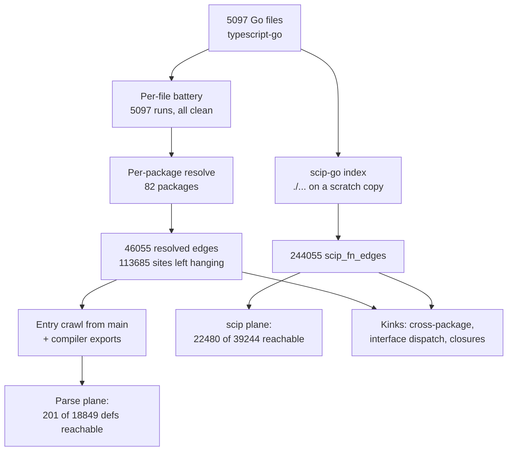

# go.PLAN: entrypoint crawl of typescript-go, in one story

## The crawl, drawn

## What the numbers say

| where | parse plane | scip plane |
|---|---|---|
| defs | 18849 | 39244 |
| reachable from entrypoints | 201 | 22480 |
| reachable with test roots | 10118 | 31332 |

The parse arm can only see inside one package at a time, so a crawl from
`tsgo` main dies at depth 5. The compiler index reaches 57% of all defs
from the same roots.

## Top 5 kinks in plain words

1. The Go resolver never follows imports. Seven of ten call sites in the
   corpus have no edge because the callee lives in another package.
2. Interface method calls go nowhere. The parser gives interface methods
   no definition, so dispatch through an interface type is invisible.
3. Calls through function values (closures, callbacks) lose their edges.
   The site shrinks to one byte of source.
4. Builtins like `make` and `append` are names with no target.
5. The scip build path misfires: the wrong package pattern is passed to
   scip-go, and the time budget kills the run without saying anything.
